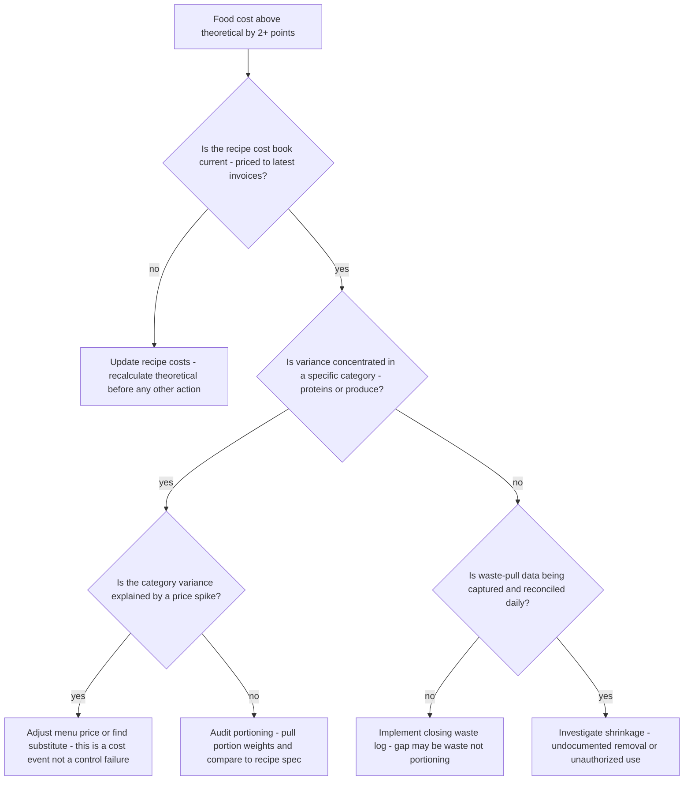
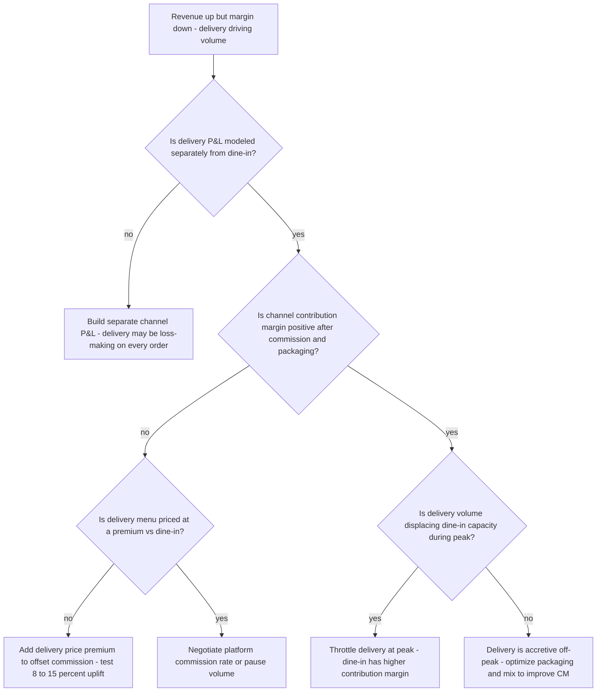
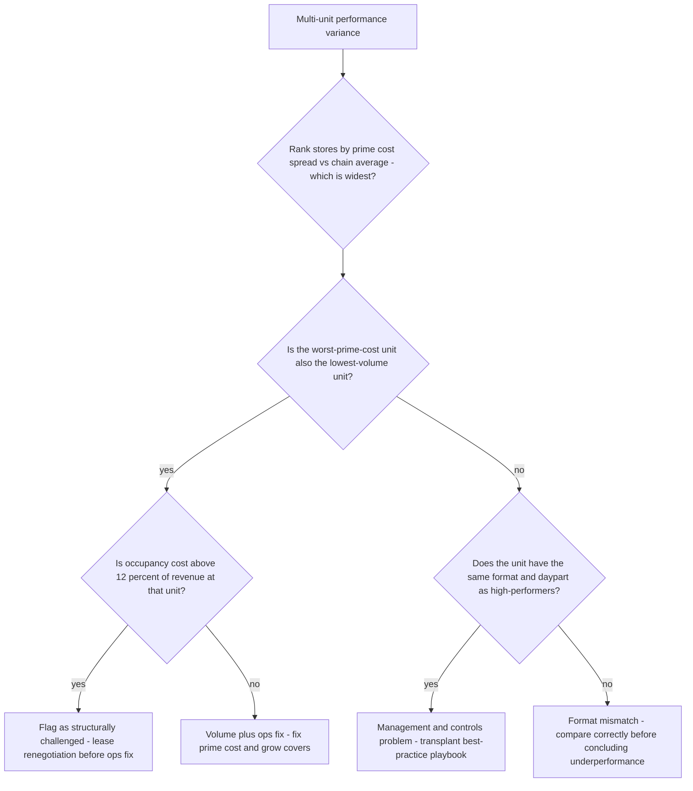

# Restaurant decision trees

Which analysis for which symptom — traverse top-to-bottom before picking a method.

## Decision Tree: This store is losing money

1) Read prime cost first (§3 #1). 2) Split food vs labor. 3) Food → theoretical-vs-actual gap (§3 #2); labor → daypart ratio (§3 #4). 4) Then menu mix (§3 #3).

## Decision Tree: Margins are thin but sales are fine

1) Engineer the menu on contribution margin (§3 #5). 2) Check comps/voids/waste (§3 #6). 3) Resist a price cut as the first lever (§3 #3).

## Decision Tree: One store lags the others

1) Normalize for format/daypart (§3 #7). 2) Rank on prime cost. 3) Map top-quartile practices to the laggard.

## How to read these trees

Traverse top-to-bottom and stop at the first matching branch — the order encodes the cheap-checks-before-expensive-checks discipline (§3). Each leaf names a skill, a specialist, or a house-opinion to apply. Never skip a higher branch because a lower one looks more interesting; a denominator, seasonal, or definitional artifact masquerades as a finding more often than not.

## Decision Tree: Which skill for which task

- **Read prime cost** → use when: Lead any four-wall read with prime cost (food + labor) before decomposing either half, so the master number frames the diagnosis. ([`../skills/read-prime-cost/SKILL.md`](../skills/read-prime-cost/SKILL.md))
- **Engineer the menu** → use when: Place every item on the contribution-margin × popularity matrix and move the mix, instead of cutting prices, to raise margin. ([`../skills/engineer-the-menu/SKILL.md`](../skills/engineer-the-menu/SKILL.md))
- **Close the food-cost gap** → use when: Decompose actual vs theoretical food cost into waste, portioning, price, and theft, so the fix targets the real driver. ([`../skills/close-the-food-cost-gap/SKILL.md`](../skills/close-the-food-cost-gap/SKILL.md))
- **Schedule labor to demand** → use when: Build a labor plan to forecast demand by daypart that holds the service line, so a labor cut doesn't cost more than it saves. ([`../skills/schedule-to-demand/SKILL.md`](../skills/schedule-to-demand/SKILL.md))
- **Rank multi-unit variance** → use when: Rank comparable units against each other, normalized for format and daypart, to find where the margin actually is. ([`../skills/rank-multi-unit/SKILL.md`](../skills/rank-multi-unit/SKILL.md))

## Decision Tree: Which specialist owns this

- **The engagement** → [`restaurant-engagement-lead`](../agents/restaurant-engagement-lead.md)
- **The menu and food cost** → [`menu-cost-engineer`](../agents/menu-cost-engineer.md)
- **Service and labor** → [`foh-boh-operations-specialist`](../agents/foh-boh-operations-specialist.md)
- **The four-wall P&L** → [`restaurant-finance-analyst`](../agents/restaurant-finance-analyst.md)

When two leaves apply, route to the **lead** first to scope and sequence — overlapping symptoms usually mean two drivers at once, and the lead keeps the analysis from collapsing into a single-cause story.

## Decision Tree: Which house-opinion gates the call

Before picking any method, check whether one of the standing biases (§3) already decides the framing:

1. Prime cost is the master number — if this is in question, apply §3 #1 before any method.
2. Food cost is judged against theoretical, not last month — if this is in question, apply §3 #2 before any method.
3. Engineer the menu on margin AND popularity, never price — if this is in question, apply §3 #3 before any method.
4. Labor is a ratio to sales, with a floor — if this is in question, apply §3 #4 before any method.
5. Contribution margin per item beats food-cost % — if this is in question, apply §3 #5 before any method.
6. Comps, voids, and waste are a control system, not noise — if this is in question, apply §3 #6 before any method.
7. Multi-unit variance is the signal — rank stores against themselves — if this is in question, apply §3 #7 before any method.
8. Cite the source and date for every benchmark — if this is in question, apply §3 #8 before any method.

## Escalation & guardrails

- Anything touching client PII / regulated records → stop and route to `ravenclaude-core` `security-reviewer`.
- Any external figure entering a deliverable → carry a source URL + retrieval date, or mark it `[unverified — training knowledge]` / `[ESTIMATE]` (§3, final house opinion).
- A recommendation ships only with an owner, a date, and an expected metric movement.
## Sourcing note

Figures in this file are from the author's domain knowledge and are marked `[unverified — training knowledge]` or `[ESTIMATE]` at point of use. Validate against a primary source before putting any figure in a client deliverable (§3 cite-or-mark rule).

---

## Decision Tree: Restaurant — Food Cost Is High But Prime Cost Looks Acceptable

**When this applies:** Actual food cost % is running 2–4 points above theoretical, but overall prime cost is near target because labor is running low. The symptom is "food cost is a problem but the P&L looks OK." This tree prevents a false sense of stability from masking a food-cost control failure.

**Last verified:** 2026-06-05 against standard restaurant food-cost audit methodology.

**Rationale per leaf:**
- *Update recipe costs* — a stale cost book produces a false theoretical; the gap may not be operational at all.
- *Adjust menu price or substitute* — a commodity price spike is a market event, not a control failure; the fix is pricing or substitution.
- *Audit portioning* — category concentration with current prices points to portioning as the gap driver; measure before concluding.
- *Implement waste log* — without daily waste documentation, the gap is unattributable; the log is the diagnostic instrument.
- *Investigate shrinkage* — when recipe costs are current, portioning is correct, and waste is documented, unexplained gap is a shrinkage signal.

**Tradeoffs summary:**

| Method | Cost / time | Blast radius | Approval gate? | Use when |
|---|---|---|---|---|
| Update recipe costs | Low / 1-2 days | None | Menu cost engineer | Cost book not current |
| Reprice or substitute | Medium / 1 week | Guest experience | GM + owner | Verified price spike, not controllable |
| Portioning audit | Low / 1 shift | Kitchen morale | Kitchen manager | Category-concentrated variance |
| Implement waste log | Low / ongoing | None | Kitchen manager | No waste documentation in place |
| Shrinkage investigation | High / 1-2 weeks | Staff trust | Owner | All other causes eliminated |

---

## Decision Tree: Restaurant — Delivery Channel Growing but Margin Falling

**When this applies:** Total revenue is increasing driven by third-party delivery volume, but contribution margin or net income is declining. The symptom is "we're busier but making less money." This tree routes the diagnosis before recommending delivery strategy changes.

**Last verified:** 2026-06-05 against third-party delivery platform economics and restaurant channel P&L methodology.

**Rationale per leaf:**
- *Build separate channel P&L* — blended P&L masks delivery economics; the diagnosis cannot proceed without separating them.
- *Add delivery price premium* — most platforms allow differential pricing; a 10% uplift recovers roughly a third of a 25–30% commission.
- *Negotiate platform rate* — if delivery is priced at a premium and still margin-negative, the commission rate is the constraint; negotiate or reduce volume.
- *Throttle delivery at peak* — if delivery orders displace dine-in covers, the higher-margin channel is being cannibalized.
- *Optimize packaging and mix* — if channel contribution is positive and timing is off-peak, focus on reducing incremental costs and improving the item mix.

**Tradeoffs summary:**

| Method | Cost / time | Blast radius | Approval gate? | Use when |
|---|---|---|---|---|
| Build channel P&L | Low / 1 day | None | Finance analyst | No separate model exists |
| Delivery price premium | Low / 1 day | Guest price perception | GM + owner | No premium in place |
| Negotiate commission | Medium / 1-4 weeks | Platform relationship | Owner | Premium in place, still negative |
| Throttle at peak | Low / immediate | Delivery volume reduction | GM | Delivery cannibalizing dine-in |
| Optimize off-peak | Low / ongoing | None | Kitchen manager | Channel is already accretive |

---

## Decision Tree: Restaurant — Multi-Unit Operator Wants to Know Which Unit to Fix First

**When this applies:** A multi-unit operator has 3+ locations with variable performance and wants to prioritize which unit gets a turnaround investment or management attention first. The symptom is "some stores are doing well, some aren't — where do we focus?"

**Last verified:** 2026-06-05 against multi-unit restaurant variance analysis methodology.

**Rationale per leaf:**
- *Flag as structurally challenged* — over-rented low-volume units cannot be fixed by operations alone; the lease is the binding constraint.
- *Volume plus ops fix* — adequate rent ratio but poor prime cost and low volume is addressable through combined ops and traffic improvement.
- *Management and controls problem* — when format, daypart, and market are comparable and one unit underperforms, the difference is execution — transplant the specific practices from the top-quartile unit.
- *Format mismatch* — comparing a highway-adjacent unit to a downtown unit is an apples-to-oranges variance; normalize before diagnosing.

**Tradeoffs summary:**

| Method | Cost / time | Blast radius | Approval gate? | Use when |
|---|---|---|---|---|
| Lease renegotiation | High / months | Landlord relationship | Owner + legal | Occupancy above 12%, low volume |
| Combined ops and volume | Medium / 3-6 months | Multiple teams | GM + regional | Prime cost gap and volume gap together |
| Transplant best-practice playbook | Low / 4-8 weeks | Unit team | Regional manager | Same-format comp, execution gap identified |
| Normalize and reanalyze | Low / 1-2 days | None | Finance analyst | Format or market differences unexplained |
