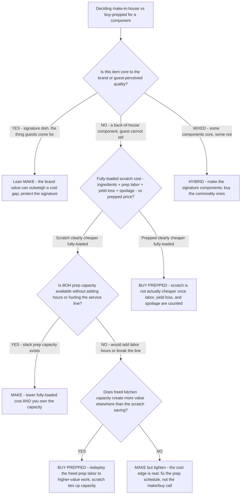

# Restaurant prep decision tree — make from scratch vs. buy prepped (make-vs-buy)

**Last reviewed:** 2026-06-05 · **Confidence:** medium (make-vs-buy trade-literature + labor-cost framing, web-verified this date). Per-batch labor minutes, yield, spoilage, and prepped-product pricing are item- and supplier-dependent — they carry inline `[verify-at-use]` / `[ESTIMATE]` markers and must be validated against the unit's actual recipe, wage, and supplier quotes before any deliverable (CLAUDE.md §3 #8).

> Canonical decision tree for the `menu-cost-engineer` (recipe cost) with an operations assist from `foh-boh-operations-specialist` (the kitchen-labor and capacity draw). Traverse top-to-bottom before deciding to make an item in-house or buy it prepped. The decision is **not** "scratch is cheaper" — it is a **fully-loaded cost + capacity + consistency + brand** trade where the answer varies by item, and the most common error is comparing raw-ingredient cost to prepped-product price while ignoring the **labor, yield loss, and spoilage** of making it. This is decision-support for the operator, not a brand or culinary verdict (CLAUDE.md §2).

---

## When this applies

You are deciding whether a component (sauce, stock, dough, dressing, butchery, dessert, par-baked bread) should be made in-house or bought prepped/pre-portioned. Common triggers: a labor-cost review, a back-of-house capacity squeeze, a consistency complaint, a new-item spec, or a prepped-product sales pitch.

## The tree



## Rationale per leaf

- **Brand / signature (lean make)** — if the guest comes for it, the brand value can justify a higher fully-loaded cost. Don't outsource the thing that differentiates you.
- **Buy prepped on cost** — the most common make-vs-buy error is comparing **raw-ingredient cost to prepped price** and ignoring prep **labor, yield loss, and spoilage**. Once those are counted, "scratch is cheaper" frequently isn't [verify-at-use]. Prepped also buys **consistency** (batch-made to spec) and **less prep time**.
- **Make (cost edge + slack capacity)** — when fully-loaded scratch is genuinely cheaper **and** you have prep capacity you're already paying for, make it; the saving is real and the labor is sunk.
- **Buy prepped to free capacity** — even when scratch is marginally cheaper, if making it consumes scarce BOH capacity that would create more value elsewhere (or forces added hours / breaks the service line — CLAUDE.md §3 #4), buying frees that capacity. Prep labor is **not free**; model it.
- **Make but tighten** — the cost edge holds and capacity isn't the constraint; the fix is the prep schedule/par, not the make/buy decision.
- **Hybrid (the usual answer)** — make the signature components, buy the commodity ones. Most kitchens land here.

## The load-bearing arithmetic (the trap is the missing labor)

```
fully-loaded scratch cost/unit =
      raw-ingredient cost/unit
    + (prep-minutes/batch ÷ batch yield) × (loaded wage/min)     # the line most operators omit
    + yield-loss adjustment (trim, waste)
    + spoilage allowance (unsold prepped product written off)

BUY if  prepped price/unit  <  fully-loaded scratch cost/unit
MAKE if fully-loaded scratch cost/unit  <  prepped price/unit  AND prep capacity is free
```

"Loaded wage" includes payroll taxes + benefits, not just the base rate. [`../scripts/restaurant_calc.py`](../scripts/restaurant_calc.py) `make-vs-buy` computes the fully-loaded scratch cost (including the prep-labor term) and prints the per-unit and monthly verdict against a prepped price + projected volume.

## Gotchas

- **Prep labor is the omitted variable** — the headline "scratch saves X" almost always ignores the labor minutes and the loaded wage. Count them, or the comparison is invalid.
- **Yield loss and spoilage are real cost** — trim, over-prep thrown at close, and unsold prepped product written off all belong in the fully-loaded number.
- **Capacity is a cost even when labor is "already on the clock"** — if scratch prep crowds out higher-value work or pushes the line past its service floor (§3 #4), the opportunity cost is real even if no hours are added.
- **Consistency has a dollar value** — a prepped component that removes a recurring consistency complaint may be worth a small cost premium.

## Escalation & guardrails

- Recipe/plate costing and the theoretical food cost → [`menu-cost-engineer`](../agents/menu-cost-engineer.md).
- BOH prep-labor scheduling + the service-line floor → [`foh-boh-operations-specialist`](../agents/foh-boh-operations-specialist.md) (the schedule-to-demand skill).
- Every figure entering a deliverable carries a source URL + retrieval date or an `[unverified — training knowledge]` / `[ESTIMATE]` mark (CLAUDE.md §3 #8).

## Sources (retrieved 2026-06-05)

- Modern Restaurant Management — *Make vs Buy: More Than What Meets the Eye* (fully-loaded cost, the labor the headline ignores): https://modernrestaurantmanagement.com/make-vs-buy-more-than-what-meets-the-eye/
- RestaurantOwner — *The Pros and Cons of Premade Versus Scratch Products in the Kitchen* (consistency, prep-time, when scratch is worth the extra effort): https://www.restaurantowner.com/public/The-Pros-and-Cons-of-Premade-Versus-Scratch-Products-in-the-Kitchen.cfm
- McDonald Paper — *Restaurant Food Preparation: Scratch or Pre-made Food?* (consistency + prep-time advantages of prepped): https://www.mcdonaldpaper.com/blog/restaurant-food-preparation-scratch-or-pre-made-food/
