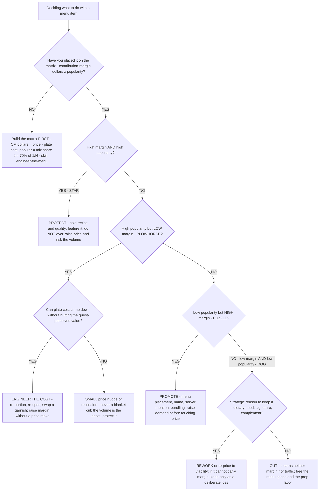

# Restaurant menu decision tree — raise price vs re-engineer the mix vs cut the item

**Last reviewed:** 2026-06-05 · **Confidence:** medium (menu-engineering method + benchmark sources, web-verified this date). Contribution-margin, food-cost-%, and popularity figures are menu- and segment-dependent — they carry inline `[verify-at-use]` / `[ESTIMATE]` markers and must be validated against the unit's actual POS mix + recipe costs before any deliverable (CLAUDE.md §3 #8).

> Canonical decision tree for the `menu-cost-engineer` (the menu and food cost) with a finance assist from `restaurant-finance-analyst`. Traverse top-to-bottom against the item's real numbers **before** recommending a menu move. The order encodes the house discipline: **engineer the mix on margin AND popularity, and resist the price cut as the first lever** (CLAUDE.md §3 #3, #5). A blanket price cut sits at the bottom on purpose — it is rarely the right answer. This is decision-support for the operator, not a guarantee of guest response (CLAUDE.md §2).

---

## When this applies

You are deciding what to *do* with a menu item (or a menu): raise its price, re-engineer it (cost or reposition), promote it, leave it, or cut it. Common triggers: a food-cost review, a re-print, a margin-thin-but-sales-fine complaint, or a new-menu design.

## The tree



## Rationale per leaf

- **Build the matrix first** — never act on a single item in isolation or on food-cost % alone (CLAUDE.md §3 #5). Contribution margin is **price − plate cost in dollars**; an item is "popular" when its menu-mix share is at least **70% of even share (1 ÷ number of items)** [verify-at-use] — the Kasavana-Smith threshold. The 70% multiplier accounts for the fact that some items always outsell others.
- **Star (protect)** — high margin, high popularity. Don't kill the golden goose with an aggressive price hike; feature it and hold its quality.
- **Plowhorse (engineer cost, then nudge)** — popular but thin. The first lever is **cost engineering** (re-portion, re-spec) to lift margin without touching price; only if cost can't move do you take a *small* price nudge or reposition. **Never a blanket cut** — the popularity is the asset (CLAUDE.md §3 #3).
- **Puzzle (promote)** — profitable but under-ordered. Raise demand through placement, naming, server mention, and bundling **before** discounting; a discount on a high-margin item throws away the margin that made it a puzzle.
- **Dog (rework or cut)** — earns neither margin nor traffic. Keep only for a deliberate strategic reason (a dietary need, a signature, a complement that sells other items); otherwise cut it and reclaim the menu space + prep labor.

## The load-bearing arithmetic

```
contribution margin ($) = menu price − plate (recipe) cost
popularity threshold    = 0.70 × (1 ÷ number of menu items)     # "popular" if mix share ≥ this
item is a STAR     if CM ≥ menu-average CM AND mix share ≥ threshold
item is a PLOWHORSE if CM <  menu-average CM AND mix share ≥ threshold
item is a PUZZLE   if CM ≥ menu-average CM AND mix share <  threshold
item is a DOG      if CM <  menu-average CM AND mix share <  threshold
```

[`../scripts/restaurant_calc.py`](../scripts/restaurant_calc.py) `menu-item` computes CM, food-cost %, and the star/plowhorse/puzzle/dog quadrant for an item against a menu average + item count; `price-change-breakeven` computes how much volume an item can lose to a price increase (or must gain from a price cut) before contribution dollars fall.

## Gotchas

- **Food-cost % is not profit.** A 38%-food-cost entrée can out-earn a 22%-food-cost side in absolute dollars (CLAUDE.md §3 #5). Engineer on **dollars of CM**, not the percentage.
- **A price cut almost never "fixes" margin.** It needs a large volume gain just to stay even — run `price-change-breakeven` before proposing one (CLAUDE.md §3 #3).
- **Mix share must be real POS data**, not a guess — the whole quadrant flips on whether an item clears the popularity threshold. Treat any specific share as `[ESTIMATE]` until pulled from the POS.
- **Don't reprice off the competitor's menu** — reprice from the cost stack and the item's value/role on *your* menu.

## Escalation & guardrails

- Recipe-costing / theoretical-vs-actual food cost → [`menu-cost-engineer`](../agents/menu-cost-engineer.md) (the close-the-food-cost-gap skill).
- The four-wall margin impact of a re-engineered menu → [`restaurant-finance-analyst`](../agents/restaurant-finance-analyst.md).
- Every figure entering a deliverable carries a source URL + retrieval date or an `[unverified — training knowledge]` / `[ESTIMATE]` mark (CLAUDE.md §3 #8).

## Sources (retrieved 2026-06-05)

- Toast — *Menu Engineering Matrix: Stars, Puzzles & More* (the four categories + the four strategic moves): https://pos.toasttab.com/blog/on-the-line/menu-engineering-matrix
- meez — *Menu Engineering Matrix: How to Classify Every Menu Item* (contribution-margin = price − plate cost): https://www.getmeez.com/blog/menu-engineering-matrix
- Apicbase — *Restaurant Menu Engineering* (the 70% × (1 ÷ N) Kasavana-Smith popularity threshold): https://get.apicbase.com/restaurant-menu-engineering/
