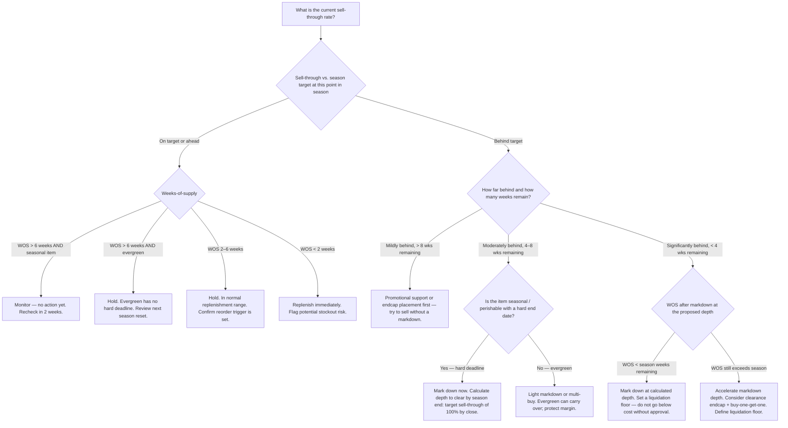
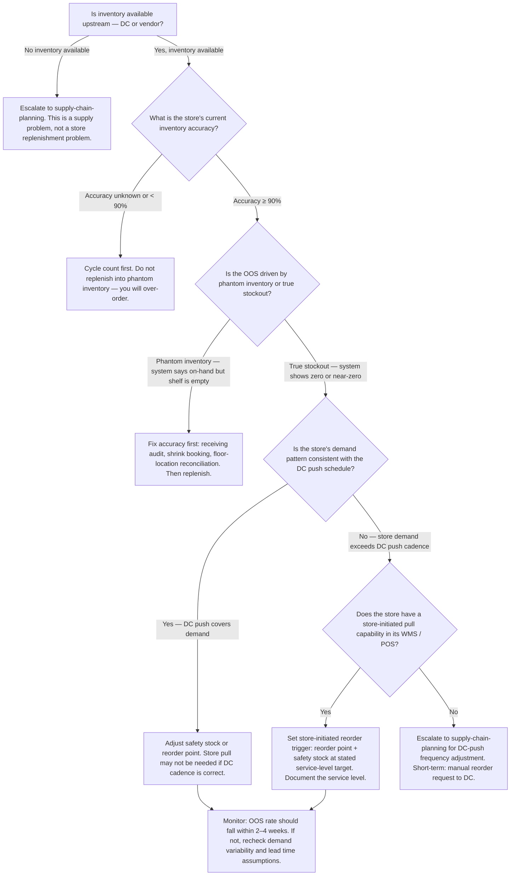
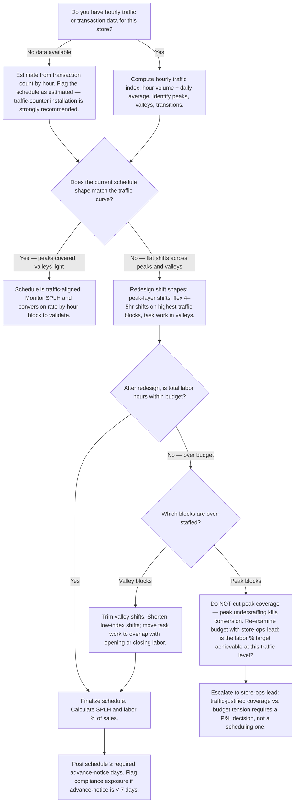

# Retail Store Operations — Decision Trees + 2026 Capability Map

> Canonical knowledge bank for `retail-store-operations`. **Traverse the relevant Mermaid tree
> top-to-bottom before choosing** — the proactive complement to the Capability Grounding Protocol.
> Volatile product/version facts in the capability map carry a retrieval date and a re-verify-at-use
> rider. Mark any market-share figure or specific product claim `[verify-at-use]`.

---

## Decision Tree 1: Markdown or Hold

**Leaf rule:** markdown decisions require (1) a current sell-through rate, (2) weeks-of-supply
on hand, (3) a count of weeks remaining in the selling season, and (4) a seasonal vs. evergreen
classification. A markdown recommendation without all four is an opinion. Never go below cost
without explicit approval and a documented reason. Evergreen items tolerate a carry-over hold;
seasonal items with a hard deadline cannot.

---

## Decision Tree 2: Replenish vs. Allocate

**Leaf rule:** before setting a replenishment trigger, confirm inventory accuracy ≥ 90% —
replenishing into phantom inventory creates overstock, not coverage. Every safety stock figure
must be paired with an explicit service-level target (95% / 98% / 99%). A store-triggered pull
is appropriate when DC push cadence cannot match demand variability; escalate upstream
(`supply-chain-planning`) when the supply is absent entirely.

---

## Decision Tree 3: Staff-to-Traffic Curve

**Leaf rule:** staff to the traffic curve, not the clock. A flat-shift schedule systematically
under-staffs peak blocks (where conversion is made) and over-staffs valley blocks (where it
isn't). If a traffic-justified schedule exceeds the labor budget, that is a P&L conversation with
`store-ops-lead` — not a reason to cut peak coverage blindly. Sales per labor hour and conversion
rate by hour block are the diagnostic KPIs for schedule quality.

---

## 2026 Capability Map — Retail Store Operations Platforms

_Retrieved 2026-06-08. Product positioning, pricing, and availability are volatile — re-confirm
at use; this is orientation, not a procurement recommendation._

| Category | Platforms (2026) | Notes |
|---|---|---|
| **POS systems** | **Square for Retail** — SMB-friendly, cloud-native, strong omnichannel inventory sync [verify-at-use]. **Lightspeed Retail** — mid-market, strong inventory management and analytics [verify-at-use]. **NCR Counterpoint / NCR Voyix** — larger retail chains, on-prem + SaaS hybrid [verify-at-use]. **Shopify POS** — strong DTC-to-retail bridge; inventory shared with Shopify online [verify-at-use]. | POS market is highly fragmented. Confirm current product names and capabilities — vendors rebrand and consolidate. |
| **Merchandising / space planning** | **Blue Yonder (formerly JDA) Space Planning** — enterprise assortment and floor planning, planogram design, category management [verify-at-use]. **Symphony RetailAI** — AI-assisted category management and assortment optimization [verify-at-use]. **One Door** — cloud-native store execution and planogram compliance [verify-at-use]. | Enterprise space planning tools require significant implementation; mid-market often uses Excel + provider templates. |
| **Workforce management (WFM)** | **Legion WFM** — AI-driven demand forecasting and scheduling, mobile-first, retail-focused [verify-at-use]. **UKG (Kronos Workforce Ready / Pro WFM)** — enterprise WFM, deep compliance engine, broad retail use [verify-at-use]. **HotSchedules (Fourth)** — strong in food/beverage and specialty retail [verify-at-use]. **Deputy** — SMB scheduling, mobile-first [verify-at-use]. | WFM capability around predictive scheduling compliance varies by geography — verify the specific ordinance support for your jurisdictions. |
| **Inventory accuracy / cycle counting** | **Zebra Technologies** scanner and mobile computing hardware. **Scandit** — smartphone-based scanning, reduces hardware cost [verify-at-use]. **Xtreme Cycle Counting** — cycle count workflow software [verify-at-use]. | Many retailers run cycle counting inside their WMS or ERP (e.g. Manhattan Associates, JDA) without a standalone tool. |
| **Loss prevention / EAS** | **Checkpoint Systems** — EAS (Electronic Article Surveillance) tagging and deactivation, RFID [verify-at-use]. **Sensormatic (Johnson Controls)** — EAS, RFID, exception-based reporting [verify-at-use]. **Appriss Retail (formerly The Retail Equation)** — return fraud analytics, exception reporting [verify-at-use]. | LP technology is a capital decision; product selection requires a site assessment and vendor demo. |
| **Exception-based reporting (EBR)** | **Appriss Retail**, **Samba Safety**, **ProfitTrax** — rules-based POS exception analytics for internal theft detection [verify-at-use]. | Most enterprise POS platforms offer some EBR; standalone tools add deeper analytics and case management. |

> Provenance: vendor website review and retail-industry analyst coverage (NRF, RIS News), retrieved
> 2026-06-08. Product names, ownership, and features change — re-verify at use. No invented products.
> Shares and rankings are not cited; this is an orientation map, not a market-share report.

---

## See also

- [`../CLAUDE.md`](../CLAUDE.md) — team constitution and seams.
- [`../best-practices/README.md`](../best-practices/README.md) — the named, citable rules.
- [`../scripts/retail_calc.py`](../scripts/retail_calc.py) — GMROI, sell-through, shrink %, WOS,
  conversion, SPLH calculator.

_Last reviewed: 2026-06-08 by `claude`._
