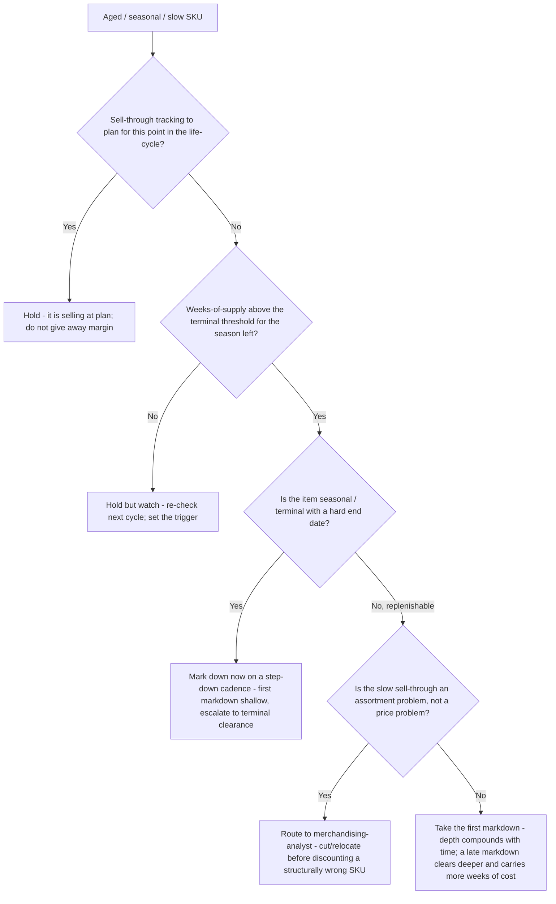
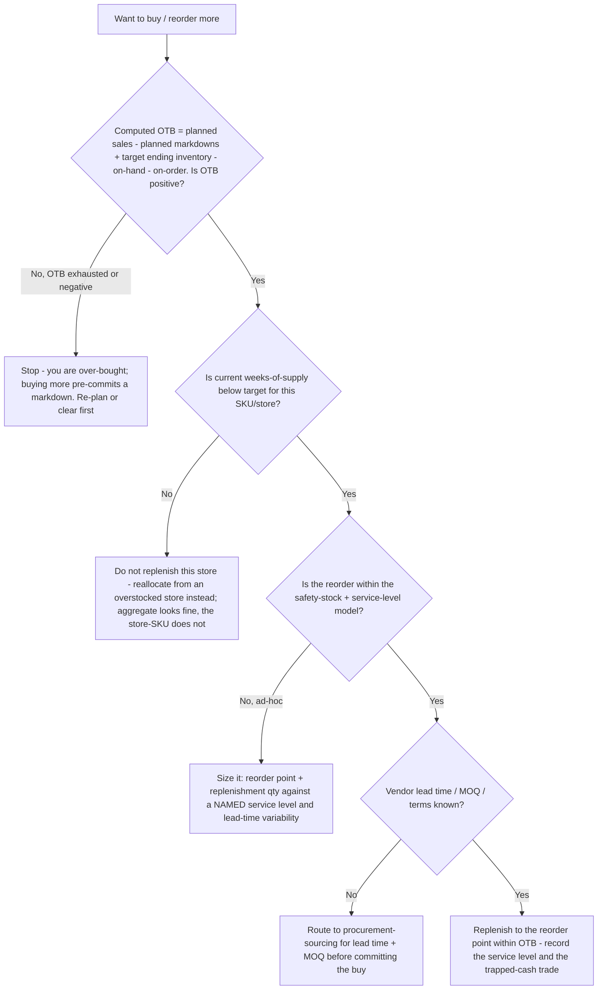

# Retail Store Operations — Decision Trees

_Decision trees + a dated metric/formula map. Formula rows are `[verify-at-build]` — re-check the definition (numerator, denominator, window) against the consumer's reporting before quoting. Last reviewed: 2026-06-08._

Traverse before marking down aged inventory, committing a buy against open-to-buy, or calling a store P&L "fixed".

## Decision Tree: Mark it down now, or hold?

Markdown clears trapped cash; holding bets on demand returning. The first markdown is usually the cheapest.

_Trigger markdowns on sell-through + weeks-of-supply, not on the calendar alone. The first markdown is the cheapest; waiting trades a shallow cut now for a deep one later plus carrying cost._

## Decision Tree: Replenish the buy, or stop at the open-to-buy cap?

Open-to-buy is the budget; over-buying pre-commits the markdown.

_OTB caps forward commitment; weeks-of-supply decides whether THIS store needs it; the service level sizes the buffer. Aggregate availability is a comforting lie during a stockout — always drill to store-SKU._

---

## Metric / formula map (2026, `[verify-at-build]`)

| Metric | Working definition | Notes |
|---|---|---|
| Sell-through % | units sold ÷ units received (over a window) × 100 | Always state the window; "sell-through" with no period is ambiguous `[verify-at-build]` |
| Weeks-of-supply (WOS) | on-hand units ÷ average weekly demand | The inventory truth-teller; normalizes on-hand to the demand rate `[verify-at-build]` |
| GMROI | gross margin $ ÷ average inventory cost | "Does this inventory earn its carrying cost?" — the capital-efficiency lens `[verify-at-build]` |
| Inventory turns | COGS ÷ average inventory (at cost) | Turns and WOS are reciprocals of the same flow `[verify-at-build]` |
| Open-to-buy (OTB) | planned sales − planned markdowns + planned ending inventory − (on-hand + on-order) | The forward-buy budget; usually in retail $ at a category/month level `[verify-at-build]` |
| Safety stock | f(demand variability, lead-time variability, target service level) | Sized to a NAMED service level; e.g. z·σ over lead time — state the z / service target `[verify-at-build]` |
| Comp / same-store sales | sales from stores open ≥ ~12 months, period vs. like period | Excludes new/closed stores; the organic-growth read `[verify-at-build]` |
| Labor % (of sales) | store labor $ ÷ store sales × 100 | The controllable lever scheduled against the traffic curve `[verify-at-build]` |
| Conversion | transactions ÷ traffic (door counter) | Sales = traffic × conversion × basket; protect at peak `[verify-at-build]` |
| Shrink % | (book inventory − physical inventory) value ÷ sales × 100 | Split operational vs. theft (internal/external) vs. vendor/admin `[verify-at-build]` |

_Reference: every metric is ambiguous until you state the numerator, denominator, and window. GMROI and turns answer "is this inventory earning?"; WOS and sell-through answer "is the flow right?"; OTB answers "can we buy more?". Re-verify any definition against the consumer's reporting system before defending a decision on it — definitions drift between retailers._
