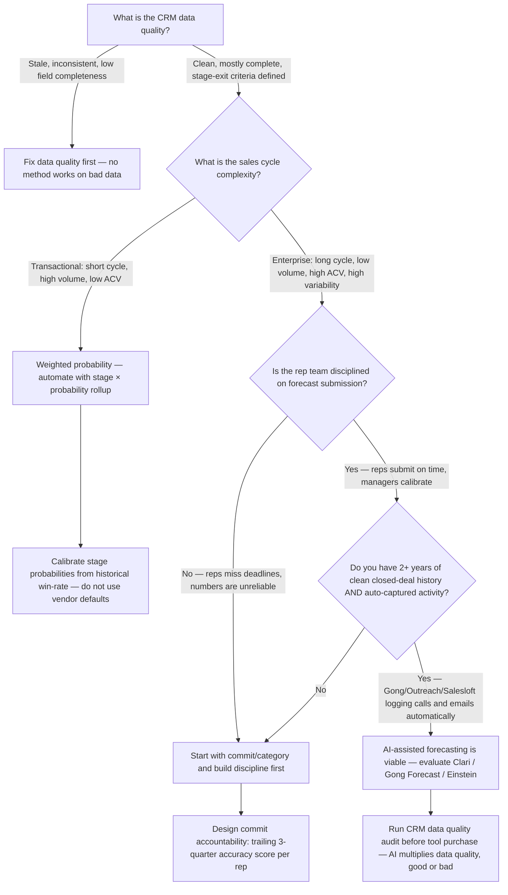
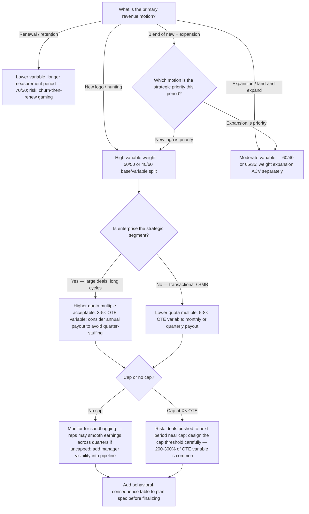
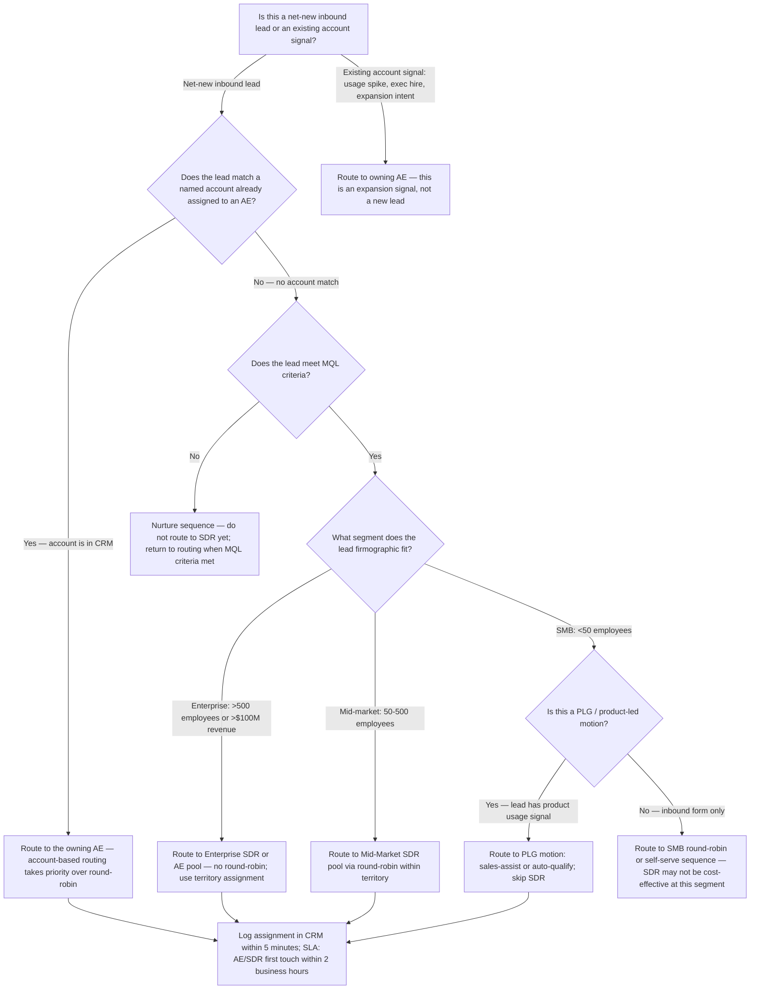

# Revenue Operations — Decision Trees + 2026 Capability Map

> Canonical knowledge bank for `revenue-operations`. **Traverse the relevant Mermaid tree
> top-to-bottom before choosing** — the proactive complement to the Capability Grounding Protocol.
> Volatile product/version/pricing facts in the capability map carry a retrieval date and a
> re-verify-at-use rider. Mark all market/product figures `[verify-at-use]`.

---

## Decision Tree 1: Forecast Method Selection

**Leaf rules:**
- Weighted probability: always calibrate from historical win-rate — vendor defaults are wrong for
  almost every company.
- Commit/category: rep accountability for commit accuracy is the non-negotiable prerequisite.
- AI-assisted: the tool does not replace the process — it accelerates a process that already works.
  Do not adopt before CRM data quality is established.

---

## Decision Tree 2: Comp Plan Shape

**Leaf rules:**
- Name the intended behavior and the adjacent perverse behavior for every mechanic before
  finalizing the plan. A plan designed without behavioral-consequence analysis is incomplete.
- OTE is set after quota is set, not before: OTE variable = quota ÷ quota multiple.
- SPIFs must have an end date or they become baseline noise within two quarters.

---

## Decision Tree 3: Lead Routing and Account Assignment

**Leaf rules:**
- Account-based routing always overrides round-robin: if a lead's company matches an existing
  named account, it goes to the owning AE, not the round-robin queue.
- Lead routing SLAs must be in the CRM: a lead not touched within SLA is a process failure, not
  a rep failure — fix the routing rule, not the rep.
- PLG signals (product usage, trial activity) are high-intent — route to the appropriate motion
  (sales-assist for enterprise, self-serve for SMB) and do not treat them as cold inbound.

---

## 2026 Capability Map — RevOps Tooling

> All product capabilities, pricing, and market positions are as of 2026 research. Mark volatile
> figures `[verify-at-use]`. This map covers the primary categories; it is not exhaustive.

### CRM

| Platform | Strengths | Watch-outs | Best fit |
| --- | --- | --- | --- |
| **Salesforce Sales Cloud** | Deep customization, AppExchange ecosystem, enterprise-grade security, Revenue Cloud (CPQ/billing) | High admin overhead; licensing cost; can become a complexity trap | Mid-market to enterprise; complex sales processes; existing Salesforce org |
| **HubSpot CRM** | Ease of use, fast setup, strong marketing-sales integration, competitive SMB pricing | Customization ceiling; reporting depth vs. Salesforce; enterprise scale limits | SMB to lower mid-market; inbound-heavy motions; teams prioritizing adoption speed over depth |
| **Pipedrive** | Deal-centric UI, simple pipeline view, fast onboarding | Limited reporting and automation at scale | SMB transactional sales; small team |

### Forecasting and Pipeline Intelligence

| Tool | Primary value | Prerequisite | Notes |
| --- | --- | --- | --- |
| **Clari** | AI forecast, pipeline inspection, deal risk scoring | Clean CRM + activity capture (Gong or Outreach) | Market leader for enterprise AI forecasting [verify-at-use for pricing] |
| **Gong Forecast** | Conversation intelligence + forecast in one platform | Gong already deployed for call recording | Strongest if Gong is already the activity capture layer |
| **Salesforce Einstein Forecasting** | Native to Salesforce; no additional data pipe | Salesforce CRM required; requires Einstein license | Lower lift if already on Salesforce; less sophisticated than Clari for complex orgs |
| **Aviso** | AI forecast with deal coaching signals | Salesforce or HubSpot CRM; activity capture | Enterprise alternative to Clari [verify-at-use] |

### Sales Engagement (Activity Capture)

| Tool | Primary value | Notes |
| --- | --- | --- |
| **Outreach** | Sequence automation, call recording, CRM sync | Market leader for outbound sales engagement [verify-at-use] |
| **Salesloft** | Sequence automation, revenue workflow, analytics | Strong alternative to Outreach; merged with Drift [verify-at-use] |
| **Gong** | Conversation intelligence, call recording, deal risk | Best-in-class for call analysis; feeds AI forecasting tools |
| **Apollo.io** | Prospecting + engagement in one platform | Strong for SMB / data-enriched outbound [verify-at-use] |

### Revenue Intelligence / BI

| Tool | Primary value | Notes |
| --- | --- | --- |
| **Tableau / Salesforce Analytics** | Deep BI on CRM data | High setup cost; requires dedicated analyst |
| **Looker / Google Looker Studio** | Governed semantic layer; embedded analytics | Strong if BigQuery is the data warehouse |
| **Clari Copilot / Revenue.io** | Real-time call coaching + CRM auto-update | [verify-at-use] |
| **Mosaic / Pigment** | Connected planning (revenue + finance) | Strong for RevOps-Finance alignment on quota-to-plan [verify-at-use] |

### Comp Management

| Tool | Primary value | Notes |
| --- | --- | --- |
| **Spiff (Salesforce)** | Commission calculation, plan admin, rep transparency | Acquired by Salesforce; native integration [verify-at-use] |
| **CaptivateIQ** | Flexible plan modeling, strong reporting | Enterprise comp management [verify-at-use] |
| **Forma.ai** | AI-assisted comp modeling and territory design | [verify-at-use] |
| **Xactly Incent** | Enterprise-grade; long-standing market leader | High implementation cost; strong for complex multi-tier plans [verify-at-use] |

---

_Last reviewed: 2026-06-08 by `claude`._
