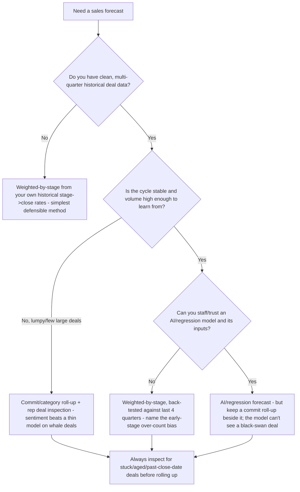
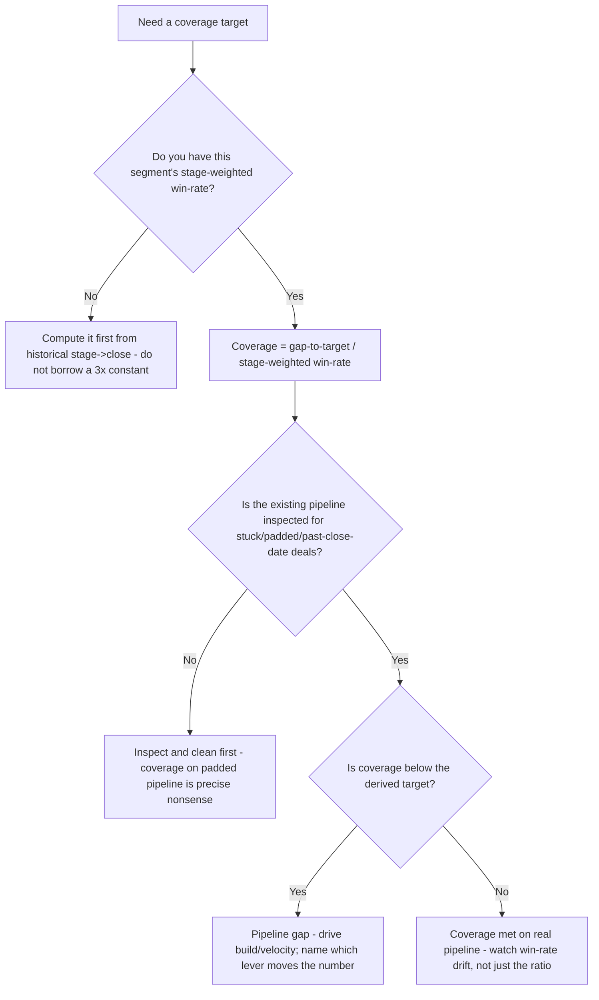

# RevOps — Decision Trees

_Decision trees + a dated reference map. Reference rows are `[verify-at-build]` — re-check the definition/method against a current source before quoting. Last reviewed: 2026-06-08._

Traverse before choosing a forecast method, deriving coverage, picking an attribution model, or defining funnel stages.

## Decision Tree: Which forecast method should we use?

A forecast is a methodology with a named bias — match the method to the data you actually have.

_Weighted over-counts early pipeline; commit is rep-sentiment-driven; AI/regression needs clean history and is blind to the unprecedented deal. State the bias every time, and back-test before you trust._

## Decision Tree: How much pipeline coverage do we actually need?

Coverage is derived from this segment's win-rate, not inherited as a folk "3x".

_Required coverage = gap ÷ stage-weighted win-rate. "3x" is somebody else's win-rate. Derive from this segment's conversion, and only on inspected pipeline._

---

## Reference map (2026, `[verify-at-build]`)

### Funnel metric glossary

| Term | Working definition | Note |
|---|---|---|
| MQL | Marketing-qualified lead — meets the agreed fit + engagement threshold to pass to sales | Define by criteria *sales accepts*; pair with an accept/reject loop `[verify-at-build]` |
| SAL | Sales-accepted lead — sales has accepted the MQL for follow-up | The handoff checkpoint; closes the marketing↔sales loop `[verify-at-build]` |
| SQL | Sales-qualified lead — sales has qualified it into active pursuit | Often the opportunity-creation trigger `[verify-at-build]` |
| Conversion rate | Volume passing stage N→N+1 ÷ volume entering stage N | Compute per segment/source; the funnel's core diagnostic `[verify-at-build]` |
| Sales velocity | (open opps × win-rate × avg deal size) ÷ avg cycle length | The lever-finder; isolates which input a change moves `[verify-at-build]` |
| Pipeline coverage | open pipeline ÷ gap-to-target | Derive the *target* from win-rate, never a folk 3x `[verify-at-build]` |
| Win-rate | won opps ÷ (won + lost) closed opps | By segment/source/stage; beware including no-decision `[verify-at-build]` |

### Forecast methods

| Method | Inputs | Known bias `[verify-at-build]` |
|---|---|---|
| Weighted-by-stage | stage × historical stage->close rate × deal size | Over-counts early-stage pipeline; only as good as the stage rates |
| Commit / category | rep roll-up into commit / best-case / pipeline | Rep sentiment (sandbagging or happy-ears); not statistical |
| AI / regression | clean multi-quarter history, deal features | Blind to unprecedented deals; needs data hygiene + a champion |

### Attribution models

| Model | Credits | Distorts (`[verify-at-build]`) |
|---|---|---|
| First-touch | the demand-creating touch | Over-credits top-of-funnel; ignores closing influence |
| Last-touch | the final touch before conversion | Defunds demand creation; over-credits bottom-of-funnel |
| Linear | every touch equally | Flattens real influence differences |
| W-shaped / position-based | first, lead-creation, opp-creation touches | Opinionated weighting; still a heuristic, not truth |
| Data-driven | algorithmic per-touch credit | Needs volume + clean data; a black box to stakeholders |

### Comp / quota mechanics

| Mechanic | Working definition | Watch-for `[verify-at-build]` |
|---|---|---|
| Quota (bottoms-up) | ramped-rep capacity × productivity, reconciled to the board number | A top-down-only quota misses predictably |
| Capacity model | ramped reps × ramp curve × expected productivity | The reconciliation surface against the board target |
| OTE / pay mix | base : variable split at target | Drives risk appetite and behavior |
| Accelerators / caps | over-attainment multipliers / ceilings | Caps invite end-of-period deal-dumping/holding |
| Clawback | reversal on early churn | Its absence rewards bad-fit closes |

_The funnel is a bowtie: model acquisition (left) and retention/expansion (right) as one connected motion — the right side hands to `customer-success-analytics`. Re-verify any definition/method/model specific before quoting it to a consumer._
