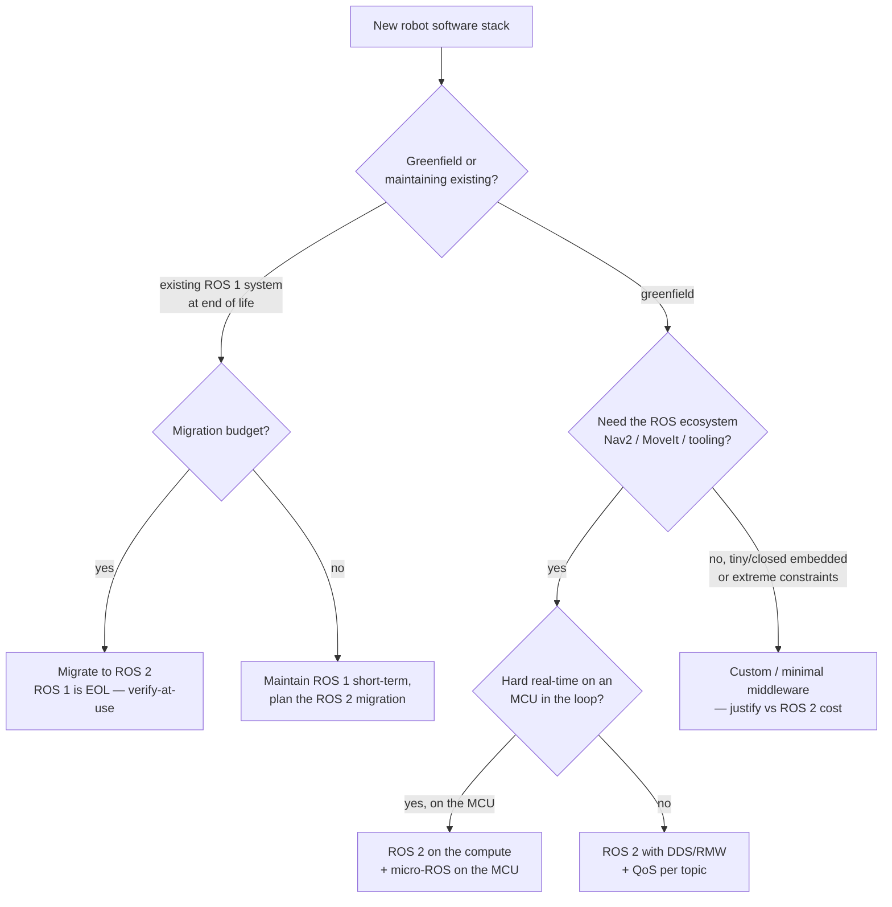
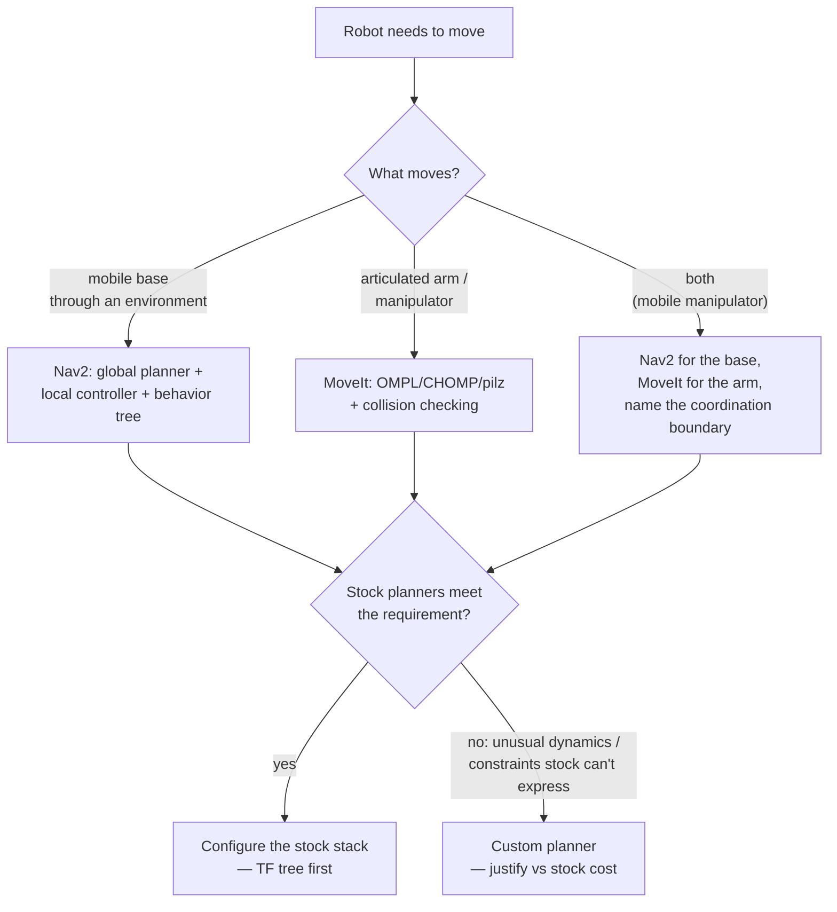
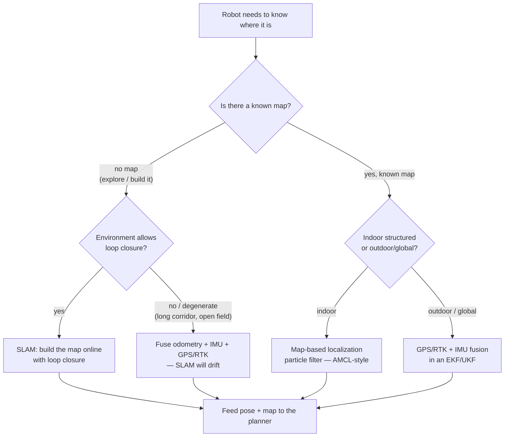
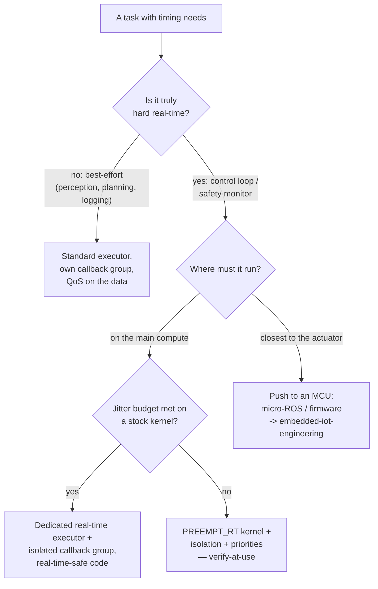

# Robotics & Autonomous Systems — Decision Trees

> Reference decision trees for the `robotics-autonomous-systems-engineering` team. Agents **traverse the relevant tree top-to-bottom before deciding** (the proactive complement to the Capability Grounding Protocol). Each `## Decision Tree` section is a Mermaid graph plus the rule it encodes.
>
> **Engineering decision-support, not functional-safety certification or legal advice.** Anything touching a functional-safety standard clause, a DDS/distro detail, or a sensor/compute spec is `[verify-at-use]` — confirm against the standard, the vendor datasheet, or a measurement on the target before acting. No PII.
>
> _Last reviewed: 2026-07-02 by `claude`. Principles are durable; dated distro/DDS/sensor/standard specifics live in [`robotics-reference-2026.md`](robotics-reference-2026.md)._

---

## Decision Tree: ROS 2 vs ROS 1 vs custom middleware

**Rule:** default to **ROS 2** for anything that benefits from the ecosystem (Nav2, MoveIt, tooling) — reach for `micro-ROS` at the MCU boundary and a **custom** middleware only when an extreme constraint defeats DDS. ROS 1 is end-of-life; new work targets ROS 2. Distro/DDS specifics are `[verify-at-use]`.

---

## Decision Tree: motion-planner choice (Nav2 vs MoveIt vs custom)

**Rule:** pick the planner to **what actually moves** — Nav2 for navigation, MoveIt for manipulation, both with a named coordination boundary for a mobile manipulator. Prefer a **well-configured stock stack** and earn a custom planner with a requirement the stock planners can't express. Verify the TF tree before blaming the planner.

---

## Decision Tree: localization-stack choice

**Rule:** decide on **whether a map exists and whether the environment supports loop closure**. Build a map online (SLAM) only when there's none and the scene allows it; localize against a known map when you have one — cheaper and more stable. Outdoors, lean on GPS/RTK + IMU fusion. Package choices are `[verify-at-use]` against your sensors and distro.

---

## Decision Tree: real-time execution path

**Rule:** decide the real-time need **at design time** and isolate what must be deterministic — most work is best-effort and lives on a standard executor; a control loop or safety monitor gets an isolated callback group/executor, then `PREEMPT_RT`, then a push to an MCU. Real-time is an architecture decision, not a runtime flag. Kernel/timing specifics are `[verify-at-use]`.

---

## See also

- [`robotics-reference-2026.md`](robotics-reference-2026.md) — dated distro/DDS/sensor/compute/standard specifics (verify-at-use).
- Skills: [`../skills/ros2-architecture-and-dds/SKILL.md`](../skills/ros2-architecture-and-dds/SKILL.md), [`../skills/motion-planning-and-control/SKILL.md`](../skills/motion-planning-and-control/SKILL.md), [`../skills/perception-and-state-estimation/SKILL.md`](../skills/perception-and-state-estimation/SKILL.md), [`../skills/sim-to-real-and-safety/SKILL.md`](../skills/sim-to-real-and-safety/SKILL.md).
