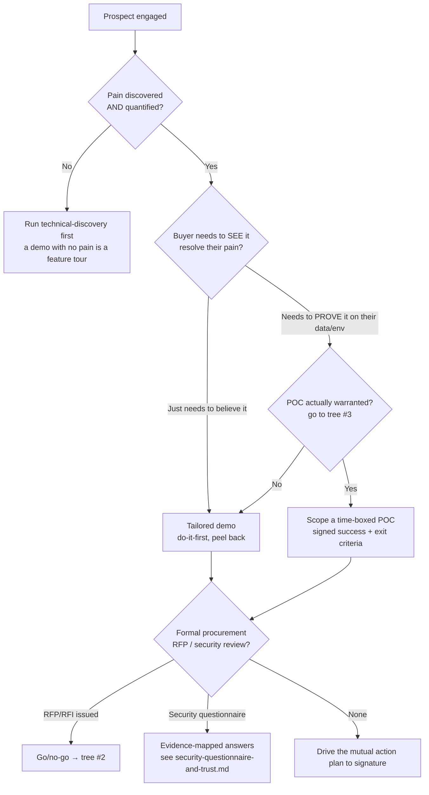
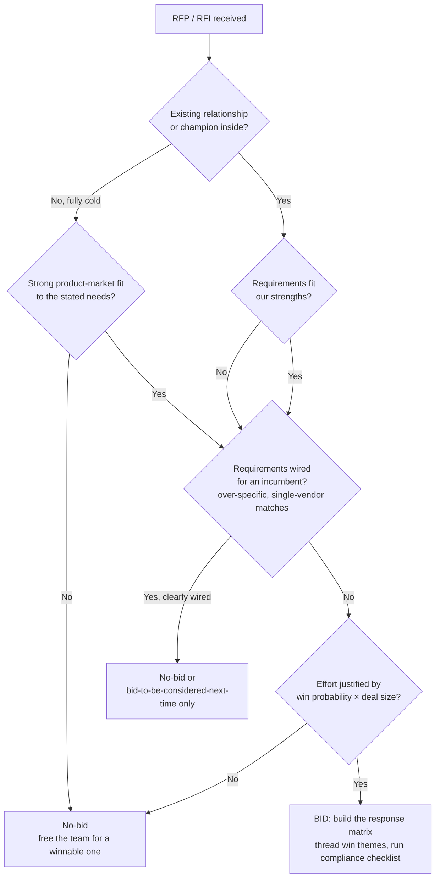
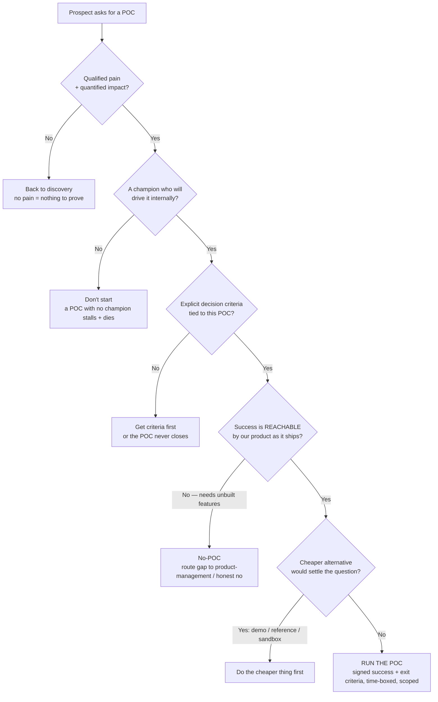
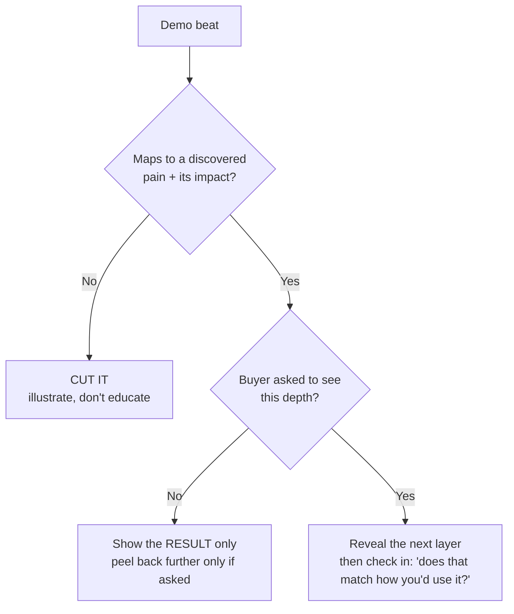

# Sales-engineering engagement decision trees

> _Last reviewed: 2026-06-10._ The decision trees the team traverses **before** choosing an engagement move. Method-before-motion: don't keyword-match "they asked for a demo" → demo; traverse the tree. These encode durable pre-sales craft (MEDDPICC, Great Demo!, standard POC and RFP qualification), not volatile tool facts.

---

## 1. Qualify the deal — what's the right next move?

**Leaves:** discovery → demo → (maybe) POC → procurement/security → close. The most common failure is jumping to a **demo with no discovered pain**, or agreeing to a **POC that a tailored demo or reference call would have closed cheaper**.

---

## 2. RFP / RFI go/no-go — should we bid at all?

**The discipline:** a graceful **no-bid** is a strategy, not a failure — the bids you decline fund the ones you win. The trap is the reflexive "respond to every RFP," which burns the team on cold, incumbent-wired, low-probability bids.

---

## 3. Build the POC? — is a proof-of-concept warranted?

**The gate exists because** a POC is the most expensive sales asset you have. The four preconditions — qualified pain, a champion, explicit decision criteria, and a *reachable* success definition — are all required; missing any one means the cheaper alternative (tailored demo, reference call, guided sandbox) is the better move.

---

## 4. Demo depth — how much to show?

**Great Demo! in one tree:** lead with the compelling result, peel back only the layers the buyer asks for, and cut any beat that doesn't tie to a discovered pain. The failure mode is the menu tour ("and here's another tab").

---

## Source discipline

These trees encode **evergreen pre-sales method** (MEDDPICC qualification, Great Demo!'s do-it-first/illustrate-not-educate, standard POC and RFP qualification gates). They carry no volatile tool/version facts, so they don't need a re-verify-at-use rider — unlike anything that names a specific vendor, price, or product version, which must carry a retrieval date per the marketplace freshness discipline.
