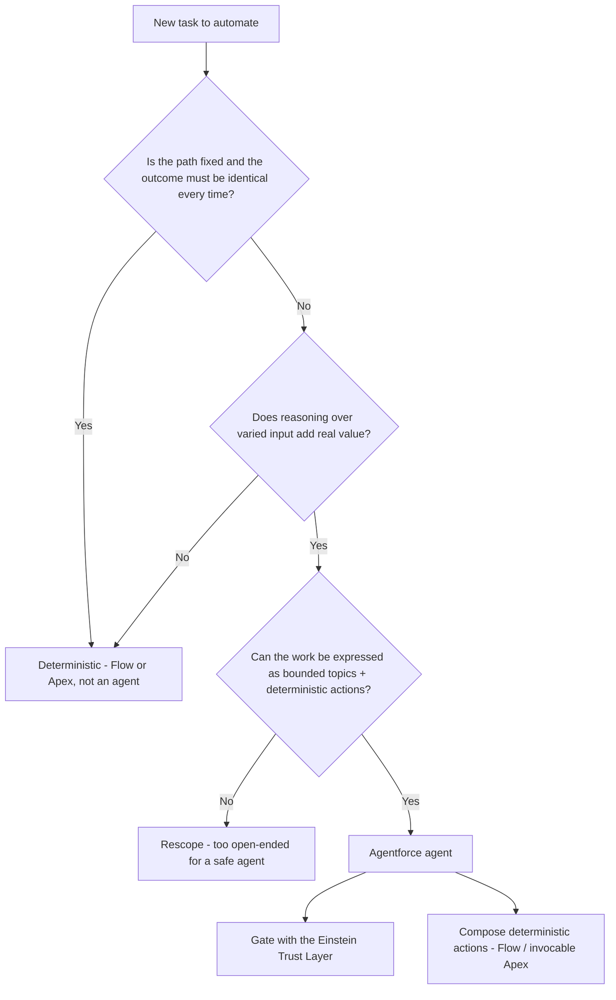

# Agentforce — Determinism & the Trust Layer

**Dated:** 2026-05-30 · **Status:** fast-moving — all Agentforce specifics `[verify-at-build]`

Agentforce is Salesforce's agentic AI layer, driven by the **Atlas reasoning engine**. It is **non-deterministic** — the cardinal rule (house opinion #14) is to never use it where a deterministic automation belongs, and to gate every agent with the **Einstein Trust Layer**.

## Decision Tree: agent or deterministic automation?

## Levels of determinism `[verify-at-build]`

Salesforce frames a spectrum from fully **deterministic** automation (Flow/Apex — same input, same output) to **agentic** behavior (the model reasons and plans). The design rule: push as much as possible onto the deterministic end; reserve the agentic end for genuine reasoning over variable input. Confirm the current naming of the levels at build time — this terminology is evolving.

## Atlas reasoning engine

Atlas plans how to satisfy a request by selecting from the **topic's actions**. Tightly scoped topics with deterministic actions (standard actions, Flows, `@InvocableMethod` Apex) keep the reasoning bounded and the side effects predictable. The newer Agentforce builder surfaces this topic/action authoring.

## Einstein Trust Layer

Every agent runs through the Trust Layer: **secure data retrieval / grounding**, **dynamic grounding** in Salesforce data, **data masking** of PII before it reaches the model, **prompt defense**, **toxicity detection**, and **zero data retention** by the model provider, plus an **audit trail**. No agent ships without it.

## Sources

- https://www.salesforce.com/agentforce/what-is-a-reasoning-engine/atlas/
- https://www.salesforce.com/agentforce/levels-of-determinism/
- https://trailhead.salesforce.com/content/learn/modules/the-einstein-trust-layer/follow-the-prompt-journey
- https://admin.salesforce.com/blog/2026/build-with-confidence-inside-the-new-agentforce-builder
