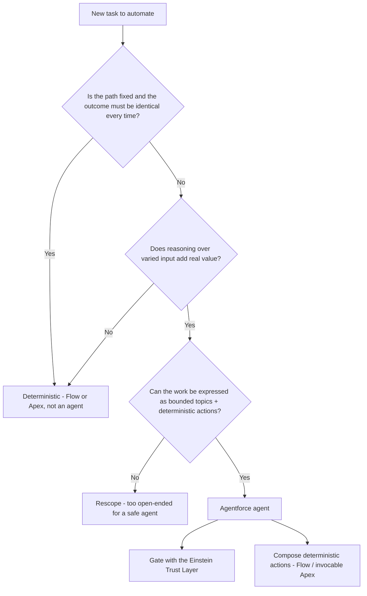

# Agentforce — Determinism & the Trust Layer

**Dated:** 2026-05-30 · **Status:** fast-moving — all Agentforce specifics `[verify-at-build]`

Agentforce is Salesforce's agentic AI layer, driven by the **Atlas reasoning engine**. It is **non-deterministic** — the cardinal rule (house opinion #14) is to never use it where a deterministic automation belongs, and to gate every agent with the **Einstein Trust Layer**.

## Decision Tree: agent or deterministic automation?

## Levels of determinism `[verify-at-build]`

Salesforce frames a spectrum from fully **deterministic** automation (Flow/Apex — same input, same output) to **agentic** behavior (the model reasons and plans). The design rule: push as much as possible onto the deterministic end; reserve the agentic end for genuine reasoning over variable input. Confirm the current naming of the levels at build time — this terminology is evolving.

## Atlas reasoning engine

Atlas plans how to satisfy a request by selecting from the **topic's actions**. Tightly scoped topics with deterministic actions (standard actions, Flows, `@InvocableMethod` Apex) keep the reasoning bounded and the side effects predictable. The newer Agentforce builder surfaces this topic/action authoring.

### Note — Agent Script + Agentforce Builder GA in Summer '26 (dated 2026-07-09)

The determinism story gains a first-class authoring surface in **Summer '26**: **Agent Script** (a schema-driven scripting language that blends **deterministic expressions** with **agentic natural-language reasoning/instructions** in one file) and the new **Agentforce Builder** are **GA**. Read against this doc's cardinal rule: Agent Script lets you pin the deterministic parts of an agent as explicit expressions while reserving NL instructions for genuine reasoning — the same "push work toward the deterministic end" discipline (house opinion #14), now expressible in the authoring language itself rather than only via topic/action scoping. Source: developer.salesforce.com Agent Script guide (`/docs/ai/agentforce/guide/agent-script.html`).

- **Legacy-builder cutover** `[verify-at-use]` (near-future date): starting the **week of 2026-07-13**, the *New Agent* button no longer opens the legacy Setup builder — new agents are created only in the new Agentforce Builder, and legacy agents upgrade **into** Agent Script. Source: Salesforce Summer '26 developer release guide.
- **Open-source toolchain:** the Agent Script toolchain (parser / linter / compiler / LSP) was **open-sourced under Apache-2.0** at `github.com/salesforce/agentscript` — a deterministic tooling path (lint/compile in CI) for what is otherwise an agentic layer.

All three sub-claims are fast-moving Agentforce specifics — keep them `[verify-at-build]` and re-confirm the week-of-2026-07-13 cutover at use.

## Einstein Trust Layer

Every agent runs through the Trust Layer: **secure data retrieval / grounding**, **dynamic grounding** in Salesforce data, **data masking** of PII before it reaches the model, **prompt defense**, **toxicity detection**, and **zero data retention** by the model provider, plus an **audit trail**. No agent ships without it.

## Sources

- https://www.salesforce.com/agentforce/what-is-a-reasoning-engine/atlas/
- https://www.salesforce.com/agentforce/levels-of-determinism/
- https://trailhead.salesforce.com/content/learn/modules/the-einstein-trust-layer/follow-the-prompt-journey
- https://admin.salesforce.com/blog/2026/build-with-confidence-inside-the-new-agentforce-builder
- https://developer.salesforce.com/docs/ai/agentforce/guide/agent-script.html (Agent Script + Agentforce Builder GA, Summer '26)
- Salesforce Summer '26 developer release guide (legacy *New Agent* builder cutover, week of 2026-07-13)
- https://github.com/salesforce/agentscript (Agent Script toolchain — parser/linter/compiler/LSP, Apache-2.0)
