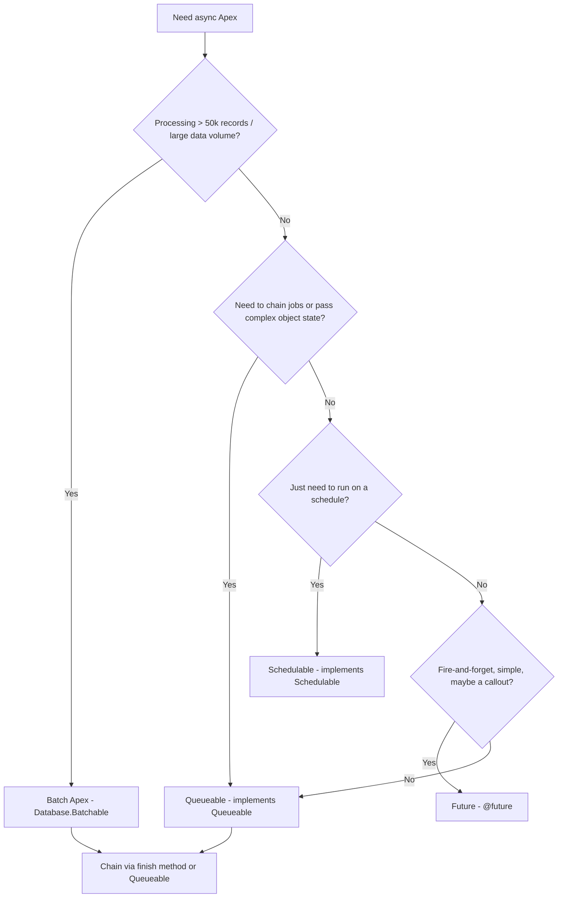

# Apex Async Patterns — Batch vs Queueable vs Future vs Schedulable

**Dated:** 2026-05-30 · **Status:** current; limit numbers `[verify-at-build]`

Async Apex moves work off the synchronous transaction — for larger data volume, higher limits, and callouts. Choosing the wrong primitive is a common cause of stuck jobs and limit breaches.

## Decision Tree: which async primitive?

## Comparison

| Primitive | Best for | Chaining | Notes |
| --- | --- | --- | --- |
| **Batch** | LDV (millions of rows) | `finish()` can enqueue next | `start/execute/finish`; scope size up to 2,000 |
| **Queueable** | Chaining, complex state, sequential jobs | enqueue from within (depth-limited) | Takes object params (unlike `@future`) |
| **Future** | Fire-and-forget, simple callouts | none | Primitive params only; no return; being superseded by Queueable for most cases |
| **Schedulable** | Cron-driven runs | often kicks off Batch | `System.schedule`; cron expression |

## Limits to watch `[verify-at-build]`

- Daily async-Apex executions (per-user-license scaled).
- Concurrent batch jobs and the flex queue depth.
- Queueable chaining depth (limited in synchronous context).
- `@future` calls per transaction.

Verify exact daily/concurrency numbers against the current limits cheat sheet.

## Sources

- https://salesforcedictionary.com/blogs/async-apex-complete-guide-batch-queueable-schedulable-future
