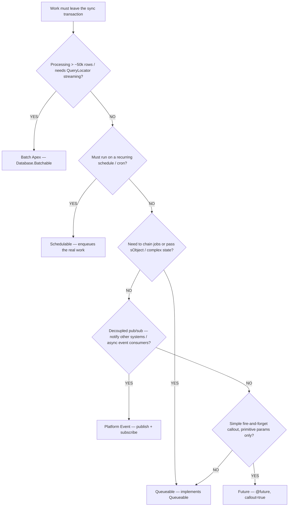
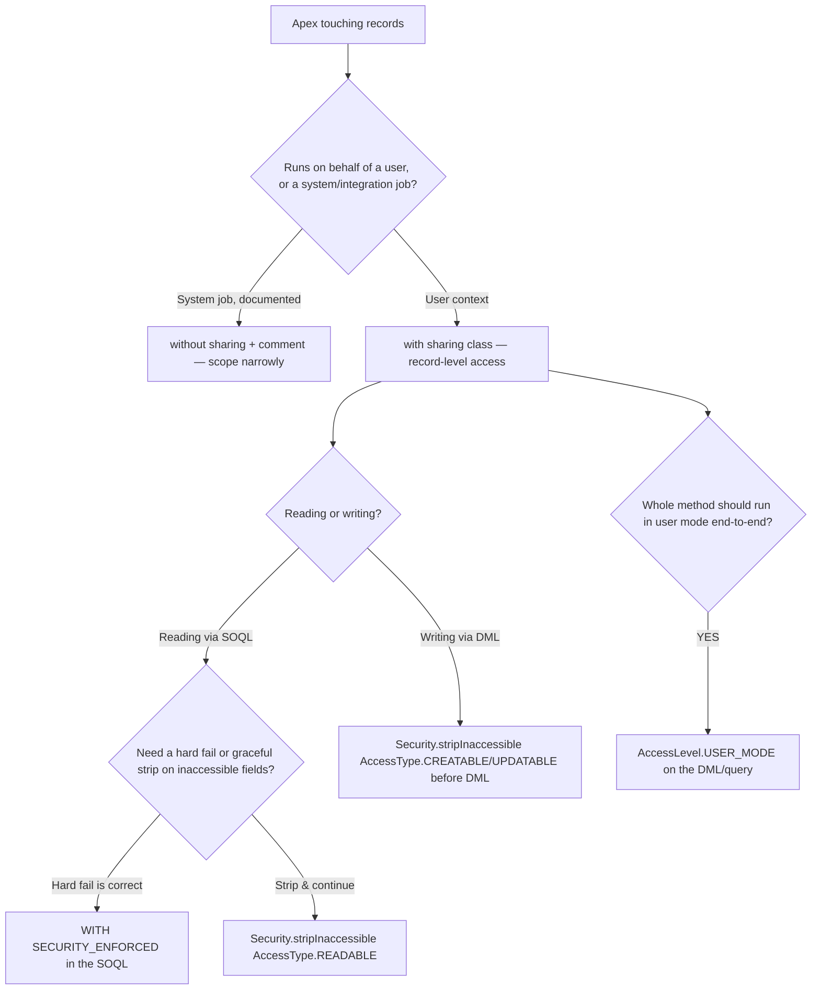
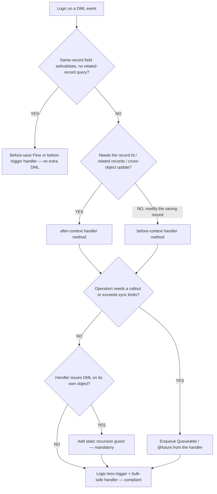
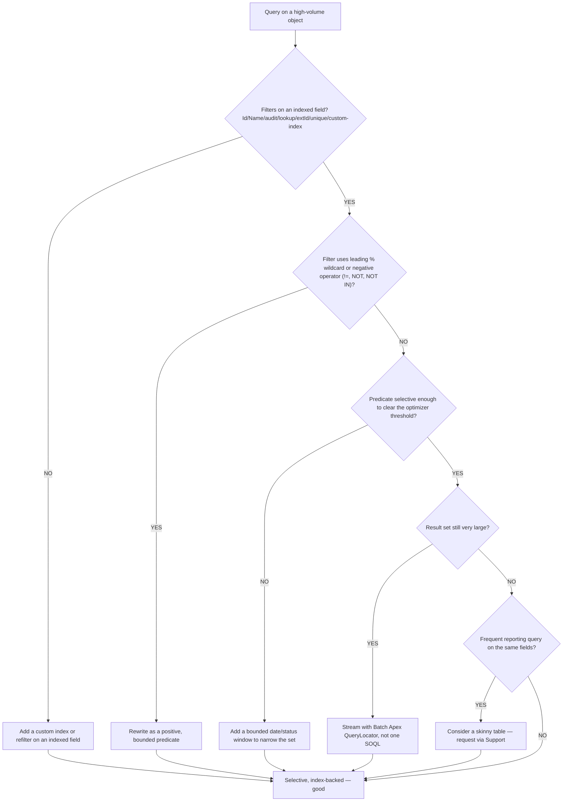
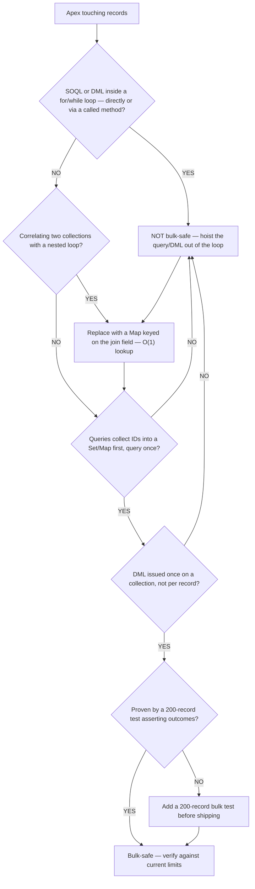
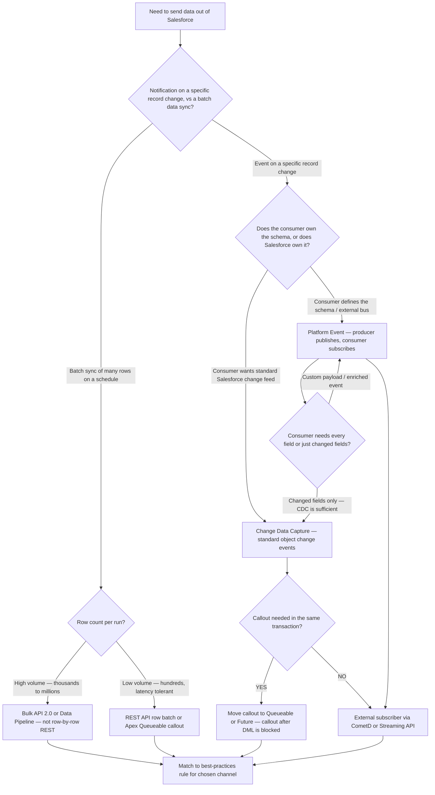
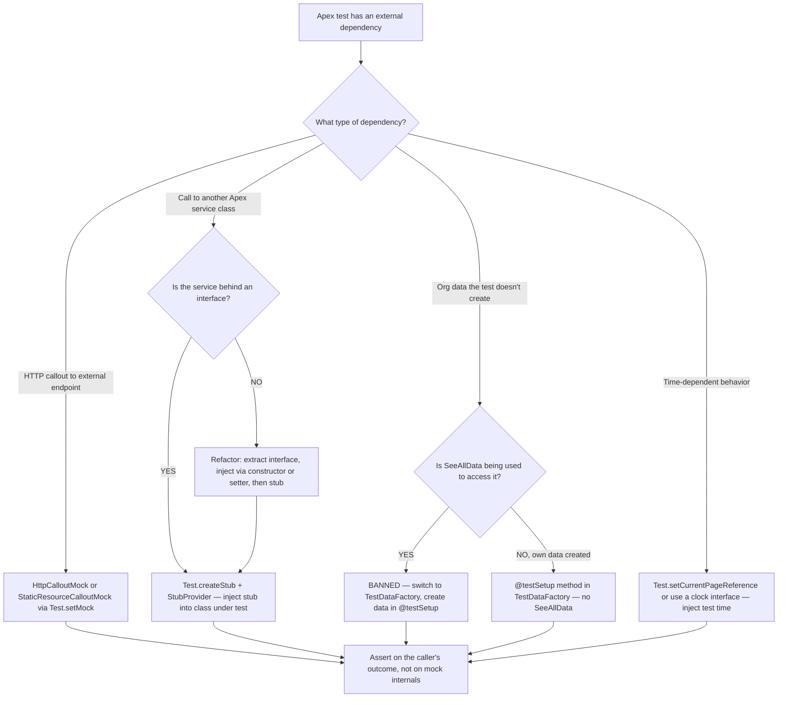
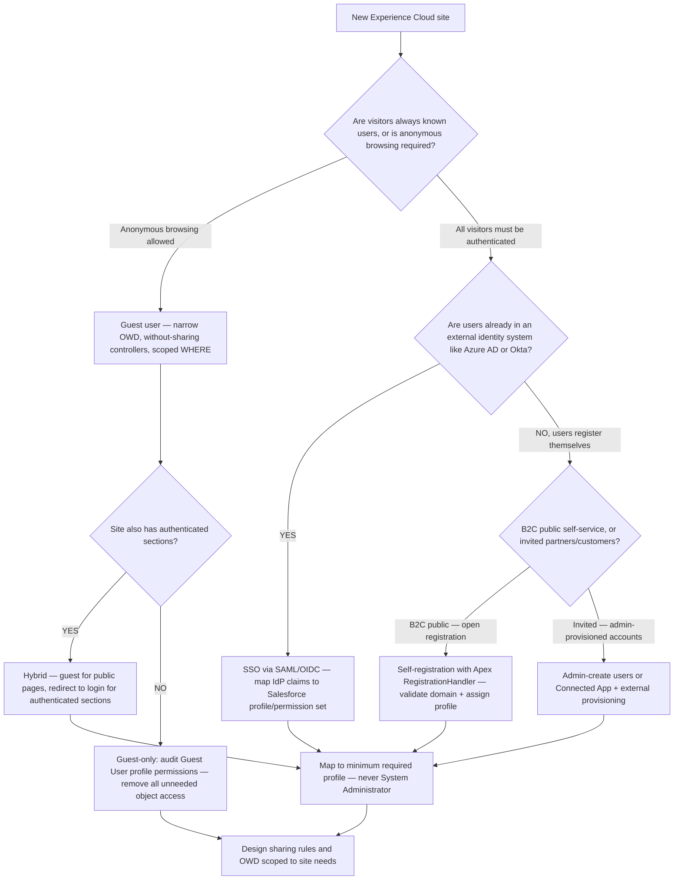

# Apex Decision Trees

**Dated:** 2026-05-30 · **Status:** current; governor-limit numbers and selectivity thresholds tagged `[verify-at-build]`

Canonical decision trees for the Apex domain — async-channel selection, security enforcement, trigger-logic placement, SOQL selectivity, and bulk-safety. Each tree is meant to be **traversed top-to-bottom before selecting a method**, not pattern-matched on keywords. The first branch where the condition resolves cleanly is the leaf to apply. Format follows [`../../../docs/best-practices/decision-trees-in-knowledge-files.md`](../../../docs/best-practices/decision-trees-in-knowledge-files.md).

---

## Decision Tree: Async Apex — which channel (Future / Queueable / Batch / Scheduled / Platform Event)

**When this applies:** You have work that must leave the synchronous transaction — a callout from a trigger context, a roll-up over more rows than a synchronous query can hold, a job that must chain, or a recurring task. Observable triggers: `System.LimitException` from synchronous volume, "callout not allowed from trigger," a need to run on a schedule, or an `@future` that won't compile because you passed an sObject.

**Last verified:** 2026-05-30 against [`apex-async-patterns.md`](apex-async-patterns.md) and the Spring '26 limits cheat sheet `[verify-at-build]`.

**Rationale per leaf:**
- *Batch Apex* — only channel that streams via `QueryLocator` and chunks (scope ≤ 2,000), so it survives row counts a single 50k-row SOQL can't hold; **requires:** nothing beyond standard Apex, but jobs compete for the org's concurrent-batch/flex-queue capacity.
- *Schedulable* — owns cron timing only; it should enqueue a Batch/Queueable rather than do heavy work itself.
- *Queueable* — the modern default for chaining and `sObject`/complex state; supersedes `@future` for nearly every new case.
- *Platform Event* — decouples producer from consumer (pub/sub) so neither blocks the other; the right tool when "other systems / async subscribers must hear about this," not when you just need more limits.
- *Future* — legacy fire-and-forget; primitive params only, no chaining, no return — reach for it only for a simple callout, and prefer Queueable even there.

**Tradeoffs summary table:**

| Channel | Best for | Chaining | State it carries | Watch-out `[verify-at-build]` |
|---|---|---|---|---|
| Batch | LDV / millions of rows | `finish()` can enqueue next | start/execute/finish state | concurrent-batch + flex-queue caps |
| Queueable | chaining, complex state | enqueue from within (depth-limited) | sObjects, full objects | chain depth limited from sync context |
| Future | simple fire-and-forget callout | none | primitive params only | no sObject params; superseded by Queueable |
| Schedulable | cron timing | kicks off Batch/Queueable | minimal | scheduled-job count limit |
| Platform Event | decoupled pub/sub | n/a (event-driven) | event payload fields | delivery semantics; publish-after-commit option |

---

## Decision Tree: Apex Security — where to enforce CRUD/FLS (with sharing / WITH SECURITY_ENFORCED / stripInaccessible / USER_MODE)

**When this applies:** You are writing Apex that reads or writes records on behalf of a user (a controller, a service called from LWC/Aura/VF, a user-invoked action). Observable triggers: a PMD/CRUD-FLS reviewer finding, an `@AuraEnabled` method exposing data, or a `without sharing` keyword with no justification. The *verdict* escalates to `ravenclaude-core/security-reviewer`; this tree picks the *mechanism*.

**Last verified:** 2026-05-30 against [`sharing-and-security-model.md`](sharing-and-security-model.md) and the `salesforce-reviewer` rubric items 6–7.

**Rationale per leaf:**
- *with sharing* — the default; enforces **record-level** OWD/sharing for the running user. **requires:** nothing; it is the baseline posture.
- *WITH SECURITY_ENFORCED* — enforces **field- and object-level** read access *in the query*; **throws** if the user lacks access to any selected field — use when a missing field is an error, not a silent omission.
- *Security.stripInaccessible (READABLE)* — removes inaccessible fields from results **without throwing**, so partial reads degrade gracefully — use when you'd rather return what the user can see.
- *Security.stripInaccessible (CREATABLE/UPDATABLE)* — strips fields the user can't write **before** the DML, preventing an FLS bypass on insert/update.
- *AccessLevel.USER_MODE* — runs the query/DML in user mode (FLS + sharing) as one switch; the modern end-to-end enforcement when you want uniform user-mode behavior.
- *without sharing* — only for a **documented** system operation that must see all records; scoped narrowly, never the default.

**Tradeoffs summary table:**

| Mechanism | Enforces | On inaccessible field | Use when |
|---|---|---|---|
| `with sharing` | record-level (OWD/sharing) | n/a (records, not fields) | always, by default, in user context |
| `WITH SECURITY_ENFORCED` | field + object read | **throws** `QueryException` | a missing field must be a hard error |
| `stripInaccessible` (READABLE) | field read | silently strips | partial read should degrade gracefully |
| `stripInaccessible` (CREATABLE/UPDATABLE) | field write | strips before DML | prevent FLS bypass on insert/update |
| `AccessLevel.USER_MODE` | FLS + sharing, query+DML | throws on violation | uniform user-mode for the whole operation |

---

## Decision Tree: Trigger Logic — where does this belong (before/after, handler, async, Flow)?

**When this applies:** You have logic to attach to a DML event and must decide the trigger context and placement. Observable triggers: a new automation requirement on an object, a field that must be defaulted/validated, a roll-up, or a callout that needs to happen on save.

**Last verified:** 2026-05-30 against [`trigger-handler-framework.md`](trigger-handler-framework.md) and house opinions #2–#4, #11–#12.

**Rationale per leaf:**
- *Before-save Flow / before-trigger* — same-record field changes need **no extra DML** (the platform saves `Trigger.new` as part of the original save); cheapest, and Flow is preferred for trivial cases (house opinion #11).
- *after-context handler* — the record Id and related records only exist **after** insert; cross-object work and roll-ups belong here.
- *before-context handler* — modify the saving record in place; no DML needed to persist the change.
- *Enqueue async* — callouts can't fire synchronously from a trigger, and over-limit work must move off the transaction.
- *Static recursion guard* — any handler that DMLs its own object will re-fire itself; the guard is **mandatory** (house opinion #4).
- *Logic-less trigger* — the trigger body never holds logic; one trigger per object dispatches to the handler.

**Tradeoffs summary table:**

| Placement | Extra DML? | Has record Id? | Use when |
|---|---|---|---|
| Before-save Flow | no | yes (on update) | trivial same-record field set, declarative ceiling not reached |
| before-trigger handler | no | no (on insert) | modify saving record, complex same-record logic |
| after-trigger handler | yes (cross-object) | yes | roll-ups, related-record updates, anything needing the Id |
| Async from handler | deferred | yes | callouts, over-limit volume |

---

## Decision Tree: SOQL Selectivity — will this query stay index-backed at volume?

**When this applies:** You are authoring or fixing a SOQL query that will run against an object expected to grow large (orders, cases, line items, logs). Observable triggers: `System.QueryException: Non-selective query against large object type`, a slow query in production, or a Query Plan showing cost ≥ 1.0.

**Last verified:** 2026-05-30 against [`large-data-volume-design.md`](large-data-volume-design.md); selectivity thresholds are platform values `[verify-at-build]`.

**Rationale per leaf:**
- *Add/standardize an index* — the optimizer can only choose an index that exists; a non-indexed filter forces a full scan that fails at volume. **requires:** custom index requested via Support, or the field flagged external-ID/unique.
- *Rewrite positive & bounded* — leading `%` wildcards and negative operators are non-selective by construction; a positive set + date window restores index use.
- *Add a bounded window* — even an indexed field is non-selective if the predicate matches too large a fraction of rows; bound it.
- *Batch QueryLocator* — streams large sets in chunks instead of holding 50k rows in one query's heap.
- *Skinny table* — a Salesforce-managed copy avoids base-table joins for hot reporting queries.

**Tradeoffs summary table:**

| Lever | Cost | Effect | Use when |
|---|---|---|---|
| Indexed/selective filter | design effort | optimizer picks the index | always — the primary lever |
| Custom index | Support request / config | makes a new field selectable | a needed filter field isn't indexed |
| Bounded date/status window | narrows results | clears the selectivity threshold | indexed but matches too many rows |
| Batch QueryLocator | async complexity | streams instead of loading | result set exceeds a single SOQL |
| Skinny table | Support request, sync overhead | removes joins | frequent reporting on fixed fields |

---

## Decision Tree: Bulk Safety — is this Apex safe for a 200-record load?

**When this applies:** You are reviewing or writing any Apex that runs in a trigger, a Batch `execute`, or any path a data load can reach. Observable triggers: `Too many SOQL queries: 101`, `Too many DML statements: 151`, `Apex CPU time limit exceeded`, or a test that only inserts one record.

**Last verified:** 2026-05-30 against [`governor-limits-and-bulkification.md`](governor-limits-and-bulkification.md); limit numbers `[verify-at-build]`.

**Rationale per leaf:**
- *Hoist out of the loop* — a SOQL/DML in a loop multiplies one operation by batch size and trips the 100-SOQL / 150-DML ceiling; this is the dominant Salesforce failure mode.
- *Replace with a Map* — a nested correlation loop is O(n×m) and trips CPU time at scale; a map keyed on the join field is O(1) per lookup.
- *Collect IDs / query once* — one query bound with `WHERE Id IN :ids` replaces N per-record queries.
- *One DML on a collection* — accumulate into a `List` and `insert`/`update` once.
- *200-record test* — coverage isn't a test; a 200-record assertion is what proves the path survives a load.

**Tradeoffs summary table:**

| Symptom | Limit hit `[verify-at-build]` | Root cause | Fix |
|---|---|---|---|
| Too many SOQL queries: 101 | 100 sync / 200 async | query in a loop | hoist + bind `IN :ids` |
| Too many DML statements: 151 | 150 | DML per record | accumulate list, one DML |
| Apex CPU time exceeded | 10,000 ms sync / 60,000 async | nested correlation loop | `Map` keyed lookup |
| Passes test, fails in prod | n/a | single-record test only | 200-record bulk test |

---

## Decision Tree: Integration pattern — Platform Event vs CDC vs outbound callout vs Bulk API

**When this applies:** You need to notify an external system (or an async subscriber) when a Salesforce record changes, or you need to push a batch of records to an external system on a schedule. Observable triggers: "trigger an external workflow when a case is closed," "sync Salesforce opportunity data to the data warehouse nightly," or "publish a domain event to a message bus."

**Last verified:** 2026-06-05 against [`../best-practices/integration-platform-events-vs-cdc-vs-callout.md`](../best-practices/integration-platform-events-vs-cdc-vs-callout.md).

**Rationale per leaf:**
- *Platform Event* — the producer controls the schema; any subscriber (Apex trigger, Flow, external system via CometD) can consume it without coupling to the Salesforce record model.
- *Change Data Capture* — Salesforce owns the event shape; consumers get field-level deltas without custom publishing code; limited to supported standard + custom objects.
- *Bulk API 2.0* — the correct channel for batch loads; processes rows asynchronously in jobs, avoiding row-by-row REST's per-call overhead and daily API request exhaustion.
- *Queueable/Future for callout* — a callout cannot fire synchronously inside an open DML transaction; async context is mandatory.

**Tradeoffs summary table:**

| Channel | Who owns schema | Latency | Volume fit | Watch-out |
|---|---|---|---|---|
| Platform Event | Salesforce (publisher) | near-real-time | medium | 24-hour retention; idempotent consumer required |
| CDC | Salesforce | near-real-time | medium | limited object support; only changed fields in payload |
| Bulk API 2.0 | external consumer | minutes (async job) | high | requires job polling; not for real-time |
| Queueable callout | caller-defined | seconds (async) | low-medium | chain depth; concurrent-limit cap |

---

## Decision Tree: Apex test isolation — which dependency-isolation technique?

**When this applies:** You are writing an Apex test class and a method under test has a dependency you want to isolate: an external HTTP callout, a SOQL query over real org data, a time-sensitive operation, or a call to another Apex service class. Observable triggers: a test that fails intermittently depending on org data, a test that issues live callouts, or a test that is only meaningful with specific record state.

**Last verified:** 2026-06-05 against [`../best-practices/apex-stub-and-mock-with-interfaces.md`](../best-practices/apex-stub-and-mock-with-interfaces.md) and house opinions #9–#10.

**Rationale per leaf:**
- *HttpCalloutMock* — Salesforce blocks live callouts from tests by default; `Test.setMock()` is the sanctioned path for faking HTTP responses without network access.
- *StubProvider* — `Test.createStub()` creates a dynamic proxy for any interface; avoids hand-rolling a concrete stub class per test scenario.
- *Refactor to interface* — a class with no interface cannot be stubbed without real DML; the interface extraction is the prerequisite for isolation.
- *TestDataFactory* — creates only the records each test needs; the data is isolated, repeatable, and doesn't depend on org state.

**Tradeoffs summary table:**

| Dependency type | Isolation technique | Requires | Banned alternative |
|---|---|---|---|
| HTTP callout | `HttpCalloutMock` via `Test.setMock` | implement `HttpCalloutMock` | live callout (always blocked) |
| Apex service class | `Test.createStub` + `StubProvider` | interface on the class | hand-coupling to concrete class |
| Org data | `TestDataFactory` + `@testSetup` | factory class | `@isTest(SeeAllData=true)` |
| Multiple records / bulk | 200-record bulk test in `@testSetup` | factory can generate N records | single-record test |

---

## Decision Tree: Experience Cloud — which auth model for a new site?

**When this applies:** You are designing a new Experience Cloud (formerly Community) site and must choose the authentication model: guest user, self-registration, SSO, or a combination. Observable triggers: "we need a partner portal," "customers should be able to register and track their orders," or "our employees access Salesforce via Azure AD and need a public-facing site too."

**Last verified:** 2026-06-05 against [`../best-practices/platform-experience-cloud-auth-model-selection.md`](../best-practices/platform-experience-cloud-auth-model-selection.md).

**Rationale per leaf:**
- *Guest user* — no Salesforce license consumed per visitor; the guest profile is shared across all anonymous visitors; must use `without sharing` controllers and narrowly scoped `WHERE` clauses — misconfiguration exposes all records of that type.
- *SSO* — the external IdP owns identity; Salesforce maps the claim to a profile; no new passwords in Salesforce; requires IdP cooperation and attribute mapping work.
- *Self-registration* — a `RegistrationHandler` Apex class runs at registration time; it validates the user's data, assigns the profile and permission set, and optionally creates a related Contact/Account; without a handler, the default assigns a dangerously permissive profile.
- *Hybrid* — the most complex model; requires careful routing so unauthenticated paths never accidentally expose authenticated data.

**Tradeoffs summary table:**

| Auth model | Who creates the Salesforce user | License cost | Security risk if misconfigured |
|---|---|---|---|
| Guest user | no user created | none | OWD exposure to the public internet |
| Self-registration | user creates their own account | Experience Cloud member license | overly permissive profile if no handler |
| SSO | IdP + Salesforce mapping | Experience Cloud member license | wrong profile mapping = over-privileged user |
| Admin-provisioned | admin | Experience Cloud member license | account lifecycle — orphaned accounts |

---

## Sources

- [`apex-async-patterns.md`](apex-async-patterns.md) — async channel comparison and limits
- [`governor-limits-and-bulkification.md`](governor-limits-and-bulkification.md) — limits table, bulk pattern
- [`trigger-handler-framework.md`](trigger-handler-framework.md) — one-trigger / handler / recursion
- [`large-data-volume-design.md`](large-data-volume-design.md) — selectivity, indexes, skinny tables
- [`sharing-and-security-model.md`](sharing-and-security-model.md) — OWD / sharing / FLS layering
- Format reference: [`../../../docs/best-practices/decision-trees-in-knowledge-files.md`](../../../docs/best-practices/decision-trees-in-knowledge-files.md)
