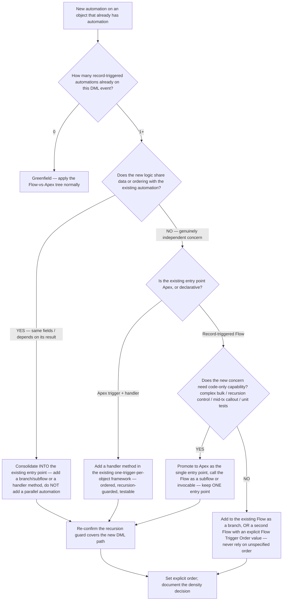
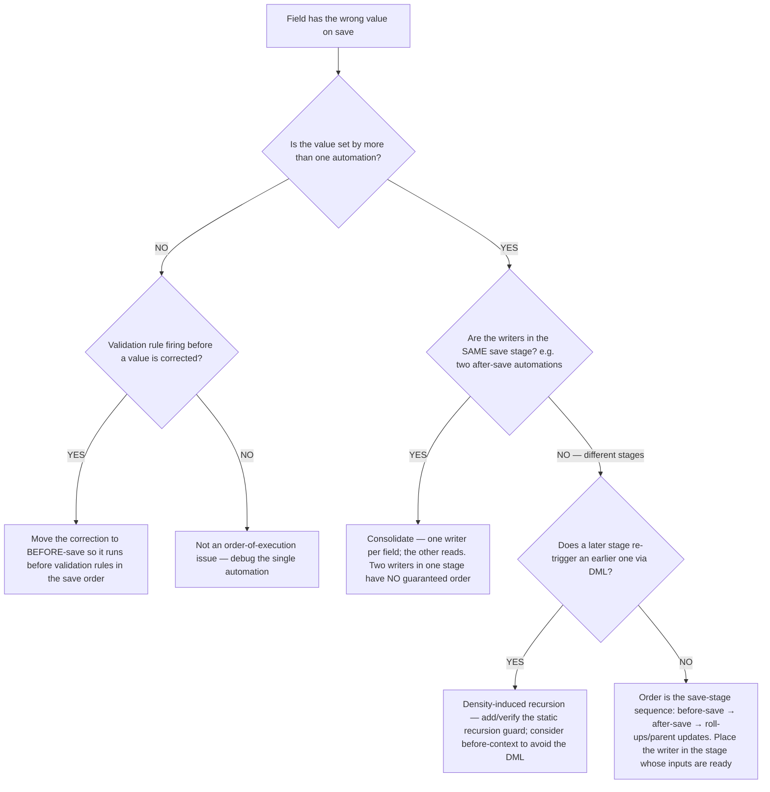

# Automation Density & Order-of-Execution — Decision Trees

**Dated:** 2026-06-05 · **Status:** current; order-of-execution stage list and any platform defaults tagged `[verify-at-build]`

Canonical decision trees for the **automation-density** problem — the failure mode that appears once an object accumulates *several* automations (triggers + record-triggered Flows + validation rules + workflow + Process Builder remnants), distinct from the "Flow vs Apex for one new requirement" question already covered in [`flow-vs-apex-decision.md`](flow-vs-apex-decision.md) and the **Placement** tree in [`flow-lwc-decision-trees.md`](flow-lwc-decision-trees.md). Density is house opinion #12 ("one automation entry point per object") and the root cause behind recursion runaways, unpredictable field-update order, and "it worked until we added the fifth automation."

Each tree follows the marketplace decision-tree format ([`../../../docs/best-practices/decision-trees-in-knowledge-files.md`](../../../docs/best-practices/decision-trees-in-knowledge-files.md)): an observable entry condition, a `Last verified` date, a Mermaid graph, per-leaf rationale, and a tradeoffs table. Traverse top-to-bottom before deciding — don't keyword-match.

---

## Decision Tree: Automation density — where does this new automation go on a busy object?

**When this applies:** You need to add automation to an object that **already has** one or more automations on the same DML event. Observable triggers: a recursion error after adding a Flow, a field that's set by two automations and "flickers," an object with a trigger *and* two record-triggered Flows *and* a legacy Process Builder, or a review finding that the same save fires five things in an order nobody can predict.

**Last verified:** 2026-06-05 against [`flow-vs-apex-decision.md`](flow-vs-apex-decision.md), [`trigger-handler-framework.md`](trigger-handler-framework.md), and house opinions #11–#12 (`[verify-at-build]` — the declarative surface and order-of-execution stages shift by release).

**Rationale per leaf:**

- *Greenfield* — no density problem yet; the standard Flow-vs-Apex/Placement trees decide it. This leaf exists so the "0 existing" path is explicit.
- *Consolidate into the existing entry point* — when the new logic touches the same fields or depends on the existing automation's result, a *parallel* automation creates an ordering and recursion trap (two things writing the same field; each re-firing the other). Fold it into the one entry point as a branch / subflow / handler method (house opinion #12).
- *Add a handler method* — an Apex object already on the one-trigger-per-object framework absorbs a new independent concern as an ordered, recursion-guarded, unit-tested method — the cleanest home.
- *Promote to Apex* — when the existing entry point is a Flow but the new concern needs code-only capability (complex bulk, recursion control, a synchronous callout, assertion-level tests), make Apex the single entry point and call the Flow as a subflow/invocable rather than running both in parallel.
- *Order the Flow explicitly* — a second record-triggered Flow on the same object/context runs in an order that is **unspecified unless you set the Flow Trigger Order**; relying on creation order is a latent bug. Set it, and document it.
- *Re-confirm the recursion guard* — every density change adds a DML path that can re-enter; the guard (static, per the trigger framework) must cover it (see the trigger-recursion scenario).

**Tradeoffs summary table:**

| Choice | Keeps one entry point? | Order predictable? | Recursion risk | Use when |
|---|---|---|---|---|
| Consolidate into existing | Yes | Yes (in-handler/in-flow order) | Low (one guard) | New logic shares fields/ordering with existing |
| Add handler method (Apex) | Yes | Yes | Low | Existing entry point is Apex; new concern independent |
| Promote Flow→Apex entry point | Yes | Yes | Low | New concern needs code-only capability |
| Second Flow + explicit order | No (two, but ordered) | Only if order set | Medium | Two genuinely independent declarative concerns |
| Parallel un-ordered automation | No | **No** | **High** | Never — this is the anti-pattern this tree prevents |

---

## Decision Tree: Order-of-execution — why does my field get the wrong value (or flicker)?

**When this applies:** A field ends up with an unexpected value on save, two automations appear to "fight" over it, a validation rule fires against a value a later automation would have fixed, or a roll-up is one save behind. Observable triggers: "the value is right after a second save but wrong on the first," a validation error on data another Flow corrects, or a duplicate/extra DML in the debug log.

**Last verified:** 2026-06-05 against the Salesforce **Order of Execution** documentation and [`trigger-handler-framework.md`](trigger-handler-framework.md) (`[verify-at-build]` — the exact stage sequence and which stages exist evolve by release; confirm the current order-of-execution list before relying on a specific stage position).

**Rationale per leaf:**

- *Move correction before-save* — validation rules evaluate at a fixed point in the save order; a value "fixed" by an after-save automation is fixed *too late* to satisfy a validation rule. Same-record corrections belong before-save (also free of extra DML).
- *Consolidate — one writer per field* — two automations writing the same field in the **same** save stage have **no guaranteed relative order**, so the surviving value is effectively non-deterministic. Make one the writer and the other a reader.
- *Density-induced recursion* — a later-stage automation that DMLs an object re-enters its earlier-stage automation; this is the order-of-execution face of the recursion problem — guard it (static guard) or move same-record work to before-context to remove the DML.
- *Stage sequence* — when writers are in different stages, the value is determined by the save-order sequence (before-save runs before after-save runs before parent roll-up recalculation). Place the writer in the stage whose inputs are actually populated (e.g. you need the record Id → after-save).

**Tradeoffs summary table:**

| Symptom | Likely cause | Fix |
|---|---|---|
| Validation fires on a value a later automation fixes | correction in after-save, validation runs earlier | move correction to before-save |
| Field "flickers" / non-deterministic value | two writers in the same save stage | one writer per field; other reads |
| Value one save behind | writer placed in a stage before its input is ready | move writer to the stage with populated inputs |
| Duplicate/extra DML, depth error | later stage re-triggers earlier via DML | static recursion guard; prefer before-context |

---

## Sources

- [`flow-vs-apex-decision.md`](flow-vs-apex-decision.md) — the single-requirement Flow-vs-Apex decision (this file is the *multi-automation* complement)
- [`flow-lwc-decision-trees.md`](flow-lwc-decision-trees.md) — Flow type + Placement trees
- [`trigger-handler-framework.md`](trigger-handler-framework.md) — one-trigger-per-object, handler, recursion guard
- [`apex-decision-trees.md`](apex-decision-trees.md) — the **Trigger Logic** and **Bulk Safety** trees
- Salesforce **Order of Execution** documentation and **Flow Trigger Order** — both version-sensitive, `[verify-at-build]` against the current release before quoting a specific stage position
- Format reference: [`../../../docs/best-practices/decision-trees-in-knowledge-files.md`](../../../docs/best-practices/decision-trees-in-knowledge-files.md)
