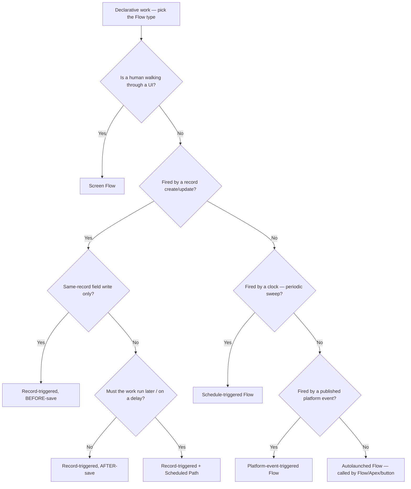
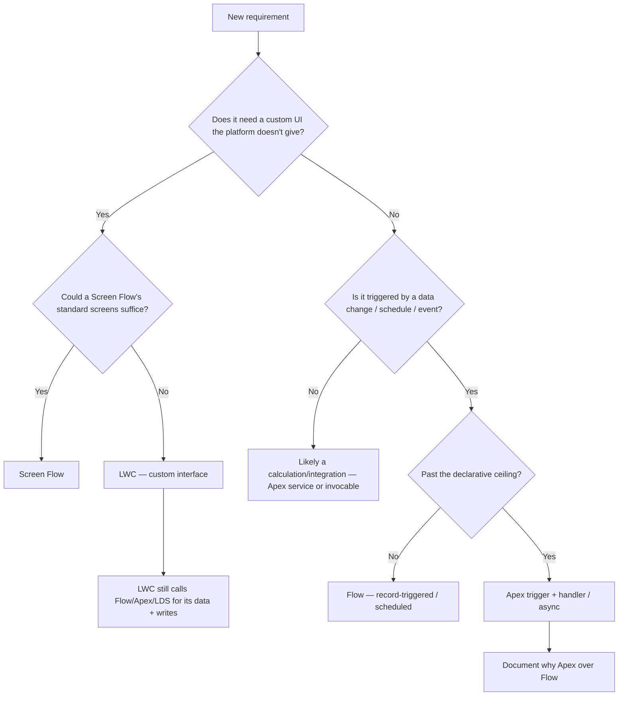
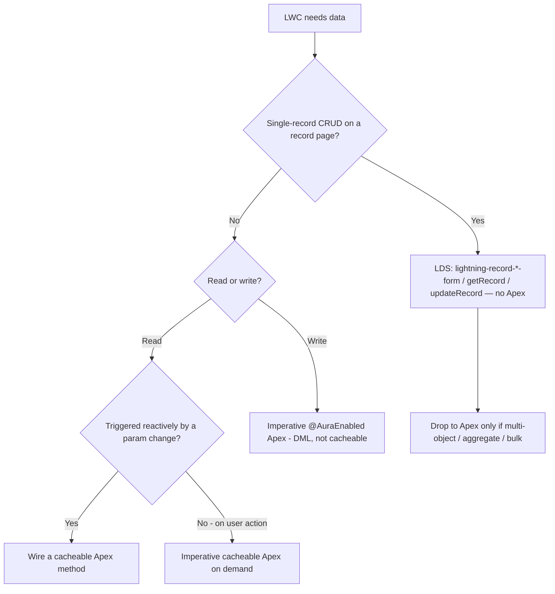
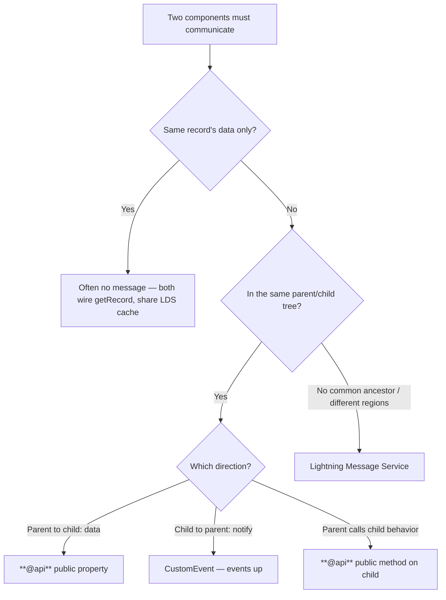
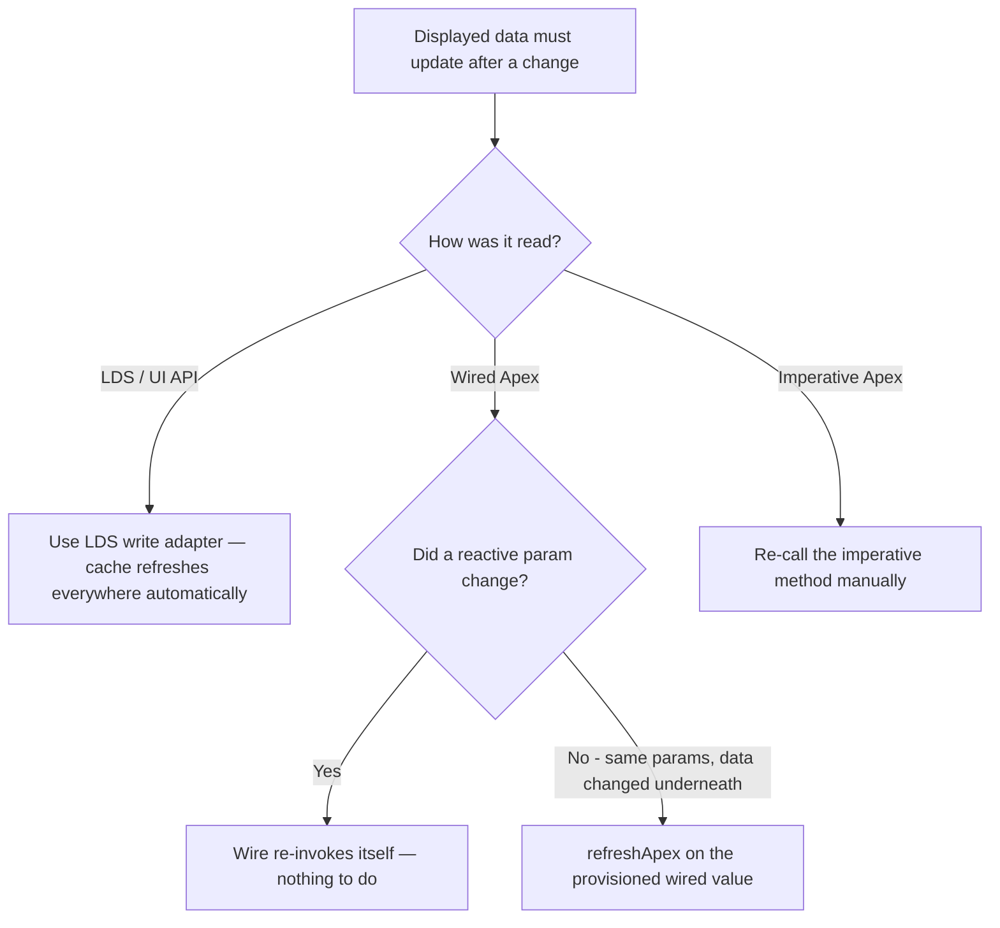

# Flow & LWC — canonical decision trees

**Dated:** 2026-05-30 · **Status:** current

Decision trees for the **automation + UI** cluster: which Flow type to build, whether a requirement belongs in Flow vs Apex vs LWC, how an LWC should access data, and how LWCs should communicate. Each tree is a canonical, observable-criteria decision with per-leaf rationale and a tradeoffs table. These back the `flow-*` and `lwc-*` best-practice docs and the `flow-automation-architect` agent.

Pairs with [`flow-vs-apex-decision.md`](./flow-vs-apex-decision.md) (the narrower Flow-vs-Apex automation call) — this file widens the lens to Flow *type* selection and the LWC/UI side.

---

## Decision Tree: Automation — which Flow type?

**When this applies (observable):** you have decided the work is declarative (a Flow, not Apex), and you must choose *which kind* of Flow. The trigger source and the timing are known: you can name what fires it (a user, a record save, a clock, a platform event, or another Flow/Apex) and when the work must happen.

**Last verified: 2026-05-30** — against Salesforce Flow-builder Flow types (screen, record-triggered before/after-save, schedule-triggered, platform-event-triggered, autolaunched) and the record-triggered scheduled-path feature. `[verify-at-build — confirm the current type list and scheduled-path offset limits against the release notes]`

**Per-leaf rationale:**

- **Screen Flow** — the only type with UI; use when a human must make choices or see steps. No human → not this.
- **Before-save record-triggered** — writes same-record fields in the platform's own DML; free, fastest, no Update element. Can't do related-record work, callouts, or async.
- **After-save record-triggered** — related-record CRUD, email/Chatter, async. The default reactive type when before-save can't do it.
- **Record-triggered + Scheduled Path** — "later, relative to *this* record" (N days before a date field, N hours after save). Runs in a separate transaction after the offset.
- **Schedule-triggered** — "periodic sweep over a record set" (nightly, hourly). Not tied to a single save; runs as an automated/chosen user.
- **Platform-event-triggered** — decouples a producer from consumers; runs in its own transaction after publish, doesn't roll the producer back.
- **Autolaunched** — no trigger of its own; the reusable/subflow type, also the one Apex/buttons/REST invoke.

**Tradeoffs:**

| Type | Trigger | Transaction | Can do callouts / async | Best for |
|---|---|---|---|---|
| Screen | User opens it | Interactive | Async via actions | Guided UI, data entry |
| Before-save record-triggered | Record save | Same as save (in-line) | No | Same-record field writes (free DML) |
| After-save record-triggered | Record save | Same save, after commit phase | Yes | Related records, notifications, async |
| Scheduled path | Record save + offset | Separate, later | Yes | Time-relative follow-up |
| Schedule-triggered | Clock | Own transaction(s) | Yes | Periodic batch-style sweeps |
| Platform-event-triggered | Event publish | Own transaction | Yes | Decoupled event consumers |
| Autolaunched | Flow/Apex/button | Caller's | Per context | Reusable subflows, invocations |

See: [`../best-practices/flow-pick-the-flow-type-by-trigger-and-timing.md`](../best-practices/flow-pick-the-flow-type-by-trigger-and-timing.md), [`../best-practices/flow-before-save-for-same-record-field-updates.md`](../best-practices/flow-before-save-for-same-record-field-updates.md).

---

## Decision Tree: Placement — Flow vs Apex vs LWC for a requirement?

**When this applies (observable):** a new requirement has landed and you don't yet know which *layer* owns it — declarative automation, server-side code, or a custom UI. You can state whether the work needs a custom interface, whether it reacts to data changes, and whether it exceeds the declarative ceiling.

**Last verified: 2026-05-30** — consistent with [`flow-vs-apex-decision.md`](./flow-vs-apex-decision.md) and the house declarative-ceiling definition. LWC is the layer for *custom UI*; Flow/Apex are the *automation/logic* layers.

**Per-leaf rationale:**

- **Screen Flow** — needs UI, but the standard screen components cover it: cheapest custom UI, no JS, no deploy pipeline.
- **LWC** — needs UI that screen-Flow components can't express (rich interaction, custom layout, real-time): a custom component. Note LWC is a *presentation* layer — it still gets data from LDS/Flow/Apex underneath, so this leaf usually pairs with a data-access decision.
- **Apex service / invocable** — no UI, no data trigger: a calculation, transformation, or integration callable from Flow or code.
- **Flow (record-triggered/scheduled)** — data-triggered and within the declarative ceiling: the default.
- **Apex trigger + handler / async** — data-triggered but past the ceiling (complex bulk, recursion control, mid-tx callout, heavy testing). Document the call.

**Tradeoffs:**

| Layer | Owns | Cost to build/maintain | Reach for when |
|---|---|---|---|
| Screen Flow | Guided UI from standard components | Low (declarative) | A human needs a simple guided flow |
| LWC | Custom interface | High (JS, tests, deploy) | UI exceeds screen-Flow components |
| Flow (record-triggered/scheduled) | Declarative automation | Low | Data-change reaction within the ceiling |
| Apex | Server logic past the ceiling | High (code, bulk tests) | Complexity/recursion/callout/bulk tuning |

Note: LWC vs Flow/Apex is not strictly either-or — an LWC is the *view*, Flow/Apex/LDS is the *data + logic* behind it. The real question for the UI leaf is then the next tree.

See: [`flow-vs-apex-decision.md`](./flow-vs-apex-decision.md), [`../best-practices/flow-vs-apex-one-entry-point.md`](../best-practices/flow-vs-apex-one-entry-point.md), [`../best-practices/lwc-lds-before-apex.md`](../best-practices/lwc-lds-before-apex.md).

---

## Decision Tree: LWC data access — LDS vs wire-Apex vs imperative-Apex?

**When this applies (observable):** you are building an LWC and must decide how it reads or writes Salesforce data. You can state whether the operation is single-record or multi-object, whether it's a read or a write, and whether it's triggered reactively or by a user gesture.

**Last verified: 2026-05-30** — against Salesforce Lightning Data Service / UI-API wire adapters (`getRecord`, `getRelatedListRecords`, `createRecord`, `updateRecord`, `deleteRecord`, `lightning-record-*-form`) and `@AuraEnabled(cacheable=true)` wirability. `cacheable=true` is required for `@wire`-to-Apex and forbids DML.

**Per-leaf rationale:**

- **LDS / UI API** — single-record read/write: zero Apex, CRUD/FLS enforced for free, shared client cache, no test class. Always the first rung.
- **Wire cacheable Apex** — multi-object/aggregate read that reacts to a reactive parameter (`"$recordId"`): cached, auto-re-invoked, no manual lifecycle.
- **Imperative cacheable Apex** — a read that must run on a specific user action or re-run with the same params (a wire won't re-fire on unchanged inputs); use `refreshApex` or imperative.
- **Imperative `@AuraEnabled` (non-cacheable)** — any write: DML cannot be `cacheable`, so it's imperative by definition, called on a user gesture.

**Tradeoffs:**

| Mechanism | Apex needed | Cached | Reactive | FLS | Use when |
|---|---|---|---|---|---|
| LDS / UI API | None | Yes (shared) | Yes (wire adapters) | Auto | Single-record read/write on a page |
| Wire → cacheable Apex | Yes (read) | Yes | Yes | You enforce in Apex | Multi-object reactive read |
| Imperative cacheable Apex | Yes (read) | Yes | No | You enforce | Read on user action / forced re-run |
| Imperative @AuraEnabled | Yes (write) | No | No | You enforce | Any DML / write |

Ladder rule: **LDS → wire-cacheable-Apex → imperative-Apex**, stopping at the first rung that satisfies the need.

See: [`../best-practices/lwc-lds-before-apex.md`](../best-practices/lwc-lds-before-apex.md), [`../best-practices/lwc-wire-over-imperative-when-cacheable.md`](../best-practices/lwc-wire-over-imperative-when-cacheable.md), [`../best-practices/lwc-controller-is-cacheable-fls-aware-and-bulk-safe.md`](../best-practices/lwc-controller-is-cacheable-fls-aware-and-bulk-safe.md).

---

## Decision Tree: LWC communication — @api props/events vs LMS vs public method?

**When this applies (observable):** two or more components must exchange data or notifications, and you can describe their relationship in the DOM — parent/child, ancestor/descendant, or unrelated (different page regions / no common ancestor).

**Last verified: 2026-05-30** — against the LWC communication model: `@api` public properties, `CustomEvent` (with `bubbles`/`composed` defaulting to `false`), public `@api` methods, and Lightning Message Service (message-channel publish/subscribe) for cross-DOM.

**Per-leaf rationale:**

- **Shared LDS cache** — if the two components only need the *same record*, wiring `getRecord` in both shares the cache; an edit in one refreshes the other with no explicit message at all.
- **`@api` property** — data flows down to a child reactively; the child re-renders on change. Inputs are read-only to the child.
- **`CustomEvent`** — a child notifies its parent without knowing who the parent is; keeps the child reusable. Defaults (`composed:false`) keep it from leaking past the parent.
- **`@api` method** — a parent imperatively invokes a child's behavior (focus, reset, validate) via a queried reference.
- **LMS** — the only supported channel for components with **no DOM relationship** (different page regions). Subscribe in `connectedCallback`, unsubscribe in `disconnectedCallback`.

**Tradeoffs:**

| Mechanism | Relationship | Coupling | Use when |
|---|---|---|---|
| Shared LDS cache | Any (same record) | None | Both just need the same record |
| @api property | Parent → child | Low (props down) | Pass data to a child |
| CustomEvent | Child → parent | Low (events up) | Child notifies ancestor |
| @api method | Parent → child | Medium (parent knows child API) | Parent triggers child behavior |
| LMS | Cross-DOM / unrelated | Higher (global channel) | No common ancestor |

Rule: use the **smallest mechanism that reaches** — never broadcast over LMS what a prop or event already carries.

See: [`../best-practices/lwc-events-and-component-communication.md`](../best-practices/lwc-events-and-component-communication.md), [`../best-practices/lwc-lds-before-apex.md`](../best-practices/lwc-lds-before-apex.md).

---

## Decision Tree: Reactive-read freshness — wire vs refreshApex vs imperative re-fetch?

**When this applies (observable):** an LWC already reads data, and after a write (or an external change) the displayed data must update. You can state whether the data came through LDS, a wired Apex method, or an imperative call.

**Last verified: 2026-05-30** — against LWC cache-refresh behavior: LDS updates propagate through the shared cache automatically; wired Apex provisioned values refresh via `refreshApex(this.wiredResult)`; imperative results have no cache and must be re-fetched manually.

**Per-leaf rationale:**

- **LDS write adapter** — `updateRecord`/`createRecord` update the shared cache, so every component wired to that record refreshes with no extra code. The cleanest path; another reason LDS-first wins.
- **Wire, param changed** — the wire is reactive: change a `"$prop"` input and it re-runs. Free.
- **`refreshApex`** — a wire does **not** re-fire when its inputs are unchanged. After a DML that altered the underlying data but not the wire's params, call `refreshApex(this.wiredResult)` to force a re-pull.
- **Imperative re-fetch** — imperative calls have no cache and no reactivity; you must call the method again yourself.

**Tradeoffs:**

| Read path | How it refreshes | Code you write | Gotcha |
|---|---|---|---|
| LDS / UI API | Shared-cache auto-propagation | None | Single-record only |
| Wired Apex (param changed) | Auto re-invoke | None | Only if a reactive param actually changed |
| Wired Apex (same params) | `refreshApex(wiredValue)` | Keep the provisioned result | Forgetting it = stale UI after DML |
| Imperative Apex | Manual re-call | Re-invoke + handle loading/error | No cache; you own the lifecycle |

Common bug: write via imperative Apex, expect a *wire* to refresh — it won't, because the wire's params didn't change. Either route the write through LDS, or `refreshApex` the wire explicitly.

See: [`../best-practices/lwc-wire-over-imperative-when-cacheable.md`](../best-practices/lwc-wire-over-imperative-when-cacheable.md), [`../best-practices/lwc-lds-before-apex.md`](../best-practices/lwc-lds-before-apex.md).

---

## Sources

- Salesforce Flow Builder — Flow types & record-triggered automation: https://help.salesforce.com/s/articleView?id=sf.flow_concepts.htm
- Record-triggered automation decision guide: https://architect.salesforce.com/docs/architect/decision-guides/guide/record-triggered
- LWC Dev Guide — Lightning Data Service & UI API wire adapters: https://developer.salesforce.com/docs/platform/lwc/guide/data-ui-api.html
- LWC Dev Guide — `@wire`, cacheable Apex, `refreshApex`: https://developer.salesforce.com/docs/platform/lwc/guide/apex.html
- LWC Dev Guide — communication (`@api`, events, Lightning Message Service): https://developer.salesforce.com/docs/platform/lwc/guide/create-components-communicate.html

`[verify-at-build]` — Flow type lists, scheduled-path limits, and UI-API page sizes shift by release; reconfirm the volatile numbers against the current release notes before relying on them.
