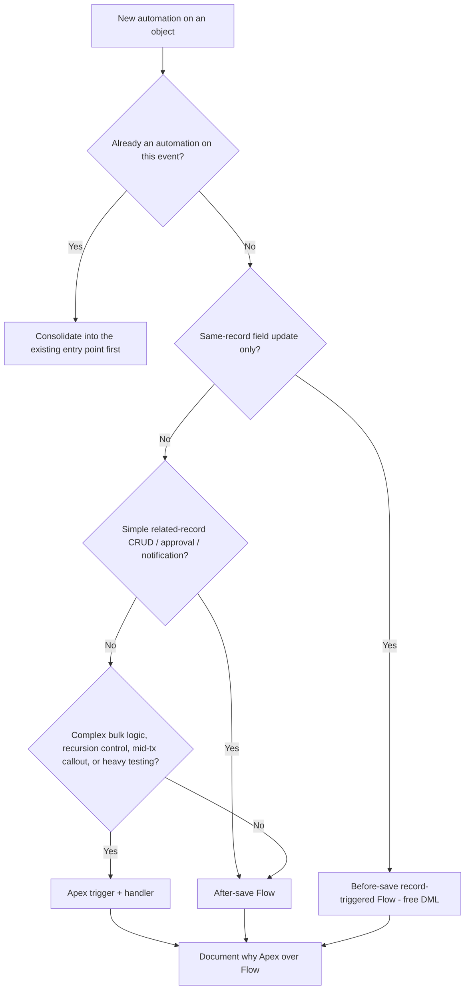

# Flow vs Apex — The Automation Decision

**Dated:** 2026-05-30 · **Status:** current

The recurring question: *should this be declarative (Flow) or code (Apex)?* House opinions #11-#12 say Flow for simple automation, Apex past the declarative ceiling, and **one automation entry point per object**.

## Decision Tree: Flow or Apex?

## The declarative ceiling — reach for Apex when

- Logic is genuinely complex or requires reusable units and unit tests.
- You need explicit recursion control or precise execution order.
- You need a synchronous callout inside the transaction.
- Bulk behavior must be tuned beyond what Flow's element limits allow.

## Automation density

The silent failure is **stacking**: a record-triggered Flow *and* an Apex trigger *and* a legacy Process Builder all firing on the same save. They have no shared order and recurse unpredictably. Inventory every entry point before adding one, and keep **one ordered entry point per object**.

Whichever you choose, **document the call** ("Flow because X" / "Apex because Y") in the design.

## Sources

- https://architect.salesforce.com/docs/architect/decision-guides/guide/record-triggered
- https://sfdcdevelopers.com/2025/09/17/when-to-use-flow-vs-apex/
