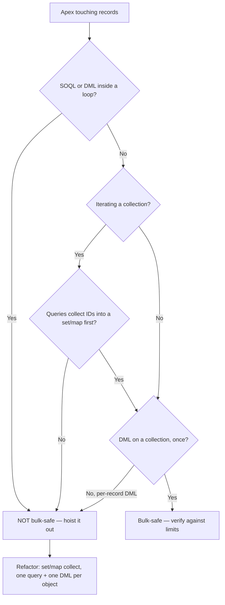

# Governor Limits & Bulkification

**Dated:** 2026-05-30 · **Status:** current; exact numbers `[verify-at-build]` against the Spring '26 limits cheat sheet

Salesforce runs Apex in a multi-tenant context, so every transaction is capped by **governor limits**. The dominant failure mode is non-bulkified code that works on one record and breaks the moment a batch of 200 arrives. Bulkification is house opinion #1.

## Decision Tree: is this code bulk-safe?

## The limits that bite most

| Limit | Synchronous | Asynchronous |
| --- | --- | --- |
| SOQL queries | 100 | 200 |
| DML statements | 150 | 150 |
| Records retrieved by SOQL | 50,000 | 50,000 |
| DML rows | 10,000 | 10,000 |
| CPU time | 10,000 ms | 60,000 ms |
| Heap | 6 MB | 12 MB |

> Treat these as approximate and **verify exact values against the current cheat sheet** `[verify-at-build]` — they shift across releases.

## Bulkification pattern

1. Collect IDs/keys from `Trigger.new` into a `Set`/`Map` in a single pass.
2. Query related records **once** using that set (`WHERE Id IN :ids`).
3. Build a `Map<Id, SObject>` for O(1) lookup inside the loop — no query in the loop.
4. Accumulate records to update in a `List`, then issue **one** `update`.

The same per-transaction limits are shared by Apex *and* Flow — a Flow looping over a large collection hits them too.

## Sources

- https://www.apexhours.com/governor-limits-in-salesforce/
- https://developer.salesforce.com/docs/atlas.en-us.apexcode.meta/apexcode/apex_dml_non_mix_sobjects.htm (mixed DML)
