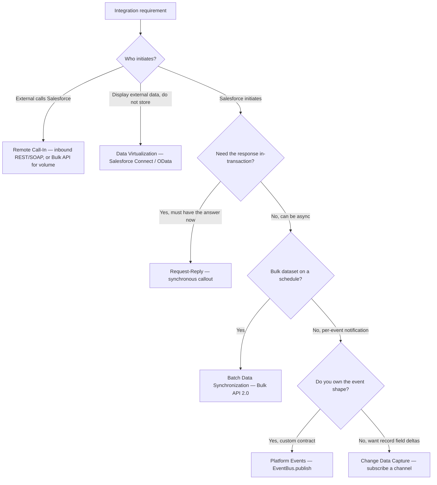
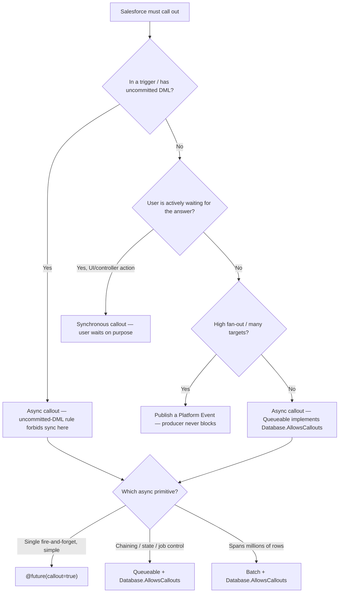
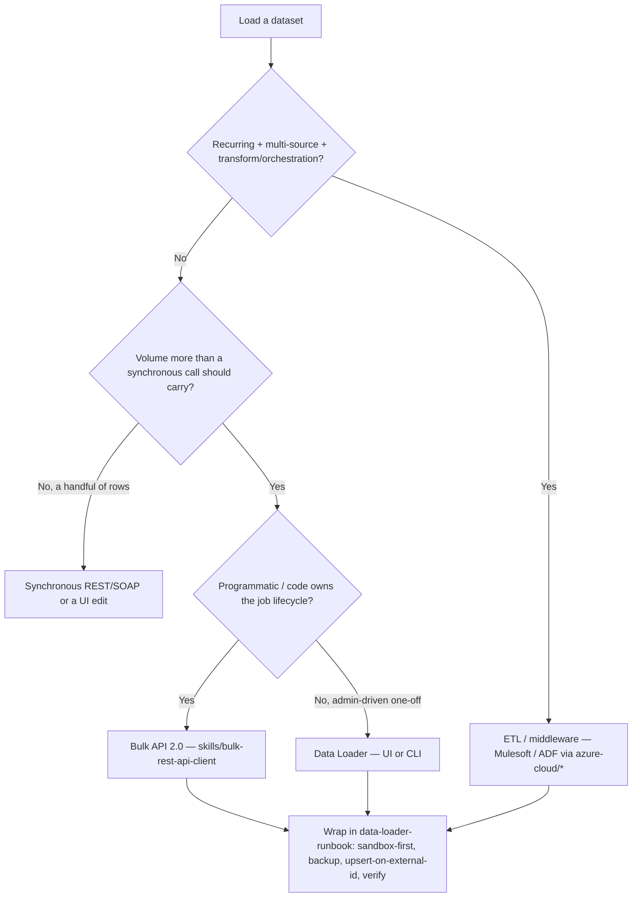
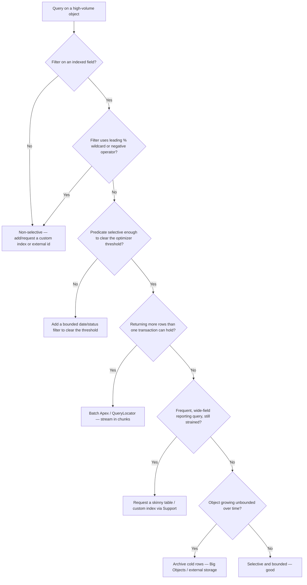
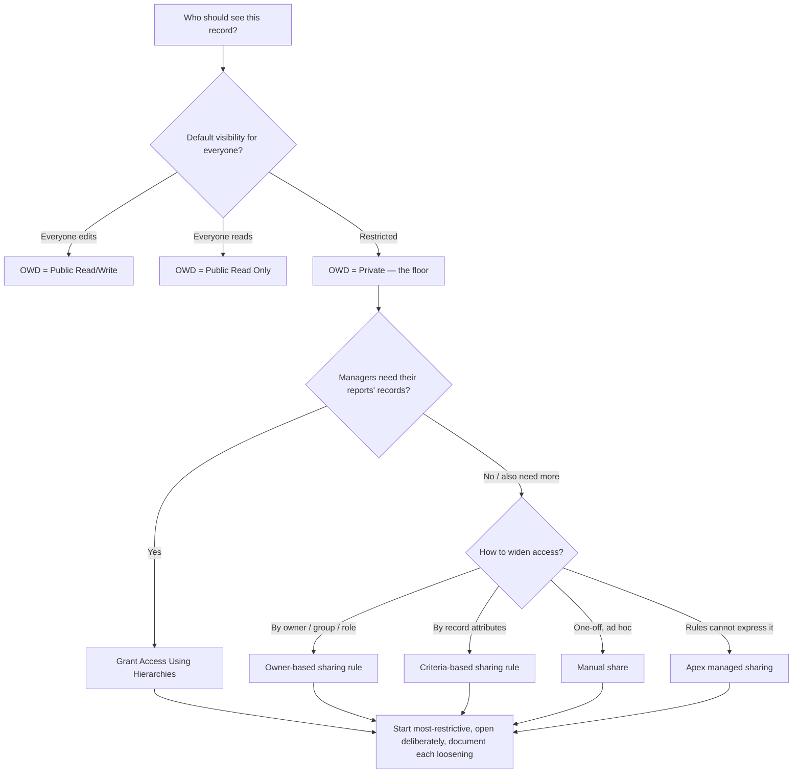
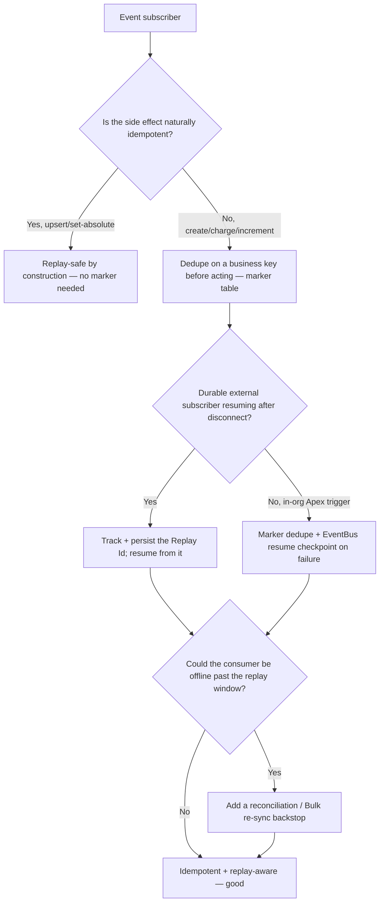

# Integration & Data — Decision Trees

**Dated:** 2026-05-30 · **Status:** current

Canonical decision trees for the Integration and Data domains of the `salesforce` plugin. Each follows the marketplace decision-tree convention (`docs/best-practices/decision-trees-in-knowledge-files.md`): an observable entry condition, a `Last verified:` date, a Mermaid graph, per-leaf rationale, and a tradeoffs table for trees with ≥3 leaves. These trees expand the prose trees already in [`integration-patterns.md`](integration-patterns.md), [`large-data-volume-design.md`](large-data-volume-design.md), and [`sharing-and-security-model.md`](sharing-and-security-model.md) into traversable form.

**Decision-tree traversal (priors).** When a situation matches an entry condition below, traverse the Mermaid graph top-to-bottom before selecting a mechanism. Do NOT pattern-match on keywords in the request. The first branch whose condition resolves cleanly is the leaf to apply. Volatile platform numbers (limits, allocations, thresholds) are tagged `[verify-at-build]` and must be confirmed against the current limits cheat sheet before they gate an irreversible action.

---

## Decision Tree: Integration — which pattern (request-reply vs fire-forget vs batch vs pub-sub)

**When this applies:** You must move data or notifications between Salesforce and another system and have not yet chosen REST/SOAP vs Platform Events vs CDC vs Bulk API. Observable trigger: a requirement phrased as "when X happens here, do Y there" or "load/sync this dataset."

**Last verified:** 2026-05-30 against the six canonical patterns in [`integration-patterns.md`](integration-patterns.md) (Salesforce integration patterns, current docs).

**Rationale per leaf:**
- *Remote Call-In* — the external system is the initiator; expose REST/SOAP, and for high volume route it through Bulk API rather than row-by-row.
- *Data Virtualization* — the data must not be copied into Salesforce; Salesforce Connect/OData reads it live (no storage, no sync job).
- *Request-Reply* — the running transaction needs the remote answer before it can proceed (credit check gating a save); only a synchronous callout provides that. **requires:** no uncommitted DML in the transaction.
- *Batch Data Synchronization* — a large dataset on a cadence; Bulk API 2.0 collapses thousands of calls into one async job.
- *Platform Events* — you design the event contract and want producer/consumer decoupling + replay; publish on your terms.
- *Change Data Capture* — you want record-level field deltas without authoring a publish per DML path; subscribe instead of instrument.

**Tradeoffs summary table:**

| Pattern | Sync/Async | Coupling to remote | Limit budget | Replay/durability | Use when |
|---|---|---|---|---|---|
| Request-Reply | Sync | Tight (outage = txn fail) | Daily API + concurrent-request slot + per-txn time cap | None (RPC) | Need the answer in-transaction |
| Fire-and-Forget (Platform Events) | Async | Decoupled | Daily event publish allocation | Replay window (std/high-vol) `[verify-at-build]` | You own the event shape |
| Change Data Capture | Async (push) | Decoupled | Daily CDC delivery allocation | Replay window | Want record field deltas, no per-DML publish |
| Batch Data Synchronization | Async | Decoupled | Daily Bulk allocation + daily API | Job results (success/failed/unprocessed) | Large dataset on a schedule |
| Remote Call-In | Sync/Async | Caller-driven | Daily API + concurrent-request slot | Caller's responsibility | External system initiates |
| Data Virtualization | Sync (no copy) | Live read | Per-call to external (OData) | n/a (not stored) | Show external data without storing |

---

## Decision Tree: Integration — synchronous vs asynchronous callout placement

**When this applies:** Salesforce must call an external system and you're deciding whether the callout runs inline or async. Observable triggers: a callout in a trigger/save path, or the error `You have uncommitted work pending`, or a callout looping per record.

**Last verified:** 2026-05-30 against [`../best-practices/integration-callout-governor-and-async.md`](../best-practices/integration-callout-governor-and-async.md) and [`apex-async-patterns.md`](apex-async-patterns.md).

**Rationale per leaf:**
- *Synchronous callout* — only when there is no pending DML and the user is waiting on the result on purpose (LWC/controller action).
- *Async callout* — any trigger/save path: the uncommitted-DML rule throws on a sync callout, and async decouples the save from remote latency. **requires:** the async class implements `Database.AllowsCallouts`.
- *Platform Event* — high fan-out: publishing once lets many consumers react without the producer orchestrating N callouts or blocking.
- *@future(callout=true)* — simplest async callout, no chaining/state needed.
- *Queueable* — when you need job chaining, state, or job-id control around the callout.
- *Batch* — when the callout work spans more rows than one transaction can hold.

**Tradeoffs summary table:**

| Placement | Blocks user/txn? | Survives uncommitted DML? | Best for | Cost |
|---|---|---|---|---|
| Synchronous callout | Yes | No (throws) | UI action where user waits | Holds concurrent-request slot + per-txn time cap |
| @future(callout=true) | No | Yes | Simple fire-and-forget callout | No chaining, no return value |
| Queueable + AllowsCallouts | No | Yes | Chained/stateful async callout | Async-job limits |
| Batch + AllowsCallouts | No | Yes | Callout over millions of rows | Callouts-per-chunk cap `[verify-at-build]` |
| Platform Event | No | Yes | High fan-out notification | Eventual delivery, replay window |

---

## Decision Tree: Data — which load tool (Data Loader vs Bulk API vs ETL)

**When this applies:** You must insert/update/upsert/delete a dataset into an org and are choosing the tool. Observable triggers: a row count beyond a handful, a recurring sync, or a multi-source transform.

**Last verified:** 2026-05-30 against [`../best-practices/data-loader-vs-bulk-api-selection.md`](../best-practices/data-loader-vs-bulk-api-selection.md), [`../skills/bulk-rest-api-client/SKILL.md`](../skills/bulk-rest-api-client/SKILL.md), and [`../skills/data-loader-runbook/SKILL.md`](../skills/data-loader-runbook/SKILL.md).

**Rationale per leaf:**
- *ETL / middleware* — recurring, multi-system, transform-heavy pipelines need orchestration/retries a single job can't express; coordinate Azure-native with `azure-cloud/*`.
- *Synchronous REST/SOAP* — a handful of rows doesn't justify batch tooling.
- *Bulk API 2.0* — large or programmatic single-object loads where code owns create/upload/poll/reconcile. **requires:** API-enabled integration user.
- *Data Loader* — one-off/occasional admin loads with a human verifying mappings and error files.
- *Runbook wrap* — every non-trivial load goes through the reversible runbook regardless of tool.

**Tradeoffs summary table:**

| Tool | Volume sweet spot | Cadence | Orchestration | Human in loop | Limit budget |
|---|---|---|---|---|---|
| Synchronous REST/SOAP | A few rows | Ad hoc | None | Optional | Daily API per call |
| Data Loader | Low–moderate, one-off | Occasional | None (UI/CLI) | Yes | Rides Bulk/SOAP API |
| Bulk API 2.0 | Large, single object | Scheduled/programmatic | Job lifecycle in code | No | Daily Bulk + daily API `[verify-at-build]` |
| ETL / middleware | Any, multi-source | Recurring | Full (retries, joins) | No | Per-tier + Salesforce API |

---

## Decision Tree: Data — is this query LDV-safe?

**When this applies:** You're authoring or debugging a SOQL query against a high-volume object (millions of rows), or you hit `Non-selective query against large object type`, a query timeout, or a slow list view/report.

**Last verified:** 2026-05-30 against [`large-data-volume-design.md`](large-data-volume-design.md), [`../best-practices/data-selective-soql-on-indexed-fields.md`](../best-practices/data-selective-soql-on-indexed-fields.md), and [`../skills/soql-authoring/SKILL.md`](../skills/soql-authoring/SKILL.md).

**Rationale per leaf:**
- *Add/request an index* — an un-indexed (or index-defeated) filter scans; on an LDV object that throws, so restore selectivity first.
- *Add a bounded filter* — even an indexed field must resolve below the optimizer threshold; a bounded date/status narrows it.
- *Batch Apex / QueryLocator* — result set exceeds the per-transaction row/heap limit; stream it in governor-bounded chunks.
- *Skinny table / custom index* — a proven hot, wide read still strained after selectivity; the Support-managed lever removes the base/companion join. **requires:** Salesforce Support request.
- *Archive cold rows* — unbounded growth makes selectivity harder over time; shrink the hot object instead of indexing it forever.
- *Selective and bounded* — clears the threshold and fits one transaction; ship it.

**Tradeoffs summary table:**

| Lever | Cost to apply | Self-serve? | Removes the cause? | Use when |
|---|---|---|---|---|
| Selective indexed filter | Free (query change) | Yes | No (treats symptom) | Always — the first lever |
| Bounded date/status filter | Free (query change) | Yes | No | Indexed field still over threshold |
| Batch Apex / QueryLocator | Dev effort | Yes | No (streams it) | Result set > one transaction |
| Custom index | Support lead time | No | Partially | Frequent filter on non-indexed field |
| Skinny table | Support lead time | No | Partially (skips join) | Hot wide read, still strained `[verify-at-build]` |
| Archive cold rows | Design + Batch job | Yes | Yes (shrinks object) | Unbounded-growth object |

---

## Decision Tree: Data — how to open record access (OWD / hierarchy / sharing rules / manual / Apex-managed)

**When this applies:** You're designing who can see a record type and choosing among OWD, role hierarchy, sharing rules, manual shares, and Apex managed sharing. Observable trigger: "user/group X can't see record Y" or a new object's sharing design.

**Last verified:** 2026-05-30 against [`sharing-and-security-model.md`](sharing-and-security-model.md) and [`../best-practices/data-owd-most-restrictive-then-open-deliberately.md`](../best-practices/data-owd-most-restrictive-then-open-deliberately.md).

**Rationale per leaf:**
- *OWD = Private* — the default floor for restricted data; everything else only opens up from here, and tightening later is the expensive reversal.
- *OWD = Public Read Only / Read-Write* — only for genuinely public reference data; widening the floor is hard to claw back.
- *Grant Access Using Hierarchies* — upward visibility (managers see subordinates' records); not a mechanism for lateral/peer sharing.
- *Owner-based sharing rule* — widen to a group/role/queue based on the record's owner.
- *Criteria-based sharing rule* — widen based on the record's field values (declarative).
- *Manual share* — a one-off grant rules can't or shouldn't generalize.
- *Apex managed sharing* — programmatic sharing for logic no declarative rule can express. **requires:** `with sharing`/CRUD-FLS discipline in the sharing code; the security verdict escalates to `ravenclaude-core/security-reviewer`.

**Tradeoffs summary table:**

| Mechanism | Direction | Declarative? | Recalc cost at volume | Use when |
|---|---|---|---|---|
| OWD | Floor (all) | Yes (setup) | Re-share on change — large | Set the baseline; start Private |
| Grant Access Using Hierarchies | Upward | Yes | Recalc on role/owner change | Managers must see reports' rows |
| Owner-based sharing rule | Widen by owner | Yes | Recalc on owner/membership change | Share by owner/group/role |
| Criteria-based sharing rule | Widen by attribute | Yes | Recalc on field change | Share by record values |
| Manual share | One record | Yes (UI) / API | Minimal | Ad hoc, non-generalizable |
| Apex managed sharing | Programmatic | No (code) | Per-share DML | Logic no rule can express |

---

## Decision Tree: Integration & Data — at-least-once event delivery, is the consumer safe?

**When this applies:** You subscribe to Platform Events or CDC and must confirm the consumer won't double-process a redelivered event or silently miss events. Observable triggers: duplicate downstream records, a consumer that was offline, or designing any event subscriber.

**Last verified:** 2026-05-30 against [`../best-practices/integration-idempotent-consumers-and-replay-aware-subscribers.md`](../best-practices/integration-idempotent-consumers-and-replay-aware-subscribers.md) and [`../best-practices/integration-platform-events-vs-cdc-vs-callout.md`](../best-practices/integration-platform-events-vs-cdc-vs-callout.md).

**Rationale per leaf:**
- *Replay-safe by construction* — an upsert or set-to-absolute side effect produces the same end state on redelivery; no extra dedupe needed.
- *Dedupe on a business key* — non-idempotent side effects (create/charge/increment) must guard against re-processing with a marker keyed on a stable business value.
- *Track the Replay Id* — a durable external subscriber must persist where it left off and resume from that Replay Id.
- *Marker + resume checkpoint* — an in-org Apex Platform Event trigger dedupes and uses `EventBus.TriggerContext` to resume after a partial failure.
- *Reconciliation backstop* — replay windows are finite; a consumer offline longer than the window misses events, so a periodic re-sync (or Azure-durable queue via `azure-cloud/*`) is the backstop. `[verify-at-build]` the std vs high-volume retention windows.
- *Idempotent + replay-aware* — both ends covered; ship it.

**Tradeoffs summary table:**

| Consumer strategy | Handles redelivery? | Handles missed events? | Extra storage | Use when |
|---|---|---|---|---|
| Idempotent side effect (upsert/set-absolute) | Yes | No (still need backstop if offline) | None | Side effect is naturally idempotent |
| Business-key marker dedupe | Yes | No | Marker table | Non-idempotent side effect, in-org |
| Replay-Id tracking | Yes (resume) | Partially (within window) | Replay-Id store | Durable external subscriber |
| Reconciliation / Bulk re-sync backstop | n/a | Yes | Recon job | Offline beyond replay window possible |

---

## Sources

- [`integration-patterns.md`](integration-patterns.md) — the six canonical patterns and the limit budget
- [`large-data-volume-design.md`](large-data-volume-design.md) — selectivity, skinny tables, archival, sharing recalc
- [`sharing-and-security-model.md`](sharing-and-security-model.md) — the OWD → hierarchy → rule → manual/Apex layering
- [`apex-async-patterns.md`](apex-async-patterns.md) — Future vs Queueable vs Batch for async callouts
- The `integration-*` and `data-*` best-practice docs in [`../best-practices/`](../best-practices/) — one rule each, cross-linked from the trees above
- Decision-tree convention: [`../../../docs/best-practices/decision-trees-in-knowledge-files.md`](../../../docs/best-practices/decision-trees-in-knowledge-files.md)
