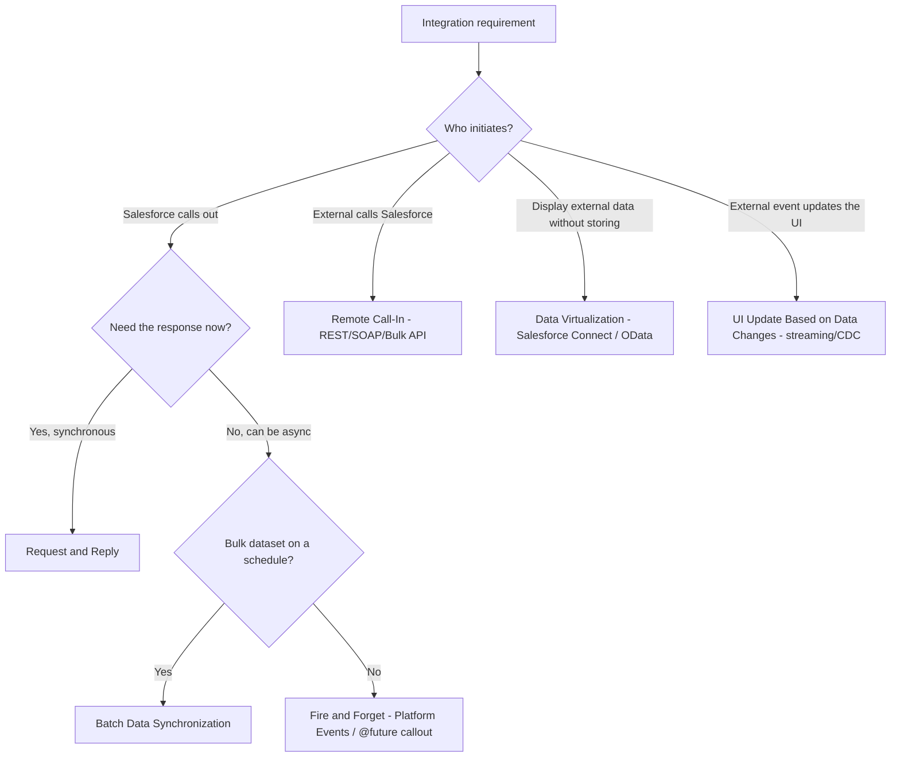

# Integration Patterns

**Dated:** 2026-05-30 · **Status:** current

Salesforce integration reduces to **six canonical patterns**. The choice turns on synchronous vs asynchronous, who initiates, and the API/limit budget. Azure-native middleware coordinates with `azure-cloud/*`.

## Decision Tree: which integration pattern?

## The six patterns

| Pattern | Sync/Async | Use when |
| --- | --- | --- |
| **Request and Reply** | Sync | Salesforce needs an immediate response from an external system |
| **Fire and Forget** | Async | Salesforce notifies; no response needed (Platform Events, async callout) |
| **Batch Data Synchronization** | Async | Bulk import/export on a schedule (Bulk API 2.0) |
| **Remote Call-In** | Sync/Async | External system creates/reads/updates Salesforce data via API |
| **UI Update Based on Data Changes** | Async (push) | External change pushes to the Salesforce UI (Streaming/CDC) |
| **Data Virtualization** | Sync (no copy) | Display external data live without storing it (Salesforce Connect/OData) |

## Limit budget

Every outbound callout and inbound API call consumes the **daily API request limit**; synchronous callouts hold a long-running concurrent request slot and have a per-transaction time cap. Prefer Platform Events / Bulk API for high-volume async, and push middleware (incl. Azure Event Grid / Service Bus via `azure-cloud/*`) for fan-out. Verify current API/limit numbers `[verify-at-build]`.

## Sources

- https://sfdcdevelopers.com/2025/10/29/salesforce-integration-patterns-types-use-cases-and-best-practices/
