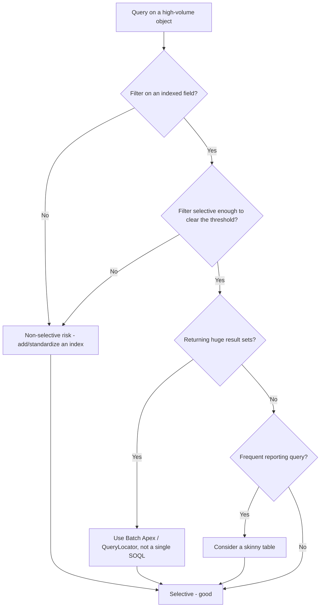

# Large Data Volume (LDV) Design

**Dated:** 2026-05-30 · **Status:** current

At high row counts (millions+), queries that were fine in a demo org time out or hit non-selective-query errors. Design for LDV from day one (house opinion #13).

## Decision Tree: is this query LDV-safe?

## What makes a query selective

The **query optimizer** chooses an index when a filter is *selective* — below a row/percentage threshold of total rows on the object. Standard indexes (Id, Name, audit fields, lookups, external IDs, unique fields) and custom indexes qualify; filtering on a non-indexed field, with leading `%` wildcards, or with negative operators (`!=`, `NOT`) defeats the index and risks a non-selective-query error on LDV objects.

## Levers

- **Indexed, selective filters** — the primary lever.
- **Skinny tables** — Salesforce-managed copies of frequently queried fields, avoiding joins to the base table (request via Support).
- **Archival / data tiering** — move cold rows out (Big Objects, external storage) to keep the hot object small.
- **Batch Apex with `QueryLocator`** — stream large sets instead of one 50k-row SOQL.
- **Sharing recalculation** at volume is expensive — defer with "Defer Sharing Calculation" during large loads.

## Sources

- https://www.apexhours.com/how-salesforce-query-optimizer-works-for-ldv/
