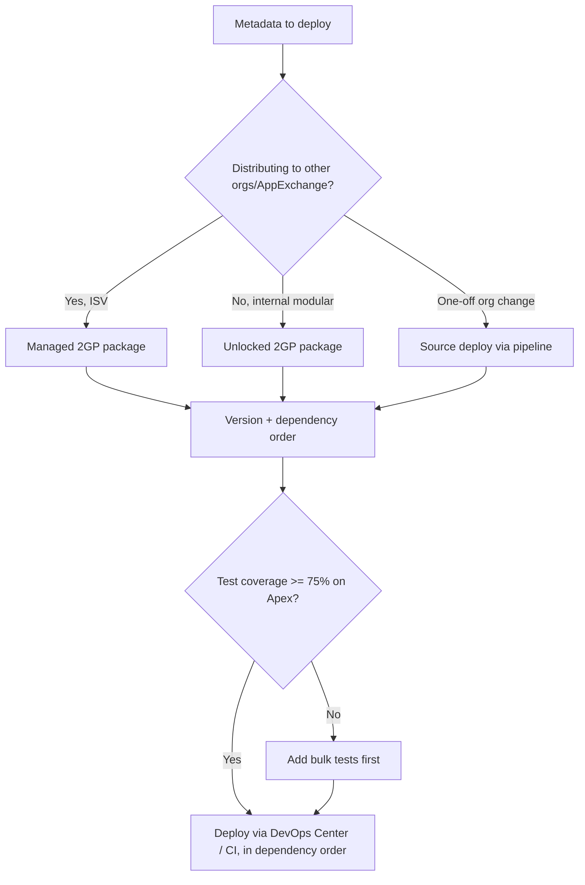

# Packaging & Deployment

**Dated:** 2026-05-30 · **Status:** current

Modern Salesforce ships as **second-generation packages (2GP)** through a pipeline (DevOps Center), with metadata deployed in **dependency order** — never a click-deploy to prod (house opinion #15).

## Decision Tree: how to package and ship

## 2GP packaging

- **Unlocked packages** — modular, source-driven, for internal org development; can be upgraded and removed.
- **Managed packages (2GP)** — for ISV/AppExchange distribution with namespace and IP protection.
- Packages are **versioned**; declare dependencies so they install in the right order.

## Deploy ordering

Metadata has dependencies — deploy in order: fields/objects before the code that references them, permission sets after the objects, Flows/triggers after their referenced types. The Metadata API deployment best-practice is to **stage by dependency**, run with the right test level, and validate (check-only) before a real deploy.

## Coverage gate

Production deployments require **≥75% Apex code coverage** org-wide, and every trigger needs some coverage. Coverage is a deploy gate, not a quality measure — pair it with bulk assertions (see `knowledge/governor-limits-and-bulkification.md` and the test-class template).

## Pipeline

**DevOps Center** provides source-tracked, work-item-based promotion across environments, replacing manual change sets. Use it (or an equivalent CI) so prod is deployed to, never clicked in.

## Sources

- https://developer.salesforce.com/docs/atlas.en-us.pkg2_dev.meta/pkg2_dev/sfdx_dev_dev2gp.htm
- https://gearset.com/blog/what-are-the-benefits-of-devops-center/
- https://developer.salesforce.com/blogs/2025/10/master-metadata-api-deployments-with-best-practices
- https://developer.salesforce.com/docs/atlas.en-us.apexcode.meta/apexcode/apex_code_coverage_best_pract.htm
