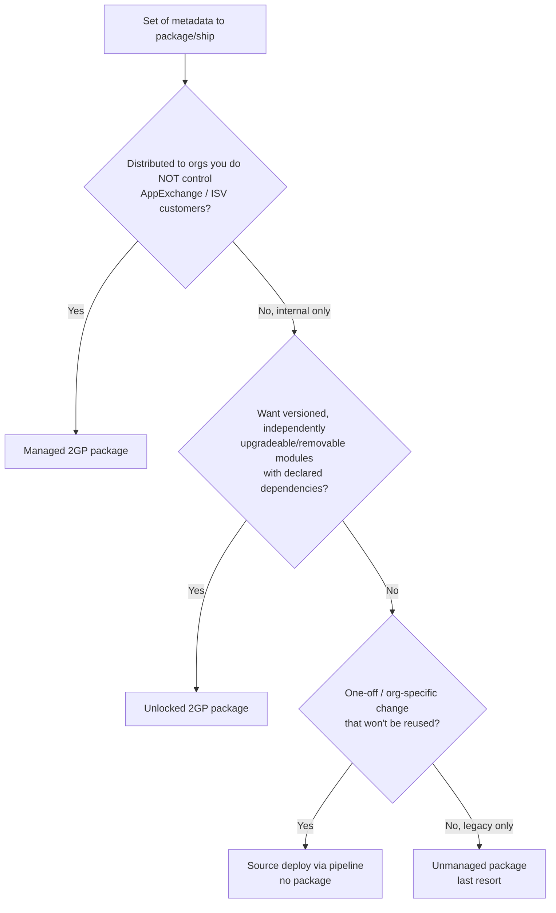
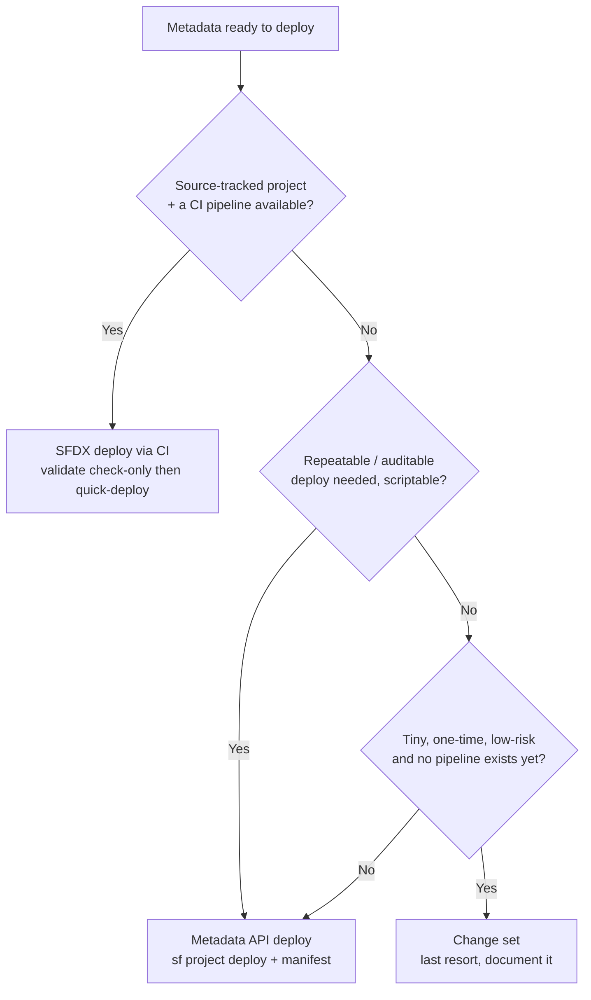
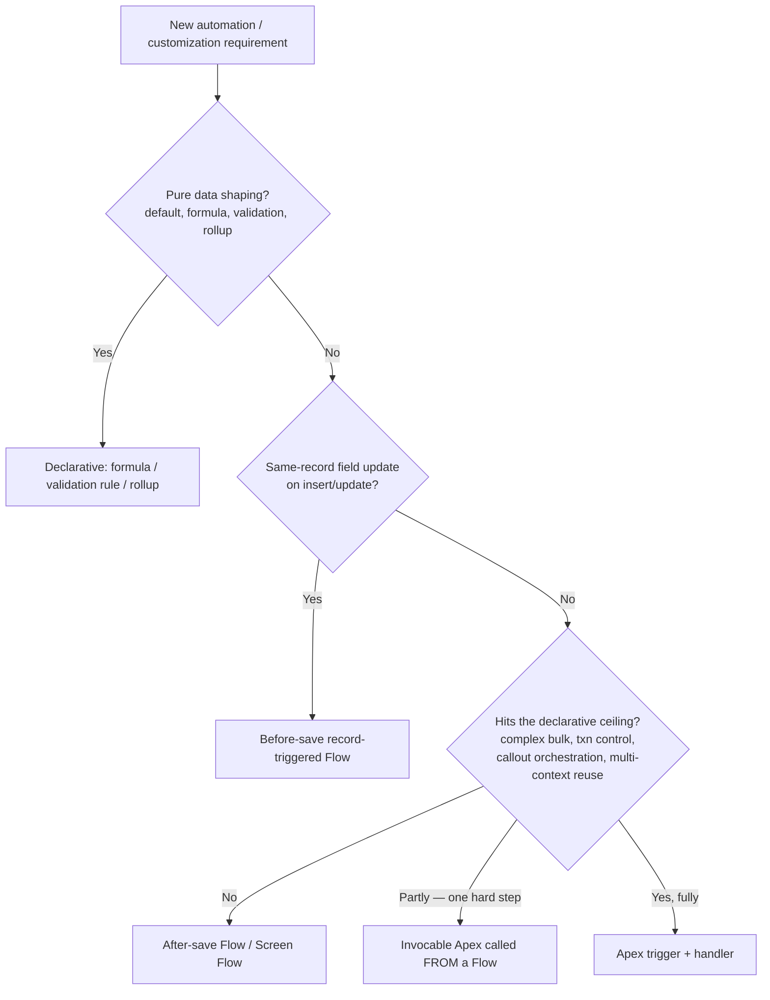
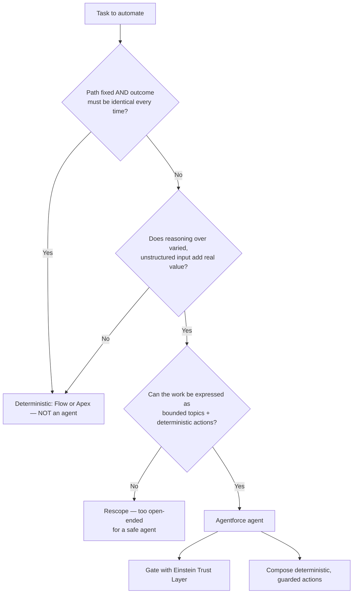
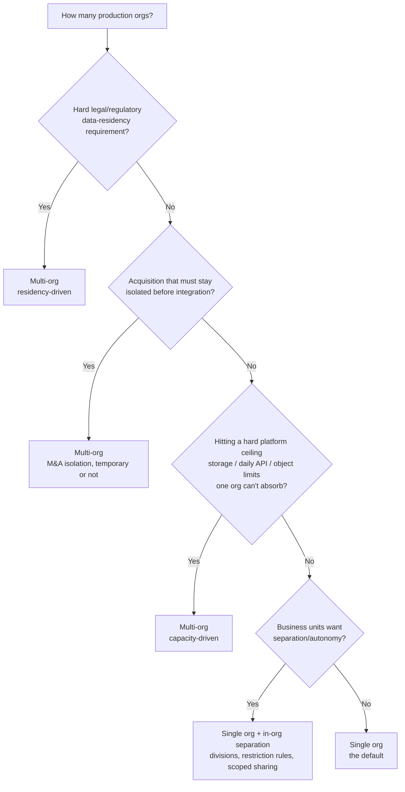
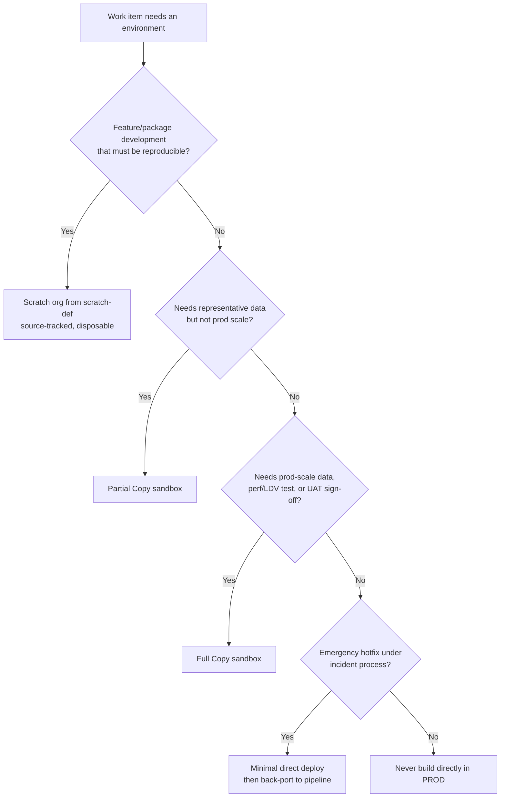

# Platform / ALM / Agentforce — Decision Trees

**Dated:** 2026-05-30 · **Status:** current · fast-moving Agentforce/CLI specifics tagged `[verify-at-build]`

Canonical decision trees for the platform-architecture, application-lifecycle, and Agentforce domains. Each follows the marketplace decision-tree format ([`docs/best-practices/decision-trees-in-knowledge-files.md`](../../../docs/best-practices/decision-trees-in-knowledge-files.md)): an observable entry condition, a `Last verified` date, a Mermaid graph, per-leaf rationale, and a tradeoffs table for any tree with ≥3 leaves.

**Decision-tree traversal (priors).** When a situation matches a tree's "When this applies", traverse the Mermaid graph top-to-bottom before selecting a method. Do not pattern-match on keywords in the request. The first branch where the condition resolves cleanly is the leaf to apply.

---

## Decision Tree: Packaging — which package type for this metadata?

**When this applies:** You have a coherent set of metadata (objects, code, config) and must decide *how it is packaged and distributed*. Observable trigger: you're about to run `sf package create`, or someone asks "should this be unlocked, managed, or just deployed?"

**Last verified:** 2026-05-30 against Salesforce 2GP packaging docs (`[verify-at-build]` — packageable-metadata coverage shifts each release).

**Rationale per leaf:**

- *Managed 2GP* — namespace + IP protection + push-upgrade for code you ship to orgs you don't own; the only option that hides source and supports ISV licensing. One-way: can't convert managed → unlocked.
- *Unlocked 2GP* — the internal-modularization default: versioned, dependency-declared, upgradeable, and removable; carves the org into bounded modules (see `best-practices/alm-2gp-unlocked-package-modularization.md`).
- *Source deploy via pipeline* — a genuine one-off (a picklist value, a report) doesn't need a package, but still ships through the source-tracked pipeline so the org stays reproducible.
- *Unmanaged package* — **legacy / last resort**: no upgrade path, no version lineage; effectively a one-time metadata bundle. Prefer source deploy for new work. **requires:** nothing special, but accept it can't be upgraded.

**Tradeoffs summary table:**

| Method | Upgradeable? | IP protected? | Dependencies declared? | Reversible choice? | Use when |
|---|---|---|---|---|---|
| Managed 2GP | Yes (push) | Yes (namespace) | Yes | No — one-way from unlocked | ISV / AppExchange / orgs you don't control |
| Unlocked 2GP | Yes | No | Yes | Yes (within unlocked) | Internal modular dev — the default |
| Source deploy | N/A (no artifact) | No | Via deploy order | Yes | One-off / org-specific change |
| Unmanaged | No | No | No | No | Legacy only — avoid for new work |

---

## Decision Tree: Deployment — change set vs Metadata API vs SFDX/CI?

**When this applies:** Metadata is ready to move between orgs and you must choose the *mechanism*. Observable trigger: "how do we get this to UAT/prod?" or someone reaches for the Setup → Outbound Change Sets UI.

**Last verified:** 2026-05-30 against Salesforce DX / Metadata API deployment docs (`[verify-at-build]`).

**Rationale per leaf:**

- *SFDX deploy via CI* — the default: version-controlled source, dependency-ordered, `deploy validate` (check-only) gates the PR, `deploy quick` promotes without re-testing under change-freeze (see `best-practices/alm-ci-cd-with-validation-only-deploys.md`). **requires:** CI auth via JWT (`sf org login jwt`), not interactive login.
- *Metadata API deploy* — scriptable and repeatable without full CI; the right call for an ad-hoc but auditable deploy, or destructive-changes manifests (see `best-practices/alm-deletions-go-through-destructive-changes-not-the-org-ui.md`).
- *Change set* — **last resort**: manual, no source of truth, no repeatable order, no rollback; click-deploy to prod violates house opinion #15. Acceptable only for a tiny one-off where no pipeline exists yet — and document it.

**Tradeoffs summary table:**

| Method | Source of truth? | Repeatable/ordered? | Test gate? | Effort to set up | Use when |
|---|---|---|---|---|---|
| SFDX via CI | Yes (repo) | Yes | validate + quick-deploy | High (one-time) | Any real pipeline — the default |
| Metadata API | Yes (manifest) | Yes (scripted) | `--test-level` | Low | Ad-hoc but auditable / destructive changes |
| Change set | No | No | Coverage only | None | Tiny one-off, no pipeline — last resort |

---

## Decision Tree: Build method — declarative vs programmatic for this requirement?

**When this applies:** A new automation or customization requirement, and you must pick the build tool. Observable trigger: "should this be a Flow or Apex?", a new field-update/validation/automation request, or a record-trigger being scoped.

**Last verified:** 2026-05-30 against `knowledge/flow-vs-apex-decision.md` and Salesforce record-triggered-automation guidance (`[verify-at-build]` — the declarative surface grows each release).

**Rationale per leaf:**

- *Declarative (formula / validation / rollup)* — pure data shaping has no logic to test; declarative is upgraded by the platform and visible to admins.
- *Before-save Flow* — same-record updates with no DML are the cheapest, fastest rung (see `best-practices/flow-before-save-for-same-record-field-updates.md`).
- *After-save / Screen Flow* — related-record DML, async paths, and guided UI that stay under the ceiling.
- *Invocable Apex from a Flow* — keep orchestration declarative; drop into code only for the one hard step (complex calc, callout). Best of both.
- *Apex trigger + handler* — past the ceiling: complex bulk, transaction control/rollback, assertion-level testing, or multi-context reuse (house opinion #11). Keep one entry point per object.

**Tradeoffs summary table:**

| Method | Admin-maintainable? | Governor bookkeeping | Unit-testable to assertions? | Best for |
|---|---|---|---|---|
| Declarative (formula/validation) | Yes | None | N/A | Data shaping, guards |
| Before-save Flow | Yes | Minimal (no DML) | Limited | Same-record field updates |
| After-save / Screen Flow | Yes | Some (DML/async) | Limited | Related-record DML, guided UI |
| Invocable Apex from Flow | Partly | You own the Apex step | Yes (the step) | One hard step in a declarative shell |
| Apex trigger + handler | No (dev-owned) | You own all of it | Yes | Past the declarative ceiling |

---

## Decision Tree: Automation — Agentforce agent vs Flow/Apex?

**When this applies:** A task could plausibly be "an AI agent", and you must decide whether it should be. Observable trigger: "can Agentforce do this?", "should this be an agent?", or a stakeholder asking for an AI assistant over a fixed-path process.

**Last verified:** 2026-05-30 against `knowledge/agentforce-determinism-and-trust.md` (`[verify-at-build]` — all Agentforce specifics are fast-moving).

**Rationale per leaf:**

- *Deterministic (Flow/Apex)* — fixed-path work gets unpredictability, consumption credits, and an audit headache from an agent in exchange for nothing a Flow does reliably (house opinion #14; `best-practices/agentforce-earns-its-non-determinism.md`).
- *Rescope* — if the work can't be bounded into topics + deterministic actions, it's too open-ended to ship safely; narrow it until it can.
- *Agentforce agent* — genuine reasoning over varied input (triage, summarization, grounded Q&A) is where an agent earns its non-determinism. **requires:** Einstein Trust Layer gating + grounded reads + guarded, idempotent writes (`best-practices/agentforce-action-grounding-and-guardrails.md`).

**Tradeoffs summary table:**

| Choice | Deterministic? | Trust Layer needed? | Consumption cost | Use when |
|---|---|---|---|---|
| Flow / Apex | Yes | No | Governor limits only | Fixed path, identical outcome required |
| Rescope then re-decide | — | — | — | Can't bound into topics + actions yet |
| Agentforce agent | No (model plans) | Yes — mandatory | Einstein requests/credits per cycle | Reasoning over varied input adds real value |

---

## Decision Tree: Org strategy — single org vs multi-org?

**When this applies:** Deciding how many *production* orgs the business runs, or whether a new business unit / acquisition / region needs its own org. Observable trigger: "do we need a second org?", an M&A integration, or a data-residency requirement landing.

**Last verified:** 2026-05-30 against `best-practices/platform-org-strategy-and-environments.md` and Salesforce org-strategy guidance (`[verify-at-build]`).

**Rationale per leaf:**

- *Single org* — the gravitational default: one customer 360, one model, one security model, zero cross-org integration tax.
- *Single org + in-org separation* — "BUs want their own space" is a governance problem; solve it with divisions, restriction rules, and scoped sharing before paying for a second org.
- *Multi-org (residency / M&A / capacity)* — only a **hard** constraint justifies the permanent cost (duplicated metadata, integration middleware, split reporting). Residency law, acquisition isolation, and a genuine platform ceiling are the legitimate drivers.

**Tradeoffs summary table:**

| Choice | Customer 360? | Integration tax | Reversible? | Justified by |
|---|---|---|---|---|
| Single org | Yes (one view) | None | — | Default — no hard constraint forces a split |
| Single + in-org separation | Yes | None | Yes | BU autonomy / separation needs |
| Multi-org | No (federated) | High (MDM + middleware) | Nearly never (merge = multi-year) | Residency law, M&A isolation, hard ceiling |

---

## Decision Tree: Lifecycle — which environment do I build/test this in?

**When this applies:** Choosing where a given piece of work happens — a feature, a perf test, UAT sign-off, a hotfix. Observable trigger: "which org should I do this in?", or someone about to make a change directly in production or a shared sandbox.

**Last verified:** 2026-05-30 against `best-practices/alm-scratch-orgs-and-source-tracking.md` and Salesforce environment-management docs (`[verify-at-build]` — sandbox license types/limits shift).

**Rationale per leaf:**

- *Scratch org* — disposable, source-defined, reproducible; the development default so the org's shape lives in version control, not in a drifting sandbox (`best-practices/alm-scratch-orgs-and-source-tracking.md`). **requires:** Dev Hub enabled.
- *Partial Copy sandbox* — representative data subset for integration testing without Full-Copy refresh cost/time.
- *Full Copy sandbox* — prod-scale data for LDV/performance testing and UAT sign-off; long refresh, license cost — use where prod-scale fidelity is the point.
- *Hotfix direct deploy* — incident-process exception: deploy a minimal source set fast, then **back-port to the pipeline immediately** — never leave it as a divergent manual edit (house opinion #15).
- *Never build in prod* — production is deployed to, never clicked in; this leaf exists to name the anti-pattern explicitly.

**Tradeoffs summary table:**

| Environment | Reproducible? | Data fidelity | Cost/refresh time | Use when |
|---|---|---|---|---|
| Scratch org | Yes (from def) | Seeded/minimal | Low / minutes | Feature & package dev — the default |
| Partial Copy | Partly | Representative subset | Medium | Integration testing |
| Full Copy | Partly | Prod-scale | High / long refresh | LDV/perf testing, UAT sign-off |
| Hotfix direct | No (back-port after) | Prod | N/A | Incident only — then re-enter pipeline |

---

## Sources

- [`../../../docs/best-practices/decision-trees-in-knowledge-files.md`](../../../docs/best-practices/decision-trees-in-knowledge-files.md) — the format these trees follow
- [`packaging-and-deployment.md`](./packaging-and-deployment.md) — package type, deploy ordering, coverage gate
- [`agentforce-determinism-and-trust.md`](./agentforce-determinism-and-trust.md) — Atlas, determinism levels, Trust Layer
- [`flow-vs-apex-decision.md`](./flow-vs-apex-decision.md) — the declarative ceiling criteria
- `best-practices/platform-*.md`, `best-practices/alm-*.md`, `best-practices/agentforce-*.md` — the one-rule docs these trees route into
- Salesforce 2GP packaging, Metadata-API deployment, org-strategy, and Agentforce documentation — all version-sensitive, `[verify-at-build]`
