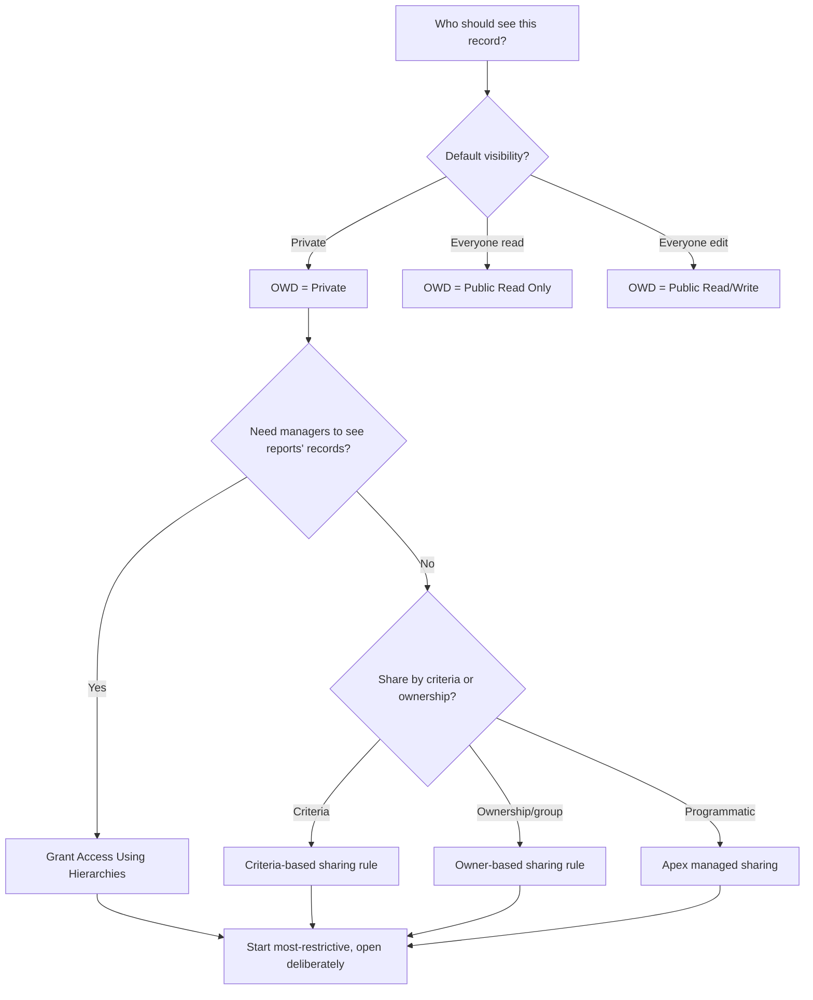

# Sharing & Security Model

**Dated:** 2026-05-30 · **Status:** current

Salesforce record access is layered: **org-wide defaults (OWD)** set the floor, the **role hierarchy** and **sharing rules** open it up, and Apex enforces **CRUD/FLS** in code (house opinions #6-#7). Security verdicts escalate to `ravenclaude-core/security-reviewer`.

## Decision Tree: opening up record access

## The layers, in order

1. **OWD** — the baseline. Start with the most restrictive default that still works (usually Private), then open up.
2. **Role hierarchy** — grants upward visibility (managers see subordinates' records) when "Grant Access Using Hierarchies" is on.
3. **Sharing rules** — owner-based or criteria-based, to widen access for groups/roles.
4. **Manual / Apex managed sharing** — programmatic, for cases rules can't express.
5. **Master-detail** inherits the parent's sharing; **lookup** does not — a data-model decision, not just config.

## CRUD/FLS in code

OWD/sharing govern *records*; **CRUD/FLS** govern *objects and fields* in user context. Enforce with `WITH SECURITY_ENFORCED` in SOQL or `Security.stripInaccessible` on DML. `with sharing` on a class respects sharing rules; justify every `without sharing`. Treat FLS as a security control and **escalate the verdict to core**.

## Sources

- https://sfdcdevelopers.com/2025/10/18/salesforce-sharing-model-guide/
- https://docs.pmd-code.org/latest/pmd_rules_apex_security.html (CRUD/FLS rules)
