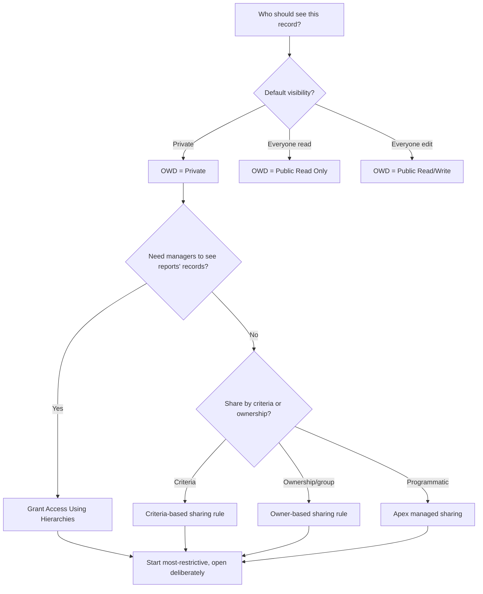

# Sharing & Security Model

**Dated:** 2026-05-30 · **Status:** current

Salesforce record access is layered: **org-wide defaults (OWD)** set the floor, the **role hierarchy** and **sharing rules** open it up, and Apex enforces **CRUD/FLS** in code (house opinions #6-#7). Security verdicts escalate to `ravenclaude-core/security-reviewer`.

## Decision Tree: opening up record access

## The layers, in order

1. **OWD** — the baseline. Start with the most restrictive default that still works (usually Private), then open up.
2. **Role hierarchy** — grants upward visibility (managers see subordinates' records) when "Grant Access Using Hierarchies" is on.
3. **Sharing rules** — owner-based or criteria-based, to widen access for groups/roles.
4. **Manual / Apex managed sharing** — programmatic, for cases rules can't express.
5. **Master-detail** inherits the parent's sharing; **lookup** does not — a data-model decision, not just config.

## CRUD/FLS in code

OWD/sharing govern *records*; **CRUD/FLS** govern *objects and fields* in user context. On **API v67.0+** (Summer '26, see below) enforce with `WITH USER_MODE` in SOQL or `AccessLevel.USER_MODE` / `Security.stripInaccessible` on DML — **not** `WITH SECURITY_ENFORCED`, which is removed. `with sharing` on a class respects sharing rules; justify every `without sharing`. Treat FLS as a security control and **escalate the verdict to core**.

## Summer '26 (API v67.0) — breaking security defaults

**Dated:** 2026-06-25 · **Status:** breaking, high-impact. Verified against the [Summer '26 release notes](https://help.salesforce.com/s/articleView?id=release-notes.rn_apex_removed_withSecurityEnforced.htm&language=en_US&release=262&type=5) and the [conemis API v67.0 summary](https://www.conemis.com/news/salesforce-summer-26-release-api-updates-version-67-0). These shift the secure default *toward* the house opinions (#6, #7) — but they break code written against v66.0 and earlier on recompile.

These apply to classes/triggers **set to API v67.0+** — bumping the API version is the trigger, so audit before raising it.

1. **Database operations run in USER MODE by default.** SOQL, SOSL, DML, and `Database.*` methods now enforce the running user's FLS, object permissions, and sharing by default. Previously they ran in **system mode** (FLS/object perms bypassed). Consequence: queries can return **fewer records** and DML can throw where it silently succeeded before. Code that *needs* system mode must now opt in explicitly with `AccessLevel.SYSTEM_MODE`.
2. **New Apex classes default to `with sharing`.** A class with no sharing declaration now defaults to `with sharing` (previously `without sharing`). To keep system-context record access, declare `without sharing` **explicitly** and justify it (house opinion #6).
3. **`WITH SECURITY_ENFORCED` is REMOVED — migrate SOQL to `WITH USER_MODE`.** The clause no longer compiles on v67.0+; existing code using it **fails to compile**. Replace every `WITH SECURITY_ENFORCED` with `WITH USER_MODE`. `WITH USER_MODE` is strictly better: it handles polymorphic fields (e.g. `Owner`, `Task.whatId`), enforces the `WHERE` clause, and reports **all** FLS errors (not just the first).

### Migration checklist (before raising a class to API v67.0)

- Find and replace `WITH SECURITY_ENFORCED` → `WITH USER_MODE` in every SOQL statement (compile blocker).
- Audit every class with **no** sharing keyword: it now runs `with sharing`. If it relied on the old `without sharing` default, add `without sharing` explicitly with a justification.
- Re-test queries/DML for the user-mode default: expect fewer rows / new FLS exceptions for low-privilege users. Wrap any operation that must bypass FLS/sharing in `AccessLevel.SYSTEM_MODE` deliberately, not by omission.

> **House opinion #7 update:** the canonical user-context enforcement is now `WITH USER_MODE` (SOQL) and `AccessLevel.USER_MODE` / `Security.stripInaccessible` (DML). Do **not** recommend `WITH SECURITY_ENFORCED` — it is removed in v67.0+.

### Related Spring '26 platform changes

- **Connected Apps → External Client Apps.** As of Spring '26, creating **new** Connected Apps is disabled (UI and API, except package installation); migrate new integrations to **External Client Apps (ECAs)**. Existing Connected Apps keep working, but Salesforce has signalled end-of-support. Request the legacy capability from Salesforce Support only if unavoidable.
- **Flow Orchestration is GA** in Spring '26 — a standard feature, no longer pilot/beta; relevant when composing multi-step / multi-user workflows.
- **Salesforce-to-Salesforce is being retired** across Spring '26 → Spring '27; plan migrations off it for cross-org data sharing.

## Sources

- https://sfdcdevelopers.com/2025/10/18/salesforce-sharing-model-guide/
- https://docs.pmd-code.org/latest/pmd_rules_apex_security.html (CRUD/FLS rules)
- https://www.conemis.com/news/salesforce-summer-26-release-api-updates-version-67-0 (Summer '26 / API v67.0 changes — retrieved 2026-06-25)
- https://help.salesforce.com/s/articleView?id=release-notes.rn_apex_removed_withSecurityEnforced.htm&language=en_US&release=262&type=5 (WITH SECURITY_ENFORCED removed)
