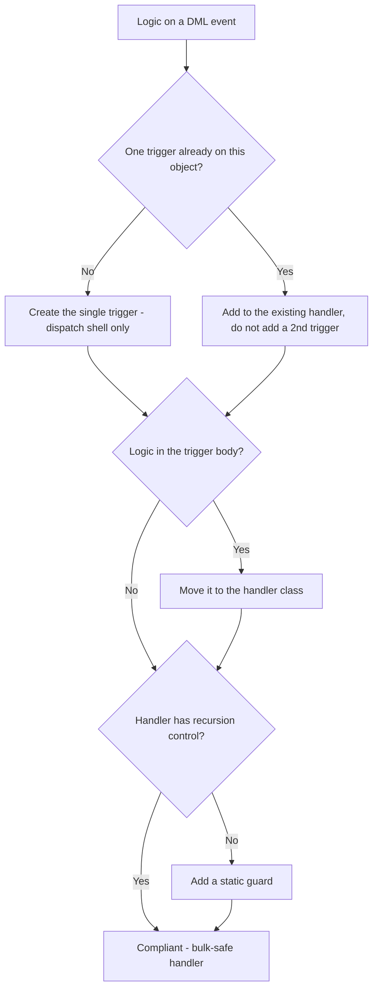

# Trigger Handler Framework

**Dated:** 2026-05-30 · **Status:** current

The trigger-handler pattern is the house standard: **one logic-less trigger per object** delegating to a handler class with mandatory recursion control (house opinions #2-#4).

## Decision Tree: structuring trigger logic

## The pattern

1. **One trigger** per SObject, covering all contexts (`before insert`, `after update`, …).
2. The trigger body **only dispatches** — it calls handler methods based on `Trigger.operationType`. No queries, no DML, no `if` business logic in the trigger itself.
3. A **handler class** (often a virtual base + per-object subclass) holds the logic, one method per context.
4. **Recursion control** is mandatory: a static `Boolean` or a static `Set<Id>` of already-processed IDs prevents re-entry when the handler's own DML re-fires the trigger.
5. The handler is **bulk-safe** by construction — it operates on `Trigger.new`/`Trigger.newMap` collections, never one record at a time.

See `templates/trigger-handler.md` for the skeleton.

## Why one trigger

Multiple triggers on one object have **no guaranteed execution order**, making behavior non-deterministic and recursion impossible to reason about. A single ordered handler is the only debuggable design.

## Sources

- https://www.salesforceben.com/the-salesforce-trigger-handler-framework/
