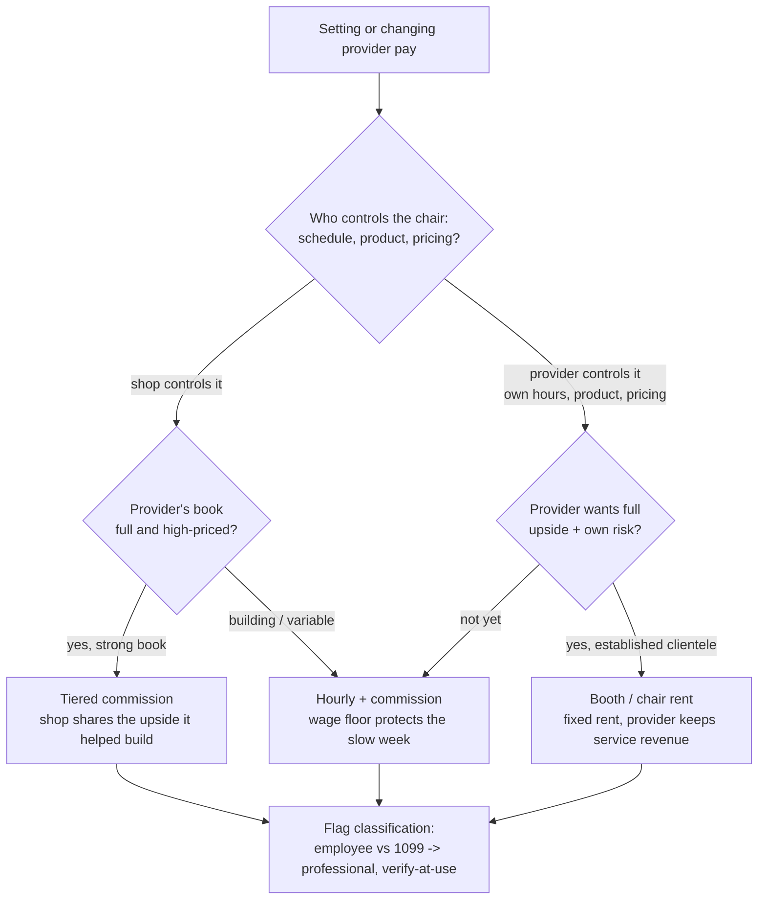
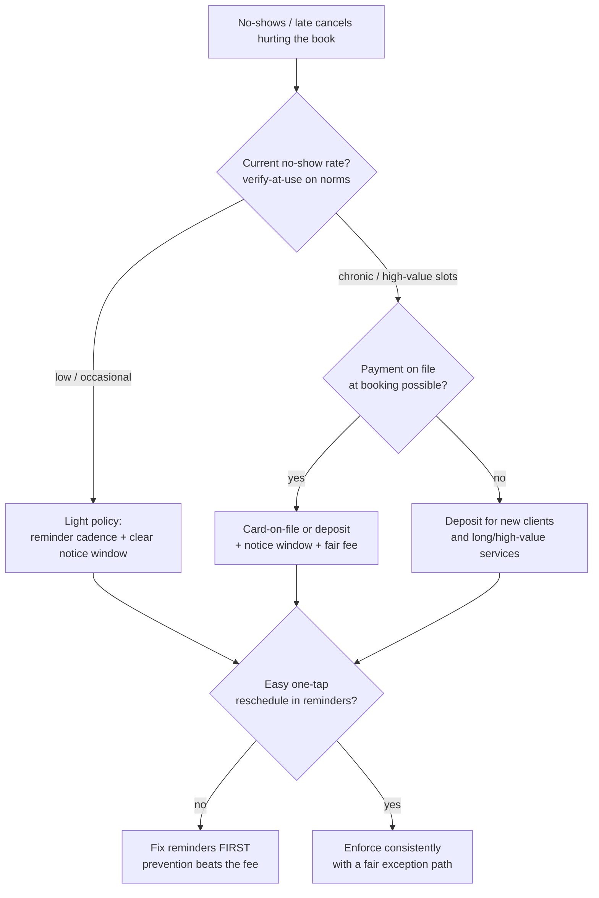
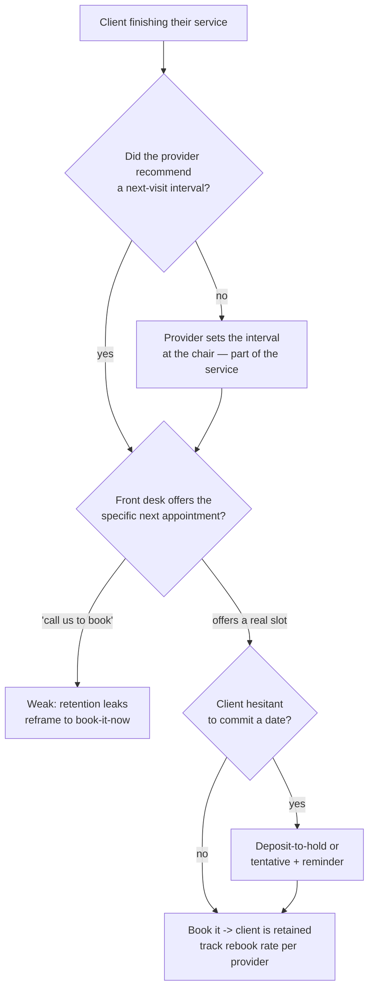
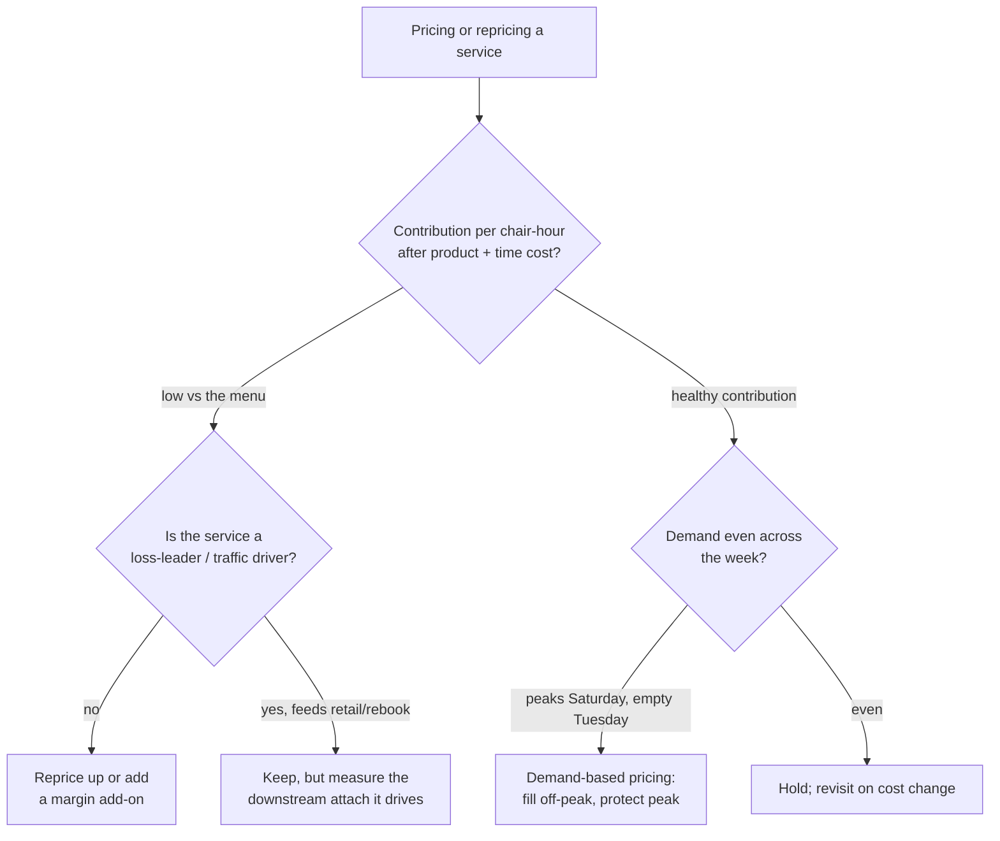

# Salon / Spa / Barbershop — Decision Trees

> Reference decision trees for the `salon-spa-operations` team. Agents **traverse the relevant tree top-to-bottom before deciding** (the proactive complement to the Capability Grounding Protocol). Each `## Decision Tree` section is a Mermaid graph plus the rule it encodes.
>
> **Operations and financial decision-support, not legal, tax, or employment-classification advice.** Anything touching worker classification, a deposit/consumer-protection rule, or a lease term is `[verify-at-use]` and routes to a licensed professional. Benchmarks (utilization, retail-attach, no-show norms) are volatile — confirm before quoting. No client PII.
>
> _Last reviewed: 2026-07-02 by `claude`. Principles are durable; dated benchmarks live in [`salon-spa-reference-2026.md`](salon-spa-reference-2026.md)._

---

## Decision Tree: choose the compensation model (commission vs booth-rent vs hourly)

**Rule:** the comp model follows **who actually controls the chair** and how strong the book is — model it on the provider's real revenue and cost, never a rule of thumb. Employee vs booth-renter/1099 is a legal determination: model the economics, `[verify-at-use]`, and route the classification call to a licensed professional.

---

## Decision Tree: set the no-show / late-cancel policy & deposit

**Rule:** the policy exists to **change behavior, not collect fees** — prevent the no-show with a confirming reminder cadence first, then enforce a deposit/card-on-file sized to the actual no-show rate, consistently and with a fair exception path. A no-show is inventory you can't resell. Norms are `[verify-at-use]`.

---

## Decision Tree: rebook at checkout

**Rule:** the highest-yield front-desk act is booking the **next** appointment before the client leaves the chair, at the provider's recommended interval. "Call us to book" is a hope; a booked slot is retention. Track rebooking rate per provider as the leading indicator of a full future calendar.

---

## Decision Tree: price the service menu (time and demand)

**Rule:** price on **contribution per chair-hour and on demand**, not on what the shop down the street charges. Reprice the low-contribution service (or attach margin to it), and use demand-based pricing to fill the empty daypart and protect the peak. Chair-hours are perishable — an empty Tuesday is spoiled inventory. Local price data is `[verify-at-use]`.

---

## See also

- [`salon-spa-reference-2026.md`](salon-spa-reference-2026.md) — dated benchmarks + concepts (verify-at-use).
- Skills: [`../skills/compensation-models-commission-vs-booth-rent/SKILL.md`](../skills/compensation-models-commission-vs-booth-rent/SKILL.md), [`../skills/booking-and-no-show-control/SKILL.md`](../skills/booking-and-no-show-control/SKILL.md), [`../skills/chair-and-room-utilization/SKILL.md`](../skills/chair-and-room-utilization/SKILL.md), [`../skills/retail-attach-and-service-mix/SKILL.md`](../skills/retail-attach-and-service-mix/SKILL.md).
