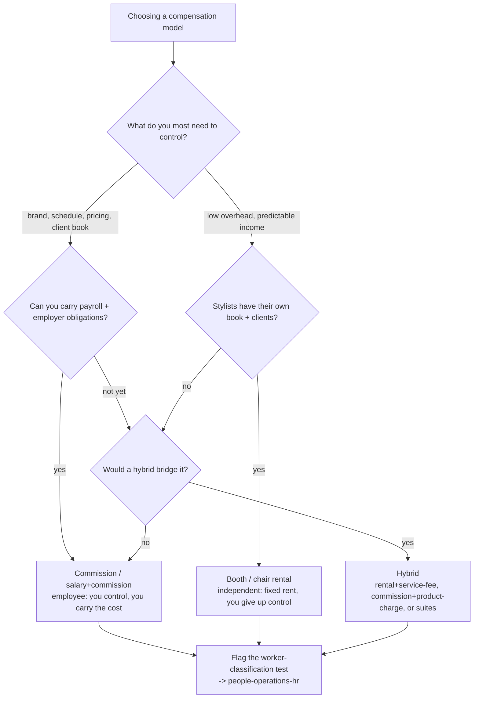
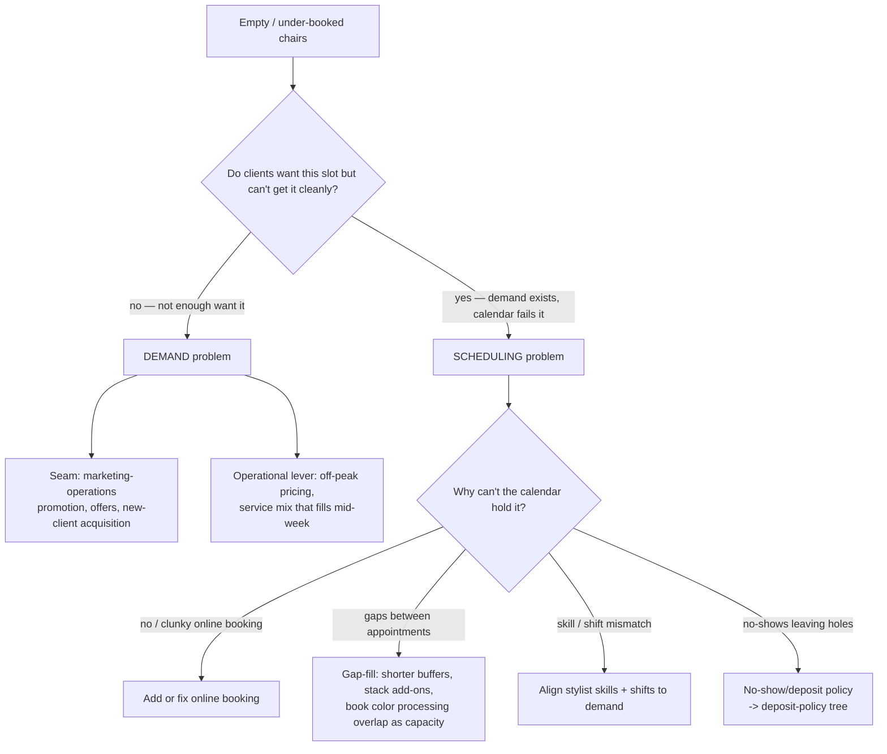
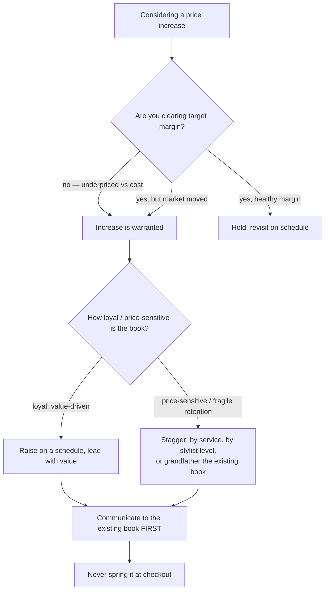
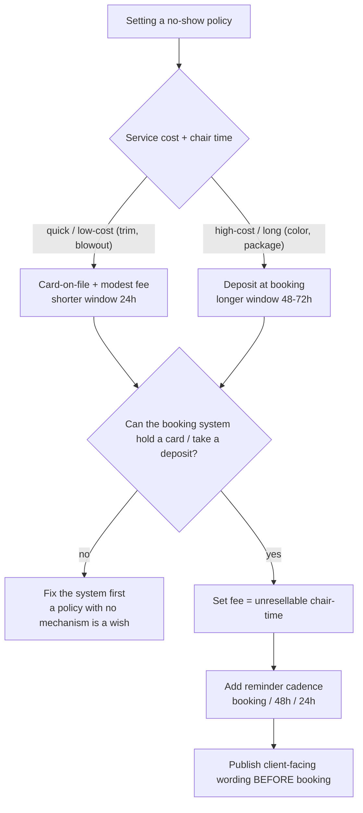

# Salon & Spa Operations — Decision Trees

> Reference decision trees for the `salon-spa-operations` team. Agents **traverse the relevant tree top-to-bottom before choosing** (the proactive complement to the Capability Grounding Protocol). Each `## Decision Tree` section is a Mermaid graph plus the rule it encodes.
>
> _Last reviewed: 2026-06-25 by `claude`. Principles are durable; specific benchmark numbers live (dated) in [`salon-spa-operations-reference-2026.md`](salon-spa-operations-reference-2026.md). Worker-classification and tax outcomes are jurisdiction-dependent — these trees frame the operational trade only; the legal verdict escalates to `people-operations-hr` / `accounting-bookkeeping`._

---

## Decision Tree: commission vs booth/chair rental vs hybrid?

**Rule:** the model is a control/risk trade, not just a split. Commission = control + employer cost; rental = low overhead + lost control; hybrid splits it. **Every branch ends at the classification flag** — employee-vs-contractor is a legal test (control, tools, schedule), jurisdiction-dependent, and never a label of convenience. Frame the operational trade here; escalate the verdict to `people-operations-hr` and the tax mechanics to `accounting-bookkeeping`.

---

## Decision Tree: is the chair empty because of demand or scheduling?

**Rule:** diagnose before you fix. An empty chair is either too little *demand* (a `marketing-operations` seam, plus off-peak/mix levers) or a *scheduling* failure (online booking, gaps, color-overlap capacity, skill/shift fit, or no-shows). The fix differs entirely by cause — never throw a marketing promotion at a scheduling problem (or vice versa).

---

## Decision Tree: should I raise prices, and how?

**Rule:** raise to a target margin, not to a competitor; raise on a *schedule*; lead with *value*; *segment/grandfather* where retention is fragile; and **communicate to the existing book before the change.** The surprise at checkout — not the price — is what burns the trust rebooking depends on.

---

## Decision Tree: what no-show / deposit policy fits?

**Rule:** the policy is a *mechanism*, not a sentence. Match the deposit/card and window to the service's cost and chair-time, make the system actually enforce it, set the fee to the chair-time you can't resell, and show the wording before booking. Reminders reduce honest mistakes; the deposit covers the deliberate no-show.

---

## How the agents use these trees

- `salon-spa-operations-lead` → the **compensation-model** tree before any pay-structure recommendation (always ending at the classification flag).
- `booking-and-retention-analyst` → the **empty-chair** and **deposit-policy** trees before diagnosing utilization or writing a no-show policy.
- `service-menu-and-pricing-strategist` → the **price-increase** tree before any increase.

Traverse top-to-bottom; don't keyword-match. Volatile numbers are dated in the reference map and re-verified before quoting.
