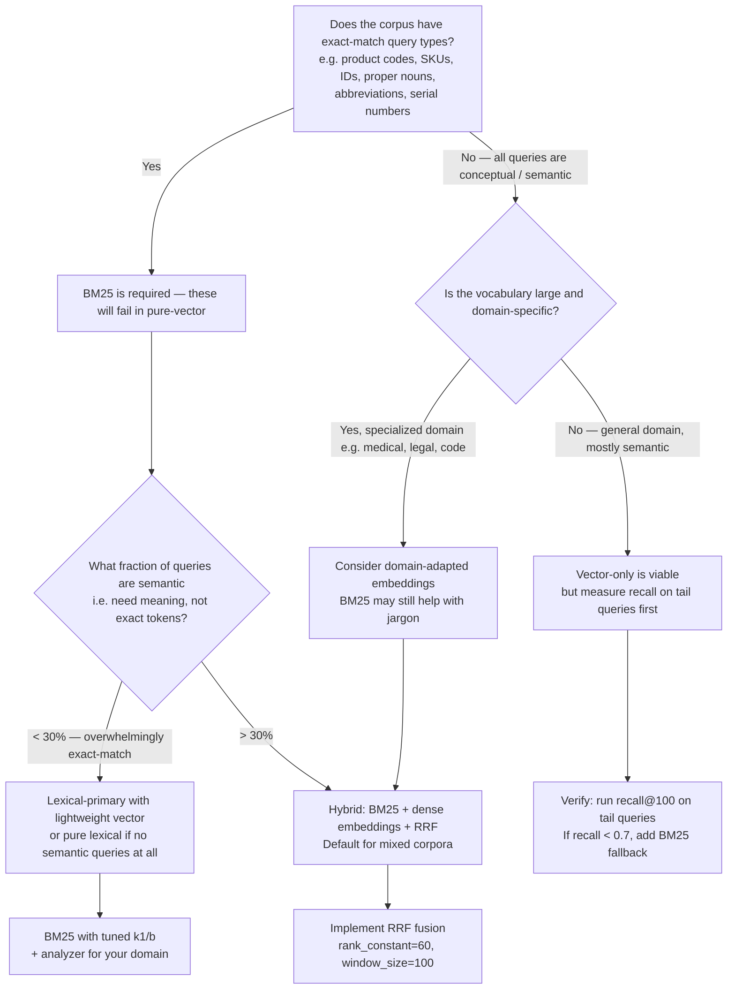
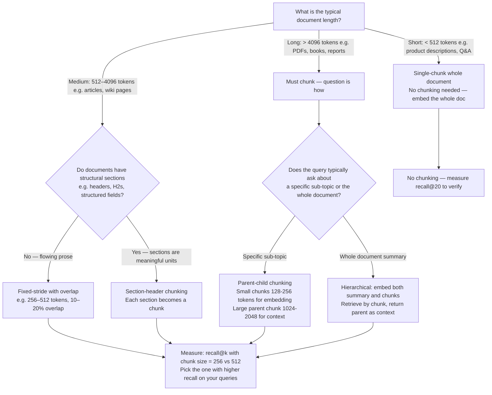
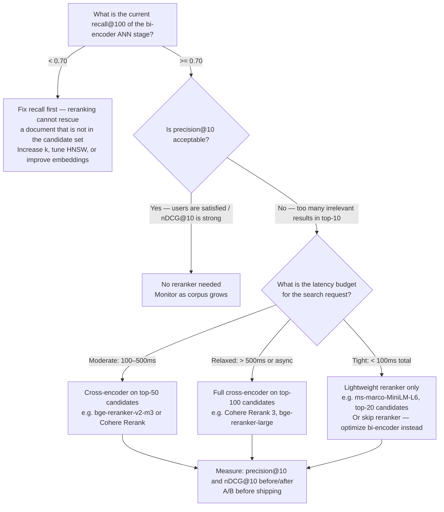

# Search & Retrieval Engineering — Decision Trees + 2026 Capability Map

> Canonical knowledge bank for `search-relevance-engineering`. **Traverse the relevant Mermaid
> tree top-to-bottom before recommending** — the proactive complement to the Capability Grounding
> Protocol. Volatile product/version facts carry `[verify-at-use]`; stable algorithmic facts do not.

---

## Decision Tree 1: Lexical vs Vector vs Hybrid

**Leaf rule:** for any corpus with product codes, identifiers, abbreviations, or proper nouns,
pure-vector retrieval will fail on those query types. Hybrid (BM25 + dense + RRF) is the safe
default; pure-vector requires evidence that the corpus has no exact-match query types. Pure
lexical is suitable only for structured catalogue lookup with no semantic queries.

---

## Decision Tree 2: Chunking Strategy

**Leaf rule:** chunk size is a corpus + query-specific empirical decision. The most common
mistake is hardcoding 512 tokens without measuring. Run recall@k at 128, 256, and 512 tokens
on a sample of real queries and pick the size that maximises recall on your query distribution.
Long documents almost always benefit from parent-child chunking: embed small chunks (128–256
tokens) for retrieval precision, return the parent context window (1024–2048 tokens) to the
LLM for answer quality.

---

## Decision Tree 3: Rerank-or-not

**Leaf rule:** a reranker is a precision tool, not a recall tool. If the bi-encoder recall@100
is below 0.70, fix the embedding model or HNSW parameters first — no reranker can retrieve
a document that wasn't in the top-100 candidate set. When recall is sufficient and precision is
not, add a cross-encoder reranker sized to the latency budget. Always measure the precision@10
and nDCG@10 delta before A/B-testing in production.

---

## 2026 Capability Map — Search & Retrieval Landscape

_Retrieved 2026-06-08. Product versions, pricing, and performance benchmarks are volatile —
re-confirm at use. This is orientation, not a procurement recommendation._

| Category | Options (2026) | Notes |
|---|---|---|
| **Lexical + hybrid search (ops-mature)** | **Elasticsearch 8.x** (Elastic, ESRE, native kNN + BM25 + RRF in one query), **OpenSearch 2.x** (AWS-managed, Elasticsearch fork, hybrid search support) | Battle-tested at scale; native hybrid query in Elasticsearch 8.12+; rich analyzer ecosystem; significant ops cost [verify-at-use]. |
| **In-database vector search** | **pgvector** (Postgres extension, HNSW + IVFFlat), **SQLite-vss** (embedded), **Supabase Vector** (hosted pgvector) | Zero extra infra if Postgres is already in stack; HNSW added in pgvector 0.5.0 (2023); suitable for < 10M vectors and moderate query rates [verify-at-use]. |
| **Dedicated vector stores** | **Pinecone** (managed, serverless tier), **Weaviate** (OSS + managed, hybrid BM25+vector native), **Qdrant** (OSS + managed, Rust, payload filtering), **Milvus** (OSS + Zilliz managed, GPU support) | Higher ANN throughput than pgvector at scale; operational overhead vs managed tradeoff; Pinecone serverless removes index pre-sizing [verify-at-use]. |
| **BM25 / lexical scoring** | **BM25** (Elasticsearch/OpenSearch default, k1=1.2 b=0.75), **BM25F** (multi-field BM25 via field boosts in Elasticsearch), **BM25+** (Okapi extension) | BM25 is the standard; BM25F is achieved via field-level boosts in Elasticsearch; BM25+ relevant for very short queries [verify-at-use]. |
| **Bi-encoder embedding models** | **OpenAI text-embedding-3-small / 3-large** (API, 1536 dims), **Cohere Embed v3** (API, 1024 dims), **voyage-large-2-instruct** (API), **E5-large-v2** / **E5-mistral-7b-instruct** (open-weight), **BGE-large-en-v1.5** / **BGE-M3** (open-weight, multilingual) | BGE-M3 and E5-mistral are strong open-weight options; OpenAI 3-small is cost-competitive; domain fine-tuning consistently beats general models on specialized corpora [verify-at-use]. |
| **Cross-encoder rerankers** | **Cohere Rerank 3 / 3.5** (API, managed), **bge-reranker-v2-m3** (open-weight, multilingual), **ms-marco-MiniLM-L6** (fast, open-weight), **Jina Reranker v2** (open-weight) | Cohere Rerank 3 is strong and managed; bge-reranker-v2-m3 is the best open-weight multilingual option as of mid-2026; ms-marco-MiniLM for latency-sensitive pipelines [verify-at-use]. |
| **Hybrid fusion** | **RRF** (Reciprocal Rank Fusion, native in Elasticsearch 8.12+, OpenSearch 2.x), **Linear combination** (weighted sum of BM25 and cosine scores, requires tuned weight) | RRF is parameter-light and empirically robust; linear combination requires a held-out judgment set to tune the weight; default to RRF [verify-at-use]. |
| **Learning-to-rank** | **Elasticsearch LTR plugin** (XGBoost/LambdaMART features from Elasticsearch scores), **XGBoost RankNet/LambdaMART** (standalone), **LightGBM LGBM Ranker** | Requires click logs or judgment sets at scale; LambdaMART is the standard industrial LTR baseline; neural LTR for very large datasets only [verify-at-use]. |
| **Offline eval metrics** | **nDCG@k** (ranking quality, primary), **MRR** (single-relevant-doc queries), **recall@k** (RAG retrieval), **precision@k** | Computed by `scripts/search_eval.py` in this plugin. |
| **Online eval** | **CTR@k** (click-through rate), **mean click position**, **session abandonment rate**, **explicit relevance feedback** | Online metrics lag offline; use both; never use CTR alone. |

> Provenance: Elasticsearch/OpenSearch official docs, BEIR benchmark results, Cohere/OpenAI
> embedding model pages, pgvector GitHub, Pinecone/Weaviate/Qdrant/Milvus documentation,
> retrieved 2026-06-08. Product versions and benchmark rankings change frequently — re-verify
> before committing to a stack.

---

## See also

- [`../CLAUDE.md`](../CLAUDE.md) — team constitution & seams.
- [`../best-practices/README.md`](../best-practices/README.md) — the named, citable rules.
- [`../scripts/search_eval.py`](../scripts/search_eval.py) — nDCG@k, MRR, recall@k, precision@k.
- Neighbour decision trees: `claude-app-engineering` (generation), `data-platform` (pipelines),
  `api-engineering` (API layer), `applied-statistics` (A/B significance).

_Last reviewed: 2026-06-08 by `claude`._
