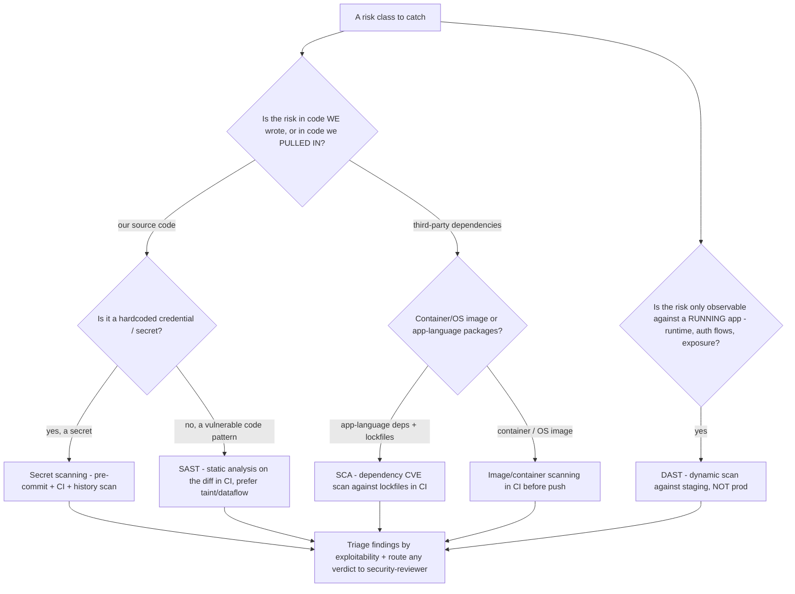

# SAST / DAST / SCA / Secret-Scanning — Scanner Selection Decision Tree

_A Mermaid decision tree for picking the **right scanner class for the risk you're trying to catch**, and where it belongs in the pipeline. Complements the existing [`security-engineering-decision-trees.md`](security-engineering-decision-trees.md) "Where does this security control belong (shift-left placement)" tree — that one decides the *stage*; this one decides the *tool class* and names concrete, currently-published tools. Tool rows are `[verify-at-use]` — re-check the project's maintenance/version before adopting. Last reviewed: 2026-06-05._

> **This team proposes; it does not pronounce the verdict.** This tree recommends a scanner class + placement; the adopt/spend decision and any ship/no-ship on findings route to `ravenclaude-core/security-reviewer`.

## Why this tree exists (the one-line thesis)

**Each scanner class catches a *different* defect class, and none substitutes for another.** SAST reads your source for vulnerable *patterns*; SCA inventories your *dependencies* and matches them to known CVEs; DAST attacks the *running* app for runtime/exposure flaws; secret-scanning finds *committed credentials*. A program that runs only one is blind to three. This tree maps "what am I trying to catch?" to the class, and to where it runs.

## Decision Tree: which scanner class for this risk?

## Scanner class → what it catches → placement → currently-published tools

| Class | Catches | Where it runs | Concrete tools `[verify-at-use]` |
|---|---|---|---|
| **SAST** (static) | Injection, unsafe deserialization, path traversal, weak crypto — vulnerable *patterns in your source* | CI on the PR diff; prefer taint/dataflow mode over syntactic match for signal | **Semgrep** (OSS, fast, taint mode, 5,000+ rules), **CodeQL** (GitHub), language linters (Bandit/py, gosec/go, ESLint security plugins) |
| **SCA** (software composition) | Known CVEs in your *dependencies* (direct + transitive), via lockfile → advisory matching | CI against lockfiles; gate on reachability where supported | **OSV-Scanner** (Google, Apache-2.0, uses osv.dev), **Trivy** (Aqua, also images), **Dependabot** / **Renovate** (auto-PRs), Grype |
| **Secret scanning** | Committed credentials, keys, tokens — *in source/history* | Pre-commit (block) + CI + full-history scan | **gitleaks** (OSS), **TruffleHog** (OSS), **GitHub secret scanning + push protection** (native) |
| **Container/image scanning** | OS-package + base-image CVEs, misconfig, embedded secrets in *images* | CI before image push; registry scanning | **Trivy** (Aqua), **Grype** (Anchore), Docker Scout |
| **DAST** (dynamic) | Runtime/exposure flaws — auth/session handling, reflected XSS, server misconfig — *against the running app* | **Staging, not prod** (it sends real attack traffic) | **OWASP ZAP** (OSS), Nuclei (templated), commercial DAST |
| **IaC / policy-as-code** | Misconfigured infra *before deploy* (open SG, public bucket, wildcard IAM) | CI on the IaC PR; preventive over detective | **Checkov**, **tfsec/Trivy-config**, **OPA/Conftest** |

> **None of these substitute for a threat model.** Architectural / trust-boundary risks (a design that authenticates but never authorizes; a missing trust boundary) are invisible to *every* scanner above — they're caught at design time by `threat-modeler`, not by a tool. The scanners catch the implementation classes; the threat model catches the design classes.

## How to read the two axes (grounding)

- **"Our code vs. pulled-in code"** is the load-bearing first split, and it maps cleanly to the OWASP coverage: **SAST + DAST cover OWASP Top 10 (web) implementation flaws**, while **SCA covers the known-vulnerable-dependency slice of A03:2025 "Software Supply Chain Failures"** — this was its own category, **A06:2021 "Vulnerable and Outdated Components,"** until the 2025 edition folded it into the broader supply-chain category, so SCA discharges the dependency-CVE part of A03, **not** its provenance / build-integrity part. A program with SAST but no SCA passes its own code and ships a known-CVE dependency — the most common modern breach vector, and **2026 saw multiple npm supply-chain compromises** that make A03's elevation concrete: SCA inventories the dependency CVEs, while lockfile pinning + SLSA provenance verification defend the install path SCA can't see. Source: **OWASP Top 10:2025** (finalized; supersedes 2021 — https://owasp.org/Top10/2025/, retrieved 2026-06-16).
- **"Static vs. running"** is why DAST is not redundant with SAST: SAST cannot see a misconfigured auth flow or a server header that only exists at runtime; DAST cannot see an unreachable code path or tell you *which line* to fix. They are complementary, and the program runs both. Source: OWASP Web Security Testing Guide (WSTG) / OWASP DevSecOps Guideline.
- **Placement = earliest stage that can catch the class** — the shift-left principle, formalized in the companion "shift-left placement" tree. Secret scanning and SAST/SCA belong on the PR (cheap, pre-merge); DAST needs a deployment so it belongs on staging; IaC policy belongs on the infra PR. Source: OWASP DevSecOps Guideline.

## When NOT to use this tree

- You already know the *stage* and only need the tool — this tree's value is the class mapping; if you've decided "CI on the diff," the table's SAST/SCA/secret rows are the menu.
- The risk is a **design/architecture** flaw — no scanner catches it; route to `threat-modeler` (STRIDE / data-flow / trust boundaries).
- You're choosing a **bundled MCP tool** for this plugin — that's governed by [`../../../docs/best-practices/bundled-mcp-servers.md`](../../../docs/best-practices/bundled-mcp-servers.md) (zero-config + read-only bar), not by tool capability alone; see the plugin CLAUDE.md MCP section.

**Sources (retrieved 2026-06-05):**
- OWASP Top 10:2025 (web; finalized — A03 "Software Supply Chain Failures" absorbs the 2021 A06 "Vulnerable & Outdated Components"; new A10 "Mishandling of Exceptional Conditions"; Security Misconfiguration → A02) — https://owasp.org/Top10/2025/ (retrieved 2026-06-16)
- OWASP DevSecOps Guideline (SAST/DAST/SCA/secret placement) — https://owasp.org/www-project-devsecops-guideline/
- OWASP Web Security Testing Guide (WSTG) — https://owasp.org/www-project-web-security-testing-guide/
- Semgrep (SAST, taint mode) — https://github.com/semgrep/semgrep (MIT)
- OSV-Scanner (SCA) — https://github.com/google/osv-scanner (Apache-2.0; v2.3.8, May 2026)
- Trivy (SCA + image + IaC) — https://github.com/aquasecurity/trivy (Apache-2.0)
- gitleaks (secret scanning) — https://github.com/gitleaks/gitleaks
- OWASP ZAP (DAST) — https://www.zaproxy.org/

Tool maintenance status, versions, licenses, and OWASP edition are all volatile — `[verify-at-use]` against each project and the current OWASP edition before adopting or quoting.
