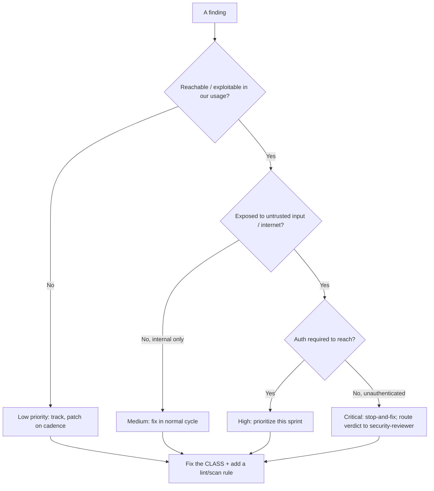
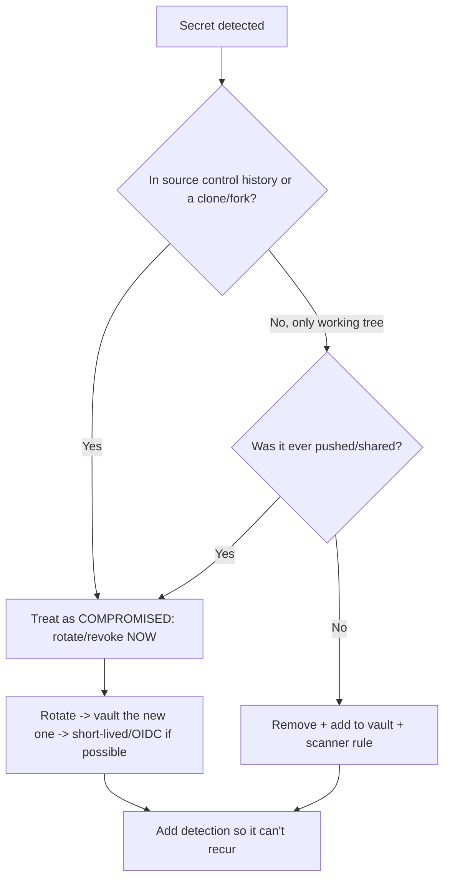
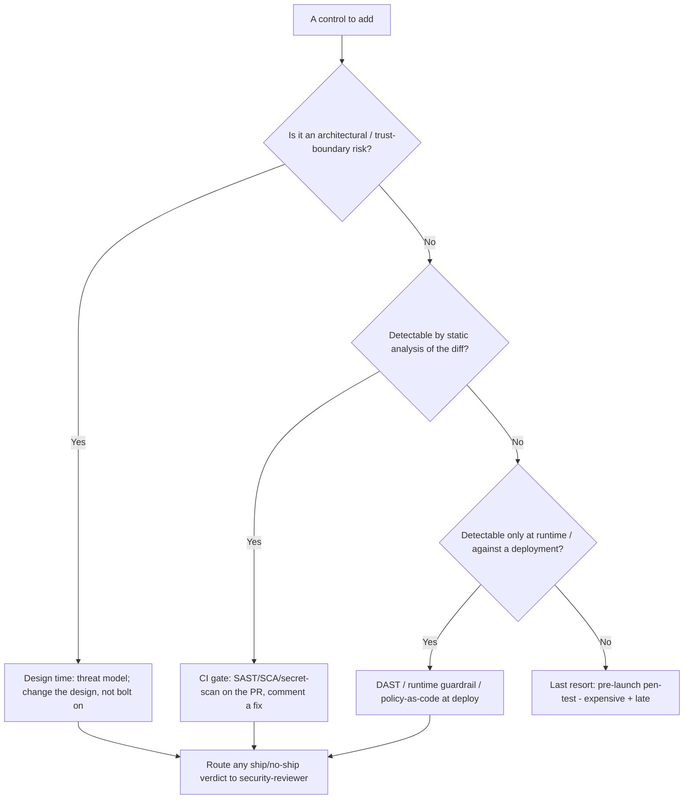
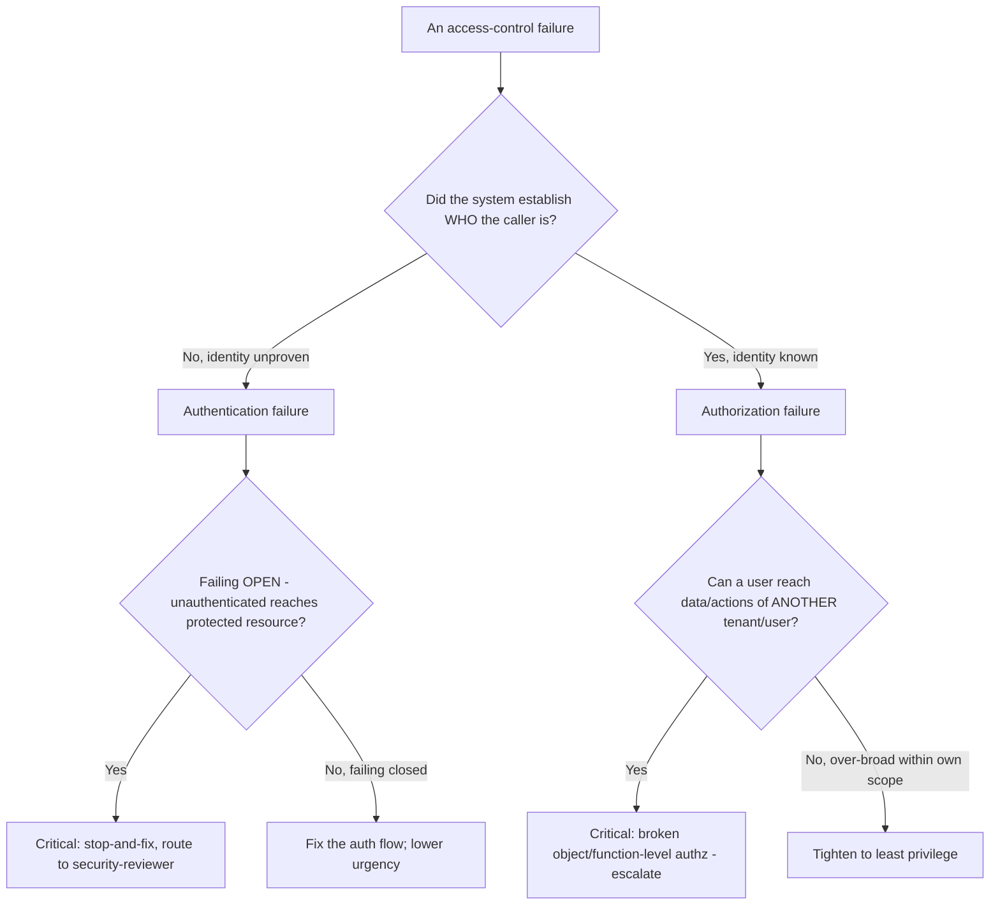
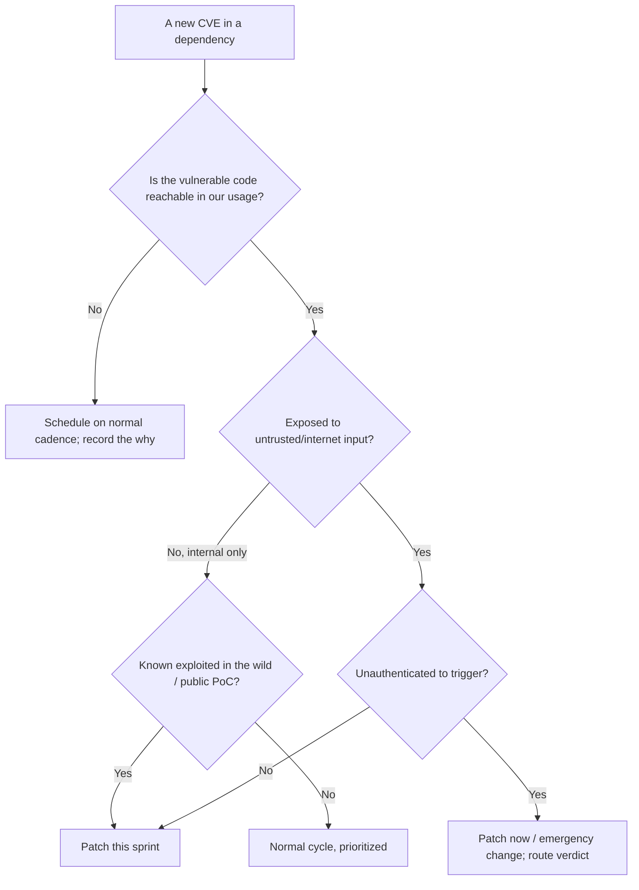

# Security Engineering — Decision Trees

_Decision trees + a dated capability map. Capability rows are `[verify-at-build]` — re-check against the vendor before quoting. Last reviewed: 2026-06-04._

Traverse before triaging a finding or handling a secret. Remember: this team proposes; security-reviewer decides.

## Decision Tree: Vulnerability triage priority

Rank by exploitability and blast radius, not CVSS alone — then route the verdict.

_Every ship/no-ship call routes to `ravenclaude-core/security-reviewer`._

## Decision Tree: A secret was found — what now?

A committed secret is compromised. Deleting the commit is not remediation.

## Decision Tree: Where does this security control belong (shift-left placement)?

Place the control at the earliest, cheapest stage that can actually catch the class — earlier is cheaper, but the verdict still routes.

_Shift the detection left; never shift the verdict. The earlier you catch it, the cheaper the fix._

## Decision Tree: Auth-vs-authz failure triage

"Access denied" and "access wrongly granted" are different bugs with different blast radii — separate them before you fix.

_Authn = are you who you claim? Authz = are you allowed? A failing-open authn check and a cross-tenant authz hole are both critical; route the verdict._

## Decision Tree: Patch now vs schedule (exploitability gate)

Reachability and exposure decide urgency, not the CVSS number on the advisory.

_A 9.8 in an unreachable path waits; a 6.5 unauthenticated and exploited-in-the-wild does not. Verdict to security-reviewer._

## Capability map (dated — verify at build)

| Capability | 2026 state `[verify-at-build]` | Notes |
|---|---|---|
| OWASP Top 10 (web) | 2021 edition current | 2025 refresh tracked; verify at build |
| SAST/SCA in CI | mature | Tune for signal; reachability where supported |
| Secret scanning | GitHub/GitLab native + tools | Pre-commit + CI + history scan |
| SLSA | v1.0 | Build levels; verify provenance on consume |
| CSPM | mature across clouds | Misconfig is #1 breach cause |
| Policy-as-code (OPA/Conftest, cloud policy) | GA | Preventive > detective; wire via terraform-iac |
