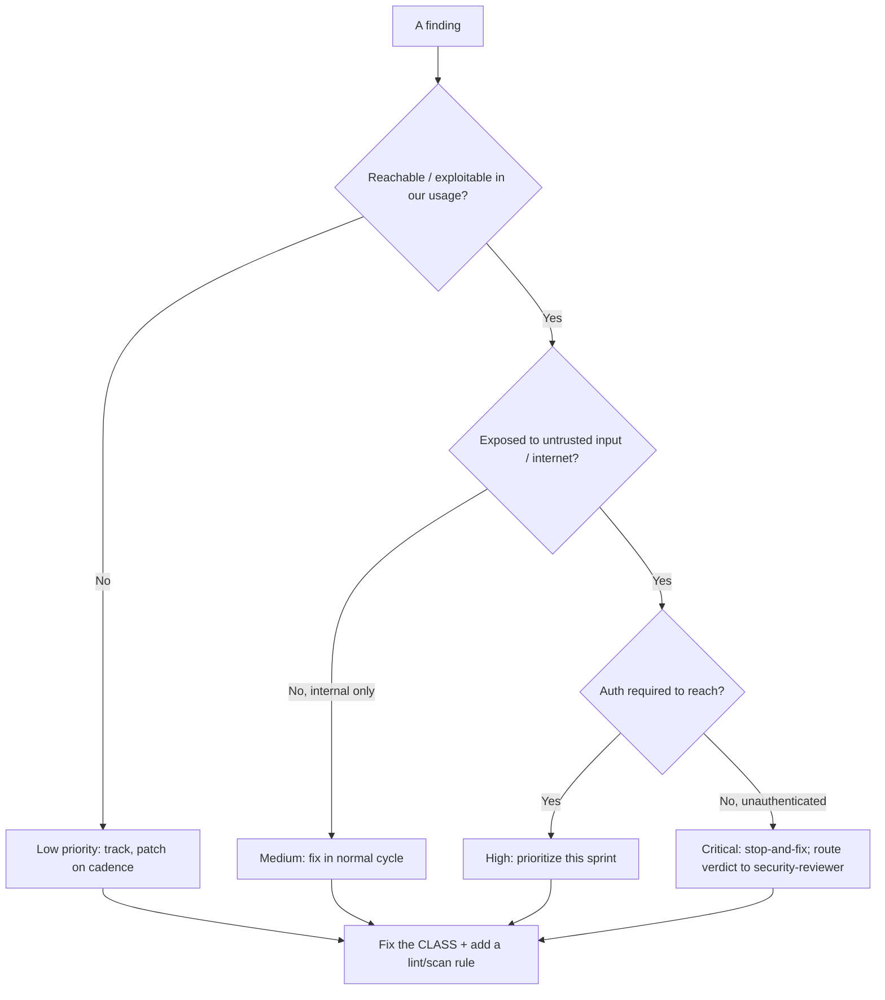
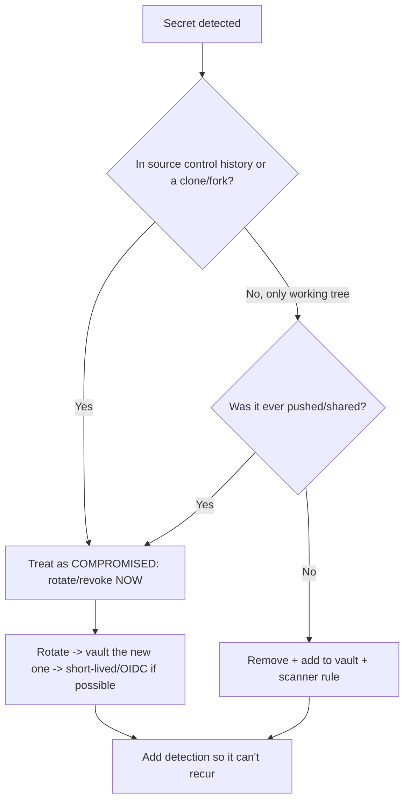
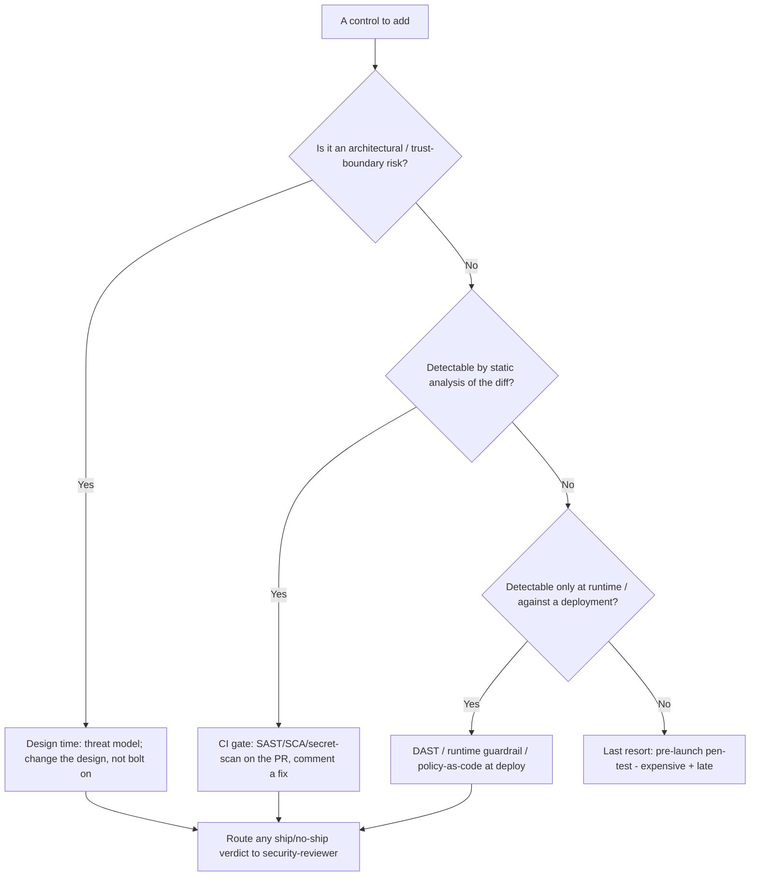
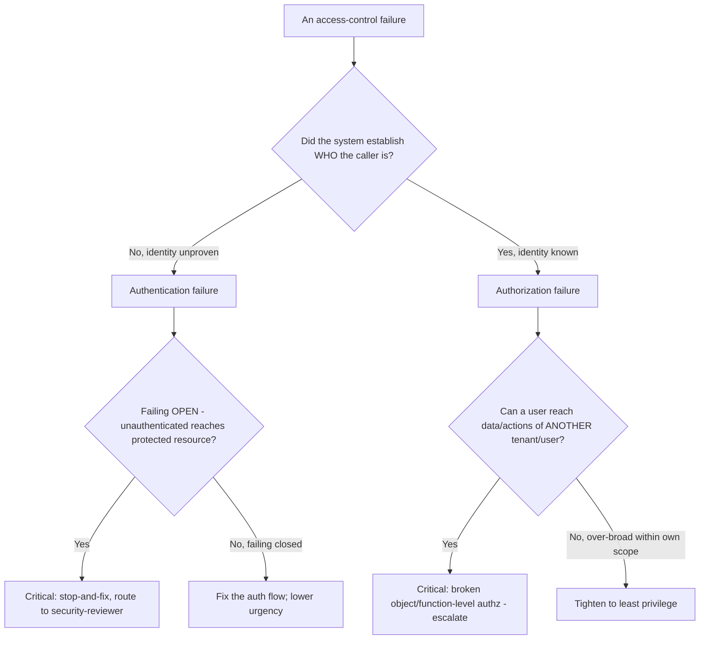
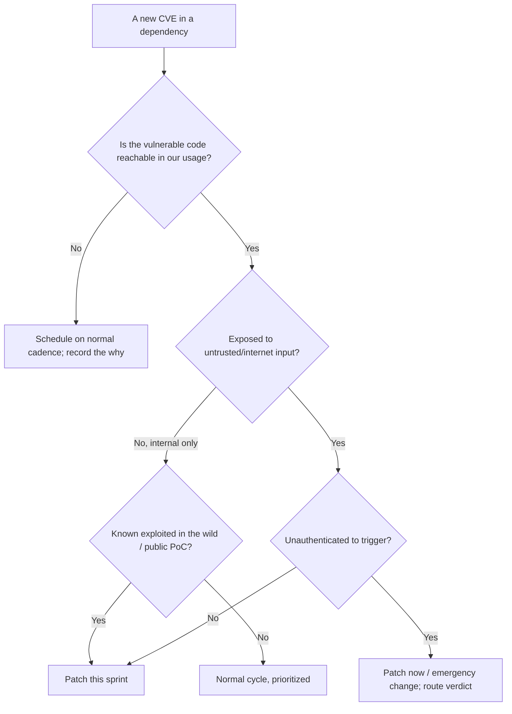
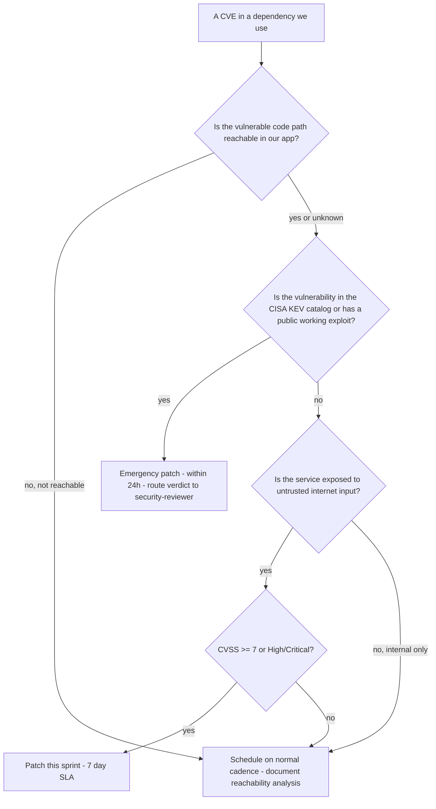
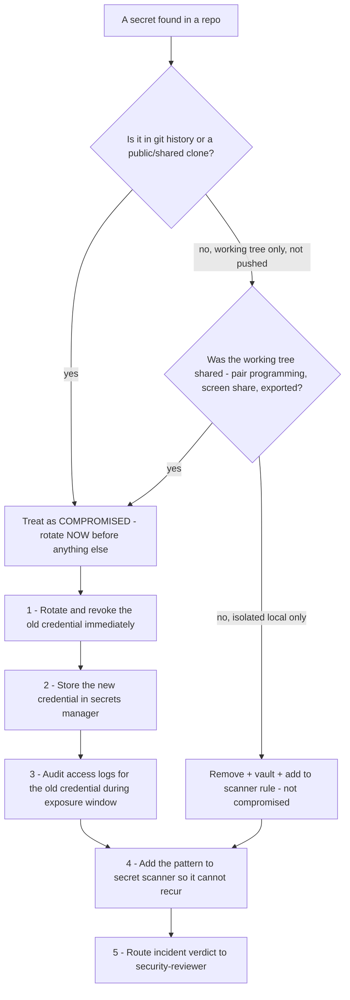
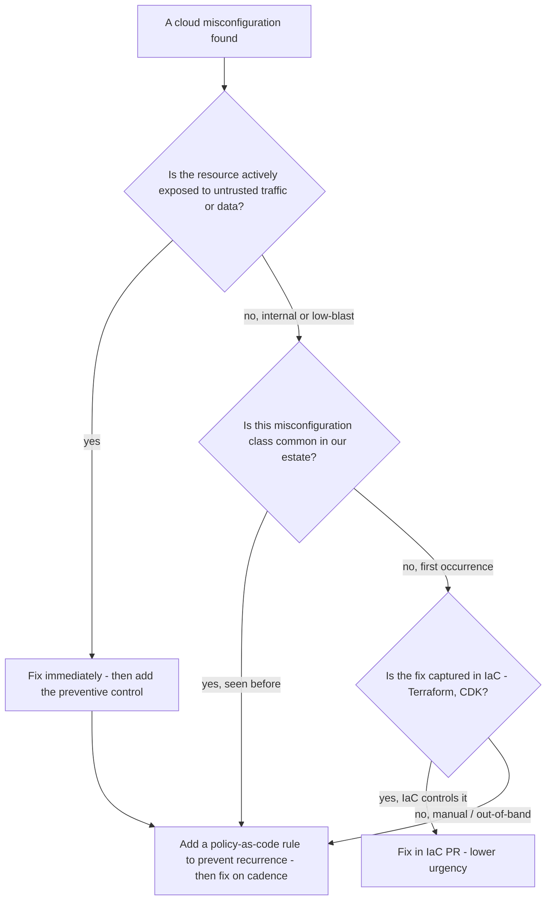

# Security Engineering — Decision Trees

_Decision trees + a dated capability map. Capability rows are `[verify-at-build]` — re-check against the vendor before quoting. Last reviewed: 2026-06-18 (OWASP Top 10 → 2025 edition)._

Traverse before triaging a finding or handling a secret. Remember: this team proposes; security-reviewer decides.

## Decision Tree: Vulnerability triage priority

Rank by exploitability and blast radius, not CVSS alone — then route the verdict.

_Every ship/no-ship call routes to `ravenclaude-core/security-reviewer`._

## Decision Tree: A secret was found — what now?

A committed secret is compromised. Deleting the commit is not remediation.

## Decision Tree: Where does this security control belong (shift-left placement)?

Place the control at the earliest, cheapest stage that can actually catch the class — earlier is cheaper, but the verdict still routes.

_Shift the detection left; never shift the verdict. The earlier you catch it, the cheaper the fix._

## Decision Tree: Auth-vs-authz failure triage

"Access denied" and "access wrongly granted" are different bugs with different blast radii — separate them before you fix.

_Authn = are you who you claim? Authz = are you allowed? A failing-open authn check and a cross-tenant authz hole are both critical; route the verdict._

## Decision Tree: Patch now vs schedule (exploitability gate)

Reachability and exposure decide urgency, not the CVSS number on the advisory.

_A 9.8 in an unreachable path waits; a 6.5 unauthenticated and exploited-in-the-wild does not. Verdict to security-reviewer._

## Capability map (dated — verify at build)

| Capability | 2026 state `[verify-at-build]` | Notes |
|---|---|---|
| OWASP Top 10 (web) | **2025 edition current** (verify Final vs RC at use) | 2021 superseded; new **A03 Software Supply Chain Failures** (expands 2021 A06 Vulnerable & Outdated Components) + **A10 Mishandling of Exceptional Conditions**; [owasp.org/Top10/2025](https://owasp.org/Top10/2025/), verified 2026-06-18 `[verify-at-use]` |
| SAST/SCA in CI | mature | Tune for signal; reachability where supported |
| Secret scanning | GitHub/GitLab native + tools | Pre-commit + CI + history scan |
| SLSA | v1.0 | Build levels; verify provenance on consume |
| CSPM | mature across clouds | Misconfig is #1 breach cause |
| Policy-as-code (OPA/Conftest, cloud policy) | GA | Preventive > detective; wire via terraform-iac |

## Decision Tree: Should a dependency update be emergency or scheduled?

**When this applies:** a new CVE advisory arrives for a dependency in use. The team must decide whether to drop everything and patch now, or schedule the update in the normal flow.

**Last verified:** 2026-06-05 against CISA KEV catalog guidance and supply-chain-security-engineer mandate.

**Rationale per leaf:**
- *Emergency patch* — exploited in the wild or public PoC means the attacker already has a recipe; exposure window must be zero.
- *Patch this sprint* — internet-exposed high/critical means a motivated attacker could develop an exploit; prioritize.
- *Schedule on cadence* — unreachable or low-impact can wait for the normal dependency update flow without meaningful risk increase.

**Tradeoffs summary:**

| Method | Cost / time | Blast radius | Approval gate? | Use when |
|---|---|---|---|---|
| Emergency patch | Interrupts current sprint | Release risk if rushed | Security-reviewer | KEV / public exploit |
| Sprint priority | Normal sprint overhead | Low | Sprint planning | Internet-exposed High/Critical |
| Scheduled update | Lowest effort | Lowest | PR review | Unreachable or low severity |

## Decision Tree: Discovered a secret in a repo — immediate response?

**When this applies:** a secret (API key, password, certificate private key, OAuth client secret) is found in a repository — in history, in a PR, or in a running config file. The response sequence matters.

**Last verified:** 2026-06-05 against GitHub secret scanning documentation and incident response best practices.

**Rationale per leaf:**
- *Compromised path* — git history is permanent and cloned; rotation is the only remediation; deleting the commit does not help (clones exist).
- *Safe remove* — a working-tree-only, never-pushed secret can be cleaned without incident, but the scanner rule must still be added.

**Tradeoffs summary:**

| Method | Cost / time | Blast radius | Approval gate? | Use when |
|---|---|---|---|---|
| Rotate immediately | High - interrupt ops | Rotation may require deploy | Security-reviewer verdict | In history or shared |
| Remove and vault | Low - no rotation | None | PR review | Working tree, never shared |

## Decision Tree: Cloud misconfiguration found — preventive control or reactive fix?

**When this applies:** a CSPM scan or access audit surfaces a cloud misconfiguration (open security group, public bucket, overly broad IAM role). The team decides whether to fix it reactively and/or add a preventive policy control.

**Last verified:** 2026-06-05 against cloud-security-engineer mandate and OPA/Conftest practice.

**Rationale per leaf:**
- *Fix immediately + add preventive control* — active exposure needs instant remediation; a preventive control prevents the same class from recurring.
- *Add policy + fix on cadence* — common misconfiguration classes are higher ROI for preventive policy than one-off reactive fixes.
- *Fix in IaC* — if IaC already controls the resource, fix it there; the IaC review is the gate.

**Tradeoffs summary:**

| Method | Cost / time | Blast radius | Approval gate? | Use when |
|---|---|---|---|---|
| Immediate fix + policy | High effort | Closes exposure | Security-reviewer | Actively exposed resource |
| Policy first, then fix | Medium - policy authoring | Prevents recurrence | PR review + policy review | Common class, low blast |
| Fix in IaC | Low - PR only | Lowest | PR review | IaC-controlled, not exposed |
