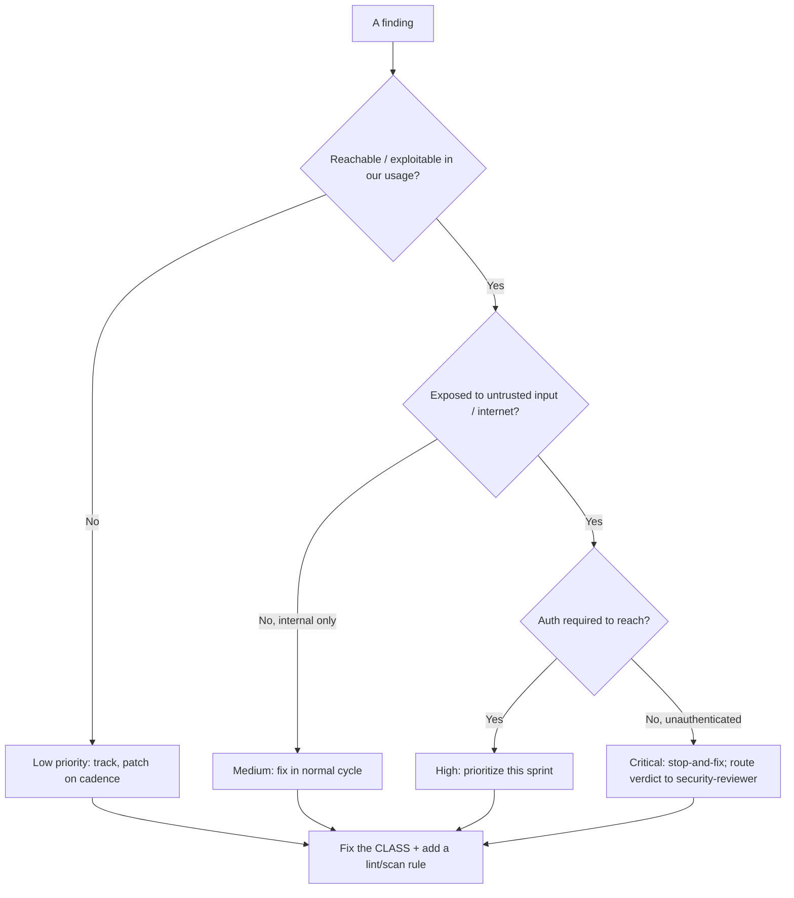
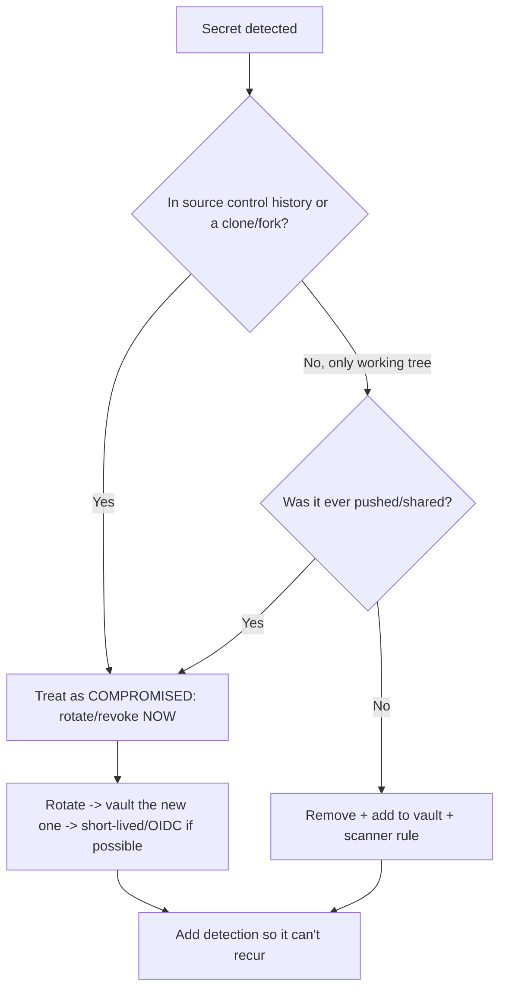

# Security Engineering — Decision Trees

_Decision trees + a dated capability map. Capability rows are `[verify-at-build]` — re-check against the vendor before quoting. Last reviewed: 2026-06-04._

Traverse before triaging a finding or handling a secret. Remember: this team proposes; security-reviewer decides.

## Decision Tree: Vulnerability triage priority

Rank by exploitability and blast radius, not CVSS alone — then route the verdict.

_Every ship/no-ship call routes to `ravenclaude-core/security-reviewer`._

## Decision Tree: A secret was found — what now?

A committed secret is compromised. Deleting the commit is not remediation.

## Capability map (dated — verify at build)

| Capability | 2026 state `[verify-at-build]` | Notes |
|---|---|---|
| OWASP Top 10 (web) | 2021 edition current | 2025 refresh tracked; verify at build |
| SAST/SCA in CI | mature | Tune for signal; reachability where supported |
| Secret scanning | GitHub/GitLab native + tools | Pre-commit + CI + history scan |
| SLSA | v1.0 | Build levels; verify provenance on consume |
| CSPM | mature across clouds | Misconfig is #1 breach cause |
| Policy-as-code (OPA/Conftest, cloud policy) | GA | Preventive > detective; wire via terraform-iac |
