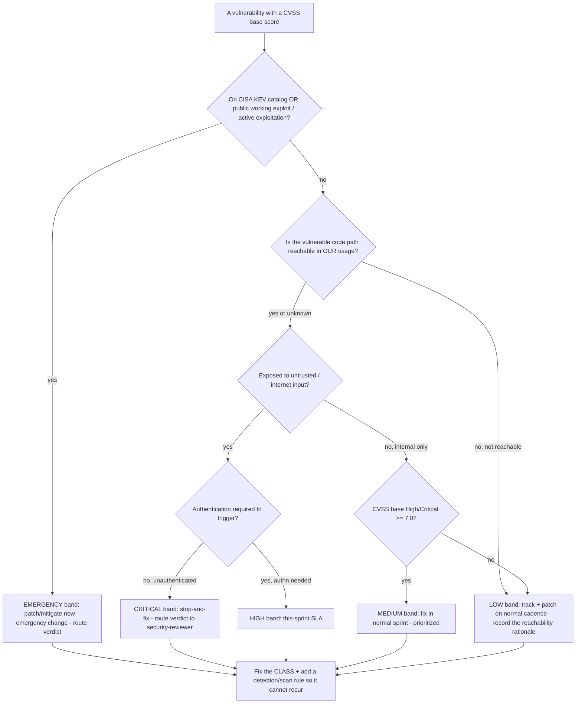

# Vulnerability Severity vs. Risk — Decision Tree

_A Mermaid decision tree for turning a raw severity score into a **risk-ranked, SLA-bearing** disposition. Complements the existing [`security-engineering-decision-trees.md`](security-engineering-decision-trees.md) trees ("Vulnerability triage priority", "Patch now vs schedule") by making the **CVSS-base → environmental/contextual → risk** translation explicit, with the SLA bands attached. Capability/standard rows are `[verify-at-use]` — re-check against the vendor/standard before quoting. Last reviewed: 2026-06-05._

> **This team proposes; it does not pronounce the verdict.** The tree ranks and proposes an SLA; the ship/no-ship / accept-the-risk call routes to `ravenclaude-core/security-reviewer`.

## Why this tree exists (the one-line thesis)

**A CVSS base score describes the vulnerability in the abstract; risk describes it in *your* deployment.** A 9.8 in an unreachable build-time path is genuinely lower risk than a 6.5 that is unauthenticated, internet-reachable, and on the CISA KEV catalog. Triage that keys on the base score alone over-spends on theater and under-spends on the exploited. This tree keys on **exploitability × exposure × reachability**, with the base score as a tie-breaker within a band.

## Decision Tree: Vulnerability severity → risk band + SLA

## Risk bands → recommended SLA (proposed, not binding)

| Risk band | Entry condition | Proposed SLA `[verify-at-use]` | Approval gate |
|---|---|---|---|
| **Emergency** | KEV-listed OR public working exploit / active exploitation | Patch or mitigate **now** (emergency change) | `security-reviewer` verdict |
| **Critical** | Reachable + internet-exposed + **unauthenticated** to trigger | **Stop-and-fix** (target ≤ 72h) | `security-reviewer` verdict |
| **High** | Reachable + internet-exposed, **authn** required | **This sprint** (target ≤ 7 days) | Sprint planning |
| **Medium** | Reachable, internal-only, CVSS base ≥ 7.0 | Normal sprint, prioritized | Sprint planning |
| **Low** | Unreachable, OR internal-only + CVSS base < 7.0 | Normal dependency-update cadence | PR review |

> SLA day-counts are a **defensible default to tune to the org's risk appetite**, not a standard-mandated number. Some regulated environments bind tighter (e.g. an internal policy may require KEV remediation inside the CISA BOD-22-01 federal window). Re-anchor the numbers on the org's own policy at use.

## How the inputs map to a standard (grounding)

- **CVSS base vs. environmental/temporal.** CVSS v4.0 (and v3.1 before it) explicitly separates the **Base** metric (intrinsic to the flaw) from **Environmental** (your deployment) and **Threat/Temporal** (exploit maturity) metric groups. This tree's "reachability / exposure / authn" questions are exactly the Environmental dimension, and "KEV / public exploit" is the Threat dimension — so risk-ranking off the base score alone is using one-third of the standard. Source: FIRST CVSS specification (`[verify-at-use]` — v4.0 is current; confirm the metric-group names against the spec).
- **KEV as the exploitation signal.** The CISA Known Exploited Vulnerabilities catalog is the authoritative "this is being exploited in the wild" feed; SSVC (Stakeholder-Specific Vulnerability Categorization, CISA/CMU-SEI) formalizes the same exploitation × exposure × impact decision the tree encodes. Both are the sanctioned alternatives to "sort by CVSS." Source: CISA KEV + SSVC.
- **EPSS as a probability complement.** EPSS (Exploit Prediction Scoring System, FIRST) gives a 0–1 probability that a CVE will be exploited in the next 30 days — a useful tie-breaker *within* a band where KEV is silent. Treat it as an input to the "public exploit likely?" judgment, not a replacement for reachability. Source: FIRST EPSS.

## When NOT to use this tree

- The finding is a **secret leak**, not a CVE — use the "A secret was found" / "Discovered a secret in a repo" trees in [`security-engineering-decision-trees.md`](security-engineering-decision-trees.md) (rotation, not severity-banding, is the response).
- The finding is a **cloud misconfiguration** — use the "Cloud misconfiguration found" tree (preventive-control vs reactive-fix is the axis there).
- You have **no reachability signal at all** and can't get one cheaply — default the finding to "yes/unknown reachable" (fail safe toward higher urgency) and record that you couldn't determine reachability.

**Sources (retrieved 2026-06-05):**
- FIRST — CVSS v4.0 specification (Base / Threat / Environmental metric groups) — https://www.first.org/cvss/v4-0/specification-document
- CISA — Known Exploited Vulnerabilities (KEV) Catalog — https://www.cisa.gov/known-exploited-vulnerabilities-catalog
- CISA — Stakeholder-Specific Vulnerability Categorization (SSVC) — https://www.cisa.gov/stakeholder-specific-vulnerability-categorization-ssvc
- FIRST — Exploit Prediction Scoring System (EPSS) — https://www.first.org/epss/
- CISA — Binding Operational Directive 22-01 (KEV remediation timeframes, federal) — https://www.cisa.gov/news-events/directives/bod-22-01-reducing-significant-risk-known-exploited-vulnerabilities

CVSS version, KEV contents, EPSS scores, and any policy-mandated SLA windows are volatile — `[verify-at-use]` against the current standard/catalog and the org's own policy before any deliverable.
