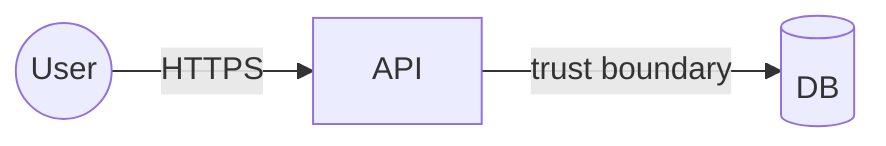

# Threat model — <feature/system> (<date>)

## Data-flow diagram

_Mark trust boundaries explicitly._

## STRIDE analysis
| Element / flow | Threat (STRIDE) | Likelihood×Impact | Treatment (mitigate/transfer/accept) | Owner |
|---|---|---|---|---|

## Accepted risks (route to security-reviewer)
| Risk | Why accepted | Sign-off |
|---|---|---|
