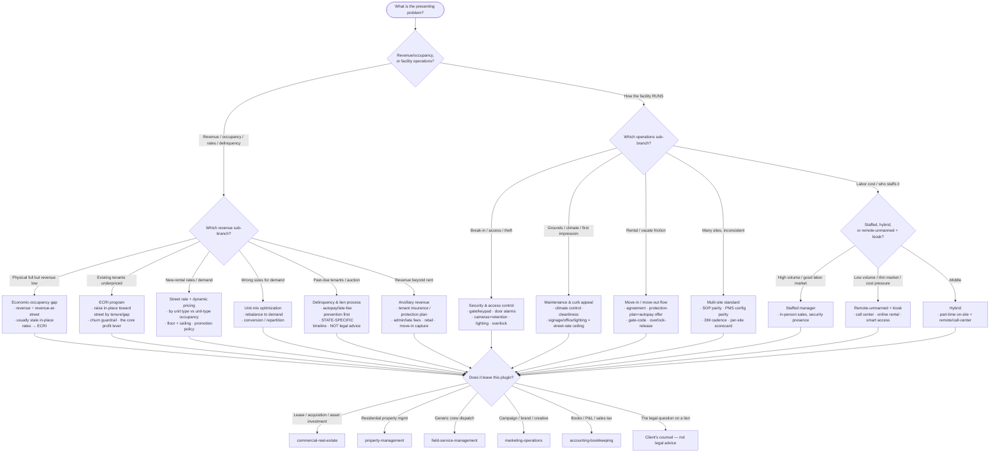

# Knowledge — Self-storage operations decision tree

> **Last reviewed:** 2026-07-09 · **Confidence:** Medium-High (consensus on the revenue-vs-operations framing, the physical-vs-economic occupancy split, ECRIs as the core profit lever, and the general shape of the delinquency-to-lien sequence; **specific state lien statutes, PMS/pricing-tool features, aggregator terms, and REIT benchmarks are volatile — re-verify with a state + retrieval date before a client commitment. Lien mechanics here are operational guidance, not legal advice.**).
> The first question in any self-storage engagement is "is this a *revenue* problem or an *operations* problem?" This is the decision tree the `self-storage-operations-lead` traverses to scope and route, and the `storage-revenue-and-occupancy-specialist` traverses to reach its revenue sub-branch — **before** prescribing a fix or a rate move.

The team's discipline: **name the branch before the fix; separate physical from economic occupancy before any rate call; flag state + retrieval date and "not legal advice" on any lien step.** The lease, the acquisition, and asset-level investment leave this plugin for `commercial-real-estate`; the residential variant is `property-management`; generic dispatch is `field-service-management`.

---

## Decision Tree: scope & route a self-storage engagement

Traverse top-to-bottom. Gate on **revenue vs operations** first, then the sub-branch.

---

## Occupancy: the two numbers you must not conflate

| Metric | Definition | What it tells you |
|---|---|---|
| **Physical / unit occupancy** | Units rented ÷ total units (or sq ft rented ÷ total sq ft) | How full the facility *looks* — the capacity picture |
| **Economic occupancy** | Actual revenue ÷ revenue if every occupied unit paid the current **street** rate | The *honest* number — how much discounting, stale in-place rates, and delinquents cost you |

A facility can be **95% physically full and 78% economic**. That ~17-point gap is money — almost always closable with an **ECRI** (raising stale in-place rates toward street) and delinquency discipline, not by discounting to fill the last few units.

---

## The operating-model sub-choice (after "it's an operations problem")

| Model | Fits when | Watch out for |
|---|---|---|
| **Staffed (on-site manager)** | Higher-volume site, in-person sales value, a labor market that supports it | Labor is the largest controllable cost; a single manager is a security and coverage single point of failure |
| **Hybrid (part-time on-site + call center / remote)** | Mid-volume; some in-person need but not full-time | Coverage gaps; clear ownership of what's on-site vs remote |
| **Remote-unmanned + kiosk** | Lower-volume or cost-pressured site; online rental + smart access + call center | Requires solid access control, cameras, and a call-center/aggregator funnel; not every market accepts it yet — re-verify local demand |

Labor is the largest controllable operating line — the model is where an operator wins or loses it. Don't default to "hire a manager"; weigh remote/kiosk against the site's volume and the local labor market.

---

## Seams (this plugin operates the storage BUSINESS — not the asset, the residential variant, or dispatch)

- **The lease, the acquisition, cap-rate / asset-level investment underwriting** → `commercial-real-estate` (own the asset, not operate the business).
- **Residential property management** (apartments, single-family, HOA) → `property-management`.
- **Generic mobile-crew dispatch / work-order routing** → `field-service-management` (this plugin owns storage maintenance in-house).
- **Paid-search / aggregator *campaign* strategy, brand, creative** → `marketing-operations` (this team decides promotion *economics*).
- **Bookkeeping, the P&L, sales tax on rent/insurance** → `accounting-bookkeeping`.
- **The actual legal question on a lien / notice / auction** → the client's counsel (this team gives operational guidance, not legal advice).

---

## Provenance

- Durable framing (physical-vs-economic occupancy, street-vs-in-place rate, ECRIs as the core profit lever, the general delinquency-to-lien sequence, the staffed/hybrid/remote operating-model split) is consensus self-storage operating practice, reviewed 2026-07-09 — **Medium-High confidence**.
- **State lien statutes, PMS/pricing-tool feature sets (Storable/SiteLink/storEDGE, Easy Storage Solutions, Yardi), aggregator terms (SpareFoot/Neighbor), auction-platform terms (StorageTreasures/Lockerfox), and REIT benchmarks (Public Storage, Extra Space, CubeSmart) are volatile** — treat any specific claim as a 2026-07 snapshot, attach a state and/or retrieval date, and re-verify with `ravenclaude-core/deep-researcher` before a client commitment. Lien mechanics are **operational guidance, not legal advice**.
