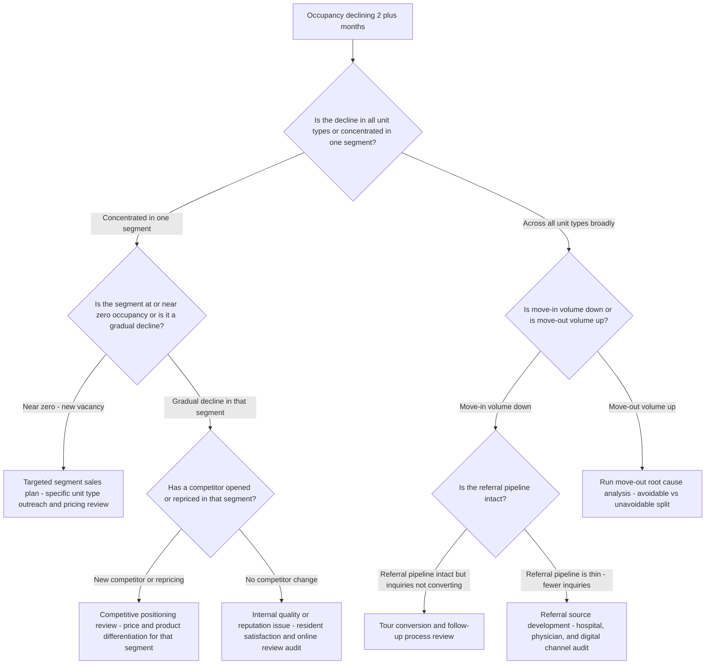
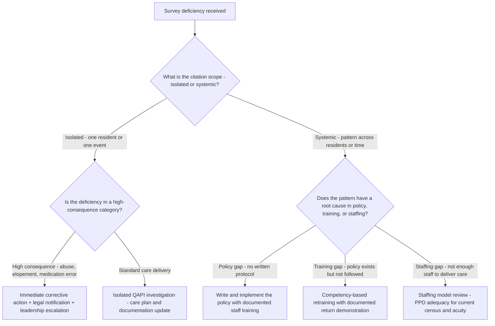
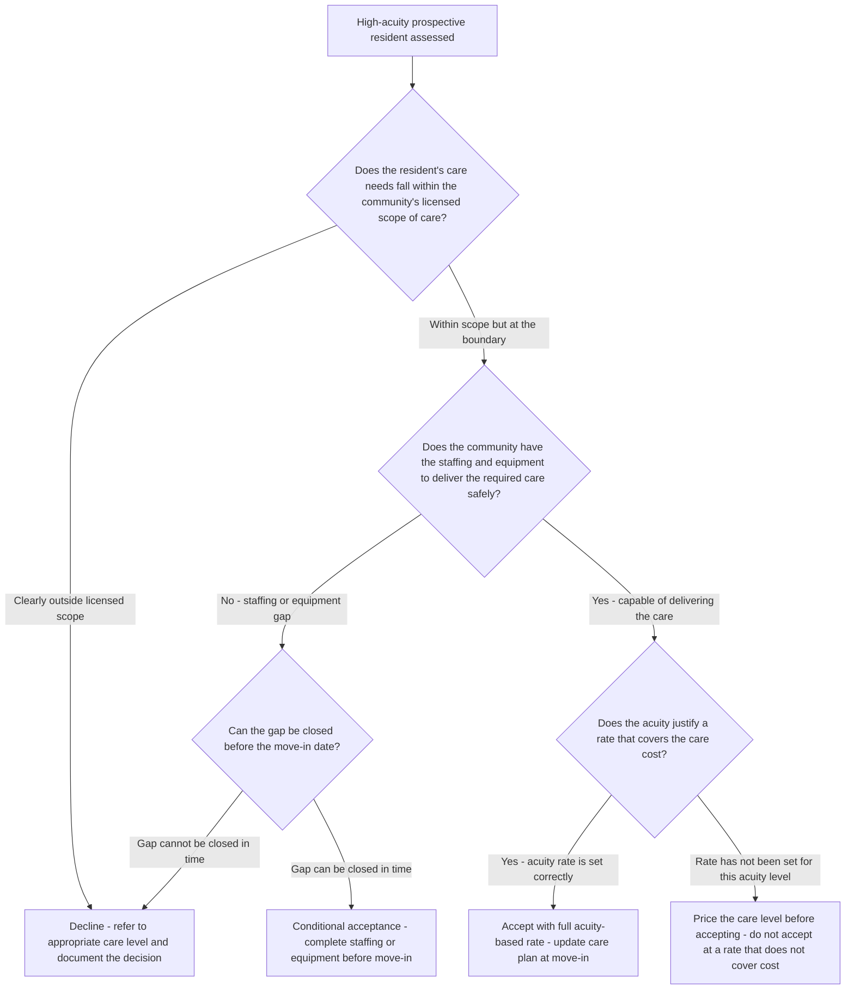

# Senior-care decision trees

Which analysis for which symptom — traverse top-to-bottom before picking a method.

## Decision Tree: Margin is slipping

1) Read census flow (§3 #1). 2) Check acuity pricing (§3 #2). 3) Check acuity-based staffing/PPD (§3 #3). 4) Read labor/turnover (§3 #6).

## Decision Tree: Occupancy is dropping

1) Decompose move-out vs move-in (§3 #1). 2) Read the sales funnel (§3 #7). 3) Fix the conversion/time-to-move-in leak.

## Decision Tree: A quality/survey concern

1) Read survey readiness and incident patterns (§3 #4). 2) Map to operations. 3) Route clinical/regulatory items to the qualified authority.

## How to read these trees

Traverse top-to-bottom and stop at the first matching branch — the order encodes the cheap-checks-before-expensive-checks discipline (§3). Each leaf names a skill, a specialist, or a house-opinion to apply. Never skip a higher branch because a lower one looks more interesting; a denominator, seasonal, or definitional artifact masquerades as a finding more often than not.

## Decision Tree: Which skill for which task

- **Manage census flow** → use when: Read census as a flow of move-ins, move-outs, and length of stay, not a point number, so the right lever is pulled. ([`../skills/manage-census-flow/SKILL.md`](../skills/manage-census-flow/SKILL.md))
- **Price to acuity** → use when: Build acuity-based pricing that captures the care cost by level, instead of a flat rate, to protect margin. ([`../skills/price-to-acuity/SKILL.md`](../skills/price-to-acuity/SKILL.md))
- **Staff to acuity-based PPD** → use when: Build a staffing model on acuity-weighted hours-per-resident-day, not a fixed ratio, so labor matches need. ([`../skills/staff-to-acuity-ppd/SKILL.md`](../skills/staff-to-acuity-ppd/SKILL.md))
- **Read quality and compliance** → use when: Read survey readiness, incidents/falls, and quality measures as existential operational risk, as decision-support. ([`../skills/read-quality-and-compliance/SKILL.md`](../skills/read-quality-and-compliance/SKILL.md))
- **Quantify labor and turnover** → use when: Read labor cost, agency reliance, and turnover as quantified unit economics, since they drive both margin and quality. ([`../skills/quantify-labor-and-turnover/SKILL.md`](../skills/quantify-labor-and-turnover/SKILL.md))

## Decision Tree: Which specialist owns this

- **The engagement** → [`senior-care-lead`](../agents/senior-care-lead.md)
- **Quality and compliance** → [`clinical-care-compliance-specialist`](../agents/clinical-care-compliance-specialist.md)
- **Census** → [`census-occupancy-strategist`](../agents/census-occupancy-strategist.md)
- **The numbers** → [`senior-care-finance-analyst`](../agents/senior-care-finance-analyst.md)

When two leaves apply, route to the **lead** first to scope and sequence — overlapping symptoms usually mean two drivers at once, and the lead keeps the analysis from collapsing into a single-cause story.

## Decision Tree: Which house-opinion gates the call

Before picking any method, check whether one of the standing biases (§3) already decides the framing:

1. Census is the revenue engine — manage the flow, not just the number — if this is in question, apply §3 #1 before any method.
2. Price to acuity, not a flat rate — if this is in question, apply §3 #2 before any method.
3. Staff to acuity-based hours-per-resident-day, not a fixed ratio — if this is in question, apply §3 #3 before any method.
4. Quality and compliance are the license and the reputation — track them — if this is in question, apply §3 #4 before any method.
5. Length of stay drives the economics — and it's shrinking — if this is in question, apply §3 #5 before any method.
6. Labor cost and turnover are a unit-economics issue, not just HR — if this is in question, apply §3 #6 before any method.
7. Move-in friction and sales conversion are the census levers — if this is in question, apply §3 #7 before any method.
8. Date and source any rate, benchmark, or regulation figure — if this is in question, apply §3 #8 before any method.

## Escalation & guardrails

- Anything touching client PII / regulated records → stop and route to `ravenclaude-core` `security-reviewer`.
- Any external figure entering a deliverable → carry a source URL + retrieval date, or mark it `[unverified — training knowledge]` / `[ESTIMATE]` (§3, final house opinion).
- A recommendation ships only with an owner, a date, and an expected metric movement.
## Sourcing note

Figures in this file are from the author's domain knowledge and are marked `[unverified — training knowledge]` or `[ESTIMATE]` at point of use. Validate against a primary source before putting any figure in a client deliverable (§3 cite-or-mark rule).

---

## Decision Tree: Senior Care — Why Occupancy Is Declining

**When this applies:** Community occupancy has declined for 2+ consecutive months or is more than 5 percentage points below the prior-year same period. The census-occupancy-strategist or senior-care-lead needs to identify the primary driver before committing to a response.

**Last verified:** 2026-06-05 against standard senior care census management frameworks.

**Rationale per leaf:**
- *Targeted segment sales plan* — a segment-specific vacancy responds to a segment-specific intervention; applying a broad community discount obscures the problem.
- *Run move-out root cause analysis* — avoidable move-outs are the highest-leverage retention intervention; the root cause must be known before a fix is applied.
- *Competitive positioning review* — a competitor event (new opening, repricing) changes the market the community is operating in; the response is positioning, not just promotion.
- *Internal quality or reputation issue* — a gradual decline with no external cause points to an internal experience problem; satisfaction data and review audits reveal it.
- *Tour conversion and follow-up process review* — if referrals are arriving but not converting, the problem is in the sales execution, not the pipeline.
- *Referral source development* — a thin inquiry pipeline is a marketing and referral relationship problem; the fix is upstream from sales.

**Tradeoffs summary:**

| Method | Cost / time | Blast radius | Approval gate? | Use when |
|---|---|---|---|---|
| Segment-targeted sales plan | Low-medium - focused effort | Small | Executive Director | Single-segment vacancy |
| Move-out root cause analysis | Low - process change | Small | Executive Director | Move-out rate elevated |
| Competitive repositioning | Medium - pricing and marketing | Large - affects whole community | Owner approval | Competitor event confirmed |
| Internal quality improvement | High - operations change | Large | Executive Director + owner | Satisfaction data shows quality gap |

---

## Decision Tree: Senior Care — Responding to a Surprise Survey Deficiency

**When this applies:** The community has received a survey deficiency citation (state or CMS) that was unexpected — either a new issue or a recurrence. The clinical-care-compliance-specialist and senior-care-lead need to determine the correct response track before drafting the Plan of Correction.

**Last verified:** 2026-06-05 against CMS State Operations Manual and standard ALF survey response practice.

**Rationale per leaf:**
- *Immediate corrective action + legal notification* — high-consequence citations (abuse, elopement, serious medication error) require same-day response including notification to ownership, legal counsel, and any mandated state reporting.
- *Isolated QAPI investigation* — isolated standard-care deficiencies are addressed through the QAPI (Quality Assurance and Performance Improvement) process with a specific care plan and documentation update.
- *Write and implement the policy* — a deficiency with no written policy behind it requires a policy and procedure creation with documented training; the Plan of Correction cannot reference a policy that does not yet exist.
- *Competency-based retraining* — a policy exists but was not followed; the fix is competency verification, not policy rewriting — document the retraining with return demonstration records.
- *Staffing model review* — a deficiency pattern driven by inadequate staffing requires a structural fix; a training response to an understaffing problem will not eliminate the deficiency recurrence.

**Tradeoffs summary:**

| Method | Cost / time | Blast radius | Approval gate? | Use when |
|---|---|---|---|---|
| Immediate escalation | Urgent - same day | Large - ownership and legal | Executive Director + owner | High-consequence citation |
| QAPI isolated investigation | Low - focused review | Small | Director of Nursing | Isolated standard-care deficiency |
| Policy creation and training | Medium - 2-4 weeks | Medium | Executive Director | Policy gap identified |
| Staffing model review | High - 4-8 weeks | Large - budget and hiring | Owner approval | Staffing gap is root cause |

---

## Decision Tree: Senior Care — Should the Community Accept a High-Acuity Move-In?

**When this applies:** A prospective resident presents with care needs that are at or near the community's clinical capability boundary. The clinical-care-compliance-specialist and senior-care-lead need to decide whether to accept, conditionally accept, or decline the placement before the move-in assessment is finalized.

**Last verified:** 2026-06-05 against standard assisted-living clinical admissions practice and state ALF scope-of-care regulations.

**Rationale per leaf:**
- *Decline - refer to appropriate care level* — accepting a resident beyond the licensed scope of care is a regulatory violation; the referral is both an ethical and a legal obligation.
- *Conditional acceptance - complete gap first* — a staffing or equipment gap that can be resolved before move-in allows acceptance; the condition must be in writing and met before the resident arrives.
- *Accept with full acuity-based rate* — within-scope, capable care delivery at the correct rate is the standard acceptance path; the care plan is the execution document.
- *Price the care level before accepting* — accepting a high-acuity resident at a rate that does not cover the care cost creates a margin problem and a care-quality risk simultaneously.

**Tradeoffs summary:**

| Method | Cost / time | Blast radius | Approval gate? | Use when |
|---|---|---|---|---|
| Accept at correct acuity rate | Low - standard intake process | Small | Director of Nursing + Executive Director | Within scope and capability, rate is correct |
| Conditional acceptance | Medium - preparation required | Medium - delay to move-in | Director of Nursing + owner | Gap identified but closeable |
| Decline and refer | Low - one conversation | None - no commitment | Director of Nursing + Executive Director | Outside scope or gap not closeable |
| Price before accepting | Low - rate modeling | Small | Executive Director + owner | Acuity rate not yet established for this level |
