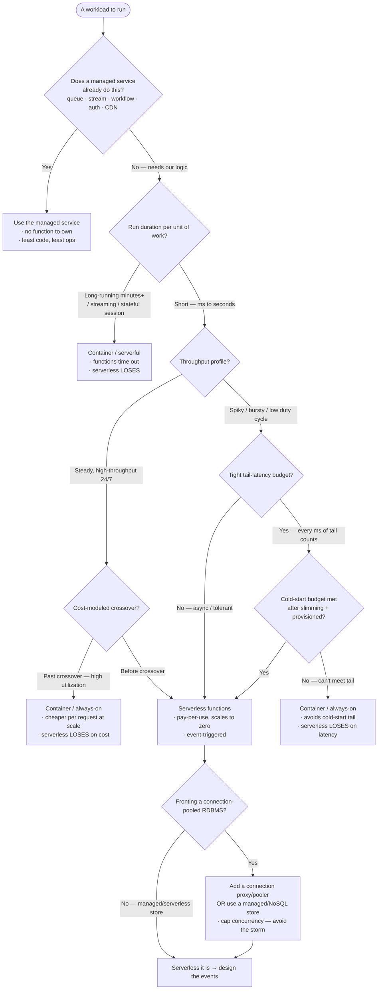
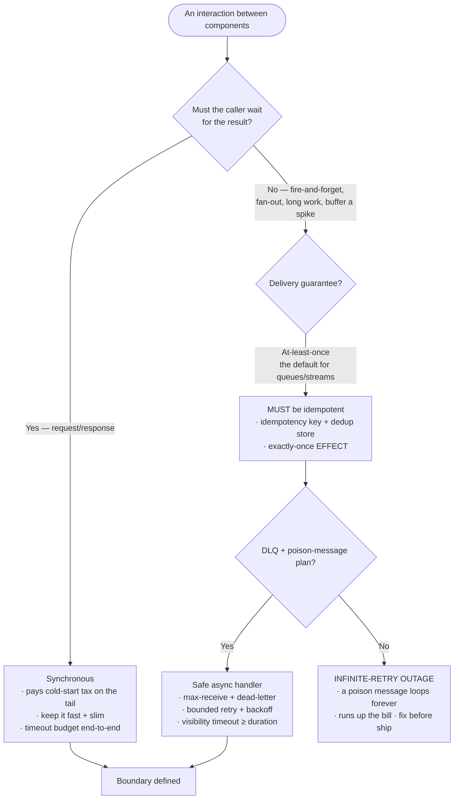
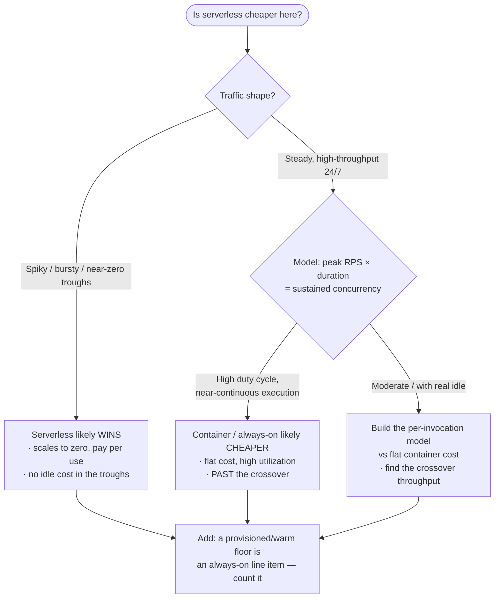

# Knowledge — Serverless engineering decision tree

> **Last reviewed:** 2026-07-13 · **Confidence:** Medium-High (consensus on the durable framing — the serverless-vs-container fit criteria, orchestration-vs-choreography, at-least-once/idempotency, the DLQ requirement, and the steady-vs-spiky cost crossover; **specific provider concurrency caps, timeouts, package-size limits, and per-invocation prices are volatile and provider-specific — this doc stays generic; re-verify exact numbers with `ravenclaude-core/deep-researcher` before a commitment**).
> The recurring serverless questions are "serverless vs container vs managed service?", "orchestration or choreography?", "sync or async (and is it idempotent)?", and "is serverless cheaper here or do we cross over?". This is the decision tree the two agents traverse **before** answering, plus the trade-off tables and the seams to adjacent plugins.

The team's discipline: **serverless is a trade, not a default** — traverse the tree, name the workload profile where it loses, design around events/contracts (never a synchronous call graph), make every async path idempotent with a DLQ, and model the cost crossover. Provider-specific IaC and exact limits/prices **leave this layer** for `aws-cloud` / `gcp-cloud` / `azure-cloud` and for research.

---

## Decision Tree A: serverless vs container vs managed-service

Traverse top-to-bottom. **The "wrong choice" leaves are the point** — name them out loud.



**Where serverless LOSES (say it out loud):** long-running/streaming/stateful work (times out), steady high-throughput past the cost crossover (containers cheaper), tight-tail-latency paths cold start can't meet, and connection-pool-hungry RDBMS behind high concurrency (connection storm). Serverless wins on **spiky, short, stateless, event-driven, low-duty-cycle** work.

---

## Decision Tree B: orchestration vs choreography

```mermaid
graph TD
  M([Multi-step process]) --> STATE{Need a visible end-to-end<br/>state or compensation/rollback?}

  STATE -->|Yes — a saga, refunds,<br/>"where is this order?"| ORCH[Orchestration<br/>· state machine / workflow<br/>· one place owns the flow<br/>· easy to observe · compensations]
  STATE -->|No — loose reactions| COUPLE{How coupled are the steps?}

  COUPLE -->|Independent fan-out,<br/>services react on their own| CHOREO[Choreography<br/>· event bus, pub/sub<br/>· low coupling, easy to add consumers<br/>· harder to trace end-to-end]
  COUPLE -->|A few ordered steps,<br/>some shared state| ORCH

  ORCH --> TRADE1[Trade-off: coupling to the orchestrator,<br/>a central thing to run + scale]
  CHOREO --> TRADE2[Trade-off: no single view of the flow,<br/>emergent behavior, distributed tracing is essential]
```

> **The tell:** if you need to answer *"where is this transaction and can I roll it back?"* → **orchestration** (state machine / saga). If it's *"react to this event however you like"* fan-out → **choreography** (event bus). Both are valid; the failure is picking by fashion instead of by whether you need a visible, compensable flow.

---

## Decision Tree C: sync vs async + the idempotency/DLQ gate



**The two rules this tree enforces:** (1) every async handler is **idempotent** (delivery is at-least-once — exactly-once *effect* via a key + dedup store); (2) every queue has a **DLQ + max-receive** (no DLQ = infinite-retry outage). A sync path pays the cold-start tail — budget it.

---

## Decision Tree D: cost crossover — steady vs spiky



> **Per-invocation model (generic — unit prices volatile):** `cost ≈ invocations × (duration × memory-price) + invocations × request-price + data-transfer + downstream + any provisioned-concurrency floor`. Serverless wins at **low duty cycle**; at **high steady utilization** an always-on instance wins per request. Model it — don't ship "serverless is cheaper" as a slogan.

---

## Trade-off table — compute shape

| Shape | Sweet spot | Watch out for |
|---|---|---|
| **Serverless / FaaS** | Spiky/bursty, short, stateless, event-driven, low duty cycle | Cold-start tail; per-invocation cost at high steady scale; concurrency limits; RDBMS connection storms |
| **Container / serverful** | Steady high-throughput, long-running, stateful, tight tail-latency | Always-on cost at idle; you own scaling + patching; over-provisioning at low duty cycle |
| **Managed service** | The capability already exists (queue, stream, workflow, auth, CDN) | Vendor coupling; config-not-code limits; still needs an integration + failure plan |

## Trade-off table — orchestration vs choreography

| | Orchestration (state machine / workflow) | Choreography (event bus / pub-sub) |
|---|---|---|
| **Best for** | Sagas, compensation/rollback, a visible end-to-end state | Loose fan-out, independent reactions, easy consumer addition |
| **Coupling** | Steps couple to the orchestrator | Low — services only know events |
| **Observability** | Central, easy to see "where is it?" | Emergent — distributed tracing is mandatory |
| **Failure mode** | Orchestrator is a thing to run/scale | No single view; hidden cycles; harder rollback |

## Trade-off table — event-driven patterns (pointers, detail in patterns doc)

| Pattern | Solves |
|---|---|
| **Outbox / transactional event** | Dual-write (DB write + event emit drifting under failure) |
| **Claim-check** | Large payloads through a size-limited bus (store the blob, pass a reference) |
| **Fan-out / fan-in** | Parallel work + aggregation |
| **Saga** | A distributed transaction with compensation (via orchestration or choreography) |
| **Event-carried state transfer** | Consumers avoid a callback by carrying needed state in the event |

---

## Seams (serverless engineering is provider-neutral PATTERNS, not IaC)

- **Provider-specific IaC & service specifics** (the actual Lambda / Cloud Functions / Azure Functions resource, IAM, VPC, the managed service config, the DLQ/proxy resource) → `aws-cloud` / `gcp-cloud` / `azure-cloud`.
- **The streaming platform itself** (Kafka / Kinesis topic & partition design, consumer groups, stream processing, ordering) → `data-streaming-engineering`. This team consumes a stream *as an event source*; it doesn't run the platform.
- **The serverful alternative** (long-running services, stateful backends, the always-on API) → `backend-engineering`.
- **The deploy pipeline** (CI/CD, packaging in the pipeline, canary/blue-green, IaC apply) → `devops-cicd`.
- **Tracing / SLOs / alerting as a discipline** (the observability platform and the SLO math) → `observability-sre`.
- **Cloud cost governance at the org level** (budgets, tagging, showback) → `finops-cloud-cost`.

---

## Provenance

- The durable framing — serverless-vs-container fit criteria (duration/throughput/statefulness/latency), orchestration-vs-choreography, at-least-once delivery → idempotency, the DLQ/poison requirement, the outbox for dual-write, and the steady-vs-spiky cost crossover — is consensus in the serverless/event-driven-architecture literature (cloud well-architected guidance, EIP/enterprise-integration patterns, serverless practitioner writing), reviewed 2026-07-13. **High confidence** on the concepts.
- **Provider-specific numbers are deliberately absent here** — concurrency caps, timeouts, package-size limits, memory ranges, and per-invocation prices are volatile and vary by provider/region. Re-verify with `ravenclaude-core/deep-researcher` before a client or board commitment. See [`serverless-engineering-patterns-2026.md`](serverless-engineering-patterns-2026.md) for the dated patterns reference.
