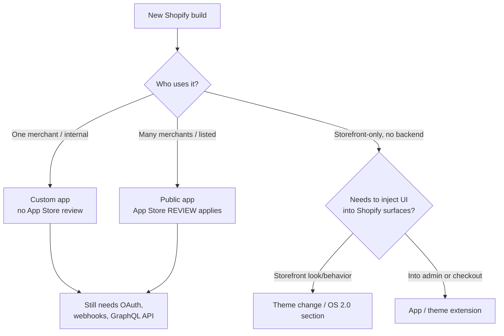
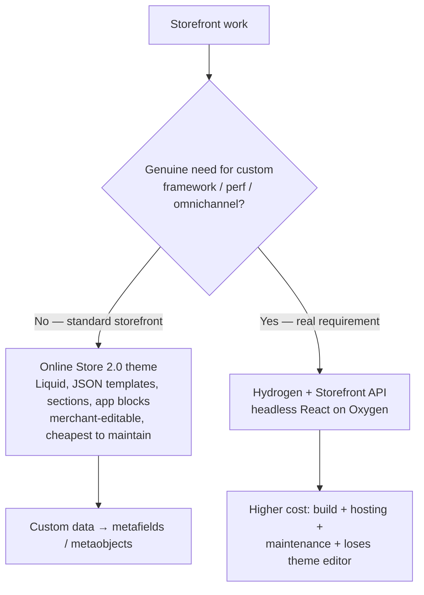
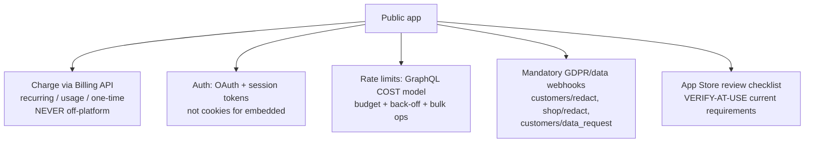

# Shopify App & Theme Engineering — Decision Trees

> Last reviewed: 2026-07-20. Confidence: **HIGH** for the durable platform architecture (app-type choice, Functions-over-scripts, embedded model, rate-limit cost model, review requirements as a category); **VERIFY-AT-USE** for every version-specific fact (current Admin API version, REST deprecation timeline, `checkout.liquid`/script-tag restriction dates, specific rate-limit numbers, exact App Store review checklist items). Shopify ships API versions quarterly — re-verify against current Shopify.dev docs before a commitment.

The agents traverse these before naming a build type or surface. Do not brand-match "headless" / "Functions" to a request a theme or a simpler path serves.

## 1. App type — who uses it, does it ship to the App Store?

**Rule:** custom for one merchant, public (with review) for many, theme/extension when no backend is needed. Public-app review is a design constraint, not an afterthought.

## 2. Customization surface — the current-generation choice

| Need                                   | Current-generation way              | The dead end (do NOT use)          |
| -------------------------------------- | ----------------------------------- | ---------------------------------- |
| Discount / shipping / payment / validation logic | **Shopify Functions**       | Script tags, off-platform hacks    |
| Checkout UI changes                    | **Checkout UI extensions**          | `checkout.liquid` (restricted)     |
| Embedded admin UI                      | **App Bridge + Polaris**            | Custom iframe chrome               |
| Reacting to store events               | **Webhooks** (HMAC-verified)        | Polling the API in a loop          |
| Reading/writing admin data             | **Admin GraphQL API**               | REST (legacy, deprecating)         |
| Large reads/writes                     | **Bulk operations**                 | Tight pagination loop (throttles)  |

**Rule:** build with the platform's grain. The "clever" bypass fails review and breaks on the next API version. (Deprecation dates: verify-at-use.)

## 3. Storefront — theme vs headless

**Rule:** a theme is the default and is enough more often than teams admit. Headless (Hydrogen) is a real cost — earn it with a requirement, don't default to it for novelty.

## 4. Data model — metafields vs a shadow store

| Custom data                         | Store it as                      |
| ----------------------------------- | -------------------------------- |
| Extra fields on product/customer/order | **Metafields** (typed, namespaced) |
| Structured standalone objects       | **Metaobjects**                  |
| App-internal state / large volumes  | App's own DB (with a reason)     |

**Rule:** don't invent a shadow database for what metafields/metaobjects hold natively. Decide storefront exposure explicitly.

## 5. Commercial + safety envelope (public apps)

**Rule:** billing on-platform, session-token auth, rate limits as a design input, GDPR webhooks from day one. Missing any of these fails review. (Exact rules/limits: verify-at-use.)

## 6. Seams to adjacent plugins

| Boundary                                              | Owner                            |
| ----------------------------------------------------- | -------------------------------- |
| Merchandising / retention / lifecycle strategy the app serves | `ecommerce-dtc`          |
| Generic, non-Shopify payment scaffold                 | `web-commerce`                   |
| Off-Shopify payment rails / PSP integration           | `fintech-payments-engineering`   |
| Generic React component/state craft (inside Hydrogen) | `frontend-engineering`           |
| Pure visual / interaction / IA design                 | `web-design`                     |
| Deep OAuth / session / token hardening                | `auth-identity`                  |
| Review-readiness test pass                            | `qa-test-automation`             |
