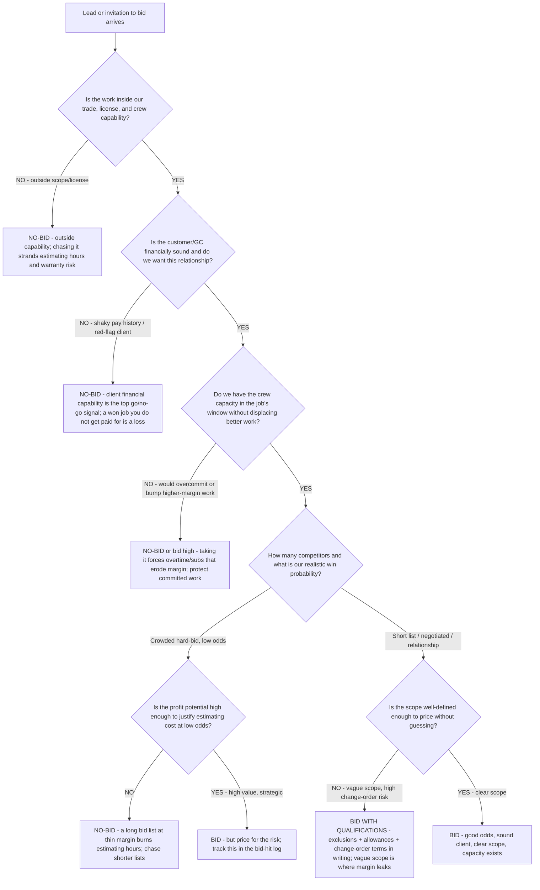

# Trades bid / no-bid decision tree — should we estimate this job at all?

**Last reviewed:** 2026-06-05 · **Confidence:** medium (construction estimating + bid-management sources, web-verified this date). Bid-hit ratios and the cost-of-bidding figures are segment-dependent — they carry inline `[verify-at-use]` markers and must be calibrated to the contractor's trade, market, and estimating capacity before any deliverable (CLAUDE.md §3 #8).

> Canonical decision tree for the `estimating-specialist` (the bid) with a routing assist from the `trades-engagement-lead`. Traverse top-to-bottom **before** committing estimating hours to a job. The point is that **estimating is not free** — takeoff, plan review, and the estimator's hours are real cost, and the opportunity cost of a skipped better bid is real too. Contractors who win consistently **bid fewer jobs and qualify each one** against a fixed framework before the estimate starts. This is decision-support for the contractor, not a guarantee of award (CLAUDE.md §2).

---

## When this applies

A lead or invitation-to-bid arrives and someone is about to start a takeoff. Use this before the estimator spends hours: a go/no-go gate that protects estimating capacity for the jobs you can actually win profitably. Common triggers: an unsolicited plan set, a GC invitation, a repeat-customer request, a public-bid posting.

## The tree

## Rationale per leaf

- **No-bid (outside capability)** — chasing work outside the trade/license strands estimating hours and imports warranty and code risk; route adjacent work to a sub or decline.
- **No-bid (client)** — **client financial capability is consistently cited as the top go/no-go factor.** A job you win but don't collect on is worse than one you never bid. Vet pay history and the GC's funding before the takeoff.
- **No-bid / bid-high (capacity)** — bidding work you can't staff without overtime or subs quietly erodes margin and risks committed jobs; if you must bid to keep the relationship warm, price the strain in.
- **Selective bid (low odds, high value)** — a crowded hard-bid list at thin margin is the classic estimating-hour sink; only chase it when the value or strategic fit justifies the long odds, and log the outcome.
- **Bid with qualifications (vague scope)** — vague scope is where change orders and disputes are born; bid it only with written exclusions, allowances, and change-order terms so out-of-scope work is captured, not absorbed (ties to the change-order discipline rule and §3 #4).
- **Bid (clean)** — short list, sound client, clear scope, real capacity: this is the job worth your estimating hours.

## The bid-hit ratio (the number this tree protects)

Track **bid-hit ratio** = bids submitted : jobs awarded. Industry rules-of-thumb [verify-at-use]:

| Work type | Healthy bid-hit ratio | Read |
|---|---|---|
| Hard-bid (competitive, public) | ~5:1 | Win 1 of every ~5; public-sector should stay at most ~10:1 — above ~11:1 estimating cost outruns the profit |
| Negotiated / relationship-driven | ~3:1 or better | Short lists and repeat clients should convert far more often |

A ratio that's *too high* (bidding many, winning few) means estimating hours are being spent on the wrong jobs — tighten this go/no-go gate. A ratio that's *too low* (winning almost everything) can mean you're leaving money on the table (pricing too low). Track job type, customer, job size, and competitor set in the bid-hit log to find the segments where your odds are highest.

## Gotchas

- **A high win rate is not automatically good** — winning everything can mean underpricing. Read bid-hit alongside realized job margin, not alone.
- **Estimating cost is real** — count estimator hours + takeoff + plan review + the opportunity cost of the skipped bid when judging whether a bid was "worth it" (§3 #8: cost the inputs).
- **Don't let a relationship override the client-solvency gate** — a beloved repeat client who can't pay is still a no-bid.

## Escalation & guardrails

- A pricing/markup question once the bid is a go → [`estimating-specialist`](../agents/estimating-specialist.md) + [`trades-markup-vs-margin-decision-tree.md`](trades-markup-vs-margin-decision-tree.md).
- Capacity/scheduling conflict surfaced by Q3 → [`field-operations-specialist`](../agents/field-operations-specialist.md).
- Every figure entering a deliverable carries a source URL + retrieval date or an `[unverified — training knowledge]` / `[ESTIMATE]` mark (CLAUDE.md §3 #8).

## Sources (retrieved 2026-06-05)

- ConstructConnect — *Bid or No-Bid: How Contractors Choose Which Projects to Pursue* (the six go/no-go factors; client capability as a top signal): https://www.constructconnect.com/blog/bid-or-no-bid-how-contractors-choose-which-projects-to-pursue
- Sunflower Bank — *Is Your "Bid-Hit" Ratio Okay?* (5:1 hard-bid, ~10:1 public ceiling): https://www.sunflowerbank.com/about-us/resource-articles/is-your-lsquo;bid-hit-rsquo;-ratio-okay
- DowntoBid — *Bid-Hit Ratio: Every Construction Company's Drive To Success* (3:1 negotiated, tracking by segment): https://downtobid.com/blog/bid-hit-ratio
