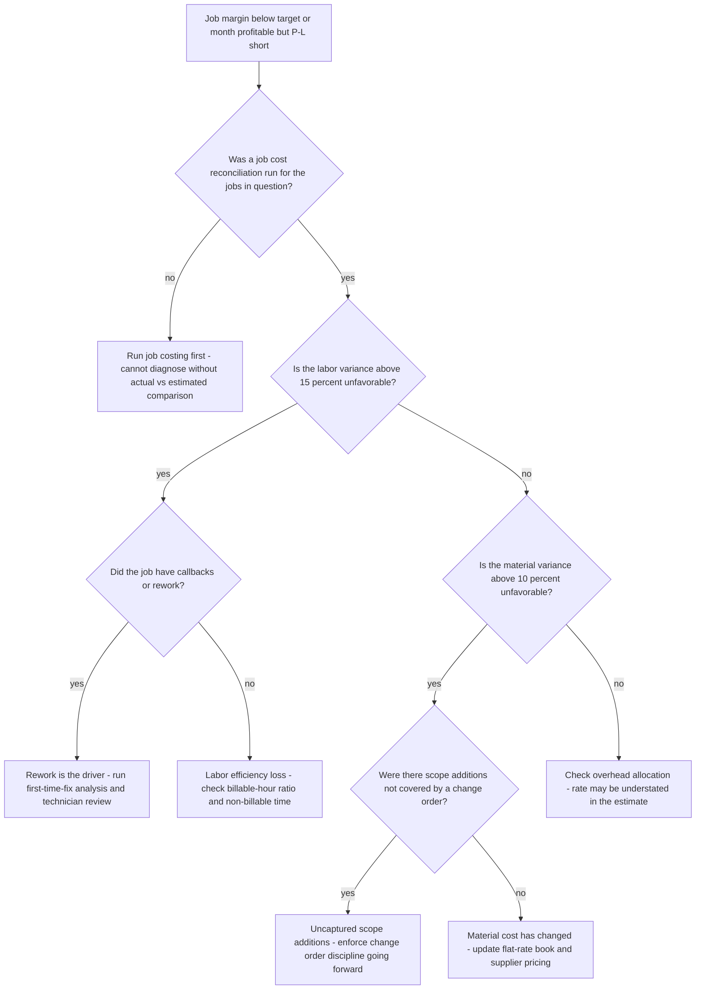
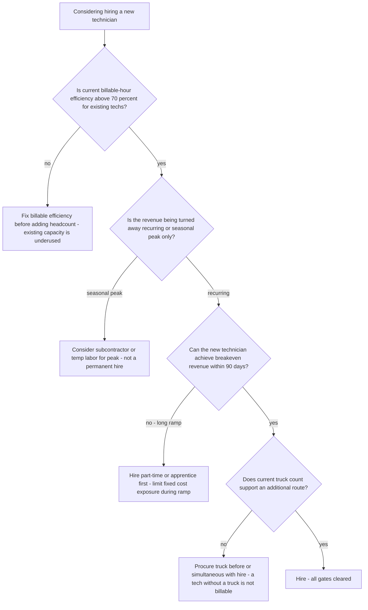
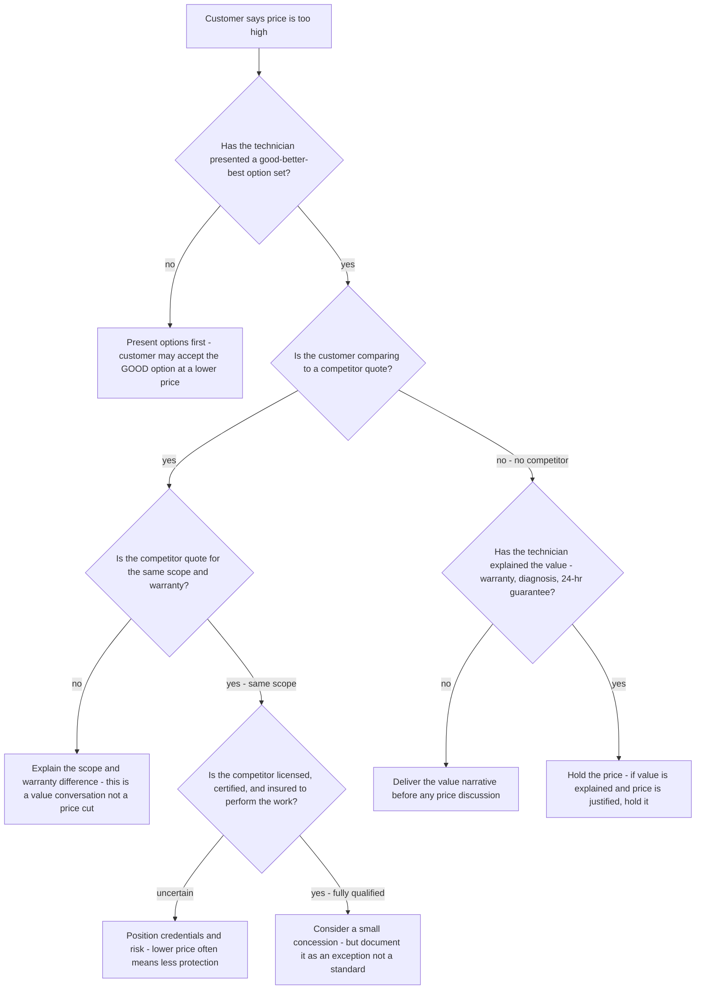

# Trade-contracting decision trees

Which analysis for which symptom — traverse top-to-bottom before picking a method.

## Decision Tree: Busy but not profitable

1) Check the loaded labor rate (§3 #1). 2) Check flat-rate vs guessed hours (§3 #2). 3) Read billable-hour efficiency (§3 #3). 4) Read first-time-fix (§3 #4).

## Decision Tree: Techs aren't billing enough

1) Measure the billable ratio (§3 #3). 2) Locate non-billable time. 3) Fix dispatch and stocking (§3 #6).

## Decision Tree: Should I spend on marketing?

1) Read close rate and average ticket (§3 #7). 2) Find the no-spend revenue gap. 3) Improve option-presentation first.

## How to read these trees

Traverse top-to-bottom and stop at the first matching branch — the order encodes the cheap-checks-before-expensive-checks discipline (§3). Each leaf names a skill, a specialist, or a house-opinion to apply. Never skip a higher branch because a lower one looks more interesting; a denominator, seasonal, or definitional artifact masquerades as a finding more often than not.

## Decision Tree: Which skill for which task

- **Build the loaded labor rate** → use when: Build a billable labor rate that absorbs wage, burden, vehicle, tools, insurance, and overhead, so every hour sold makes money. ([`../skills/build-the-loaded-rate/SKILL.md`](../skills/build-the-loaded-rate/SKILL.md))
- **Build the flat-rate book** → use when: Build a flat-rate price book from loaded labor and real material cost with good/better/best options, so service pricing protects margin. ([`../skills/build-flat-rate-book/SKILL.md`](../skills/build-flat-rate-book/SKILL.md))
- **Raise billable-hour efficiency** → use when: Read the billable-hour ratio and cut non-billable drive, restock, and rework time, since billable efficiency is the field's master number. ([`../skills/raise-billable-efficiency/SKILL.md`](../skills/raise-billable-efficiency/SKILL.md))
- **Cut the callback rate** → use when: Read first-time-fix and quantify the callback labor cost, then fix truck stocking and diagnosis, since a callback is a free truck roll. ([`../skills/cut-callbacks/SKILL.md`](../skills/cut-callbacks/SKILL.md))
- **Read the sales levers** → use when: Read close rate and average ticket and option-presentation, since they move revenue more than lead volume. ([`../skills/read-the-sales-levers/SKILL.md`](../skills/read-the-sales-levers/SKILL.md))

## Decision Tree: Which specialist owns this

- **The engagement** → [`trades-engagement-lead`](../agents/trades-engagement-lead.md)
- **Estimates and pricing** → [`estimating-specialist`](../agents/estimating-specialist.md)
- **The field** → [`field-operations-specialist`](../agents/field-operations-specialist.md)
- **The numbers** → [`trade-business-analyst`](../agents/trade-business-analyst.md)

When two leaves apply, route to the **lead** first to scope and sequence — overlapping symptoms usually mean two drivers at once, and the lead keeps the analysis from collapsing into a single-cause story.

## Decision Tree: Which house-opinion gates the call

Before picking any method, check whether one of the standing biases (§3) already decides the framing:

1. Estimate to a fully-loaded labor rate, not a wage — if this is in question, apply §3 #1 before any method.
2. Price service on a flat-rate book, not guessed hours — if this is in question, apply §3 #2 before any method.
3. Billable-hour efficiency is the field's master number — if this is in question, apply §3 #3 before any method.
4. First-time-fix and callback rate are margin, not just quality — if this is in question, apply §3 #4 before any method.
5. Material cost is the real cost plus waste plus markup — name all three — if this is in question, apply §3 #5 before any method.
6. The truck is a profit center with a utilization number — if this is in question, apply §3 #6 before any method.
7. Quote close rate and average ticket are the sales levers — if this is in question, apply §3 #7 before any method.
8. Date and source any wage, material, or market figure — if this is in question, apply §3 #8 before any method.

## Escalation & guardrails

- Anything touching client PII / regulated records → stop and route to `ravenclaude-core` `security-reviewer`.
- Any external figure entering a deliverable → carry a source URL + retrieval date, or mark it `[unverified — training knowledge]` / `[ESTIMATE]` (§3, final house opinion).
- A recommendation ships only with an owner, a date, and an expected metric movement.
## Sourcing note

Figures in this file are from the author's domain knowledge and are marked `[unverified — training knowledge]` or `[ESTIMATE]` at point of use. Validate against a primary source before putting any figure in a client deliverable (§3 cite-or-mark rule).

---

## Decision Tree: Trades — Job Is Losing Money Post-Completion

**When this applies:** The job cost reconciliation shows a job that ended below the target margin, or the operator says "we were busy all month but the P&L doesn't show it." This tree sequences the diagnosis before any systemic fix is recommended.

**Last verified:** 2026-06-05 against standard trade-contractor job costing and operations consulting practice.

**Rationale per leaf:**
- *Run job costing first* — without the actual-vs-estimated comparison, every diagnosis is speculation.
- *Rework is the driver* — a labor variance caused by rework is a quality problem, not an efficiency problem; the fix is first-time-fix training, not scheduling.
- *Labor efficiency loss* — billable-hour ratio below target indicates non-billable time (drive, restock, waiting); the fix is dispatch or truck stocking.
- *Uncaptured scope additions* — the customer received extra work for free; the fix is change-order discipline, not repricing.
- *Material cost change* — if scope and labor were correct, a material variance means the flat-rate book is stale; update it.
- *Overhead allocation understated* — when all other variances are small, the estimate may not include the full overhead allocation rate.

**Tradeoffs summary:**

| Method | Cost / time | Blast radius | Approval gate? | Use when |
|---|---|---|---|---|
| Run job costing | Low / 1-2 days | None | Business analyst | No reconciliation exists yet |
| First-time-fix / rework review | Medium / 1 week | Technician morale | Field ops manager | Callbacks identified in labor variance |
| Billable-hour efficiency review | Low / 1 day | Dispatch schedule | Field ops | Labor loss without rework |
| Change order enforcement | Low / immediate | Customer relationship | Owner + field | Scope additions identified |
| Flat-rate book update | Low / 1-2 days | Pricing structure | Estimator + owner | Material cost variance, no scope error |
| Overhead rate rebuild | Low / 1 week | All future estimates | Owner + analyst | Small variances across all categories |

---

## Decision Tree: Trades — Should We Hire a New Technician?

**When this applies:** The contractor is considering adding a technician due to call volume, referrals being turned away, or technician overtime. The symptom is "we're turning away work — time to hire." This tree gates the hire decision before it becomes a fixed-cost commitment.

**Last verified:** 2026-06-05 against standard trade contractor staffing and unit economics methodology.

**Rationale per leaf:**
- *Fix billable efficiency first* — adding a technician to a 55% billable-ratio shop adds overhead without proportional revenue; fix the utilization leak first.
- *Seasonal subcontractor* — peak demand is best handled by a variable-cost solution; a permanent hire for 8 weeks of peak becomes an overhead burden for 44 weeks of normal.
- *Part-time or apprentice* — a new hire below the breakeven revenue threshold burns cash during the ramp; a limited-hours hire reduces the risk.
- *Procure truck* — a technician without a stocked service vehicle cannot generate billable revenue; truck procurement is not optional.
- *Hire* — all four gates cleared; the hire is supported by existing efficiency, recurring demand, achievable breakeven, and truck availability.

**Tradeoffs summary:**

| Method | Cost / time | Blast radius | Approval gate? | Use when |
|---|---|---|---|---|
| Fix efficiency first | Low / 4-8 weeks | Dispatch schedule | Field ops | Billable ratio below 70% |
| Subcontractor for peak | Variable / immediate | Quality control | Owner | Seasonal demand only |
| Part-time or apprentice | Low fixed / immediate | Revenue ramp | Owner | Long time-to-breakeven |
| Procure truck | Capital / 2-6 weeks | Cash flow | Owner + finance | No available truck |
| Full hire | High fixed / immediate | P&L | Owner | All gates cleared |

---

## Decision Tree: Trades — Customer Complains the Price Is Too High

**When this applies:** A customer receives a flat-rate or estimate quote and objects to the price. The technician or CSR is in the call or on the job. This tree routes the response before any discount or price-change decision is made.

**Last verified:** 2026-06-05 against trade contractor sales training and pricing discipline practice.

**Rationale per leaf:**
- *Present options first* — the GOOD option at a lower price may resolve the objection without any discount; always offer before any other response.
- *Scope/warranty difference* — a lower competitor quote for less warranty or scope is not the same product; the comparison is invalid.
- *Credentials positioning* — an unverified competitor's lower price may reflect lower insurance, licensing, or warranty standing; surface this before competing on price.
- *Small concession on qualified competitor* — if the competitor is fully equivalent and the customer has a genuine alternative, a limited, documented concession may be warranted; it is not a price-reduction policy.
- *Value narrative* — if the technician went straight to the price without explaining the value, the objection is a presentation failure; deliver the narrative first.
- *Hold* — a price that is correctly built and whose value has been explained should be held; a contractor who discounts on demand trains customers to object every time.

**Tradeoffs summary:**

| Method | Cost / time | Blast radius | Approval gate? | Use when |
|---|---|---|---|---|
| Present options | None / immediate | None | Technician | No options presented yet |
| Scope/warranty explanation | None / immediate | None | Technician | Competitor quote for different scope |
| Credentials positioning | None / immediate | None | Technician | Competitor qualifications uncertain |
| Small concession | Margin / immediate | Pricing precedent | Owner | Qualified competitor, equivalent scope |
| Value narrative | None / immediate | None | Technician | Value not yet explained |
| Hold price | None | None | Technician | Value explained, price justified |
