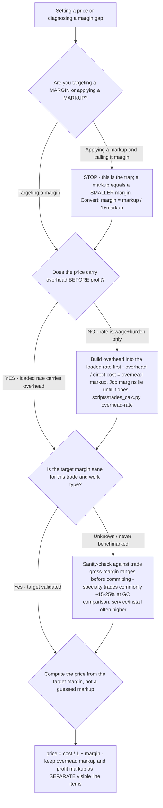

# Trades pricing decision tree — markup vs margin, and building the price from the cost stack

**Last reviewed:** 2026-06-05 · **Confidence:** medium (construction-pricing + contractor-finance sources, web-verified this date). Margin ranges, overhead ratios, and the "10-and-10" baseline are segment- and trade-dependent — they carry inline `[verify-at-use]` markers and must be calibrated to the contractor's actual P&L before any deliverable (CLAUDE.md §3 #8).

> Canonical decision tree for the `estimating-specialist` (pricing) with a numbers assist from the `trade-business-analyst`. Traverse top-to-bottom **before** setting a price or a flat-rate book entry. The load-bearing fact: **markup and margin are not the same number**, and pricing a job with a markup *equal to* the desired margin is the most common contractor pricing error — it silently underprices every job. This is decision-support, not licensed financial advice (CLAUDE.md §2).

---

## When this applies

You are setting a price, building/refreshing a flat-rate book, or diagnosing why realized margin sits below target. Use this before the price is committed. Common triggers: a new estimate, an annual flat-rate book refresh, or a P&L review showing realized margin a few points under target on most jobs.

## The two definitions (memorize these — the whole tree rests on them)

```
margin = profit / PRICE      (what fraction of the sale price is profit)
markup = profit / COST       (what fraction of cost you added on top)

price  = cost / (1 − margin)     ← build the price from the TARGET MARGIN
markup = margin / (1 − margin)   ← the markup that DELIVERS that margin
margin = markup / (1 + markup)   ← the margin a given markup actually yields
```

A **35% markup yields a 25.9% margin**. A **20% markup yields only a 16.7% margin**. To *hit* a 35% margin you must apply a **53.8% markup**. They converge only at zero. ([`../scripts/trades_calc.py`](../scripts/trades_calc.py) `markup` does this conversion both directions.)

## The tree



## Rationale per leaf

- **The trap (markup-as-margin)** — applying a markup numerically equal to the desired margin underprices every job by a predictable few points. If realized margin is consistently a bit under target on *most* jobs, suspect this first — it's definitional, not a discounting or efficiency problem. Convert with the formulas above.
- **Build overhead in first** — a rate that's only wage + burden makes every job *look* profitable at the job level while the business under-recovers fixed cost (the gross-vs-net blind spot). Compute overhead ÷ direct cost and fold it into the loaded rate **before** the profit markup (§3 #1). See [`overhead-allocation-rate-must-be-built-before-pricing-any-job.md`](../best-practices/overhead-allocation-rate-must-be-built-before-pricing-any-job.md).
- **Sanity-check the target** — a correct markup off an unreasonable target is still wrong. Benchmark the target margin against the trade and work type before committing (ranges below).
- **Price from the margin** — `price = cost / (1 − margin)`, with the **overhead markup and the profit markup as separate, visible line items** so both are tunable and the owner can see what covers overhead vs what is actual profit (the "10-and-10" framing — ~10% overhead + ~10% profit as a baseline) [verify-at-use].

## Trade gross-margin ranges (rules-of-thumb — `[verify-at-use]`)

| Work / trade | Gross-margin rule-of-thumb | Note |
|---|---|---|
| General contractor (whole-project) | ~12–16% gross | Thin; net often lands ~5–6%, healthy target ~8–10% |
| Specialty trades (electrical/HVAC) at GC comparison | ~15–25% gross | Lower material-to-labor ratio than full-project GC work |
| HVAC install | ~35–45% gross (avg ~40%) | Service businesses often target ~50–55% blended across services |
| Service/repair (vs install) | Often higher than install | Lower material content, flat-rate pricing protects margin (§3 #2) |

These are **gross-margin** figures at different scopes — read them against the scope you're pricing, not interchangeably. **Net** profit (after overhead) is far thinner than gross (~5–6% industry, ~8–10% healthy) — which is exactly why the overhead-before-profit step is load-bearing.

## Gotchas

- **"I add X% so I keep X%" is the bug, not the rule** — keep the two words mechanically distinct in the book and the template.
- **Total contractor markup ≠ profit** — a typical 20–40% total markup is *overhead + profit*, not all profit; only the profit portion is yours after fixed cost.
- **Don't price service on guessed hours** — flat-rate from a real cost stack protects margin from the slow tech and the surprise (§3 #2); the markup math here feeds the flat-rate book.
- **Change-order work needs the same discipline** — apply the markup (commonly ~15% on change orders) [verify-at-use], and capture the scope in writing so it isn't delivered free (§3 #4).

## Escalation & guardrails

- Whether to bid the job at all (before pricing) → [`trades-bid-no-bid-decision-tree.md`](trades-bid-no-bid-decision-tree.md).
- Building the loaded labor rate the price rests on → [`../skills/build-the-loaded-rate/SKILL.md`](../skills/build-the-loaded-rate/SKILL.md) + [`../skills/build-flat-rate-book/SKILL.md`](../skills/build-flat-rate-book/SKILL.md).
- Every figure entering a deliverable carries a source URL + retrieval date or an `[unverified — training knowledge]` / `[ESTIMATE]` mark (CLAUDE.md §3 #8).

## Sources (retrieved 2026-06-05)

- Procore — *Construction Markup vs Profit Margin* (definitions, formulas, the trap): https://www.procore.com/library/construction-markup-and-profit-margin
- Buildern — *Construction Profit Margin vs. Markup* (20% markup → 16.7% margin worked example): https://buildern.com/resources/blog/construction-profit-margin-vs-markup/
- Siana — *General Contractor Profit Margin: 2026 Industry Data & Benchmarks* (GC ~12–16%, specialty ~15–25%): https://www.sianamarketing.com/resources/general-contractor-profit-margin
- Aladdin Bookkeeping — *Average Construction Industry Profit Margin in 2025* (net ~5–6%, healthy ~8–10%): https://aladdinbookkeeping.com/average-construction-industry-profit-margin/
- NEXT Insurance — *Typical Contractor Overhead and Profit Margin* (the 10-and-10 baseline, overhead ratios): https://www.nextinsurance.com/blog/typical-contractor-overhead-profit-margin/
- FieldEdge — *HVAC Profit Margins* (install ~35–45%, service blended targets): https://fieldedge.com/blog/hvac-profit-margins/
