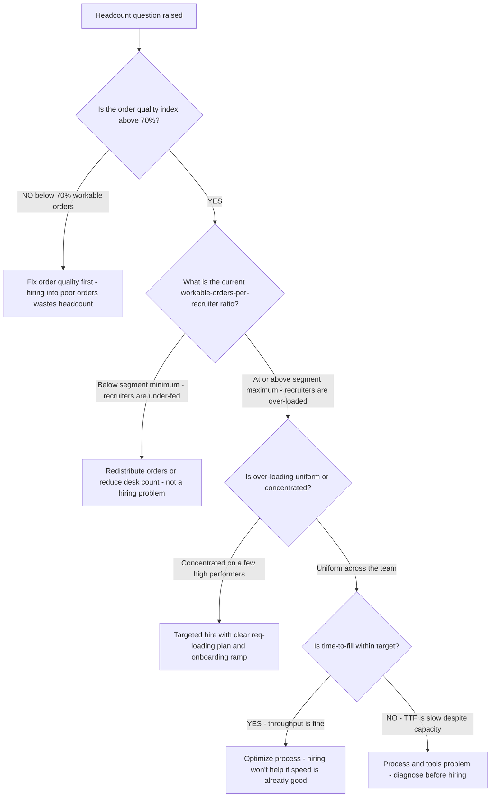
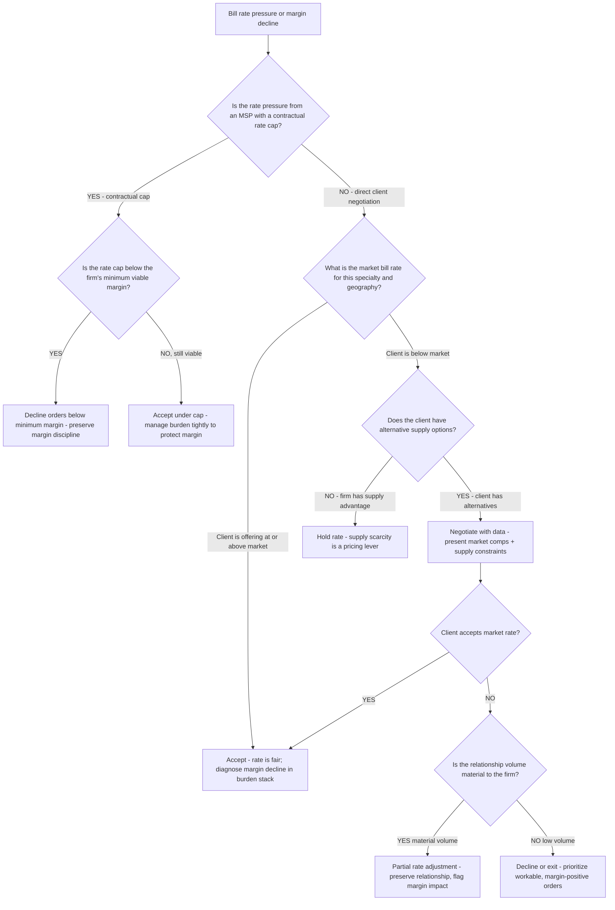
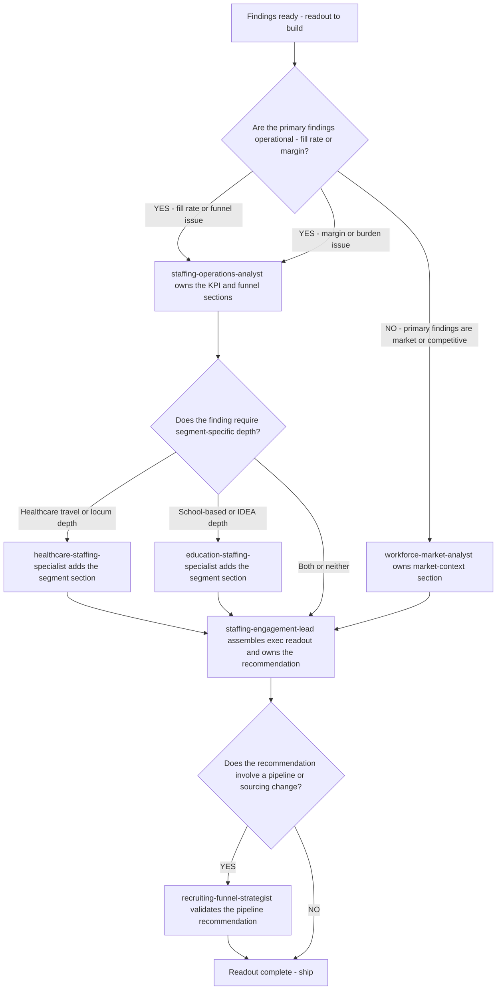

# Staffing decision trees — which diagnostic for which symptom

> **Last reviewed:** 2026-06-04. The "what do I look at first" reference for the `staffing-engagement-lead` and `staffing-operations-analyst`. When a client presents multiple simultaneous symptoms, **traverse the relevant tree top-to-bottom before picking a method** — do not pattern-match the loudest symptom to the first tool. Higher branches win over lower ones on ties.

**The most expensive wrong-first-pick in this plugin:** treating an **order-quality** problem (uncompetitive bill rates, aged/un-workable orders) as a **recruiter-performance** problem and "fixing" the recruiters. Always rule out order quality and supply before touching headcount.

---

## Decision Tree: Fill rate has declined

1. **Is the comparison crossing a seasonal boundary?** (healthcare surge/summer peak; education spring-recruit/fall-start cycle) → **YES:** re-cut YoY same-period before anything else; the decline may be a calendar artifact (§3 #5). Route: segment specialist for the cycle shape. → **NO:** continue.
2. **Which fill-rate denominator moved?** (orders received vs. workable vs. submittals-accepted) → if **dead/on-hold/uncompetitive orders grew the base**, it's an **order-quality** problem, not a fill problem. Route: `recruiting-funnel-strategist` (order-aging cut). → else continue.
3. **Split supply vs. order-quality** (§3 #6): are submittals-per-workable-order down (**supply**) or are workable orders themselves uncompetitive/aged (**demand/order-quality**)? → **Supply:** sourcing-channel + capacity work (`recruiting-funnel-strategist`); is pay rate competitive vs. market? (`healthcare`/`education` specialist). → **Order-quality:** bill-rate competitiveness + intake discipline (segment specialist).
4. **Is time-to-fill also slow?** Pair them (§3 #2). A high-fill/slow-speed disease is losing placements to faster competitors — different fix than low-fill/fast. Include the **credentialing clock** in the time (§3 #7).
5. **Only after 1–4:** if supply is healthy, orders are workable and competitive, and speed is fine, *then* examine recruiter execution — normalized for reqs-per-recruiter (§3 #4).

## Decision Tree: Margin / spread is compressing

1. **Decompose bill − pay − burden** before calling it pricing (§3 #3). → continue.
2. **Did bill rate fall?** (rate-cycle pressure, MSP rate caps, mix shift to lower-bill segments) → Route: `healthcare-staffing-specialist` for rate-cycle context + segment mix.
3. **Did pay rate rise faster than bill?** (candidate-supply scarcity forcing pay up) → supply-side; pair with fill-rate tree.
4. **Did a burden line move?** Walk the stack — taxes, **malpractice (locums)**, **housing/stipends (travel)**, insurance, credentialing cost, bench/idle time. A rise here masquerades as a pricing problem.
5. **Is bench/idle time the driver?** → redeployment-rate lever (cheapest placement; `recruiting-funnel-strategist`).
6. **Is it segment mix at the portfolio level?** (more low-margin per-diem, less high-margin allied) → not a per-deal problem; a portfolio-mix decision (`staffing-engagement-lead` synthesis).

## Decision Tree: A recruiter (or team) looks like it's underperforming

1. **Is the recruiter being fed?** Reqs-per-recruiter and order-quality first (§3 #4). An under-fed recruiter on aged/uncompetitive orders is a supply problem in a performance costume. → if under-fed: fix supply/order-quality, not the recruiter.
2. **Is the desk's order mix harder?** (credentialing-heavy segment, rural/hard-to-fill roles) → normalize the comparison for order difficulty.
3. **Is it speed or conversion?** Pull submittal-to-interview and offer-acceptance; a quality problem (low interview rate) ≠ an activity problem (low submittals).
4. **Only after 1–3:** if fed comparably, comparable mix, and the funnel ratios are genuinely below peers, *then* it's an execution conversation. Even then, lead with the specific stage that's off.

## Decision Tree: Aged-order pileup

1. **Are the aged orders workable?** Split nominal vs. workable. Dead/on-hold orders should leave the active denominator (they're distorting fill rate and capacity reads).
2. **Why are workable ones aging?** → **uncompetitive bill rate** (order-quality; intake/pricing), **supply gap** (sourcing/pay), or **credentialing bottleneck** (accept→start fallout, §3 #7)? Route to the matching specialist.
3. **Is intake discipline the root?** Orders accepted that the firm can't competitively fill inflate aging and depress fill rate — an intake/qualification problem, not a recruiting one.

## Decision Tree: "Are we competitive in this market?"

1. **Name the segment** — competitiveness in allied ≠ in travel nursing ≠ in school therapy. Don't average (§3 #9).
2. **Pull SIA-anchored sizing + the competitor map** ([`competitor-landscape.md`](competitor-landscape.md)); place the client by segment.
3. **Win/lose by lane** — where does the client's shape (dual-segment, allied + school therapy breadth) advantage it, and where do scale players (Aya/AMN travel; CHG/Jackson locums; Presence/eLuma teletherapy software; ESS/Kelly subs; TSSG therapy roll-up) lead?
4. Route synthesis to `staffing-engagement-lead` for the exec readout.

---

## How to use these
- Traverse top-to-bottom; **the first branch that matches selects the route** — don't keep going to a lower branch you "like better."
- Every tree's early branches are the cheap, high-leverage cuts (seasonality, denominator, supply-vs-order-quality). Spending the engagement's first hour there prevents the expensive wrong-first-pick.
- When two trees apply (fill *and* margin both down), run them in parallel and let `staffing-engagement-lead` reconcile — a shared root cause (e.g., segment-mix shift) often sits under both.

---

## Decision Tree: Recruiter Capacity Planning — Hire, Redistribute, or Optimize

**When this applies:** the engagement team is evaluating whether the staffing firm needs more recruiters, or whether an existing team is under-utilized or mis-deployed. Volume targets are in view, and headcount is the lever being considered. Observable entry signal: fill rate is down, or quota attainment is low, and someone has said "we need more recruiters."

**Last verified:** 2026-06-05 against standard staffing operations capacity-planning practice.

**Rationale per leaf:**
- *Fix order quality first* — hiring recruiters into a pipeline of unworkable orders produces low productivity and attrition; orders must be workable before headcount adds value.
- *Redistribute* — under-fed recruiters signal an imbalance, not a shortage; redistributing workable orders often restores productivity without a hire.
- *Targeted hire* — over-loaded desks with good order quality and good TTF are the right place to hire; the new hire has a clear req load and a path to productivity.
- *Optimize process* — if TTF is slow despite available capacity, the constraint is process (credentialing, submittal quality, decision-speed) not headcount.

**Tradeoffs summary:**

| Method | Cost | Lead time | Best for |
|---|---|---|---|
| Fix order quality | Low | Immediate | OQI below threshold |
| Redistribute orders | Low | Days | Under-fed recruiters |
| Targeted hire | High | 60-90 day ramp | Over-loaded high-OQI desk |
| Process optimization | Medium | Weeks | TTF slow despite capacity |

---

## Decision Tree: Healthcare Rate Cycle — Bill Rate Adjustment or Hold

**When this applies:** the firm is receiving pricing pressure on travel-nurse or allied bill rates from a facility or MSP, or internal margin analysis shows bill rates are declining. The question is whether to adjust rates proactively, hold current rates, or renegotiate the mix.

**Last verified:** 2026-06-05 against healthcare staffing rate-cycle dynamics and standard rate-negotiation practice.

**Rationale per leaf:**
- *Decline below minimum margin* — an MSP rate cap below viable margin is a structural loss; accepting those orders depletes recruiter capacity on unprofitable placements.
- *Accept under cap* — if margin is viable, manage the burden stack tightly (especially housing/stipend) to protect the spread.
- *Diagnose in burden stack* — if the rate is fair but margin is still declining, the problem is in the burden components, not the bill rate.
- *Hold rate* — supply scarcity is a negotiating position; hold it when the client lacks alternatives.
- *Partial adjustment* — for material-volume clients, a partial concession with a documented margin impact is a relationship investment; track it.

**Tradeoffs summary:**

| Method | Margin impact | Relationship impact | Use when |
|---|---|---|---|
| Decline orders | None (no loss) | Low-medium | Below minimum viable margin |
| Accept under cap | Compressed but viable | None | MSP cap, margin still positive |
| Hold rate | Preserved | Risk of client loss | Supply advantage exists |
| Negotiate with comps | Neutral if accepted | Constructive | Below-market rate, data available |
| Partial adjustment | Modest decline | Preserved | Material volume, no alternatives |

---

## Decision Tree: Engagement Readout Routing — Which Agent Owns the Synthesis

**When this applies:** the consulting engagement has multiple findings across fill rate, margin, recruiter performance, market context, and compliance. The engagement lead must route the synthesis to the right specialist(s) before assembling the exec readout. Observable entry: findings are ready, the readout is due, and it is unclear which agent(s) own which sections.

**Last verified:** 2026-06-05 against the team roster in CLAUDE.md §1.

**Rationale per leaf:**
- *staffing-operations-analyst* — owns the KPI layer: scorecard, fill rate, margin, recruiter metrics; all findings rooted in the operational data go here first.
- *Segment specialists* — add depth only when the finding is segment-specific (travel-nurse rate cycle, IEP compliance gap); do not involve both unless findings span both segments.
- *workforce-market-analyst* — owns the outside view when the primary finding is competitive or market-driven; supports context sections, not operational diagnostics.
- *recruiting-funnel-strategist* — validates any recommendation that involves changing pipeline capacity, sourcing mix, or req-to-recruiter ratios.
- *staffing-engagement-lead* — always owns the final synthesis and the recommendation; specialist inputs are sections, not autonomous deliverables.

**Tradeoffs summary:**

| Route | Specialist | Owns | Don't use when |
|---|---|---|---|
| Operational findings | staffing-operations-analyst | KPI + funnel sections | Market context is the primary finding |
| HC segment depth | healthcare-staffing-specialist | Travel/locum/allied section | Finding is education-segment only |
| EDU segment depth | education-staffing-specialist | School-based/IDEA section | Finding is healthcare-segment only |
| Market/competitive | workforce-market-analyst | Market context section | Finding is internal operational |
| Pipeline validation | recruiting-funnel-strategist | Sourcing recommendation check | Recommendation is pricing or compliance |
| Synthesis + recommendation | staffing-engagement-lead | Always | Never delegate the recommendation itself |
