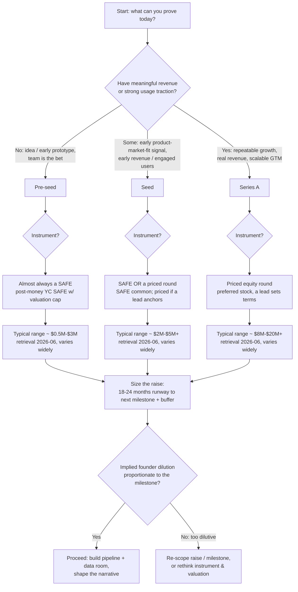

# Fundraising Stages — Decision Tree

> **Last reviewed:** 2026-06 · **Confidence:** structural mechanics = high; market-norm ranges = medium and **volatile** — treat every dollar/percent range below as a *retrieval-date 2026-06 range, not a guarantee*, and re-verify before quoting to a founder or investor.
>
> **Scope:** founder-side literacy for *which stage am I, on what instrument, raising roughly how much*. This is NOT legal or financial advice — binding term review routes to **legal-ops-clm**; the financial model to **finance**.

Stage is a function of **evidence**, not ambition. The tree maps traction signal → stage → instrument → typical range, then sizes the raise off **runway-to-the-next-milestone**.

## The tree

## How to read it

1. **Place the stage by evidence.**
   - **Pre-seed** — idea to early prototype; the *team and the why-now* are the bet. Little/no revenue.
   - **Seed** — an early product-market-fit signal: early revenue, engaged users, a wedge that's working.
   - **Series A** — repeatable, scalable growth: real revenue with a GTM motion that compounds when you add fuel.
2. **Pick the instrument.**
   - **SAFE** (simple agreement for future equity) dominates pre-seed and is common at seed — fast, cheap, defers valuation to the priced round. Today's standard is the **Y Combinator post-money SAFE** (post-2018) with a **valuation cap** (sometimes a discount, sometimes MFN).
   - **Priced round** (preferred stock) is the norm at Series A and at seeds with a committed lead — it sets a valuation now and comes with a term sheet (board, liquidation preference, pro-rata, etc.). See [`term-sheet-and-safe-essentials.md`](term-sheet-and-safe-essentials.md).
3. **Size off runway, not the meme.** Raise enough to hit the *next fundable milestone* with **18-24 months** of runway plus a buffer — then sanity-check the implied dilution. (Single-round dilution commonly lands roughly **15-25%** at seed/Series A — retrieval 2026-06, a range, not a rule.)
4. **Check the dilution is proportionate.** If reaching the milestone costs more equity than it's worth, re-scope the milestone, the raise, or the valuation/instrument before going to market. Model it with [the cap-table skill](../skills/model-cap-table-and-dilution/SKILL.md).

## Notes & caveats

- **Stage labels are fuzzy and market-driven.** "Pre-seed" and "seed" have blurred; bridge/extension rounds are common. Use the *evidence* test, not the label.
- **Ranges move with the macro cycle, geography, and sector** (AI/deep-tech rounds skew larger). The 2026-06 ranges above are starting points to be re-verified, not commitments.
- **SAFE vintage matters.** Post-money YC SAFEs (the current default) lock the investor's percentage; older *pre-money* SAFEs behave differently — confirm which you're using. The conversion mechanics live in [`term-sheet-and-safe-essentials.md`](term-sheet-and-safe-essentials.md) and [the cap-table skill](../skills/model-cap-table-and-dilution/SKILL.md).
- **The deck's headline shifts with stage:** pre-seed/seed lead with *team + why-now*; Series A leads with *traction*. The [`pitch-deck-outline.md`](../templates/pitch-deck-outline.md) covers both.
