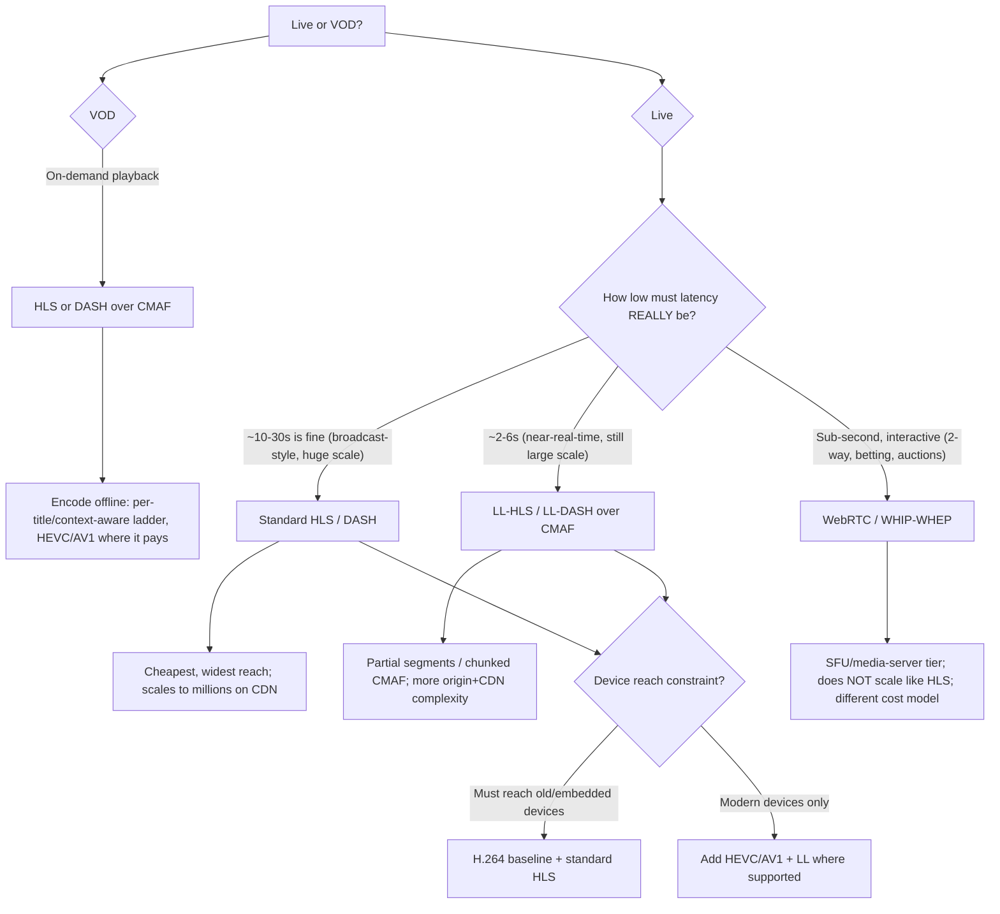

# Latency-tier → protocol decision tree

> Read this **before naming a streaming protocol**. The binding decision is the
> **latency tier** — and most "we need real-time" is really "a few seconds is fine".
> Each step lower in latency costs scale, cost, and complexity. Durable mechanics;
> the perishable device/feature specifics are in
> [`streaming-codecs-protocols-and-cdn-2026.md`](streaming-codecs-protocols-and-cdn-2026.md).

## The tree

## How to read it

1. **VOD is the easy case.** Encode offline; spend on per-title optimization and
   modern codecs where the device base supports them. Package with CMAF so one
   segment set serves HLS and DASH.
2. **For live, interrogate the latency number.** The three tiers:
   - **Broadcast (~10–30s):** standard HLS/DASH. Cheapest, widest reach, scales to
     millions on commodity CDN. The default unless a real requirement forces lower.
   - **Low (~2–6s):** LL-HLS / LL-DASH with chunked/partial CMAF segments. Buys a
     few seconds at the cost of more origin and CDN complexity.
   - **Ultra-low (<1s, interactive):** WebRTC (with WHIP/WHEP for ingest/egress).
     Required for two-way or bet-in-play interactivity — but it needs an SFU/media
     server tier and does **not** scale or cost like HLS.
3. **Don't pay the real-time tax you don't need.** Dropping from 30s to sub-second
   can multiply cost and complexity by an order of magnitude. Only go ultra-low when
   interactivity genuinely requires it.
4. **Device reach caps codec/protocol choice.** If old or embedded devices must play,
   H.264 + standard HLS is the safe floor; LL-HLS and HEVC/AV1 assume a modern base.

## The three failure modes this tree prevents

- **WebRTC for a broadcast** — paying the SFU/scaling tax for a one-way stream that
  30s-latency HLS would serve to millions for a fraction of the cost.
- **Standard HLS for genuine interactivity** — 20s of latency on a live auction or a
  two-way call, which is unusable.
- **A VOD ladder on a live encode** — expensive per-title optimization that can't run
  inside a real-time encode budget.

## Seam note

The protocol is only part of the design. **Packaging (CMAF), DRM (CBCS multi-DRM),
codec ladder, and CDN topology** are decided against
[`streaming-codecs-protocols-and-cdn-2026.md`](streaming-codecs-protocols-and-cdn-2026.md),
which carries the DRM/packaging matrix and the dated device/feature specifics.
