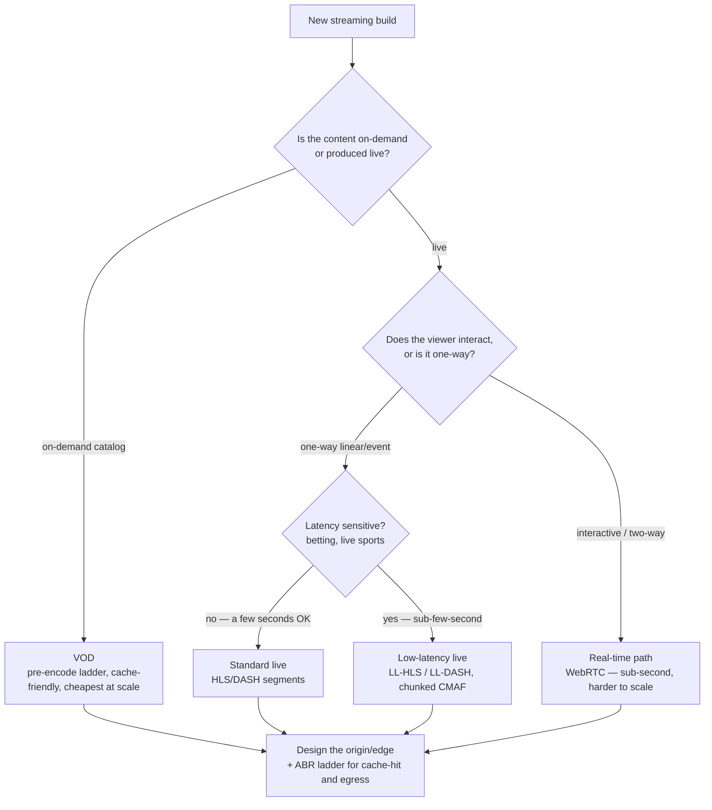
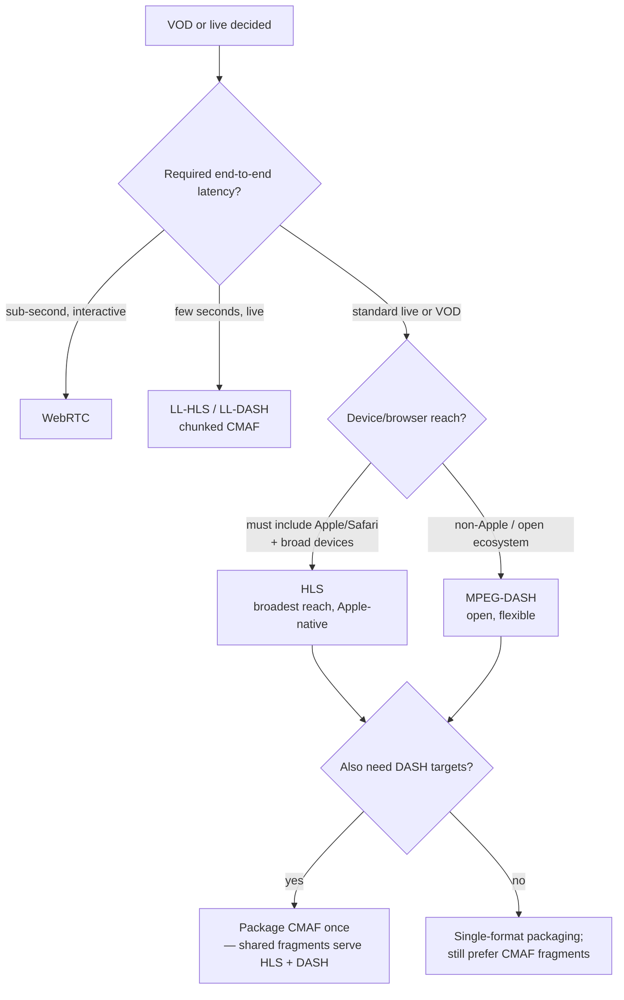
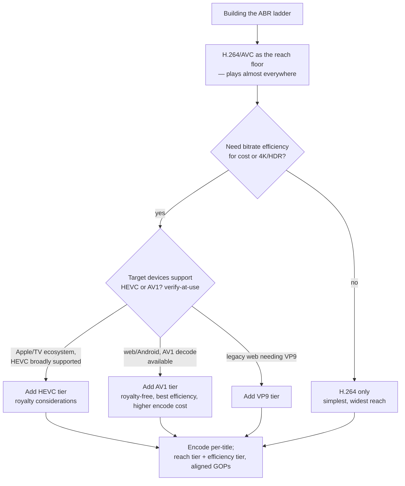
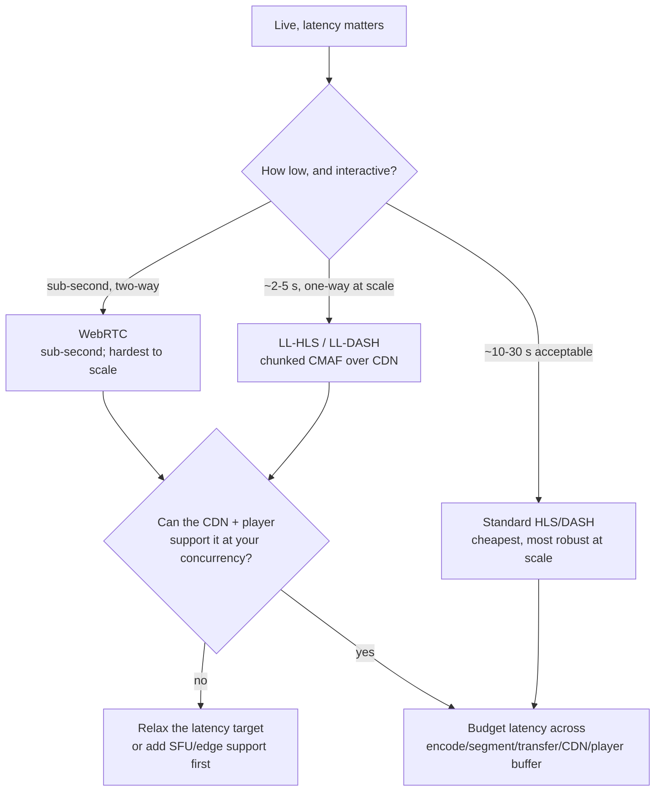

# Streaming-Media Engineering — Decision Trees

> Reference decision trees for the `streaming-media-engineering` team. Agents **traverse the relevant tree top-to-bottom before deciding** (the proactive complement to the Capability Grounding Protocol). Each `## Decision Tree` section is a Mermaid graph plus the rule it encodes.
>
> **Engineering judgment, not legal/DRM-licensing advice.** Anything touching a codec/protocol version, DRM system, CDN feature, player SDK, or QoE number is `[verify-at-use]` — confirm against the spec/vendor/SDK docs before it drives a build commitment. No PII.
>
> _Last reviewed: 2026-07-03 by `claude`. Principles are durable; dated specifics live in [`streaming-reference-2026.md`](streaming-reference-2026.md)._

---

## Decision Tree: VOD or live?

**Rule:** decide VOD vs live on how the content is produced, then — for live — let **interactivity and the latency target** pick the path. VOD is cheapest and most cache-friendly; real-time (WebRTC) costs the most to scale. All protocol/latency specifics `[verify-at-use]`.

---

## Decision Tree: which protocol / packaging?

**Rule:** the **latency target first, then the device/browser reach** pick the protocol. Reach for **CMAF** so one set of fragments serves both HLS and DASH — the cheap hedge. Confirm protocol/codec/DRM support on the target reach `[verify-at-use]` before committing.

---

## Decision Tree: which codec(s)?

**Rule:** ship a **reach tier (H.264) plus an efficiency tier (HEVC / AV1 / VP9)** chosen on the target devices' decode support and the cost/royalty trade — don't pick one codec and either starve reach or overpay egress. Codec support + encode cost `[verify-at-use]`.

---

## Decision Tree: which low-latency approach?

**Rule:** pick the low-latency approach on **how low the latency must be and whether it's interactive**, then confirm the CDN and player support it at your concurrency. Lower latency trades scale and robustness — budget latency across the whole chain, not just the player, and don't chase the edge into rebuffering. Latency floors `[verify-at-use]`.

---

## See also

- [`streaming-reference-2026.md`](streaming-reference-2026.md) — dated codec/protocol/CDN/DRM/player landscape + QoE target ranges (verify-at-use).
- Skills: [`../skills/streaming-architecture-and-protocol-selection/SKILL.md`](../skills/streaming-architecture-and-protocol-selection/SKILL.md), [`../skills/transcoding-and-abr-ladder/SKILL.md`](../skills/transcoding-and-abr-ladder/SKILL.md), [`../skills/low-latency-live-streaming/SKILL.md`](../skills/low-latency-live-streaming/SKILL.md), [`../skills/playback-qoe-and-delivery/SKILL.md`](../skills/playback-qoe-and-delivery/SKILL.md).
