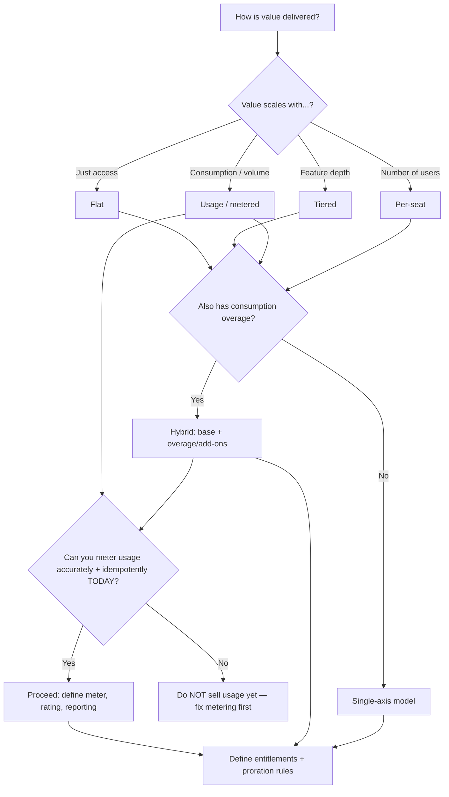

# Knowledge: Billing-Model Decision Tree

> **Last reviewed:** 2026-07-21 · **Confidence:** high for the model taxonomy and tradeoffs (stable domain); provider-specific object names and pricing are volatile — re-verify at use.
> Source of truth for [`model-plans-and-pricing`](../skills/model-plans-and-pricing/SKILL.md). Inline priors live on the [`billing-systems-architect`](../agents/billing-systems-architect.md); this file is re-read on demand.

The model must mirror **how value is delivered**. Start from the value axis, not from a provider feature.

## Decision tree

## The five models

| Model | Bills on | Best when | Watch out for |
|---|---|---|---|
| **Flat** | Fixed fee per interval | Simple product, single value prop | Leaves money on the table for heavy users; no expansion revenue |
| **Tiered** | Feature/limit tier (Good/Better/Best) | Clear feature segmentation | Tier design drift; customers stuck between tiers |
| **Per-seat** | Active/licensed users | Value scales with team size | Seat gaming; "who is an active seat?" ambiguity; downgrade friction |
| **Usage / metered** | Consumption units | Value scales with volume; aligns cost to value | Metering accuracy + idempotency; unpredictable bills scare buyers |
| **Hybrid** | Base + overage/add-ons | Predictability + usage upside | Complexity; two correctness surfaces (base + meter) |

## Rules of thumb

- **Model the value axis, not the pricing you wish you had.** Re-pricing every customer is the tax for getting this wrong.
- **Entitlements are a separate model** derived from billing state — not string-matched off the plan name in app code.
- **Prices are immutable + versioned.** Never mutate a live price; create a new one and migrate.
- **Annual = discount + cash-flow + retention**, but complicates proration and refunds — decide deliberately.
- **Usage-based is gated on metering.** If you can't count it accurately and idempotently, it's not ready.
- **Every model needs an explicit proration spec** (see the [`proration-upgrade-test-matrix`](../templates/proration-upgrade-test-matrix.md)).

## Provider landscape (retrieval-dated — verify at use)

As of 2026-07, the common hosted billing engines are **Stripe Billing**, **Chargebee**, **Recurly**, **Paddle** (merchant-of-record, handles tax/VAT for you), and **Braintree** (recurring). Merchant-of-record providers (e.g. Paddle) absorb sales-tax/VAT liability at the cost of flexibility and margin — a real tradeoff for global SaaS. Object names (`product`/`price`/`subscription`/`subscription_item`), proration behavior, and pricing move; confirm against current docs before quoting.

## House opinion

Use a hosted billing engine unless you have a measured reason not to. The invoicing, proration, tax, and dunning edge cases are a multi-year swamp that these engines have already drained.
