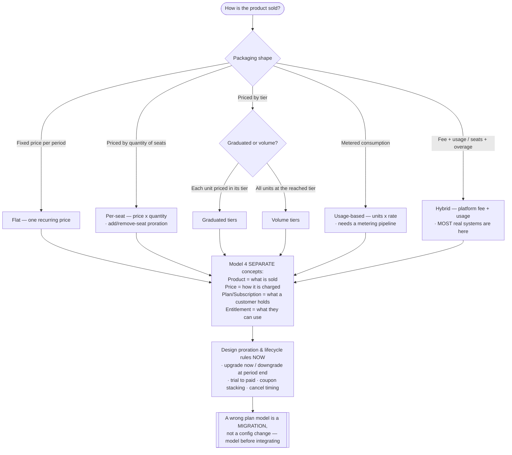
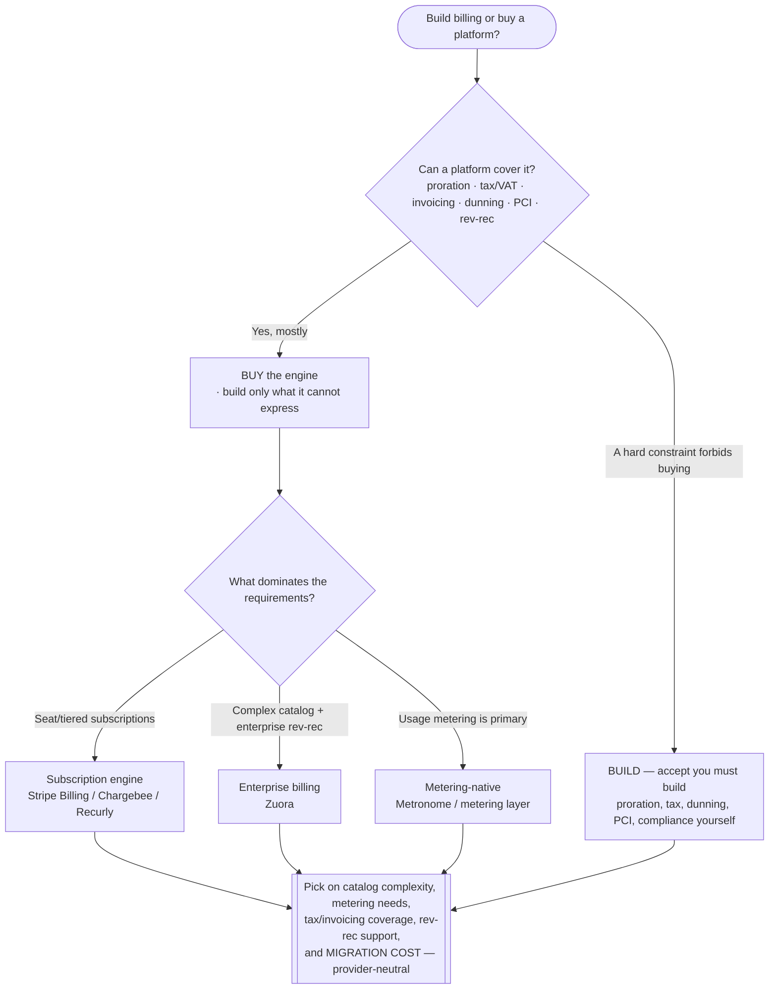
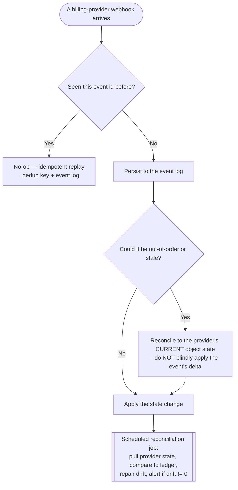
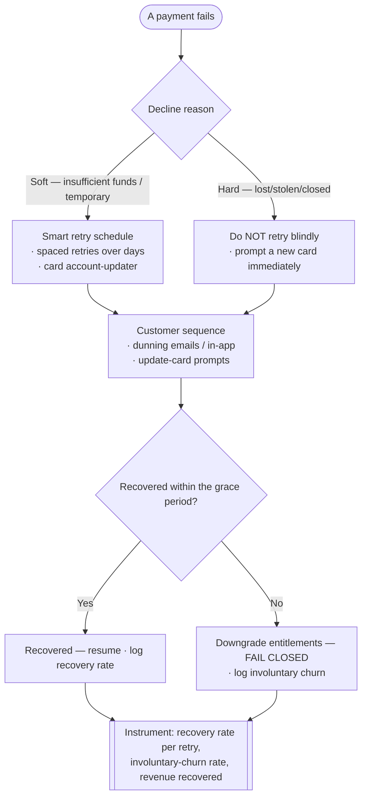
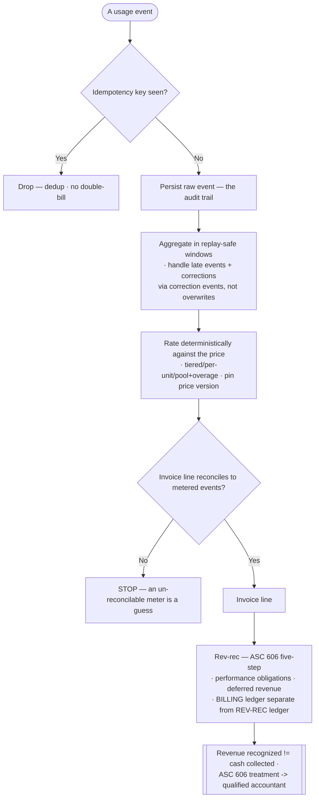

# Knowledge — Subscription-billing-revenue decision trees

> **Last reviewed:** 2026-07-17 · **Confidence:** Medium-High (consensus on the catalog-modeling, build-vs-buy, webhook-idempotency, dunning, usage-metering, and billing-vs-rev-rec framings; **specific ASC 606 revenue-recognition treatment, sales-tax/VAT rules, and billing-provider API/webhook behavior are volatile and entity-specific — re-verify with a qualified accountant/auditor before booking**).
> The most-asked billing questions are "how do we model the plans and catalog?", "build billing or buy a platform?", "how do we handle webhooks safely?", "how do we recover failed payments?", "how do we meter usage?", and "how do we recognize revenue?". These are the decision trees the `billing-systems-architect` traverses **before** naming a model, platform, or rev-rec treatment, plus the trade-off tables and the seams to adjacent plugins.

The team's discipline: **model the catalog before the integration, treat every webhook as at-least-once, meter idempotently and reconcilably, and keep billing separate from revenue recognition.** This is **not accounting, tax, or audit advice** — volatile ASC 606 / tax / provider specifics carry a retrieval date and are verified at use. Pricing STRATEGY leaves this layer for `pricing-monetization`; payment RAILS/PSP/ledger code for `fintech-payments-engineering`; FP&A for `finance`.

---

## Decision Tree 1: model the plan & product catalog (packaging shape → model)

Name the packaging shape, then model **product / price / plan / entitlement** as four separate concepts.

---

## Decision Tree 2: build vs buy, and platform selection

Buy the recurring-billing engine unless a hard constraint forbids it; the long tail is what you're buying.

---

## Decision Tree 3: webhook handling (every event is at-least-once)

Assume duplicate, out-of-order, and dropped events; idempotency + reconciliation are non-negotiable.

---

## Decision Tree 4: dunning & failed-payment recovery

Dunning recovers more revenue than any pricing tweak — instrument it; don't blind-retry.

---

## Decision Tree 5: usage metering → rating → invoice → rev-rec

Meter idempotently and reconcilably; keep billing separate from revenue recognition.

---

## Trade-off table — build vs buy the billing platform

| Choice | Sweet spot | Watch out for |
|---|---|---|
| **Buy a subscription engine** | Standard seat/tiered/hybrid billing; want tax, invoicing, dunning, PCI covered | Catalog must fit the platform's model; migration cost if you outgrow it |
| **Buy a metering-native platform** | Usage is the primary meter; high-cardinality events | Subscription/seat features may be thinner; integration with the sub engine |
| **Buy enterprise billing** | Complex catalog, multi-element, enterprise rev-rec | Cost & implementation weight; overkill for simple SaaS |
| **Build in-house** | A hard constraint truly forbids buying | You now own proration, tax, dunning, PCI, compliance — the expensive long tail |

## Trade-off table — usage-rating models

| Model | Sweet spot | Watch out for |
|---|---|---|
| **Per-unit** | Simple linear usage (per API call, per GB) | No volume incentive; can surprise customers on spikes |
| **Graduated tiers** | Reward volume; each unit priced in its tier | More complex rating; explain the bill clearly |
| **Volume tiers** | All units at the reached tier — strong volume incentive | A cliff at tier boundaries; model the edge |
| **Included pool + overage** | Bundle a base allowance with a subscription, charge over it | Pool reset timing & proration on plan change; reconcile the pool |

## Trade-off table — subscription vs revenue-recognition metrics

| Metric | What it measures | Watch out for |
|---|---|---|
| **MRR / ARR** | Normalized recurring revenue run-rate (a billing/subscription metric) | Usage MRR needs an explicit normalization; not the same as recognized revenue |
| **Net revenue retention (NRR)** | Expansion − contraction − churn on the existing base | Definition varies — state it; gross vs net churn confusion |
| **Recognized revenue (ASC 606)** | Revenue earned as obligations are satisfied (a rev-rec metric) | ≠ cash collected, ≠ MRR; deferred revenue is the bridge — accountant-verified |
| **Deferred revenue** | Billed-but-not-yet-recognized obligation | The tie-out between billing and rev-rec; carry a retrieval date on treatment |

---

## Seams (this plugin owns the billing SYSTEM, not the whole revenue stack)

- **Pricing STRATEGY / packaging economics / price points** → `pricing-monetization` (what to charge; this plugin turns it into a recurring invoice).
- **Payment RAILS / PSP integration / card-network & ledger code** → `fintech-payments-engineering` (moving the money; this plugin *uses* the rails to collect).
- **FP&A / budgeting / the P&L plan** → `finance` (the earnings plan; this plugin produces the billed & recognized revenue that feeds it).
- **The analytics warehouse / transformation pipeline** for MRR/ARR/churn at scale → `analytics-engineering`.
- **The actual accounting entries, ASC 606 treatment, and audit** → a qualified accountant / auditor (not decided in this plugin).

---

## Provenance

- Durable framings (product/price/plan/entitlement separation, packaging shapes, build-vs-buy on coverage, at-least-once webhooks + idempotency + reconciliation, decline-reason-tuned dunning, idempotent + reconcilable usage metering, deterministic rating, billing-vs-rev-rec separation, MRR/ARR/NRR vs recognized revenue) are consensus subscription-billing engineering practice reviewed 2026-07-17 — **High confidence**.
- ASC 606 revenue-recognition treatment (five-step, performance obligations, deferred revenue, multi-element allocation), sales-tax/VAT rules, and billing-provider API/webhook behavior (Stripe Billing, Chargebee, Zuora, Recurly, Metronome) are **volatile and entity-specific**, carry retrieval dates, and are **not accounting/tax/audit advice** — re-verify with `ravenclaude-core/deep-researcher` and a qualified accountant/auditor before booking. _(Reviewed 2026-07-17.)_
