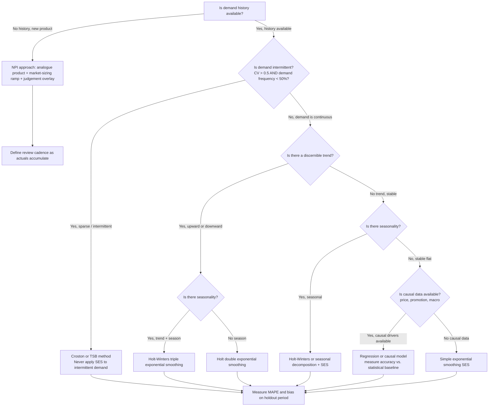
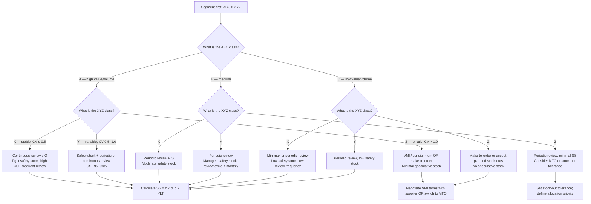
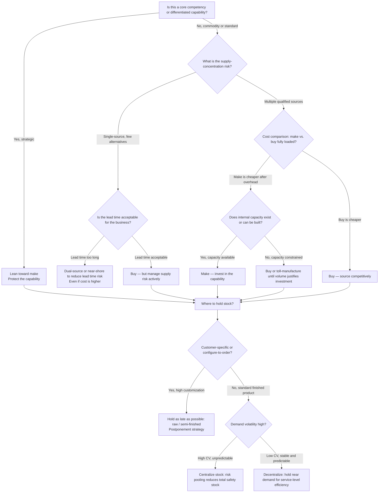

# Supply-Chain Planning — Decision Trees + 2026 Capability Map

> Canonical knowledge bank for `supply-chain-planning`. **Traverse the relevant Mermaid tree
> top-to-bottom before choosing** — the proactive complement to the Capability Grounding Protocol.
> Volatile product/version facts in the capability map carry a retrieval date and a `[verify-at-use]`
> rider.

---

## Decision Tree: Forecast-method selection

**Leaf rule:** always measure MAPE **and** bias on a holdout period before releasing any forecast.
Choose the simplest method that fits the demand character — complexity is only justified by a
measurable accuracy improvement. Clean demand history (strip promotions, stockouts, one-offs) before
fitting any model.

---

## Decision Tree: Inventory-policy selection

**Leaf rule:** segment before you set policy. An A/X SKU (high value, stable demand) and a C/Z SKU
(low value, erratic demand) need opposite policies — the first needs tight continuous-review safety
stock, the second needs make-to-order or a deliberate stock-out tolerance. Never apply a uniform
days-of-supply target across all SKUs.

---

## Decision Tree: Make-vs-buy / supply-network positioning

**Leaf rule:** make vs. buy is a strategic decision — cost alone is not the answer. Supply
concentration risk, lead-time impact on responsiveness, and core-competency protection all
outweigh a narrowly cheaper buy option. The positioning of inventory (where in the network to
hold it) is separate from the make-vs-buy decision and is driven by demand volatility and
customization depth.

---

## 2026 capability map — supply-chain planning software (dated, re-verify at use)

_Retrieved 2026-06-08. Product positioning, module coverage, and pricing are volatile — re-confirm
at use. This is orientation, not a procurement recommendation. `[verify-at-use]` marks particularly
volatile facts._

| Category | Platform | Positioning (2026) | Notes |
| --- | --- | --- | --- |
| **Enterprise APS / IBP** | **SAP IBP** (Integrated Business Planning) | Market-leading for SAP-centric orgs; strong S&OP, demand sensing, inventory optimization. `[verify-at-use]` | Requires SAP HANA; expensive; strong if ERP is S/4HANA. |
| **Enterprise APS / IBP** | **Kinaxis RapidResponse** | Concurrent planning, real-time scenario analysis, strong in automotive/hi-tech. `[verify-at-use]` | Premium tier; particularly strong for volatility and supply-risk response. |
| **Enterprise APS / IBP** | **o9 Solutions** | Integrated demand, supply, and financial planning; strong IBP and scenario tooling. `[verify-at-use]` | Strong in CPG and manufacturing; growing rapidly as of 2026. |
| **Enterprise APS / IBP** | **Blue Yonder (formerly JDA)** | Demand planning, supply planning, TMS/WMS breadth. `[verify-at-use]` | Broad suite; now part of Panasonic Holdings. |
| **Mid-market / cloud** | **Anaplan** | Connected planning (finance + supply); strong for multi-stakeholder S&OP. `[verify-at-use]` | Often used for the financial layer of IBP alongside a dedicated APS. |
| **Mid-market / cloud** | **Streamline / Netstock / Intuiflow** | SMB and mid-market demand + inventory planning. `[verify-at-use]` | Lower total cost; good for companies outgrowing spreadsheets. |
| **Spreadsheets + Python** | Excel / Google Sheets + Python (pandas, statsmodels) | Common baseline; appropriate for < 1,000 SKUs or when a dedicated APS isn't justified. | No real-time integration; manual data wrangling; scalability ceiling is real. |

> Provenance: analyst commentary (Gartner Supply Chain Planning Magic Quadrant, IDC) + vendor
> websites, retrieved 2026-06-08. Market-share figures, module-level capabilities, and pricing are
> volatile — re-verify at use. No invented products.

---

## See also

- [`../CLAUDE.md`](../CLAUDE.md) — team constitution & seams.
- [`../best-practices/README.md`](../best-practices/README.md) — the named, citable rules.
- [`../scripts/supply_calc.py`](../scripts/supply_calc.py) — EOQ, safety stock, ROP, fill rate,
  MAPE/bias calculator.
- Neighbour decision trees: `procurement-sourcing`, `freight-forwarding-sales`, `fleet-logistics`,
  `applied-statistics`, `data-platform`.

_Last reviewed: 2026-06-08 by `claude`._
