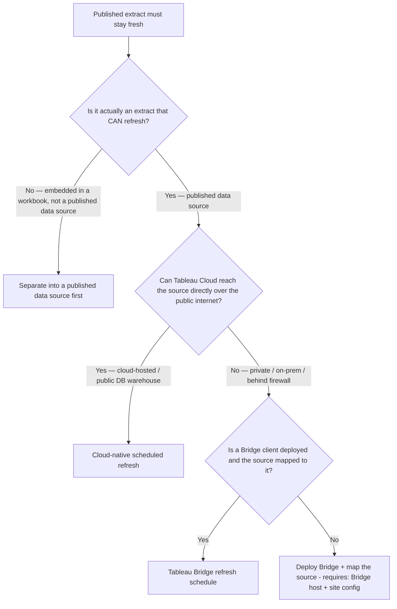
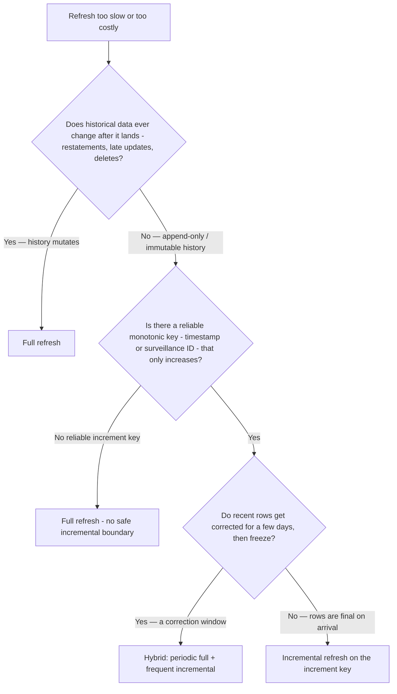
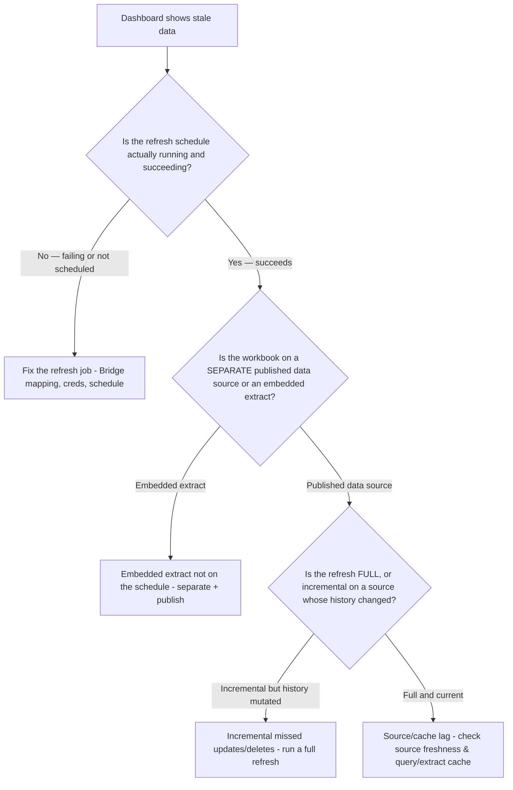

# Data Freshness Pipeline — Decision Trees

> Canonical decision trees for keeping a published data source **fresh** — how an extract gets
> refreshed (Bridge vs Cloud-native), how *much* gets refreshed (full vs incremental), and where
> a "stale dashboard" failure actually lives. Owned jointly by `tableau-data-architect` (refresh
> strategy) and `tableau-admin` (Bridge/Cloud scheduling). Traverse the relevant `## Decision
> Tree:` Mermaid graph **top-to-bottom before selecting a method** — do not keyword-match the
> user's wording. The first branch where the condition resolves cleanly is the leaf to apply.
> Format follows [`../../../docs/best-practices/decision-trees-in-knowledge-files.md`](../../../docs/best-practices/decision-trees-in-knowledge-files.md).
>
> This complements the *connection-mode* (extract-vs-live) and *content-promotion* trees: once
> you've chosen an **extract** and (where relevant) migrated/published it, **this** file decides
> how it stays current. Volatile Tableau facts (Bridge schedule types, version-gated removals,
> exact option labels) carry inline `[verify-at-build]`.
>
> **Last reviewed:** 2026-06-05.

---

## Decision Tree: Refresh path — Bridge vs Cloud-native vs no-refresh

**When this applies:** A published **extract** data source on Tableau Cloud (or migrated to it)
must stay current and you must choose *how* the refresh runs. Observable triggers: "the dashboard
is stuck at last week's data"; "refresh fails every morning after the Server→Cloud move"; "the
source is behind our firewall — how does Cloud reach it?"; "do we need Tableau Bridge?"

**Last verified:** 2026-06-05 against Tableau Cloud refresh-scheduling + Tableau Bridge docs
`[verify-at-build]` (Bridge schedule types are version-gated — see the leaf notes).

**Rationale per leaf:**
- *Cloud-native scheduled refresh (default for reachable sources)* — Tableau Cloud refreshes
  extracts of cloud-hosted/public sources (e.g. Snowflake, BigQuery, Redshift, RDS, Azure SQL,
  Salesforce) **directly**, no extra infrastructure. Schedule it to the stated SLA.
- *Tableau Bridge refresh schedule* — the secure gateway for **private/on-prem** sources Cloud
  can't reach. **Use "Bridge refresh schedules"** — *Bridge legacy schedules support was removed
  in 2025.2* `[verify-at-build]`. **requires:** a running Bridge client mapped to the published
  data source.
- *Separate into a published data source first* — Bridge and most scheduled refresh only operate
  on **separately published** data sources, never on an extract **embedded** inside a workbook.
  This is the #1 Server→Cloud refresh dead-end (see the scenario bank). Convert embedded →
  published, then re-enter this tree.
- *Deploy Bridge + map the source* — no reachability and no Bridge means there is **no** refresh
  path yet; standing up Bridge is the prerequisite, not an optional optimization.

**Tradeoffs summary table:**

| Path | Infra needed | Reaches private sources? | Best for | Watch-out |
|---|---|---|---|---|
| Cloud-native refresh | None | No | Cloud/public warehouses & SaaS | Source must be internet-reachable from Cloud |
| Tableau Bridge | Bridge client host | Yes | On-prem / firewalled sources | Use Bridge *refresh* schedules; legacy removed 2025.2 `[verify-at-build]` |
| Separate-then-publish | (one-time rework) | n/a | Embedded extracts with no refresh | Must publish the data source before any schedule applies |

---

## Decision Tree: Refresh scope — full vs incremental (and the hybrid)

**When this applies:** A published extract's refresh is **too slow / too costly** or its window
overruns, and you must choose how *much* to refresh. Observable triggers: "the nightly refresh
takes 4 hours and overlaps business hours"; "we only ever add new rows"; "history keeps getting
re-pulled for no reason"; "the warehouse bill spikes at refresh time."

**Last verified:** 2026-06-05 against Tableau extract full-vs-incremental refresh docs
`[verify-at-build]`.

**Rationale per leaf:**
- *Full refresh (default / safe)* — replaces the whole extract; the only correct choice when
  **history can change** (restatements, back-dated edits, deletes) because incremental **only
  adds rows** and never sees an update/delete to existing rows. Slower but exact.
- *Full refresh — no safe boundary* — without a reliable monotonically-increasing key, an
  incremental refresh can silently miss or duplicate rows; fall back to full.
- *Incremental refresh* — append-only data with a trustworthy increasing key (timestamp / id):
  pull only new rows. **requires:** incremental refresh was configured **before publishing** the
  extract (Desktop/web authoring) — you can't bolt it on later without republishing
  `[verify-at-build]`.
- *Hybrid (the enterprise pattern)* — frequent incremental refreshes through the day for fresh
  activity **plus** a periodic (e.g. nightly/weekly) **full** refresh to absorb late corrections
  and re-establish exactness. Best of both for sources with a short correction window.

**Tradeoffs summary table:**

| Scope | Speed / cost | Captures updates & deletes? | Setup | Use when |
|---|---|---|---|---|
| Full | Slow / high | Yes (exact copy) | Default | History mutates, or no safe increment key |
| Incremental | Fast / low | **No — adds rows only** | Must configure pre-publish | Append-only, reliable increasing key |
| Hybrid | Mixed | Yes (at the full cadence) | Both schedules | Recent rows corrected briefly, then frozen |

---

## Decision Tree: A dashboard shows stale data — where is the break?

**When this applies:** Users report old numbers but the workbook "looks fine." Observable
triggers: "the data is a day/week old"; "it refreshed but the dashboard didn't change";
"refresh shows success but the figures are wrong." Diagnose the **layer** before changing
anything — staleness has several non-interchangeable causes.

**Last verified:** 2026-06-05 against Tableau refresh-job + connection-model behavior
`[verify-at-build]`.

**Rationale per leaf:**
- *Fix the refresh job* — the schedule isn't running or is failing (expired creds, unmapped
  Bridge client, no schedule at all). Most "stale" tickets are a dead schedule, not a Tableau
  bug. Check the refresh history first.
- *Embedded extract not on the schedule* — the workbook holds its **own** embedded extract that
  no schedule touches; the separately-published source refreshes but this workbook doesn't see
  it. Separate + republish (and connect the workbook to the published source).
- *Incremental missed updates/deletes* — an incremental refresh **only appended new rows**, so a
  restatement/correction/delete upstream never propagated. Run a **full** refresh and reconsider
  scope (see the full-vs-incremental tree).
- *Source/cache lag* — schedule succeeds, source is published, refresh is full, but figures lag:
  look upstream (the source itself is stale) or at extract/query caching, not at the schedule.

**Tradeoffs summary table:**

| Symptom branch | Root cause | Primary fix | Where it's documented |
|---|---|---|---|
| Schedule failing/absent | Dead refresh job | Fix creds/Bridge/schedule | *Refresh path* tree above |
| Refreshes but workbook unchanged | Embedded extract off-schedule | Separate + publish the data source | `../best-practices/server-publish-with-separated-data-sources.md` |
| Updated rows never appear | Incremental over mutable history | Run full; revisit scope | *Refresh scope* tree above |
| All green but figures lag | Source/cache upstream | Check source freshness & cache | `../best-practices/data-extract-vs-live-by-freshness.md` |

---

## See also

- [`./data-performance-decision-trees.md`](./data-performance-decision-trees.md) — `## Decision Tree: Connection mode — extract vs live` (choose extract *before* you choose a refresh strategy)
- [`./governance-embedding-decision-trees.md`](./governance-embedding-decision-trees.md) — `## Decision Tree: Content promotion` (migrate/publish *before* you schedule a refresh)
- [`../best-practices/data-extract-optimization.md`](../best-practices/data-extract-optimization.md) — shaping the extract that this pipeline keeps fresh
- [`../best-practices/data-extract-vs-live-by-freshness.md`](../best-practices/data-extract-vs-live-by-freshness.md) — the freshness requirement that justifies the cadence
- [`../scenarios/2026-06-05-server-to-cloud-extract-refresh-deadend.md`](../scenarios/2026-06-05-server-to-cloud-extract-refresh-deadend.md) — the field symptom these trees prevent
- [`../agents/tableau-data-architect.md`](../agents/tableau-data-architect.md) / [`../agents/tableau-admin.md`](../agents/tableau-admin.md) — the agents that traverse these trees
- [`../../../docs/best-practices/decision-trees-in-knowledge-files.md`](../../../docs/best-practices/decision-trees-in-knowledge-files.md) — the format spec

## Sources (verified 2026-06-05)

- [Schedule Refreshes on Tableau Cloud — Tableau Help](https://help.tableau.com/current/online/en-us/schedule_add.htm)
- [Refresh Extracts (full vs incremental) — Tableau Help](https://help.tableau.com/current/pro/desktop/en-us/extracting_refresh.htm)
- [Set Up a Private Network Refresh Schedule (Bridge) — Tableau Help](https://help.tableau.com/current/online/en-us/to_sync_schedule.htm)
- [Optimize Bridge Refresh Performance — Tableau Help](https://help.tableau.com/current/online/en-us/to_bridge_eds_performance.htm)
