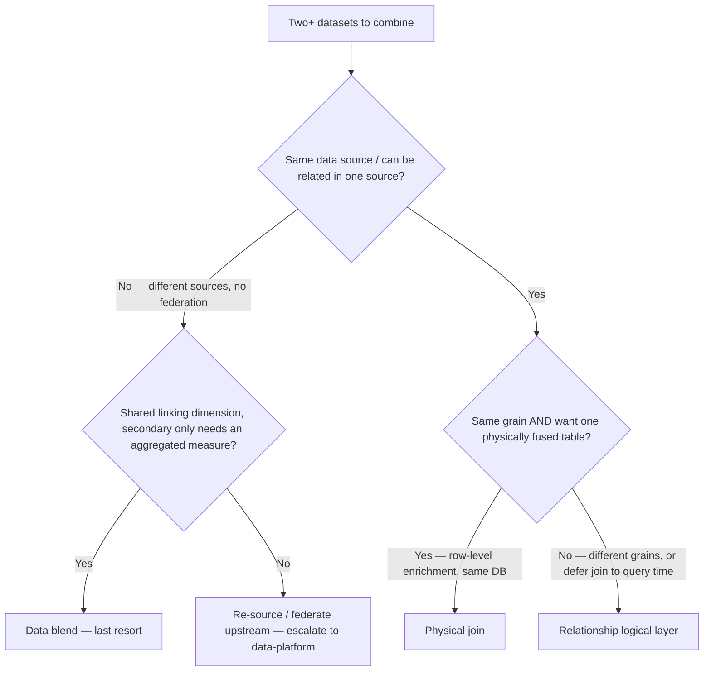
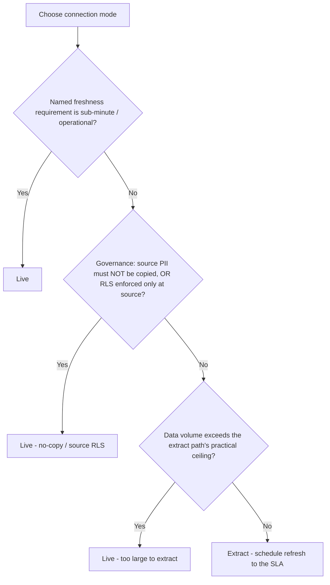
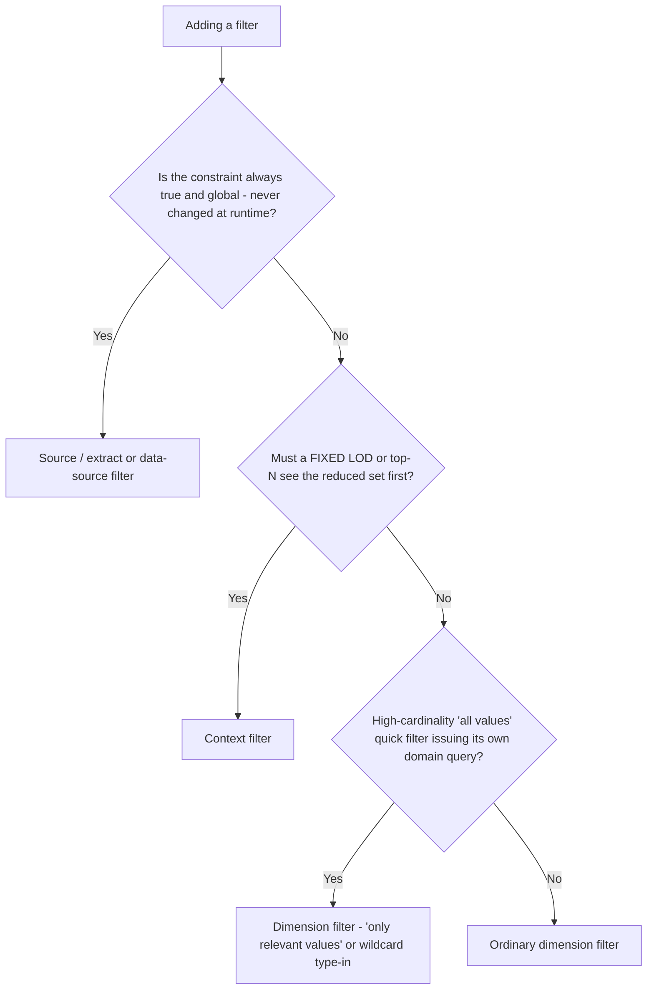
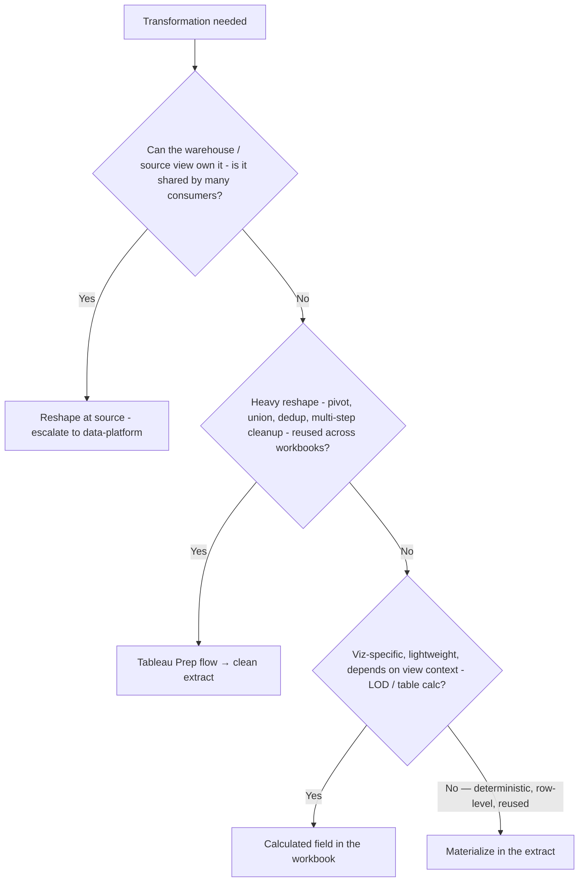
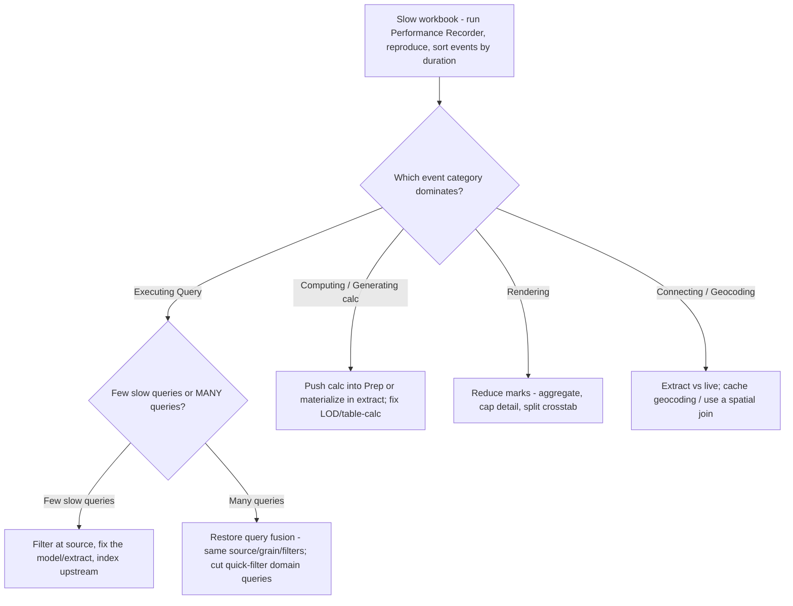
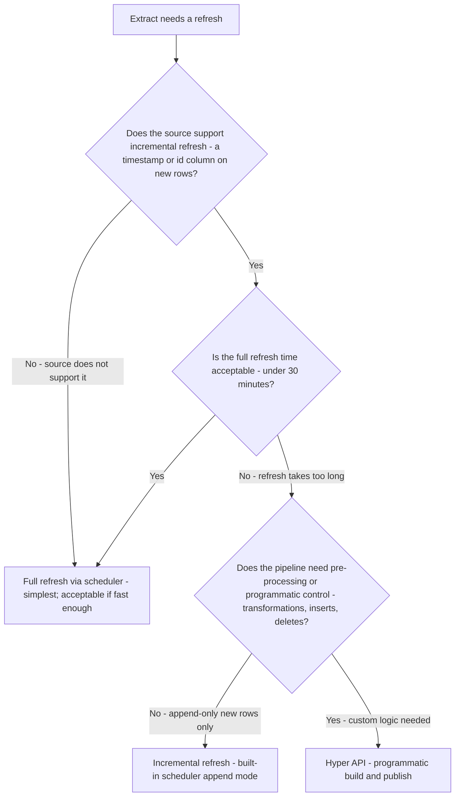
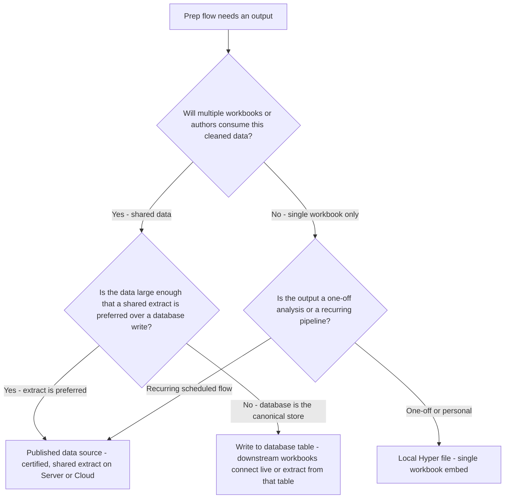
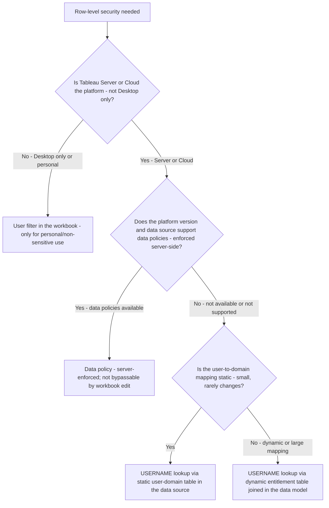

# Data & Performance — Decision Trees

> Canonical decision trees for the `tableau-data-architect` agent. Traverse the relevant `## Decision Tree:` Mermaid graph **top-to-bottom before selecting a method** — do not keyword-match the user's wording. The first branch where the condition resolves cleanly is the leaf to apply. Format follows [`../../../docs/best-practices/decision-trees-in-knowledge-files.md`](../../../docs/best-practices/decision-trees-in-knowledge-files.md).
>
> Volatile Tableau facts (version-gated limits, Hyper internals, exact option labels) carry inline `[verify-at-build]`. Re-verify any tree whose `Last verified` date is older than ~90 days.

---

## Decision Tree: Connection model — relationship vs join vs blend

**When this applies:** You have two or more tables/datasets to combine in a single data source, and you must choose *how* they connect. Observable triggers: "should this be a relationship, a join, or a blend?"; a `SUM` that double-counts after combining tables; a number that won't filter by a field from the second dataset.

**Last verified:** 2026-05-30 against Tableau relationships (logical layer, 2020.2+) and blend semantics `[verify-at-build]`.

**Rationale per leaf:**
- *Relationship (default)* — keeps each table at native grain, defers the join to query time, picks join type per-viz; correct for different-grain tables sharing a key, no fan-out.
- *Physical join* — only when the tables are the *same grain*, same database, and you genuinely want one fused table (row-level enrichment / lookup). **requires:** both tables reachable in the same physical connection.
- *Data blend* — last resort for different sources with no federation; secondary is aggregated to the primary's grain and only primary dimensions filter freely. **requires:** an identically-valued linking dimension on both sides.
- *Escalate / re-source* — no link dimension and can't relate → the fix is upstream (federate or model in the warehouse), not a Tableau join trick.

**Tradeoffs summary table:**

| Method | Grain handling | Filtering | Fan-out / double-count risk | Speed | Use when |
|---|---|---|---|---|---|
| Relationship | Each table at native grain | All fields filter freely | None (join deferred per-viz) | Fast | Default — any multi-table model in one source |
| Physical join | Flattened to finest grain | All fields filter | High if grains differ | Fast (pre-joined) | Same-grain, same-DB row-level enrichment |
| Data blend | Secondary aggregated to primary grain | Only primary dims filter freely | Low but `ATTR()→*` surprises | Slower (2 queries + merge) | Unrelatable sources, secondary contributes an aggregated measure |

---

## Decision Tree: Connection mode — extract vs live

**When this applies:** A data source is modeled and you must choose extract (Hyper) or live. Observable triggers: "extract or live?"; a dashboard slow on every interaction against a transactional DB; a stakeholder asking "how fresh is this?"

**Last verified:** 2026-05-30 against Hyper extract behavior and live-connection semantics `[verify-at-build]`.

**Rationale per leaf:**
- *Extract (default)* — columnar/compressed/in-memory, faster and off the OLTP system; refresh scheduled to exactly the stated SLA.
- *Live (sub-minute)* — only when an observable requirement needs seconds-fresh data (ops queue, fraud); an extract cannot meet it.
- *Live (no-copy / source RLS)* — governance forbids duplicating PII into an extract, or row security is enforced only in the source and an extract would bypass it. **requires:** the source genuinely enforces the RLS.
- *Live (too large)* — data volume exceeds the extract path's practical limits `[verify-at-build]`; revisit with incremental refresh before accepting live.

**Tradeoffs summary table:**

| Mode | Latency per interaction | Source load | Freshness | Governance fit | Use when |
|---|---|---|---|---|---|
| Extract (Hyper) | Low (in-memory) | None after refresh | As of last refresh | Copies data | Default — freshness need ≥ minutes |
| Live | Bound to source query | Every interaction hits source | Real-time | No copy / source RLS | Sub-minute, no-copy, or source-only RLS |

---

## Decision Tree: Where to filter — source vs data-source vs context vs dimension

**When this applies:** You're adding a filter (or a slow workbook over-fetches rows it then filters away in the view). Observable triggers: a region/date-scoped dashboard scanning the full table; a `FIXED` LOD or top-N that must operate on a filtered subset; a quick filter slow to populate.

**Last verified:** 2026-05-30 against Tableau filter order-of-operations `[verify-at-build]`.

**Rationale per leaf:**
- *Source / extract / data-source filter* — removes rows before the workbook ever reads them; cheapest layer; for always-true global scope (region, date window, active-only).
- *Context filter* — materializes a temp subset computed *before* dimension filters and `FIXED` LODs; use for the one expensive early cut a downstream `FIXED`/top-N depends on, not for every filter.
- *Dimension filter, relevant-values / wildcard* — high-cardinality user filter; switch off "all values in database" to shrink (or eliminate) the domain query.
- *Ordinary dimension filter* — the interactive choices a user changes per session, where cardinality is modest.

**Tradeoffs summary table:**

| Layer | Removes rows… | Cost | Runtime-changeable by user? | Use when |
|---|---|---|---|---|
| Source / extract filter | Before extract stores them | Cheapest | No | Always-true global scope |
| Data-source filter | Before every query | Cheap | No | Global cut across all sheets |
| Context filter | Into a pre-computed temp set | Temp-table build | Yes (the filter) | A `FIXED`/top-N needs the subset |
| Dimension filter | Per-viz against full domain | Per query | Yes | Interactive per-session choices |

---

## Decision Tree: Where to do the work — Prep vs calculated fields vs reshape at source

**When this applies:** A transformation is needed (pivot, union, dedup, cleanup, derived column, aggregation) and you must decide *where* it lives. Observable triggers: the same calc copy-pasted across many workbooks; a row-level calc that recomputes on every query; a pivot/union that won't model cleanly in the data source.

**Last verified:** 2026-05-30 against Tableau Prep + calculated-field + warehouse-modeling boundaries `[verify-at-build]`.

**Rationale per leaf:**
- *Reshape at source* — if the warehouse/view can own it and many tools consume it, do it once upstream (single source of truth). **requires:** write access / ownership of the source model — escalate to `data-platform`.
- *Tableau Prep flow* — heavy, multi-step reshaping reused across workbooks; outputs a clean, correctly-grained extract built to be idempotent + incremental.
- *Calculated field* — viz-specific, lightweight, or genuinely view-context-dependent (LOD/table calc); belongs in the workbook where the context lives.
- *Materialize in the extract* — deterministic row-level calc reused by the workbook but not view-dependent; compute once at refresh rather than per query.

**Tradeoffs summary table:**

| Where | Compute frequency | Reuse | Best for | Cost of getting it wrong |
|---|---|---|---|---|
| Source / warehouse | Once, upstream | All consumers | Shared semantic logic | Coupling to warehouse change cadence |
| Prep flow | Once per flow run | Many workbooks | Pivot/union/dedup/cleanup | Stale if flow not scheduled |
| Calculated field | Every query | One workbook | View-context LOD/table calc | Recomputes; copy-paste drift across workbooks |
| Materialized in extract | Once per refresh | One workbook | Deterministic row-level calc | Freezes volatile (`NOW()`) calcs |

---

## Decision Tree: Diagnosing a slow workbook (the Performance Recorder ladder)

**When this applies:** A workbook is slow and you need the *cause*, not a guess. Observable triggers: "this dashboard takes 40 seconds to load"; a sheet that hangs on filter change. Always turn on the **Performance Recorder**, reproduce the slow action, and read the **longest events first** before touching anything.

**Last verified:** 2026-05-30 against the Performance Recorder event categories (Executing Query / Computing/Generating / Rendering / Geocoding / Connecting) `[verify-at-build]`.

**Rationale per leaf:**
- *Executing Query — few slow queries* — the source/model is the bottleneck: push filters to source, fix the relationship/join, aggregate the extract, index upstream.
- *Executing Query — many queries* — query fragmentation: restore fusion (one source, one grain, shared filters) and kill high-cardinality "all values" quick-filter domain queries.
- *Computing / Generating* — an expensive calc/LOD/table-calc is computing per query: push it into Prep or materialize it in the extract; fix LOD addressing.
- *Rendering* — too many marks: aggregate, cap detail fields, split a giant crosstab into summary + drill.
- *Connecting / Geocoding* — connection or geocoding overhead: prefer an extract; cache geocoding or use a spatial join. **requires:** read the recorder, don't assume which category dominates.

**Tradeoffs summary table:**

| Dominant event | Root cause | Primary lever | Where it's documented |
|---|---|---|---|
| Executing Query (few) | Slow source/model | Filter at source; fix model; aggregate extract | `../best-practices/perf-filter-at-the-source.md` |
| Executing Query (many) | Fragmented queries | Restore query fusion; tame quick filters | `../best-practices/perf-context-filters-and-query-fusion.md` |
| Computing/Generating | Expensive calc/LOD | Move to Prep / materialize; fix LOD | `../best-practices/prep-incremental-and-idempotent-flows.md` |
| Rendering | Too many marks | Reduce marks; aggregate; split crosstab | `../best-practices/perf-minimize-marks-and-quick-filters.md` |
| Connecting/Geocoding | Connection/geo overhead | Extract; cache/spatial-join geocoding | `../best-practices/data-extract-vs-live-by-freshness.md` |

---

## See also

- [`../best-practices/data-relationships-before-joins.md`](../best-practices/data-relationships-before-joins.md)
- [`../best-practices/data-blend-is-a-last-resort.md`](../best-practices/data-blend-is-a-last-resort.md)
- [`../best-practices/data-extract-vs-live-by-freshness.md`](../best-practices/data-extract-vs-live-by-freshness.md)
- [`../best-practices/data-extract-optimization.md`](../best-practices/data-extract-optimization.md)
- [`../best-practices/perf-filter-at-the-source.md`](../best-practices/perf-filter-at-the-source.md)
- [`../best-practices/perf-context-filters-and-query-fusion.md`](../best-practices/perf-context-filters-and-query-fusion.md)
- [`../best-practices/perf-minimize-marks-and-quick-filters.md`](../best-practices/perf-minimize-marks-and-quick-filters.md)
- [`../best-practices/prep-incremental-and-idempotent-flows.md`](../best-practices/prep-incremental-and-idempotent-flows.md)
- [`../agents/tableau-data-architect.md`](../agents/tableau-data-architect.md) — the agent that traverses these trees
- [`../../../docs/best-practices/decision-trees-in-knowledge-files.md`](../../../docs/best-practices/decision-trees-in-knowledge-files.md) — the format spec

---

## Decision Tree: Extract refresh strategy — full, incremental, or Hyper API?

**When this applies:** An extract needs a refresh schedule and you must choose the refresh method. Observable triggers: "our extract takes 4 hours to refresh"; "we only need yesterday's new rows"; "can we refresh programmatically?"

**Last verified:** 2026-06-05 against Tableau extract refresh and Hyper API documentation `[verify-at-build]`.

**Rationale per leaf:**
- *Full refresh* — simplest; correct for small extracts, sources without an incremental key, or when full refresh is fast.
- *Incremental refresh* — built-in scheduler can append only new rows using a date/id column; no code required; covers the common case.
- *Hyper API* — when the pipeline needs pre-processing, transformation, bulk deletes, or programmatic control not available in the scheduler.

**Tradeoffs summary:**

| Method | Code required | Source requirement | Use when |
|---|---|---|---|
| Full refresh | None | Any | Small/medium extract; fast refresh |
| Incremental append | None | Timestamp or id column | Large extract; append-only; source supports it |
| Hyper API | Python/Java | Any | Custom pre-processing; deletes; programmatic pipelines |

---

## Decision Tree: Which Tableau Prep output — published data source, extract file, or database write?

**When this applies:** A Tableau Prep flow is complete and you must choose the output type. Observable triggers: "should the flow publish a data source or write to the database?"; "multiple workbooks use the same Prep output — how should we share it?"

**Last verified:** 2026-06-05 against Tableau Prep flow output documentation `[verify-at-build]`.

**Rationale per leaf:**
- *Published data source* — the standard for shared, governed, scheduled outputs; multiple workbooks can connect; the extract is refreshed centrally.
- *Write to database* — when the downstream system of record is the database and the Prep flow is an ETL pipeline, not just a Tableau-internal extract.
- *Local Hyper file* — for one-off or personal analyses that do not need to be shared or scheduled.

**Tradeoffs summary:**

| Output type | Sharing | Governance | Best for |
|---|---|---|---|
| Published data source | All users on the site | High - certifiable, permissioned | Shared governed data for multiple workbooks |
| Database write | Depends on DB permissions | External to Tableau | ETL pipelines; database as the system of record |
| Local Hyper file | Single workbook | None | Personal/one-off analysis |

---

## Decision Tree: RLS mechanism — user filter, FIXED LOD mapping, or data policy?

**When this applies:** A workbook or data source needs row-level security and you must choose the enforcement mechanism. Observable triggers: "how do we show each user only their own data?"; "should we use user filters, an LOD calculation, or a data policy?"

**Last verified:** 2026-06-05 against Tableau RLS documentation `[verify-at-build]`. Security verdict always escalates to `ravenclaude-core/security-reviewer`.

**Rationale per leaf:**
- *User filter in workbook* — simplest but least secure; bypassable by downloading the workbook; acceptable only for convenience filtering, not access control.
- *Data policy (server-enforced)* — strongest enforcement; the server applies the filter before data reaches the workbook; use when available `[verify-at-build]`.
- *USERNAME lookup - static table* — practical for small, stable user-domain mappings; enforced in the data model; scalable.
- *USERNAME lookup - dynamic table* — for large or frequently-changing entitlement tables; the JOIN is the enforcement layer.

**Tradeoffs summary:**

| Mechanism | Enforcement point | Bypassable by workbook download | Use when |
|---|---|---|---|
| Workbook user filter | Workbook | Yes - not a security control | Convenience filtering only |
| Data policy | Server | No | Server/Cloud; policy-supported sources |
| USERNAME + static table | Data model | Only if data model bypassed | Small stable user-domain map |
| USERNAME + dynamic table | Data model | Only if data model bypassed | Large or frequently-changing entitlements |
